# 叶子的新歌 Writeup by MaxXing

很荣幸能以出题人的身份出现在本届 PKU GeekGame 里. 虽然这不是我第一次给 CTF 类比赛出题, 但这是我第一次尝试在 CTF 题目中加入剧情, 总体来说出题的体验确实还不错.

> 等等, 你体验不错个毛啊, 你考虑过做题的同学们的体验吗 (x

因为是第一次给 GeekGame 出题, 所以稍微研究了一下其它出题人撰写的题面, 然后也按照类似的欢乐的风格来入手了.

不过, 题目本身并不像题面一样欢乐, 不好意思啦.

题面中出现了一些喜闻乐见的梗, 比如:

* **四轱辘爱抖露/太好听了⑧**: LoveLive (然而我并不是拉拉人).
* **无人问津的阴雨霉湿之地**: 世末歌者, COP 创作的中文 Vocaloid 歌曲.
* **三个 flag 的名称**: 三首和 “梦” 有关的冷门东方曲 (我是车车人哒).
* **Word 保存图标的手办**: 经典网络烂梗.
* **叶子和小雨的名字**: 随便起的. 虽然群里有拉拉人说是叶月恋, 但我觉得硬说的话可能更像是不能说的秘密.

## Flag1 - 夢は時空を越えて

拿到附件之后简单检查一下, 通过播放器显示的信息或者文件属性等内容, 我们不难发现, 这个 MP3 的专辑名称叫做 “Secret in Album Cover!!”:

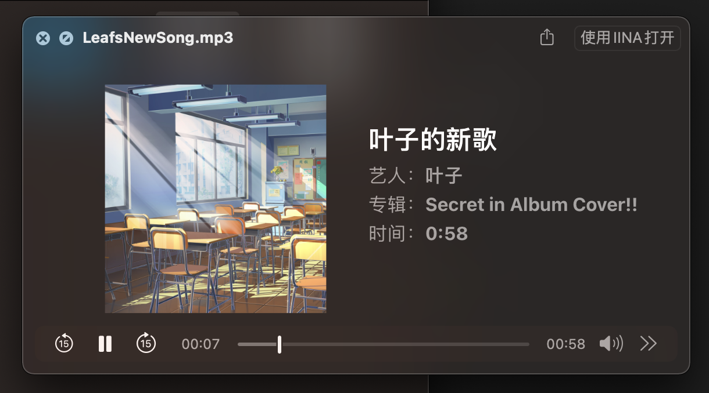

这暗示着专辑封面里藏了东西, 我们可以想办法先把专辑封面提取出来.<!--569--> 这里可以使用 `ffmpeg`, 先看一下专辑封面是什么格式:

```sh
ffmpeg -i LeafsNewSong.mp3
```

得到:

```
  Stream #0:1: Video: png, rgba(pc), 1000x1000, 90k tbr, 90k tbn, 90k tbc (attached pic)
    Metadata:
      comment         : Cover (front)
```

是<!--577--> PNG 格式的, 于是我们可以:

```sh
ffmpeg -i LeafsNewSong.mp3 -an -vcodec copy cover.png
```

这样, 专辑封面就提取到了 <!--643-->`cover.png` 中.

当然, 在提取专辑封面的过程中, `ffmpeg` 会输出 MP3 文件的 metadata, 我们可以注意到 `comment` 里藏了一段文本:

```
    comment         : 你还记得吗？小时候，我家和你家都在一个大院里。放学以后，我们经常一起在院子里玩。你虽然是个女孩子，但总是能和男孩子们玩到一块去。
                    : 
                    : 夏天的时候我们挖蚯蚓、捉蚂蚱；冬天，院子里的大坡上积了一层雪，我们就坐在纸箱子压成的雪橇上，一次次从坡顶滑到坡底。那个时候你还发现，坐在铁簸箕上滑得更快。
                    : 
                    : ——当然，那次你也摔得挺惨的。
```

这段文本和剧情相关. 在后续解题的过程中, <!--599-->你可能会继续发现若干段和剧情相关的文本.

拿到专辑封面之后, 我们可以继续深挖. 通常在 misc 类题目中, 与图片相关的内容无非就[几类](https://ctf-wiki.org/misc/picture/introduction/), 针对本题中的 PNG 图像, 最常见的应该就是 LSB 隐写了. 于是扔给 stegsolve 试一下 ([网页版](https://stegonline.georgeom.net/upload)):

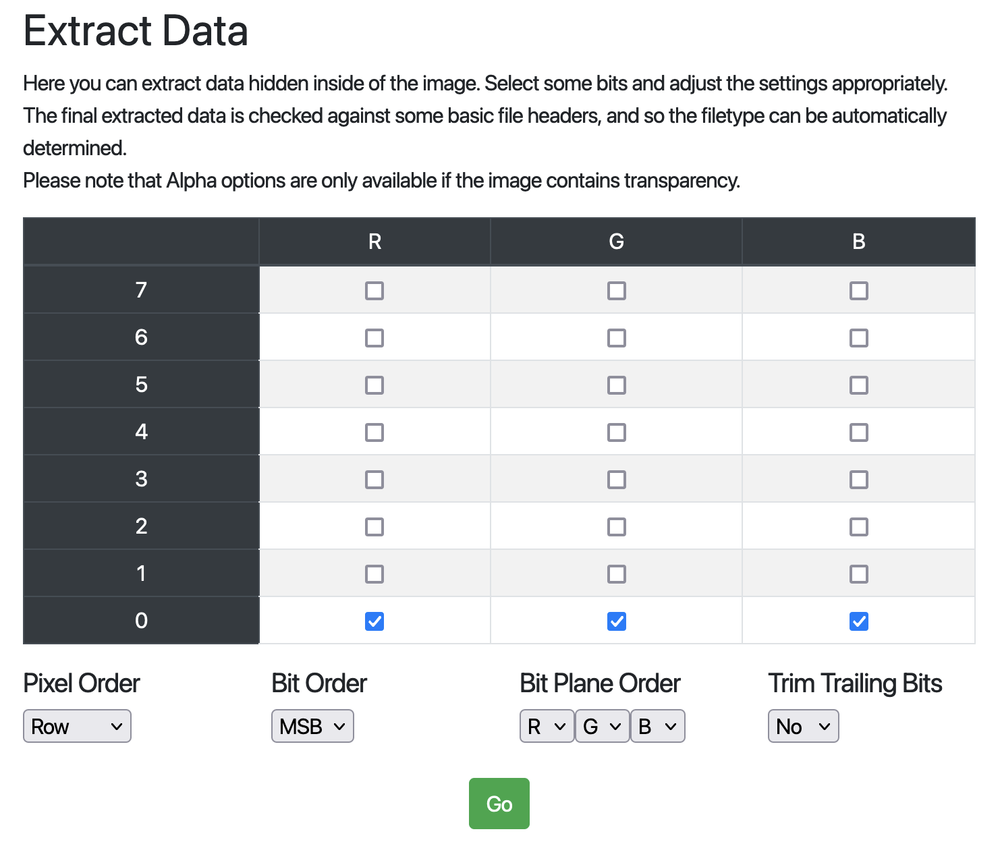

最终可以提取出另一个<!--521--> PNG 图像:


这个图像上最显眼的部分应该就是这个二维码了, 不过显然它并不是 QR code, 查阅[相关资料](https://en.wikipedia.org/wiki/Barcode#Matrix_(2D)_barcodes)我们可以得知这是一个 Aztec code, 读取后得到结果:

```
Gur frperg va uvfgbtenz.
```

这看起来像是一段乱码, 但观察可以发现这段乱码中出现了大小写字母, 空格和 `.` 符号, 所以肯定不是 base64 或其他类似编码. 通常这种看起来很像英文句子的乱码可以往凯撒密码的方向思考, <!--523-->于是稍加尝试可以发现, 这段文字中的所有字母按字母表顺序向前 (或向后) 移动 13 位即可得到一段有意义的英文句子:

```
The secret in histogram.
```

这种编码方式叫做 ROT13, 在上届 GeekGame 的[签到题](https://github.com/PKU-GeekGame/geekgame-0th/blob/main/writeups/wp-xmcp/wp-xmcp.md#%E7%AD%BE%E5%88%B0misc)中也曾出现过<!--211--> (可见上届的签到题有多亲民).

这句话提示我们, 要从 `histogram` 中寻找秘密. `histogram` 是直方图的意思, 如果你熟悉图像处理的话, 你就会了解图像直方图这种东西: 我们可以统计图像中不同颜色/亮度的像素, 然后以横轴为颜色/亮度的值, 纵轴为当前种类下的像素数量画出一个直方图.

我们不妨查看刚刚提取出来的灰度图像的直方图 ([网页版](https://www.sisik.eu/histo)):

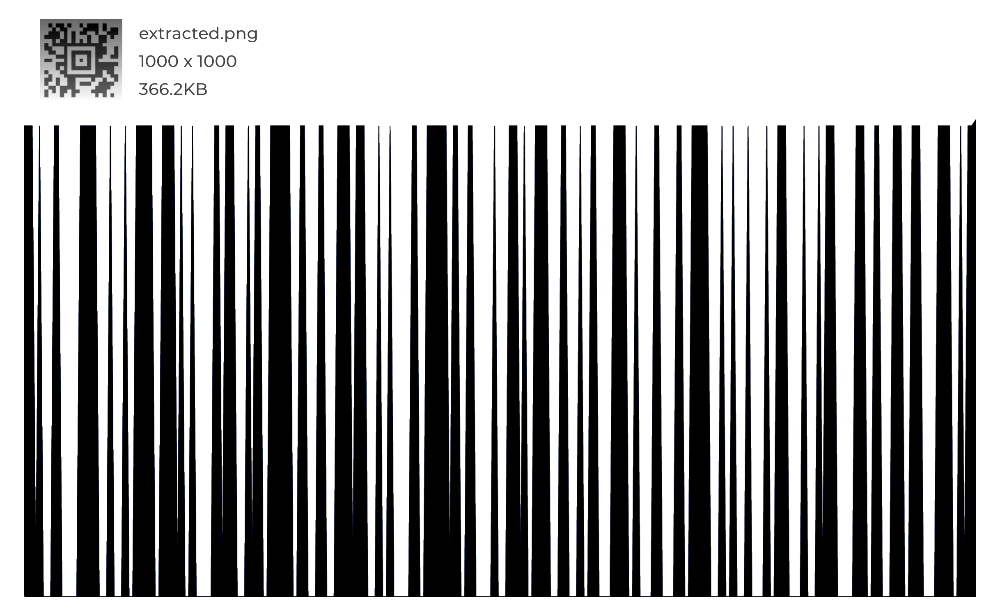

发现这居然是一个... 条形码?!

需要注意的是, 如果你使用 Photoshop 查看图像的直方图,<!--541--> 你可能会遇到这种情况:

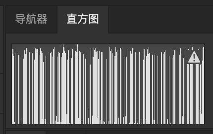

根本看不出这是一个条形码. 这是因为 Photoshop 为了提升加载速度, 默认并不会使用完整的图像数据来计算直方图. 点击右上角的警告图标, 直方图才会变成整齐的样子. 当然就算是这样, 你可能也很难看出这个直方图里藏了个条形码, 因为这个直方图的面板太小了, 而且前景是白色的... 所以你也许可以换用其他的一些专门查看图像直方图的工具, 或者干脆写个脚本算一下.

我们可以直接用条码读取的软件/[网站](https://online-barcode-reader.inliteresearch.com/)来扫描这个条码 (别用微信), <!--613-->得到:

```
xmcp.ltd/KCwBa
```

这明显是一个 URL (感谢 xmcp 提供的 host 服务), 我们可以尝试访问一下, 得到:

```
你还记得高中的时候吗？那时在市里的重点中学，我们是同桌。我以前还怪讨人嫌的，老是惹你生气，然后你就不和我说话，我就死乞白赖地求你，或者讲笑话逗你。

不过，你笑起来好可爱，从小就好可爱。此后的一切，也都是从那个笑容开始的吧。

真的，好想回到那个时候啊。

Ook. Ook. Ook. Ook. Ook. Ook. Ook. Ook. Ook. Ook. Ook. Ook. Ook. Ook. Ook.
Ook. Ook. Ook. Ook. Ook. Ook! Ook? Ook! Ook! Ook. Ook? Ook. Ook. Ook. Ook.
Ook. Ook. Ook. Ook. Ook. Ook. Ook. Ook. Ook. Ook. Ook. Ook. Ook. Ook. Ook.
...
Ook. Ook! Ook? Ook! Ook! Ook. Ook? Ook. Ook. Ook. Ook. Ook. Ook. Ook. Ook.
Ook? Ook. Ook? Ook! Ook. Ook? Ook. Ook. Ook. Ook. Ook. Ook. Ook. Ook. Ook.
Ook. Ook! Ook. Ook? Ook. 
```

上半部分是第二段剧情文本, <!--601-->下半部分是一大串 `Ook` 组成的意义不明的内容, 仔细观察, 这些 `Ook` 之后的标点符号似乎还不太一样. 遇事不决, 我们可以直接把这段内容中的某些部分放在搜索引擎里搜一下:

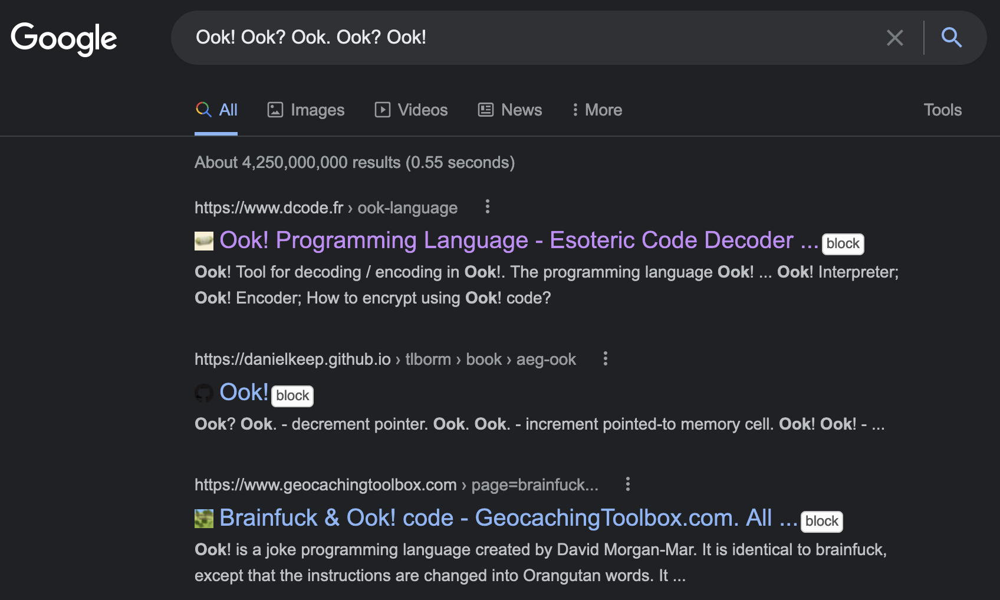

第一个结果就是解码这种内容的页面. 实际上, Ook! <!--223-->是一种类似 Brainfuck 的 esolang, 它使用若干种不同的 `Ook` 序列, 重新编码了 Brainfuck 的几种运算符. 执行一下这个 Ook! 程序, 我们可以得到 flag1:

```
flag{y0u_h4ve_f0rgott3n_7oo_much}
```

## Flag2 - 幻夢界

在解 flag1 的过程中, <!--397-->我们读取了 `LeafsNewSong.mp3` 中的 metadata:

```
Input #0, mp3, from 'LeafsNewSong.mp3':
  Metadata:
    TSS             : Logic Pro X 10.7.0
    iTunNORM        :  0000072C 00000736 00003208 00003140 00009E92 0000501A 00006703 00007E86 00007678 00007E1F
    iTunSMPB        :  00000000 00000210 000007A5 00000000002709CB 00000000 002350D1 00000000 00000000 00000000 00000000 00000000 00000000
    title           : 叶子的新歌
    artist          : 叶子
    album           : Secret in Album Cover!!
    TRACKTOTAL      : aHR0cDovL2xhYi5tYXh4c29mdC5uZXQvY3RmL2xlZ2FjeS50Ynoy
    lyrics          : 空无一人的房间
                    : 我望向窗外
                    : 想回到昨天
                    : 
                    : 琥珀色的风
                    : 能否将 回忆传到那边
                    : 闪烁的星
                    : 照亮夜空 连成我的思念
                    : 
                    : 你 在梦的另一边
                    : 站在 日落的地平线
                    : 背离这世界而去
                    : 想 在回不去的时间里
                    : 遇见你 遇见你 遇见你
                    : 遇见你 遇见你 遇见你
    comment         : 你还记得吗？小时候，我家和你家都在一个大院里。放学以后，我们经常一起在院子里玩。你虽然是个女孩子，但总是能和男孩子们玩到一块去。
                    : 
                    : 夏天的时候我们挖蚯蚓、捉蚂蚱；冬天，院子里的大坡上积了一层雪，我们就坐在纸箱子压成的雪橇上，一次次从坡顶滑到坡底。那个时候你还发现，坐在铁簸箕上滑得更快。
                    : 
                    : ——当然，那次你也摔得挺惨的。
    encoder         : Lavf58.45.100
```

仔细观察, 除了专辑名称暗示了有秘密藏在专辑封面里, <!--521-->还有一个 tag 的内容比较可疑:

```
    TRACKTOTAL      : aHR0cDovL2xhYi5tYXh4c29mdC5uZXQvY3RmL2xlZ2FjeS50Ynoy
```

`TRACKTOTAL` 的值很明显是一段 base64 编码后的内容, 我们可以对其解码, 得到 URL:

```
http://lab.maxxsoft.net/ctf/legacy.tbz2
```

访问后可以下载到 `legacy.tbz2`, <!--661-->这个压缩文件解压后会得到两个文件: `foryou.txt` 和 `To_the_past.img`. 先看看 `txt` 里说了什么:

```
我有一张很久很久以前的软盘。说起来以前的操作系统还能装在软盘里，把软盘放进电脑就可以启动，很神奇吧？我给你看过这张软盘，但你总说这是Word保存图标的手办……什么跟什么啦！

现在已经没有带软驱的电脑了，甚至连带光驱的电脑都没有了。以前软盘里的那些东西，也许再也启动不了了吧。

时间过得好快啊，转眼间，就来到了现实。
```

这是第三段剧情文本, 但其中多次强调了 “把软盘放进电脑启动”.

我们可以看一下 `To_the_past.img` 到底是个什么文件:

```
$ file To_the_past.img
To_the_past.img: DOS/MBR boot sector, code offset 0x3c+2, OEM-ID "GeekGame", root entries 224, sectors 2880 (volumes <=32 MB), sectors/FAT 9, sectors/track 18, serial number 0x0, label: "TO_THE_PAST", FAT (12 bit), followed by FAT
```

`file` 命令告诉我们, <!--461-->这是个 FAT 格式的磁盘镜像, 并且还包含 DOS/MBR 引导扇区, 也就是说它是可以被引导的. 根据剧情文本的提示, 我们可以把这个镜像放在虚拟机或者模拟器里启动一下:

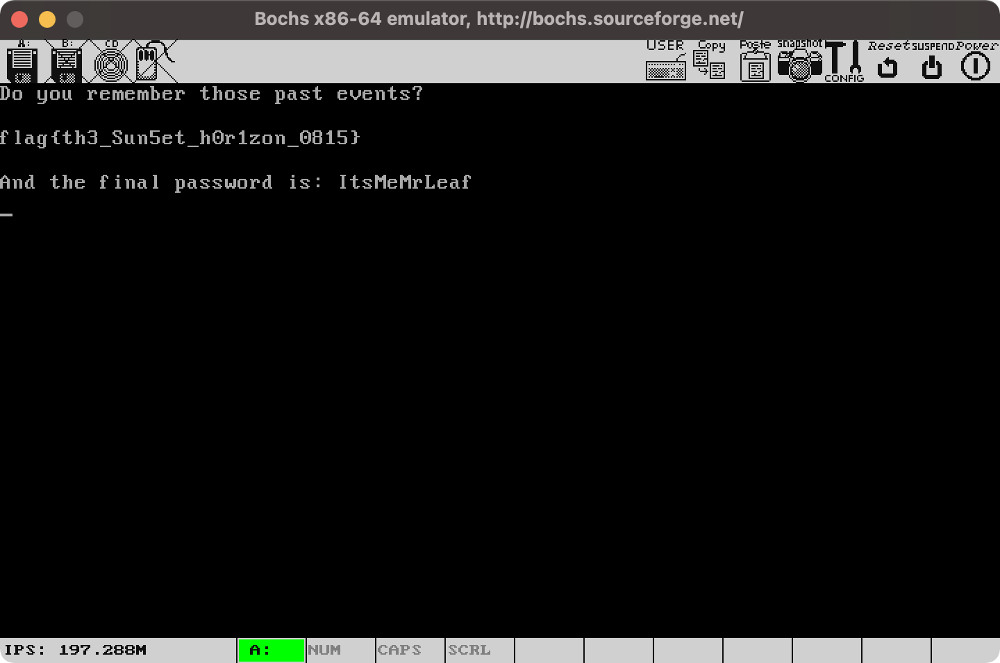

得到 flag2 (可能需要手敲):

```
flag{th3_Sun5et_h0r1zon_0815}
```

同时, 我们还可以得到密码 `ItsMeMrLeaf`, <!--577-->虽然此时我们暂时还不知道这个密码有什么用.

## Flag3 - 夢と現の境界

在 flag2 中, <!--607-->我们已经得到了一个软盘镜像, 于是自然而然地, 我们可以使用 `mount` 命令或者一些解压缩软件查看它的内容.

软盘镜像中包含了一个 `zip` 压缩包, <!--569-->和一个文本文档. 尝试解压缩 `zip` 文件, 但发现需要密码. 于是去看文本文档:

```
备忘

密码是：宾驭令诠怀驭榕喆艺艺宾庚艺怀喆晾令喆晾怀
```

就直接得到密码了... 吗?

试一下发现密码不对, <!--223-->说明这里面可能还套了一层. 遇事不决, 再次去搜索引擎搜索这段意义不明的文字 (什么叫真正的小北问答啊?):

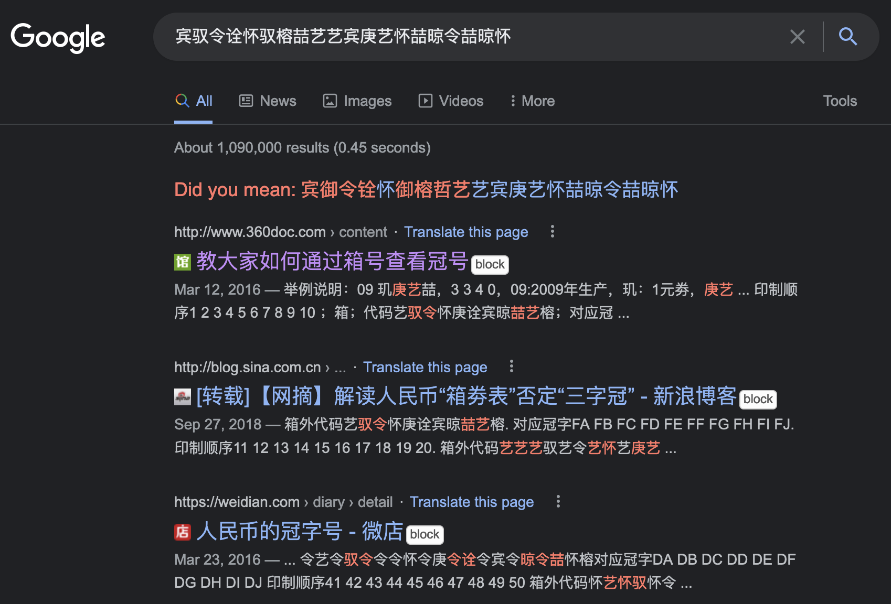

发现这是人民币装箱的冠字号,<!--661--> 从搜索结果里我们可以找出文字和数字的对应关系:

```
艺=1 驭=2 令=3 怀=4 庚=5 诠=6 宾=7 晾=8 喆=9 榕=10也就是0
```

于是替换得到解压缩密码 `72364209117514983984`, 注意这里的 `榕` 应该被替换成 `0`. 解压缩后, 又得到了另外三个文件: `left.bin`, `right.bin` 和一个 readme 文本文档. <!--577-->先看看 readme 怎么说:

```
我以前很喜欢玩红白机，当然，现在也很喜欢。超级马里奥、魂斗罗、坦克大战、马戏团、冒险岛……一玩能玩一天。

小时候家里有一台红白机，也经常叫你一起玩游戏，只不过，我记得你不喜欢这些东西。你最喜欢在4399玩找不同，而且你还玩的特别棒，简直就是找不同滴神。

呜呜，红白机已经属于时代的眼泪了。
```

这是第四段剧情文本,<!--521--> 这段文本里反复提到了 “找不同”. 我们再来用 `file`, `binwalk` 或者 16 进制编辑器看一下这两个二进制文件, 然而一无所获. 不过从 16 进制编辑器里应该可以看出, 这两个文件的内容大体上是相同的:

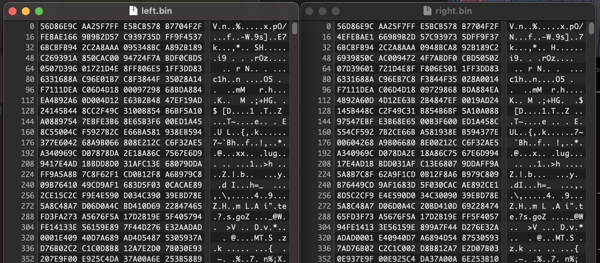

于是我们可以根据文本的提示来在这两个二进制文件里找不同, 也就是 `diff` 两个二进制文件的内容.

这里我使用的方法比较暴力: `diff` 命令本身是没办法直接对二进制文件操作的, 所以我们首先用 `xxd` 命令提取两个文件文本格式的 16 进制, <!--613-->然后再 `diff` 文本:

```sh
diff <(xxd -p -c 1 left.bin) <(xxd -p -c 1 right.bin)
```

我们期望得到纯的 16 进制的文本结果, 然后将这个文本结果再次转换为二进制, 并输出到文件, 于是对其稍作处理:

```sh
diff <(xxd -p -c 1 left.bin) <(xxd -p -c 1 right.bin) | sed -E "s/[0-9]+[a-z]+[0-9]+|> |< //g" | xxd -r -p - > out.bin
```

检查一下输出的 `out.bin`:

```
$ file out.bin
out.bin: NES ROM image (iNES): 2x16k PRG, 1x8k CHR [V-mirror]
```

发现这是一个 NES 的 ROM, 也就是一个红白机的游戏 ROM. 结合之前的剧情文本, 叶子喜欢玩红白机游戏, 这个看上去也挺合理的. 我们用 NES 模拟器载入这个 ROM:

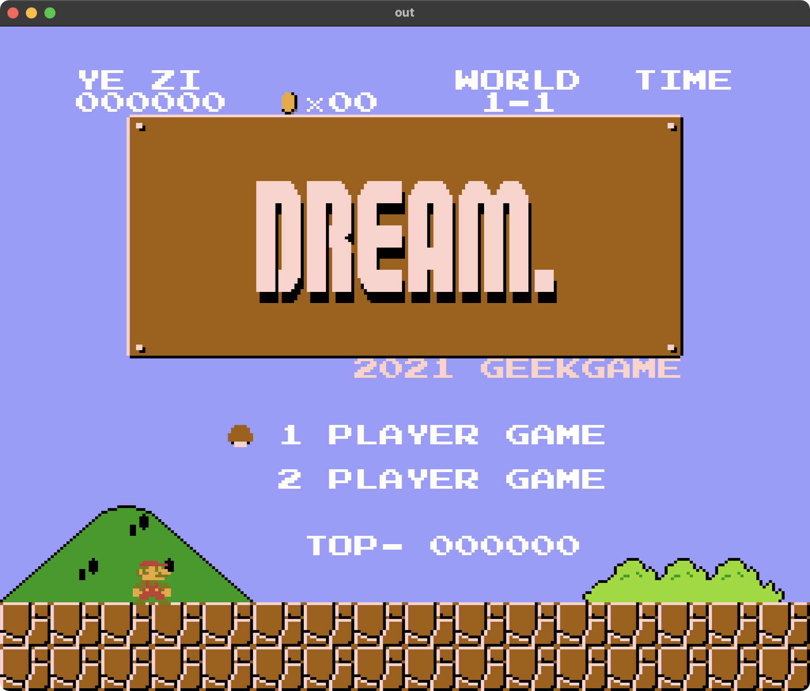

看起来是一个超级马里奥兄弟一代 <!--673-->(Super Mario Bros.) 的改版 ROM. 按照叶子的思路, 我们可以把它打通关. 附一些友情提示:

1. 超级马里奥是可以跳关的, 通常的最速通关路线为 1-1, 1-2, 4-1, 4-2, 8-1, 8-2, 8-3, 8-4.
2. 模拟器是可以在任意位置 S/L (存档/读档) 的, 如果你手残的话, 可以借助 S/L 的力量.
3. 如果你依然手残, 你可以开金手指, 建议搜索引擎找一下.
4. 如果你还是手残, 你可以去一些 TAS 录像的分享网站, 找超级马里奥一代的 TAS 录像 (比如[这个 HappyLee 打的录像](http://tasvideos.org/1715M.html)), 然后用 FCEUX 之类的模拟器播放, 这样你就完全不需要操作游戏了. 这个 ROM 只修改了标题画面和某些文字, 并没有修改关卡的内容, 所以超级马里奥一代的录像也是能在这个 ROM 里回放的.

通关后的画面如图:

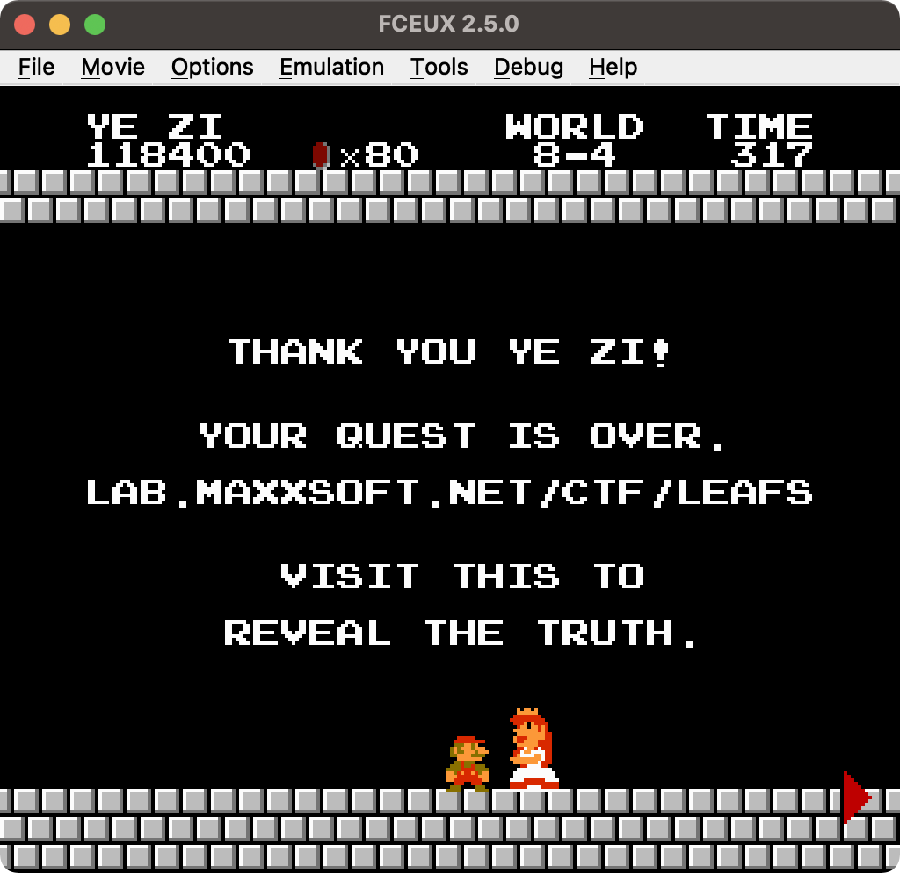

游戏提示我们访问 `lab.maxxsoft.net/ctf/leafs`, <!--647-->遂访问之:

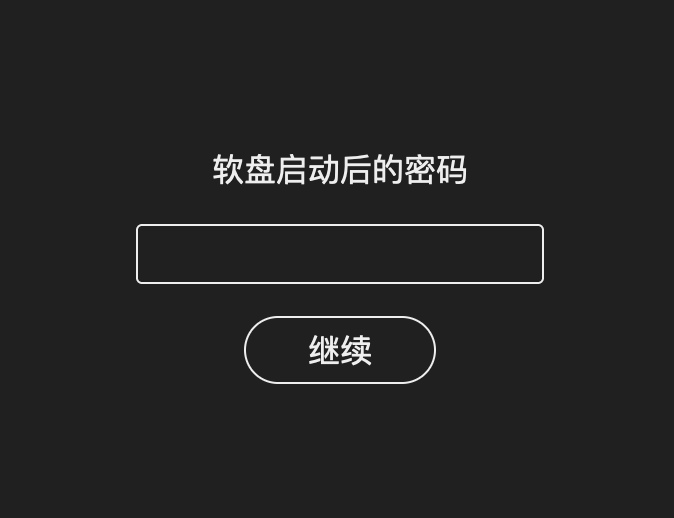

输入之前软盘启动的时候我们得到的密码: `ItsMeMrLeaf`, 即可得到最后一段剧情文本, 以及 flag3:

```
说了那么多的回忆，不如，再来聊聊现在吧。

那天和你表白之后，我们正式在一起了。回想起那段日子，整个世界都是彩色的，在校园里的每一天，我和你都很开心。

但，如果你没有在8月15号出去练琴，如果你没有经过那个十字路口，如果那辆卡车没有超速。

如果。

如果这个世界上真的有如果。

从那之后到现在，你已经昏迷整整三年了。

大夫说，你失去了所有的记忆，再也想不起我们的从前，变成了一个无意识的植物人。

但我依然相信，只要我每天都在床边陪着你，和你讲以前的故事，奇迹就一定会发生。

如果你在那个悠长的梦里，看到了这条消息，请一定记得：

从你的世界里醒过来，然后——


回家吧。


flag{W4ke_up_fr0m_7h3_L0NG_dre@m}
```

啊, 是悲伤的故事呢...
