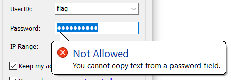

# Writeups by liangjs

本次比赛出了 3 道题：诡异的网关、最强大脑、扫雷。

## 诡异的网关

**预期解法**

这是个魔改过的旧版的北大网关程序。

胡乱点点 UI 界面，发现 UserID 下拉菜单里有个用户名是 flag。


猜测他的密码就是答案，但没法直接复制出来。



**解法 1**

密码一定保存在程序的内存里，只要把内存 dump 出来，搜索 `flag{` 字符串即可。

可用的工具有很多，如：WinDbg、x64dbg、CheatEngine、Windows Task Manager、Sysinternals。

**解法 2**

发现程序有保存用户密码的功能，所以密码一定保存在某个文件里。

输入北大账号登录网关，观察程序目录下的文件的修改时间，可以发现 `config` 文件被修改了。于是猜测账号密码保存在 `config` 文件中。
或者只看文件名也能猜出来？

`config` 文件里是乱码。逆向分析 `ipgwclient.exe`，搜索对 `config` 字符串的引用，可以找到程序打开 `config` 文件之后有个解码操作。

解码函数如下。对着文件内容跑一遍，就能得到 flag 了。

```c
int unprotect(char *input, int in_len, char *output, int *out_len, char *err)
{
	int shift = (in_len * 2 + 1) % 8;
	int mask = (1 << shift) - 1;
	for (int i = 0; i < in_len; ++i) {
		char cur = input[i];
		char next = input[(i+1)%in_len];
		output[i] = ((~next) & mask) | (cur & (~mask));
	}
	*out_len = in_len;
	return 1;
}
```

**解法 3**

逆向分析 `ipgwclient.exe`，找到密码输入框相关的逻辑，打 patch 修改二进制代码，直接把密码显示出来或者允许复制。

**命题思路**

希望选手没有被程序规模吓到。想把每个函数都逆向分析清楚是不现实的。通过搜索关键字符串，可以快速定位到重要数据和关键逻辑。

可能有人好奇，本题的程序和北大官方的网关程序有什么不同。

原版程序是用 `CryptProtectData` 和 `CryptUnprotectData` 这俩 Windows API 来进行加密和解密的。密钥与当前 Windows 用户相关，所以不用担心密码泄露。本题用 IDA patch bytes 功能把它们改成了自己实现的函数。


## 最强大脑

**预期解法**

本题是一个带 JIT 功能的 brainfuck 解释器。如果之前没了解过这种语言，可以从 [这里](https://esolangs.org/wiki/Brainfuck) 学习。

逆向的时候可以对照着 brainfuck 的语法，不难找到 `code_ptr`, `data_ptr`, `jmp_table` 等结构，对应 brainfuck 的代码、数据、跳转表，分别被放到不同的堆内存块上。

实在逆不出来可以参考 [源代码](../../src/bf/bf.c)。

flag1 被放在数据块的末尾。写个 brainfuck 程序输出数据内容即可。

```
+[-.>+]
```

flag2 需要 pwn 解释器，读取服务器上的文件。

漏洞位于 JIT 后的代码中。

在非 JIT 时，用 `<` 和 `>` 无法使 `data_ptr` 超出数据堆块开头和末尾，当 `>` 走到末尾时程序会用 `realloc` 分配更大的堆块。

当一个循环被执行第 16 次时，解释器会启用 JIT，把循环代码编译成 x86-64 指令来执行，编译后的代码没有对 `<` 和 `>` 的边界检查，因此可以移到其他堆块进行任意读写。

Exploit 思路：
1. 进入 JIT，读堆内存上的内容，泄露堆地址、libc 地址。
2. 根据 libc 地址计算 `system` 函数地址。
3. 篡改保存于堆上的 `jit_code`，使其内容为指向 `system` 函数的指针。
4. 在数据堆块上写入 `"/bin/sh"`。
5. 重新触发 JIT，调用 `system("/bin/sh")`。

编写 exploit 时，可能需要用 brainfuck 来实现一些较复杂的功能，所用的算法知识可以在 [这里](https://esolangs.org/wiki/Brainfuck_algorithms) 找到。

**命题思路**

本来想出一道 brainfuck 逆向的题，让选手写代码自动识别和匹配 brainfuck 算法。但又仔细想了想，这样可能会被选手喷死，于是改成了一道需要选手自己写 brainfuck 代码的题。

验题的时候发现本地堆布局和服务器上的不一致（即使是使用同版本的 libc），导致没法确定服务器的堆上哪里有 libc 地址、libc 偏移是多少、`jit_code` 的位置等等。

因此我实现了自动找 libc 地址和偏移的功能，写得比较复杂，仅供 [参考](sol/bf/attack.py)。

选手们好像都没遇到堆布局问题？可能是大家出奇一致的使用了 Linux 5.4 内核？

## 扫雷

首先，这是道密码学题，放在了 Algorithm 分组。可能误导了不少人？题目描述里也没说明“简单模式”对应 flag1 还是 flag2，这其实是故意的（

地图上一半都是雷，正常的扫雷算法肯定是解不出来的。[Wiki](https://en.wikipedia.org/wiki/Minesweeper_(video_game)) 说，超过 25% 是雷，想解出来就大概需要胡猜指数次。

Python 的伪随机数是通过 [梅森旋转算法](https://en.wikipedia.org/wiki/Mersenne_Twister)（MT19937）生成的。

梅森旋转算法的内部状态是 624 个 32-bit 整数 `uint32_t state[624]`。可以看出一个长度为 624 队列。每次输出的随机数时，pop 一个 32 位的整数并进行变换 `extract(state.pop())`，然后 push 下一个状态 `state.push(next_state(state))`。

其中 extract 函数如下，不难看出该函数是可逆的。可以把输入的 32-bit 整数看作 `GF(2)` 域上的长为 32 的向量，输出的 32-bit 整数相当于是对它做了线性变换。

```python
def extract(value):
    value ^= value >> 11
    value ^= (value << 7) & 0x9d2c5680
    value ^= (value << 15) & 0xefc60000
    value ^= value >> 18
    return value
```

然后 `next_state` 函数如下。可以看到它只利用了 0, 1, 397 三个位置的状态值，来计算下一个位置的状态值。

```python
def next_state(state):
    y = (state[0] & 0x80000000) | (state[1] & 0x7FFFFFFF)
    x = (y >> 1) ^ state[397]
    if (y & 1) == 1:
        x ^= 0x9908b0df
    return x
```

扫雷的棋盘大小是 $16 \times 16$，也就是 8 个 32 位整数。

对于“困难模式”，我们只要主动死亡 78 次，就能获得 $78 \times 8 = 624$ 个连续的伪随机数，然后反推出 624 个 `extract` 之前的状态值，就获得了完整的梅森旋转状态，就能预测此后的任意随机数了。

对于“简单模式”，我们没法获得连续的随机数，问题要复杂一些。

要预测一个随机数，需要知道 0, 1, 397 三个状态值。预测一个棋盘，需要预测 8 个连续的随机数，也就是需要当前 $[0,8], [397,404]$ 这些位置的状态值。而且对 `state[0]` 只需要知道高位的 1 bit。

服务器每生成一个棋盘，会跳过若干个棋盘。跳过 $x$ 个的概率是 $2^{-(x+1)}$。期望跳过的棋盘个数是 1。

我们假设服务器每生成一个棋盘，就会跳过一个棋盘（按照期望跳过个数）。可以证明，这样成功率是最高的。证明比较繁琐，留做习题读者自证。（提示：用母函数）

另外，每个棋盘覆盖 8 个状态值，而 $[0,8]$ 和 $[397,404]$ 都需要两个连续已知的棋盘来覆盖，所以我们假设这两个位置的棋盘中间没有跳过棋盘。

在这些假设下，$[0,8], [397,404]$ 这些位置的状态值对应的棋盘都是已知的，就可以预测下一个棋盘了。

具体实现可参考 [这里](sol/sweeper/solve.py)。