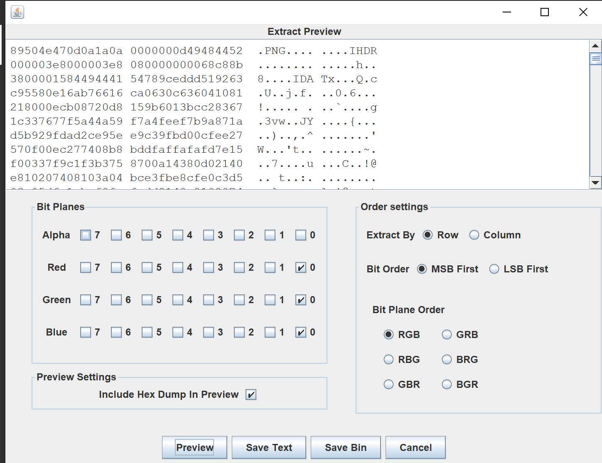
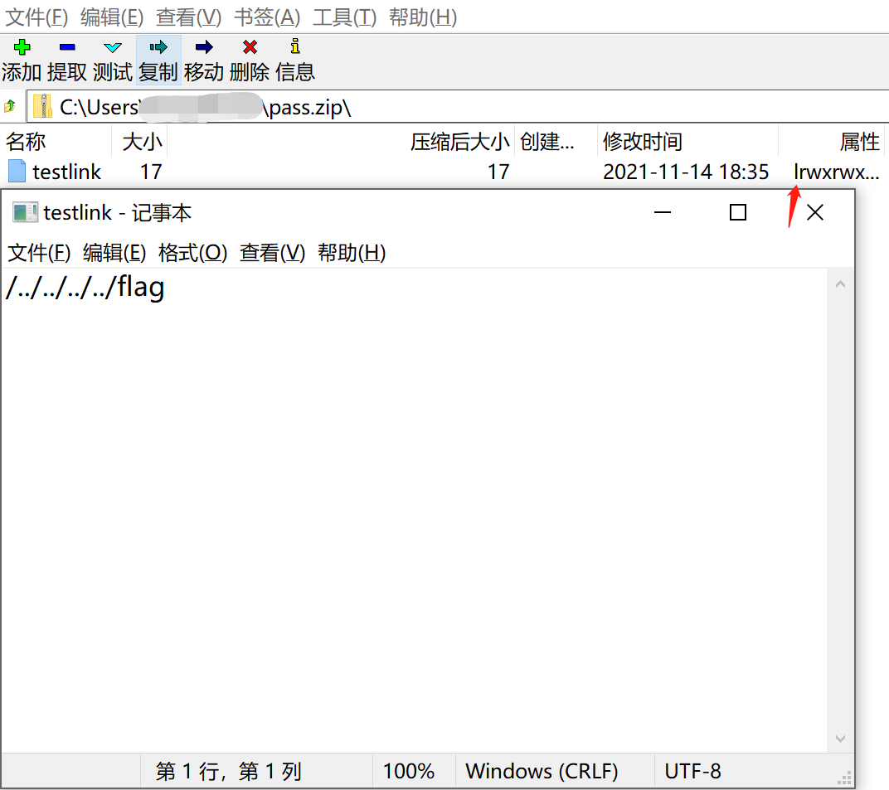

# Writeup DF4D0155

*此件无条件公开*

大家好，我脚本小子DF4D0155又来啦！

依稀记得上届wp里各位出题人纷纷表示大量题的出题宗旨就是送分、放水……嗯，从本届的凶残程度看确实是上届放水放多了【死】  
赛前定了个小目标，至少把misc打完，结果算是靠着提示勉勉强强擦边完成了吧【心虚】  

实际做题过程中的主旨是，把所有有超过十名校内选手解出的题都做出来……这个姑且也还算是完成了？   

## 签到
是大家最喜欢的Wingdings！    
Chorme保平安。复制粘贴可得： 
    
    fa{aeAGetTm@ekaev! 
    lgHv__ra_ieGeGm_1}

上下行阅读即可。

    flag{Have_A_Great_Time@GeekGame_v1!}

## 小北问答Remake
是大家最喜欢的善用搜索引擎环节！

### #1
~~校内开挂可知~~ X=5。【逃

### #2
是大家最喜欢的【?】北京大学新闻网！  

    https://news.pku.edu.cn/xwzh/203d197d93c245a1aec23626bb43d464.htm
    “本次大赛共有407人注册参赛，有效选手334人。”

### #3
是大家最喜欢的……好吧，我坦白，我之前不知道这玩意。  
使用 crt.sh:


点进倒数第二条看细节：

    Validity (Expired)
    Not Before: Apr 12 00:49:53 2021 GMT
    Not After : Jul 11 00:49:53 2021 GMT

转换为GMT+8，调格式可得答案:     
2021-07-11T08:49:53+08:00

【至于你问我怎么找到这儿来的那弯子就大了……实际上是乱搜一气的时候点进这玩意发现的: https://groups.google.com/g/certificate-transparency/c/6IJ8eVBr9ro

在此之前尝试了找Google transparencyreport，但发现他们不给证书详细信息；虽然会告诉你在哪个记录库里，但记录库好像没有什么好用的查询方法……哭了。

### #4
是大家最喜欢的Github(x)memory！   
https://githubmemory.com/repo/o-o-overflow/archiveooo/issues/40   
OOO{this_is_the_welcome_flag}

### #5
是大家最喜欢的OEIS！    
https://oeis.org/A047659  可见:

    In general, for m <= n, n >= 3, the number of ways to place 3 nonattacking queens on an m X n board is n^3/6*(m^3 - 3*m^2 + 2*m) - n^2/2*(3*m^3 - 9*m^2 + 6*m) + n/6*(2*m^4 + 20*m^3 - 77*m^2 + 58*m) - 1/24*(39*m^4 - 82*m^3 - 36*m^2 + 88*m) + 1/16*(2*m - 4*n + 1)*(1 + (-1)^(m+1)) + 1/2*(1 + abs(n - 2*m + 3) - abs(n - 2*m + 4))*(1/24*((n - 2*m + 11)^4 - 42*(n - 2*m + 11)^3 + 656*(n - 2*m + 11)^2 - 4518*(n - 2*m + 11) + 11583) - 1/16*(4*m - 2*n - 1)*(1 + (-1)^(n+1)))

然后算就完了。   
看狗妈对解决此题毫无帮助！  
什么，你说还有嘉然，我不知道嘉然是什么！【逃

**另外吐槽一则:**   
    
**这什么啊(x**

### #6
还是大家最喜欢的Github！直奔上届存档就完事了——    

    https://github.com/PKU-GeekGame/geekgame-0th/blob/main/src/choice/game/db.py

    create table if not exists submits 

submits!

### #7
是大家最喜欢的Wikipedia！    

    https://en.wikipedia.org/wiki/Autonomous_system_(Internet)

在external links里可以找到

    bgp.he.net

直接搜索Peking


AS59201!

###  #8
~~是大家最喜欢的歪打正着！【嗯?】~~    
试了几个发现题目明示了大于15字。第一反应是如果大于15个字那一定是有某些附加词，最典型的就是国重和部重，所以直奔贵校国重去找，找到了:

    http://www.research.pku.edu.cn/kyjd/kyjdml/gjjkyjd/index.htm
    "区域光纤通信网与新型光纤通信系统国家重点实验室（北大实验区）"

那么就是这个了。

然而， **这个名字它是错的……错的……**    
正确名称看实验室主页可得，是"区域光纤通信网与新型光通信系统国家重点实验室"。上述页面 **多了一个字** 。


## 共享的机器
是大家最喜欢的暴力逆向！   
经典完全不懂以太坊也能做！   

确实除了etherscan其他啥网站都不用，但问题是俺没碰过区块链，看etherscan的逆向结果完全不知道参数是咋传进去的；也完全不懂咋查询存储……所以找了个结果比较难读，但比较完整的逆向工具：

    https://ethervm.io/decompile/ropsten/0xa43028c702c3B119C749306461582bF647Fd770a

那么他干了什么呢！  

共通线是先判value，如果非0直接revert；然后看data长度，如果不满足函数要求直接revert。然后就可以根据data头四个bytes选线了！

如果进了0x7fbf5e5a线，在检查origin和caller后把data[4:36]喂进stor2，把data[36:68]喂进stor3就完事了！  

而0xded0677d很明显就是题面所谓的 **“可以知道你猜的Flag是否正确”** 的函数。它实际的作用是每次取四位，比较 *输入的参数(data[4:36])中这四位+stor2中这四位\*7+5idx(从低到高的位次顺序)* 是否与 *stor3中这四位* 相等。

很明显这个过程是可逆的；得到stor2和stor3中的值就能得到flag。具体来说:    
```py
res=''
for i in range(64):
    res+=hex (((stor3>>(4*i))-5*i-(7*(stor2>>4*i)&0xf))&0xf)[2:]
bytes.fromhex(res[::-1])
```

好了，现在的问题就是我不懂区块链，不知道怎么查合约存储了。所以我选择找到把存储灌进去的这个操作，继续做逆向:

    https://ropsten.etherscan.io/tx/0x26c021f066afcd313150ca57bfe828b47f93c4986297b201e4dff02c525a9b2e

经过一通混沌手推，可以得到实际上最后发起调用时是以code[257:321]为(实际上是每32字节为一个)参数，直接调用了0x7fbf5e5a。

所以只需要从这里取代码，找到两个灌进去的参数，分别作为stor2和stor3跑上边的那一段脚本就能得到flag了！

    flag{N0_S3cReT_ON_EThEreuM}

## 翻车的谜语人
是大家最喜欢的嗯读pcap！   
先遍览一遍整个记录，发现了大家最喜欢的http ~~(没有s)~~ 和大家最喜欢的websocket！
### Flag1
通过阅读这一堆json，可以大致理解发生了什么事:

flag是直接随机生成的16字节hex；与一个等长的随机生成的key异或后，填入flag1.txt和flag2.txt。

这个key在ipynb执行过程中曾经输出过，所以可以从同一个json中获取得到。

而由于you酱尝试在notebook中修改flag1.txt(10614)，所以其内容也可以得到(11265)。

```json
{
    "name": "flag1.txt",
    "path": "flag1.txt",
    "last_modified": "2021-11-06T07:43:20.952991Z",
    "created": "2021-11-06T07:43:20.952991Z",
    "content": "788c3a1289cbe5383466f9184b07edac6a6b3b37f78e0f7ce79bece502d63091ef5b7087bc44",
    "format": "text",
    "mimetype": "text/plain",
    "size": 76,
    "writable": true,
    "type": "file"
}
```
直接和key异或就好了！
```py
import binascii
key=b'\x1e\xe0[u\xf2\xf2\x81\x01U_\x9d!yc\x8e\xce[X\r\x04\x94\xbc9\x1d\xd7\xf8\xde\xdcd\xb2Q\xa3\x8a?\x16\xe5\x8a9'
encoded_flag1=binascii.unhexlify(b'788c3a1289cbe5383466f9184b07edac6a6b3b37f78e0f7ce79bece502d63091ef5b7087bc44')
def xor_each(k, b):
    assert len(k)==len(b)
    out = []
    for i in range(len(b)):
        out.append(b[i]^k[i])
    return bytes(out)
print(xor_each(encoded_flag1,key))
```

### Flag2
既然上一半是大家最喜欢的http，这一半就是大家最喜欢的websocket啦！

通过websocket可以看到命令行输入。简而言之是做了两件事:

    stegolsb wavsteg -h -i ki-ringtrain.wav -s flag2.txt -o flag2.wav -n 1
    7za a flag2.7z flag2.wav -p"Wakarimasu! `date` `uname -nom` `nproc`"

而flag2.7z我们可以在http包中找到(47395)！

uname -nom可以通过之前的命令行内容得知+盲猜，是you-kali-vm x86_64 GNU/Linux！

nproc在7z运行的时候可以看到，是8！

然后就来到了本次的究极卡题环节……        
这个date命令输出的东西到底是啥格式呢????

我不是Kirin，我不Wakarimasu……

实话说这题如果没提示我必做不出来……  
因为我这的WSL，它的输出格式是这样的:


当然有提示就可以秒出了！    
~~事后发现我Ubuntu虚拟机在英文系统下的date命令结果就是正确答案的格式……但是我用的是中文【悲~~

然后就是解压，stegolsb解隐写，按Flag1的方法去和key做异或……


## 叶子的新歌
是大家最喜欢的幼驯染被车撞……啊不，隐写！

做得够晚就能发现3个Flag的关系非常明显；有大量选手只得到了Flag1；也有大量选手得到了Flag2和3，但没有拿到Flag1。可以判断本题分两部分，且两部分相对独立互不影响。

### Flag1
就算使用Groove音乐打开音频都很容易注意到的一点就是album为"Secret in Album Cover!!"。恭敬不如从命，直接取出cover，是一个1000*1000的PNG。只有IHDR,IDAT和IEND，很明显是做过处理的痕迹【废话】。

惯例上Stegsolve先看一遍，看不出来什么；但尝试去查lsb时发现RGB的lsb导出是可以得到有意义内容的:



甚至是另一个PNG。

导出可以得到一个明显不对劲(?)的png:


显然是大家最喜欢的Aztec！

手机扫码就能得到内容:

    Gur frperg va uvfgbtenz.

经验/暴力/实在不行直接Google都可得，这是个大家最喜欢的ROT13:


    The secret in histogram.

这显然给这图怎么看怎么怪有了个解释。

打开PS，选择色阶，PS贴心地提供了"计算更准确的直方图"功能，然后用就好了——


这明显是个大家最喜欢的Code 128嘛！

由于某些原因（可能是间隔不够标准），手机APP扫不出来，于是随便找个在线扫描网站，比如：https://online-barcode-reader.inliteresearch.com/

可以得到:

    xmcp.ltd/KCwBa

是大家最喜欢的xmcp……不是，是大家最喜欢的Ook!

跑就完了:https://www.dcode.fr/ook-language

    flag{y0u_h4ve_f0rgott3n_7oo_much}


### Flag2&3

这个就比较折腾了……一开始的思路是觉得搞不好是真·音频隐写，又觉得结尾有些奇怪(?)，于是慢放变调倒放都来了一遍，自然是毫无进展……

直到用010 editor打开，看ID3 tag，发觉在常规制式之外有三个TXXX类型的Frame:
后两个歪打正着一下就猜出来了本质是Unicode汉字，解读之后发现是【和解题毫无关联的】剧情故事和歌词！并得到信息:你们俩都是北方人罢！(?

但问题是这个aHR0是啥呢……取前几个字符放到google搜，发现能搜出来各种毫不相干的玩意。过了一阵才幡然醒悟，aHR0就是"htt"Base64的结果……

直接B64decode得到一个url，得到一个压缩包，内含一个img和一个txt；尝试直接使用windows挂载img镜像，显然未果。但可以使用7zip打开，得到一个txt和一个带密码的zip，txt表示:

    密码是：宾驭令诠怀驭榕喆艺艺宾庚艺怀喆晾令喆晾怀

是大家最喜欢的人民币箱号编码！(这什么小众单表啊kora！)

解码打开，是两个bin和一个readme。根据readme提示“找不同”，加上两个bin相似度极高，compare可知基本就是各处散落了一个个字节的不同，初步判断这两个文件相差的内容顺序排列可以构成一个新文件。

随手写个脚本，跑完确实得到了一个新文件，而且文件开头已经表明了这个文件的类型:NES……这也与readme当中的“红白机”对应。随便找个模拟器打开:


~~经典有手就能玩！~~

还是算了吧，我选择开金手指跳关……

通关后可得这玩意！


Visit this site to get:


输入宾宾那一串，发现不对！

嗯？是不是各种意义上都不太对……比如，既然都"现实""Reveal the truth"了，是不是这应该已经要大结局Flag3了，我Flag2呢?

细读，发现说的是"软盘启动"……好像是有哪儿说过这事来着?回到一开始下下来那个压缩包里那个txt:

    我有一张很久很久以前的软盘。说起来以前的操作系统还能装在软盘里，把软盘放进电脑就可以启动，很神奇吧？我给你看过这张软盘，但你总说这是Word保存图标的手办……什么跟什么啦！

    现在已经没有带软驱的电脑了，甚至连带光驱的电脑都没有了。以前软盘里的那些东西，也许再也启动不了了吧。

打开VMware，尝试把img文件挂载为软盘，启动！


好耶！Flag2和密码都到手了！回答那个网站输入密码可得:

    说了那么多的回忆，不如，再来聊聊现在吧。

    那天和你表白之后，我们正式在一起了。回想起那段日子，整个世界都是彩色的，在校园里的每一天，我和你都很开心。

    但，如果你没有在8月15号出去练琴，如果你没有经过那个十字路口，如果那辆卡车没有超速。

    如果。

    如果这个世界上真的有如果。

    从那之后到现在，你已经昏迷整整三年了。

    大夫说，你失去了所有的记忆，再也想不起我们的从前，变成了一个无意识的植物人。

    但我依然相信，只要我每天都在床边陪着你，和你讲以前的故事，奇迹就一定会发生。

    如果你在那个悠长的梦里，看到了这条消息，请一定记得：

    从你的世界里醒过来，然后——

    

    回家吧。

    

    

    flag{W4ke_up_fr0m_7h3_L0NG_dre@m}

经典幼驯染被撞！~~【说真的，这剧情不久前刚在隔壁城市定向品鉴过一回，联动希望~~   
~~【但隔壁没有经典植物人梦中传话~~      

感谢出题人带来的故事！【虽然看起来这题至少有两位出题人的样子    

呜呜呜，为什么我不是美少女，我也没有美少女幼驯染，我更没有美少女npy【?】      

## 在线解压网站
是Web题放水之光！【真的】

甚至有原题可以参考，我就不写细节了吧【瘫】:

https://blog.csdn.net/keyball123/article/details/105169946/

直接建link钩/flag就完了！



~~【请无视这个绝对路径相对路径不分的傻子……】~~

    flag{NeV3R_trUSt_Any_C0mpResSed_File}

## Flag即服务
看起来也是Web题放水之光，但我不写nodejs，不会做！

但是通过报错页面(尝试访问https://prob11-**.geekgame.pku.edu.cn/api/)可知项目路径为 /usr/src/app/node_modules/jsonaas-backend/。搜索可知nodejs项目目录下一般都有package.json来作为项目基本信息的清单。

那怎么访问到这个文件呢！

说起来你可能不信，我搜索了一下"CTF EISDIR"，然后找到了一份WP(https://www.gem-love.com/ctf/2391.html)：

    然后去 Google 查了一下怎么不自动把../ 给处理掉，查到了：

    https://github.com/curl/curl/blob/master/docs/cmdline-opts/path-as-is.d


虽然这跟我查的关键词基本没有任何关系，但我确实就这么找到了办法。

直接curl --path-as-is https://prob11-**.geekgame.pku.edu.cn/api/../node_modules/jsonaas-backend/package.json 

就能得到源码包下载地址:

    "https://geekgame.pku.edu.cn/static/super-secret-jsonaas-backend-1.0.1.tgz"

查看发现FLAG0=`flag{${0.1+0.2}}`，直接浏览器控制台0.1+0.2，就有了:

    flag{0.30000000000000004}

JS，很神奇吧！    
然后就不做了，睡大觉！     

## 早期人类的聊天室

看起来还是web题放水之光！

但uwsgi RCE之后只有nobody，试了一天多把能想到的方法都过了一遍能下的东西都看了一遍还是没能提权！

寄！

~~盲猜是跟usr/src/ufctf下那些文件有关……但反正就是没做出来！~~

## Q小树洞的一大步

作为一个没玩过XSS的人，就没指望着通过正道做出来！    

尝试使用歪门邪道(指比较当前在用树洞前端代码和题目给出代码)，没找到有效变更；    

尝试使用社工(?)方法(指查看github上的commit)，发现最晚能找到的去年十月的版本及之前似乎也并没有什么相关更新。   

寄！

## 诡异的网关

是大家最喜欢的CheatEngine……嗯？

按Hint探索UI，发现打开客户端的时候用户名flag和对应的密码就已经保存在里面了。探索一番之后发现保存方式似乎是使用特定方法编码config.xml生成config存起来…… **但这并不重要！**

打开CE，选择ipgwcline.exe，搜索类型字符串，搜索值"flag"，得到四个结果，随便选一个，查看对应内存区域——


    flag{h0w_did_yOu_g3t_th3_pasSw0rd?}

## 最强大脑

是大家最喜欢的Brainf**k！

但我还是不会！

查找资料(这也要查找资料，我先去自裁一下)可知，可以写bf的一个简单fuzz程序:

```Brainfuck
    +[>.+],
```
说白了就是不断往后读取输出读取输出。

hex后输进去，得到：

    flag{N0_TrainIng_@_@ll}

这还真是十分贴切我之于Brainf**k呢！     
然后就不做了，睡大觉！   
*(这也能骗到一个flag，十分感激出题人放大水)*

## 密码学实践
是大家最喜欢的RSA!【更以硬核(?)形态呈现】   
【至少比上次硬核】    

### Flag1
先说这个消息加密：它的加密方法非常简单粗暴，就是把明文分成每32bytes一段，每段再分成8bytes一段的四小段，进行一轮换异或跑32轮；而且，每4轮后轮换就会归位一次。那么很显然，轮换和异或都是可逆的操作；每32个bytes进行的操作是一致的；只要我们有32个bytes的明文和密文，就可以逆向得到对应的key的变换，从而解出以相同key加密的密文。

模拟手推可得，如果我们把32bytes的明文分为abcd四小段，那么相应32bytes密文中四小段按序分别对应的是:c,d,a^c,b^d。只需根据已有的密文和明文，就能求出这四小段分别对应需异或的key；再异或到所求的密文上，就能得到明文。具体来说，如下所示:

```python
from Crypto.Util.number import bytes_to_long,long_to_bytes
a='e898eff485fb43bbb07814c435ea7cbcfafe5e94d90d39187729d61f5f698263ec85a3f1d6a60aabb9390ad0068f3998d9a61891841b23673255c30b6d4ae715c090cdc7eacb6cb0dd5065a348c200c3eef65c94b7746225461aaf426d048458'
b='eb9ea3eec0ee43abac7814c435b828a2e2f20c908a1839002726da08197eeb7df898f5fd85f14fedac3718d960a96db9c6fe4685df5f6c21275fd5024a79bf6688e6948fb28b3ddac24f7abc57dd1fdca68c2feae230135d4760cc150b69bf34'
a=bytes.fromhex(a)
b=bytes.fromhex(b)
def pad(msg):
    n = 32 - len(msg) % 32
    return msg + bytes([n]) * n
bdecry=pad(("Sorry, I forget to verify your identity. Please give me your certificate.").encode("utf-8"))
res=b''
for i in range(0,96,32):
    c=bytes_to_long(b[0:8])^bytes_to_long(bdecry[16:24])^bytes_to_long(a[i:i+8])
    d=bytes_to_long(b[8:16])^bytes_to_long(bdecry[24:32])^bytes_to_long(a[i+8:i+16])
    a=bytes_to_long(b[16:24])^bytes_to_long(bdecry[16:24])^bytes_to_long(bdecry[0:8])^bytes_to_long(a[i+16:i+24])^c
    b=bytes_to_long(b[24:32])^bytes_to_long(bdecry[24:32])^bytes_to_long(bdecry[8:16])^bytes_to_long(a[i+24:i+32])^d
    res+=long_to_bytes(a)+long_to_bytes(b)+long_to_bytes(c)+long_to_bytes(d)
res
```
运行可得a的解密结果：

    b'Hello, Alice! I will give you two flags. The first is: flag{FE1SteL_neTw0rk_ne3d_aN_OWF}\x08\x08\x08\x08\x08\x08\x08\x08'

### Flag2
有上述方法，我们可以说，只需要拿到Richard给出的第二个字符串，我们就能够解出Flag。因为现有的代码已经给出了部分明文:

    I can give you the second flag now. It is: 

其长度已经超过了32bytes，足以得出对应的key。

下面就是真正的RSA的问题：我们需要构造一个消息，这个消息满足解包后得到的前段内容是Alice，同时要经过God的RSA签名。显然，由于God不支持重复签名两个同name的Certificate，我们不能通过常规手段（指输入name为Alice）解决这个问题【废话】。

分析过程，我们可以发现:在RSA签名时，没有对mess的长度(准确来说，gmess的大小)上限作出限制。很显然，由于rsa的签名过程是(密文^d mod N)，如果在RSA签名的过程中输入一个模N为a的数，那么在经过签名之后得到的结果和以a为输入进行RSA签名的结果就会是一样的；自然解读之后得到的结果也会是一样的。

那么下一步就是怎么构造这个输入的问题了。个人而言我希望最简单粗暴地解决这个问题，所以我希望直接构造出来一个我不需要输入key的结果——换言之，结尾为00 00的输入。而对于要伪造成的结果(下文称fakeResult)，我们只要求它的开头是'416c6963650005'('Alice'+00 05)，后边随便是什么都行，只要结尾是两个bytes“随便是什么”的长度就行。

于是对于得到的n(跟god对话开头就会给出)，我们只需寻找一个它的倍数，让它的结尾两位够大(以至于我们用不太大的“随便是什么”的长度加上它就能凑到0000)就行。实际操作中我定义这个“够大”的阈值为>0xffff-250(不然很有可能fakeResult明文本身也会大于N)。如果我们定义这个倍数为k，那么我需要的fakeResult中key的长度就应该是(0x10000-(k&0xffff))，key是什么内容不重要。

此时我们就已经得到了构造所需的fakeResult的全部元素；而在实操输入中，我们需要输入的只是(fakeResult+k)去除最后32位的结果(最后2个bytes是00 00，而次后两个bytes是输入的长度，他们与k做差后会自然构成fakeResult的key的最后两个bytes)。那么要输入的也就是(k+fakeResult)>>32，也就是下述结果(此处"随便什么"使用'ff'):
```py
for i in range(1,10000):
    k=n*i
    res=k.to_bytes((k.bit_length()+7)//8,'big')
    if (0x10000-int.from_bytes(res[-2:],'big'))<250:
        print(i)
        a=0x10000-int.from_bytes(res[-2:],'big')
        break
payload=(k>>32)+int.from_bytes(bytes.fromhex("416c6963650005"+"ff"*(a-2)),'big')
hex(payload)
```
与god对话，得到n填入脚本，把payload填入name，key不填，得到certificate；用得到的certificate去与Richard对话，能得到回应。按解Flag1的方法，可以得到flag:

    flag{RSA_1s_MultIPlic4tivE_Hom0MoRPHic}

复盘的时候去了解了一下homomorphic……所以说粗看起来我好像把这道题做复杂了？【悲    
搞不好是堪比上届AES乱拼密文解法的胡搞方法……这个不会作为非预期解被挂出来吧【逃    

## 扫雷

是大家最喜欢的伪随机数生成法！   
网上可以找到一抓一大把的MT19937的机制解释和预测实践代码。总而言之就是它通过seed生成624个状态，每个状态是32位数；每一次预测对状态进行旋转，产生新的状态顶出之前最旧的状态，并产生32bits的内容。

那么通过624个连续生成的32位数就可以直接重构一个相同的生成器，从而预测之后的所有随机数生成结果啦！

### Flag1

所以非简单模式反而比较简单……因为可以直接得到完全连续生成的结果。

MT19937的相关实现可参考: https://badmonkey.site/archives/mt19937.html

Flag1就直接非easymode反复自杀到凑齐624个32位，然后开预测新生成的一个局面，暴力填就行。

MT19937类直接照搬上述链接，至于自杀操作，前方辣眼睛脚本警告……

```py
from pwn import *
p=connect("prob09.geekgame.pku.edu.cn",10009)
print(p.recvuntil(':'))
p.sendline("175:MEQCIHcUS2oTqBcypLhza3HAMsq2rpcTMkgvrM3AYO9AsADtAiAJvYZpq78i7dSzahRmiWP1FAhkrV6ygz/sUN+/CDuEjg==")
print(p.recvuntil(')'))
p.sendline("n")
x=0
y=0
res=[]
tmpres=''
while(1):
    p.recvuntil('>')
    p.sendline(str(x)+" "+str(y))
    ans=p.recvline()
    #print(ans)
    if(ans[-3]!=ord('M')):
        y+=1
        if(randint(0,1)):
            x+=1
        continue
    else:
        for i in range(16):
            tmp=p.recvline()
            for j in tmp[:16]:
                if(j==ord('*')):
                    tmpres='1'+tmpres
                else:
                    tmpres='0'+tmpres
                if len(tmpres)==32:
                    res.append(int(tmpres,2))
                    tmpres=''
        p.recvuntil(')')
        p.sendline("y")
        y=0
        x=0
        if(len(res)>624):
            break
print(p.recvuntil('>'))
#new game
mt =MT19937(0)
print(mt.predict(res[:624]))
for i in range(7):
    print(mt.getstate())
for i in range(8):
    rec=bin(mt.getstate())[2:]
    print(rec)
    for j in range(32):
        if rec=='' or rec[-1]=='0' :
            print(rec)
            print(str(j//16+i*2)+" "+str(j%16))
            p.sendline(str(j//16+i*2)+" "+str(j%16))
            print(p.recvline())
        rec=rec[:-1]

print(p.recvline())
print(p.recvline())
print(p.recvline())


```

    flag{easy_to_guess-easy_To_sweeP}

### Flag2

Flag2不会做！你现在问我怎么做，我也只能想到爆破seed【悲

## 总结

就是说感觉本届体感难度比上届有了飞跃式的提升……Misc都还好(真的吗)，主要是Web没有“有手就能玩”了(?)，导致本脚本小子成功被卡以至于Binary基本都没细看就弃了；以及Algorithm有了一大堆“真·有手也不一定能玩”上。

不过对于本脚本小子体验已经很友好了！

感谢各位出题人师傅和各位肝榜师傅，等着看wp学到很多了！

也许下届再见！

~~另外全网求俺ID这车的近期信息 近年应在牡丹江地区 如有定当感激不尽~~