无条件公开

昵称：fIa9{pp}

来自南京大学～

# 签到

初看 pdf 里面有特殊字体的文字，全部复制粘贴出来，发现是个比较乱的文字

> eAGetTm@ek __ra_ieGeG

看到其中有类似 GeekGame 的字样，猜测是栅栏密码，2 字一组解密得到

> e_A_Great_Time@GeekG

发现确实是有意义的文字，但是丢失了头尾，结合 pdf 中文字有残缺现象，猜测有部分文字还没复制出来

用 foremost 提取，得到完整的正确尺寸的 pdf，将文字复制出来再用栅栏密码解密得到 flag

# 小北问答 Remake

1. 北京大学燕园校区有理科 1 号楼到理科 X 号楼，但没有理科 (X+1) 号及之后的楼。X 是？

   百度地图中从 2 开始搜索，查到最多只有 5 号楼

2. 上一届（第零届）比赛的总注册人数有多少？

   百度搜索“第零届北京大学信息安全综合能力竞赛”，第一条[[*北京大学*举办首届*信息安全综合能力竞赛*](https://news.pku.edu.cn/xwzh/203d197d93c245a1aec23626bb43d464.htm)中提到“本次大赛共有 407 人注册参赛”

3. geekgame.pku.edu.cn 的 HTTPS 证书曾有一次忘记续期了，发生过期的时间是？

   在 crt.sh 中搜索这个域名，得到证书历史。结合题干中有正则提示秒数的最后一位为 3，确定是这一个证书 https://crt.sh/?id=4362003382

4. 2020 年 DEFCON CTF 资格赛签到题的 flag 是？

   百度找这一道题，下载原题的附件，记事本打开就是 flag

5. 在大小为 672328094 * 386900246 的方形棋盘上放 3 枚（相同的）皇后且它们互不攻击，有几种方法？

   **不会**。找到有类似题意的题解 https://www.cnblogs.com/TreeDream/p/6385509.html，和 k=3 时正方形棋盘的解法 http://pinter.netii.net/queens_down.php?sifart=101&nazart=K3Queens_en_rev2.pdf。尝试自己算也算不出

6. 上一届（第零届）比赛的 “小北问答 1202” 题目会把所有选手提交的答案存到 SQLite 数据库的一个表中，这个表名叫？

   首页有第零届资料，找到这个题的代码，就能找到表名

7. 国际互联网由许多个自治系统（AS）组成。北京大学有一个自己的自治系统，它的编号是？

   百度搜 AS 找到 http://as.chacuo.net/CN，搜 peking，发现有两个提到北大，仔细看描述后知道 AS59201 才是真正属于北大的

8. 截止到 2021 年 6 月 1 日，完全由北京大学信息科学技术学院下属的中文名称最长的实验室叫？

   看北大信科的百度百科，可以找到最长的名字的实验室。但是我并不太确定，提交以后是正确的

# 翻车的谜语人

一开始拿到 pcap，发现文件实在是太大，协议也很杂。于是先用 strings + grep 把带 flag 的字符串提取出来到一个文本文档中。然后再浏览一遍看看 flag 出现的规律，发现都是 flag1 和 flag2 的形式，并且可以看到 jupyter 格式的 json 消息，第 206 行有

> {"name": "Untitled.ipynb", "path": "Untitled.ipynb", "last_modified": "2021-11-06T07:42:40.600988Z", "created": "2021-11-06T07:42:40.600988Z", "content": {"cells": [{"cell_type": "code", "execution_count": 13, "metadata": {"trusted": true}, "outputs": [], "source": "import zwsp_steg\nfrom Crypto.Random import get_random_bytes"}, {"cell_type": "code", "execution_count": 14, "metadata": {"trusted": true}, "outputs": [], "source": "import binascii"}, {"cell_type": "code", "execution_count": 15, "metadata": {"trusted": true}, "outputs": [], "source": "def genflag():\n    return 'flag{%s}'%binascii.hexlify(get_random_bytes(16)).decode()"}, {"cell_type": "code", "execution_count": 16, "metadata": {"trusted": true}, "outputs": [], "source": "flag1 = genflag()\nflag2 = genflag()"}, {"cell_type": "code", "execution_count": 17, "metadata": {"trusted": true}, "outputs": [], "source": "key = get_random_bytes(len(flag1))"}, {"cell_type": "code", "execution_count": 18, "metadata": {"trusted": true}, "outputs": [{"data": {"text/plain": "b'\\xc4\\x07[\\xe5zy}b3\\x1aM\\xed\\t\\x14\\x1c\\xea\\x8f\\xfb\\xe52\\\\\\x80\\xb1\\x98\\x8a\\xb4\\xa6\\xdd;\\x92X\\x81\\xcd\\x86\\x86\\xc4\\xe0v'"}, "execution_count": 18, "metadata": {}, "output_type": "execute_result"}], "source": "key"}, {"cell_type": "code", "execution_count": 19, "metadata": {"trusted": true}, "outputs": [], "source": "def xor_each(k, b):\n    assert len(k)==len(b)\n    out = []\n    for i in range(len(b)):\n        out.append(b[i]^k[i])\n    return bytes(out)"}, {"cell_type": "code", "execution_count": 20, "metadata": {"trusted": true}, "outputs": [], "source": "encoded_flag1 = xor_each(key, flag1.encode())\nencoded_flag2 = xor_each(key, flag2.encode())"}, {"cell_type": "code", "execution_count": 22, "metadata": {"trusted": true}, "outputs": [], "source": "with open('flag2.txt', 'wb') as f:\n    f.write(binascii.hexlify(encoded_flag2))"}], "metadata": {"kernelspec": {"display_name": "Python 3 (ipykernel)", "language": "python", "name": "python3"}, "language_info": {"codemirror_mode": {"name": "ipython", "version": 3}, "file_extension": ".py", "mimetype": "text/x-python", "name": "python", "nbconvert_exporter": "python", "pygments_lexer": "ipython3", "version": "3.8.3rc1"}}, "nbformat": 4, "nbformat_minor": 4}, "format": "json", "mimetype": null, "size": 2502, "writable": true, "type": "notebook"}

描述了 flag1 和 flag2 的生成过程：随机产生 key，随机产生字符串 1 和 2，分别对这俩字符串用 key 异或得到 flag1 和 flag2

``` python
import zwsp_steg
from Crypto.Random import get_random_bytes
import binascii
def genflag():
    return 'flag{%s}'%binascii.hexlify(get_random_bytes(16)).decode()
flag1 = genflag()
flag2 = genflag()
key = get_random_bytes(len(flag1))
# key = b'\\x1e\\xe0[u\\xf2\\xf2\\x81\\x01U_\\x9d!yc\\x8e\\xce[X\\r\\x04\\x94\\xbc9\\x1d\\xd7\\xf8\\xde\\xdcd\\xb2Q\\xa3\\x8a?\\x16\\xe5\\x8a9'
def xor_each(k, b):
    assert len(k)==len(b)
    out = []
    for i in range(len(b)):
        out.append(b[i]^k[i])
    return bytes(out)
encoded_flag1 = xor_each(key, flag1.encode())
encoded_flag2 = xor_each(key, flag2.encode())
with open('flag1.txt', 'wb') as f:
    f.write(binascii.hexlify(encoded_flag1))
with open('flag2.txt', 'wb') as f:
    f.write(binascii.hexlify(encoded_flag2))
```

这里比较有迷惑性的是 key，这里显示的是 `b'\\xc4\\x07[\\xe5zy}b3\\x1aM\\xed\\t\\x14\\x1c\\xea\\x8f\\xfb\\xe52\\\\\\x80\\xb1\\x98\\x8a\\xb4\\xa6\\xdd;\\x92X\\x81\\xcd\\x86\\x86\\xc4\\xe0v'` ，但到底是什么，后面再看

先看 flag1，发现后面有个请求 `GET /api/contents/flag1.txt?type=file&format=text&_=1636184605693 HTTP/1.1` 是获取了 flag1.txt 的内容，为 `788c3a1289cbe5383466f9184b07edac6a6b3b37f78e0f7ce79bece502d63091ef5b7087bc44`

> {
>     "name": "flag1.txt",
>     "path": "flag1.txt",
>     "last_modified": "2021-11-06T07:43:20.952991Z",
>     "created": "2021-11-06T07:43:20.952991Z",
>     "content": "788c3a1289cbe5383466f9184b07edac6a6b3b37f78e0f7ce79bece502d63091ef5b7087bc44",
>     "format": "text",
>     "mimetype": "text/plain",
>     "size": 76,
>     "writable": true,
>     "type": "file"
> }

继续全文搜索 `key = get_random_bytes` 发现 key 只被生成过一次，执行结果是 `b'\\x1e\\xe0[u\\xf2\\xf2\\x81\\x01U_\\x9d!yc\\x8e\\xce[X\\r\\x04\\x94\\xbc9\\x1d\\xd7\\xf8\\xde\\xdcd\\xb2Q\\xa3\\x8a?\\x16\\xe5\\x8a9'`，并且进一步观察的话，可以看到这个 key 的产生先于 flag1 和 flag2 的加密，所以这个 key 就是 flag1 和 flag2 的密钥

于是结合 flag 的产生过程可以写出解密代码

```python
hex_flag = '788c3a1289cbe5383466f9184b07edac6a6b3b37f78e0f7ce79bece502d63091ef5b7087bc44'
b = []
for i in range(0, len(hex_flag), 2):
    b.append(int(hex_flag[i:i+2], 16))
encoded_flag = bytes(b)
print(encoded_flag)
def xor_each(k, b):
    assert len(k)==len(b)
    out = []
    for i in range(len(b)):
        out.append(b[i]^k[i])
    return bytes(out)
key = b'\x1e\xe0[u\xf2\xf2\x81\x01U_\x9d!yc\x8e\xce[X\r\x04\x94\xbc9\x1d\xd7\xf8\xde\xdcd\xb2Q\xa3\x8a?\x16\xe5\x8a9'
flag1 = xor_each(key, encoded_flag).decode()
print(flag1)
```

得到 flag1

全文搜索 flag2 发现有 flag2.txt，flag2.wav，flag2.7z 等文件，同时有

将 wav 打包为 7z 时的终端输出

> ["stdout", "Scanning the drive:\r\n  0M Scan \b\b\b\b\b\b\b\b\b\b          \b\b\b\b\b\b\b\b\b\b1 file, 4763436 bytes (4652 KiB)\r\n\r\nCreating archive: flag2.7z\r\n\r\nItems to compress: 1\r\n\r\n"]
>
> 2["stdout", "\b\b\b\b    \b\b\b\b  3% + flag2.wav"]O2
> n["stdout", "\b\b\b\b\b\b\b\b\b\b\b\b\b\b\b\b                \b\b\b\b\b\b\b\b\b\b\b\b\b\b\b\b 29% + flag2.wav"]O2
> p["stdout", "\b\b\b\b\b\b\b\b\b\b\b\b\b\b\b\b                \b\b\b\b\b\b\b\b\b\b\b\b\b\b\b\b 57% 1 + flag2.wav"]O2
> z["stdout", "\b\b\b\b\b\b\b\b\b\b\b\b\b\b\b\b\b\b                  \b\b\b\b\b\b\b\b\b\b\b\b\b\b\b\b\b\b 82% 1 + flag2.wav"]P2

下载 7z

> GET /files/flag2.7z?download=1 HTTP/1.1

删除 txt 和 wav

> DELETE /api/contents/flag2.txt HTTP/1.1
> DELETE /api/contents/flag2.wav HTTP/1.1

列出当前文件夹的文件

> {
>
> ​    "name": "",
>
> ​    "path": "",
>
> ​    "last_modified": "2021-11-06T07:44:30.008994Z",
>
> ​    "created": "2021-11-06T07:44:30.008994Z",
>
> ​    "content": [
>
> ​        {
>
> ​            "name": "ki-ringtrain.wav",
>
> ​            "path": "ki-ringtrain.wav",
>
> ​            "last_modified": "2021-10-04T14:40:19.954302Z",
>
> ​            "created": "2021-10-04T14:46:46.266447Z",
>
> ​            "content": null,
>
> ​            "format": null,
>
> ​            "mimetype": "audio/x-wav",
>
> ​            "size": 4763756,
>
> ​            "writable": true,
>
> ​            "type": "file"
>
> ​        },
>
> ​        {
>
> ​            "name": "Untitled.ipynb",
>
> ​            "path": "Untitled.ipynb",
>
> ​            "last_modified": "2021-11-06T07:43:22.084991Z",
>
> ​            "created": "2021-11-06T07:43:22.084991Z",
>
> ​            "content": null,
>
> ​            "format": null,
>
> ​            "mimetype": null,
>
> ​            "size": 2605,
>
> ​            "writable": true,
>
> ​            "type": "notebook"
>
> ​        },
>
> ​        {
>
> ​            "name": "flag2.7z",
>
> ​            "path": "flag2.7z",
>
> ​            "last_modified": "2021-11-06T07:44:16.312993Z",
>
> ​            "created": "2021-11-06T07:44:16.312993Z",
>
> ​            "content": null,
>
> ​            "format": null,
>
> ​            "mimetype": "application/x-7z-compressed",
>
> ​            "size": 2935226,
>
> ​            "writable": true,
>
> ​            "type": "file"
>
> ​        },
>
> ​        {
>
> ​            "name": "flag1.txt",
>
> ​            "path": "flag1.txt",
>
> ​            "last_modified": "2021-11-06T07:43:20.952991Z",
>
> ​            "created": "2021-11-06T07:43:20.952991Z",
>
> ​            "content": null,
>
> ​            "format": null,
>
> ​            "mimetype": "text/plain",
>
> ​            "size": 76,
>
> ​            "writable": true,
>
> ​            "type": "file"
>
> ​        }
>
> ​    ],
>
> ​    "format": "json",
>
> ​    "mimetype": null,
>
> ​    "size": null,
>
> ​    "writable": true,
>
> ​    "type": "directory"
>
> }

猜测是将 flag2.txt 隐写进了 ki-ringtrain.wav 后用 flag2.7z 打包并下载。此时提取出来的这个文本文档已经提供不了更多的信息

用  wireshark 打开 pcap，先将 7z 文件提取出来，发现被加密

搜索 flag2.7z，发现上述压缩过程的输出是 websocket 协议传输的，于是猜测是通过 websocket 建立一个远程 shell，密码就在这条压缩命令中

过滤出所有 websocket 请求，找到标准输出（从服务器到客户端）之前的从客户端到服务器的请求，也就是带有 MASKED 的这些

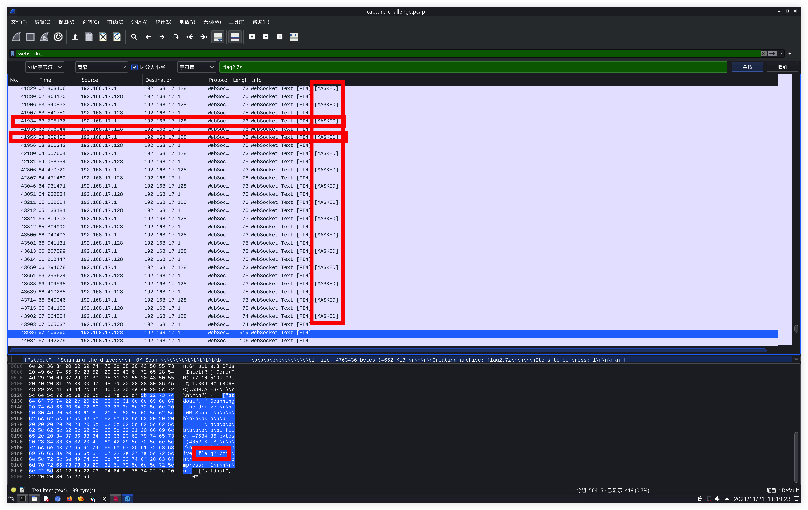

发现每一条请求都是输入了一个字符，逐个查看和记录，可以知道从 33951 这条请求开始，输入了

```bash
7z x flag2.7z -p"Wakarimasu! `date` `uname -nom` `nproc`"
```

密码十分复杂，分着来看

date：这条命令执行时的时刻，约等于 7z 文件的最近更新时间，之前在列出所有文件的时候可以看到是 2021-11-06T07:44:16.312993Z。用 `date -d 2021-11-06T07:44:16.312993Z` 就可以查看这个时刻的 date 输出了。但是这里有个问题，我们不知道题主用的 date 是什么格式的输出，也不知道时区，于是我分别在我的虚拟机、服务器、Python Docker 镜像中，搜集到了三种格式六种输出（标准时和北京时间）

> 'Sat Nov  6 07:44:16 UTC 2021'
>
> 'Sat Nov  6 15:44:16 CST 2021'
>
> 'Sat 06 Nov 2021 03:44:16 PM CST'
>
> 'Sat 06 Nov 2021 07:44:16 AM UTC'
>
> '2021年 11月 06日 星期六 15:44:16 CST'
>
> '2021年 11月 06日 星期六 07:44:16 UTC'

同时考虑到 7z 压缩需要时间，所以 date 的执行时间可能比 7z 的修改时间在数值上小一些，所以 44 分 15 秒或更小的情况也需要考虑

uname -nom：获取主机名，这个可以看命令行提示符。在之前压缩 7z 完毕之后的请求之后，就输出了命令提示符，得到主机名为 you-kali-vm

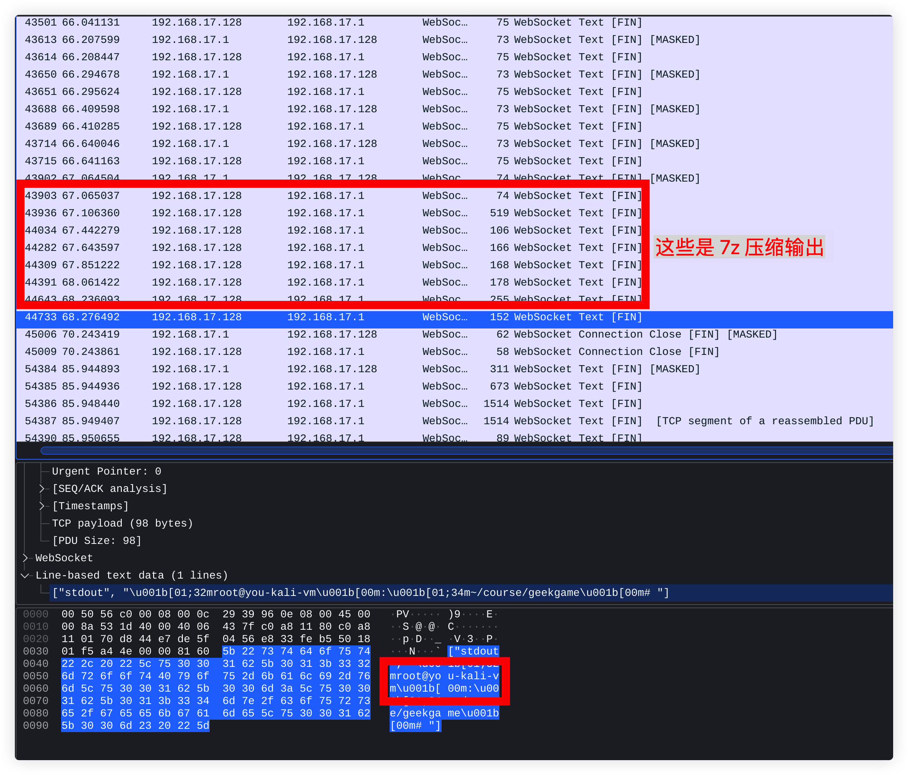

nproc：可用的处理器核数。做题当时我还以为是进程个数，所以用 1-100 去枚举可能的进程数。现在一百度才知道是核心数，然后想到在压缩 7z 开始时输出了 CPU 信息

> ["stdout", "\r\n7-Zip (a) [64] 16.02 : Copyright (c) 1999-2016 Igor Pavlov : 2016-05-21\r\np7zip Version 16.02 (locale=en_US.utf8,Utf16=on,HugeFiles=on,64 bits,8 CPUs Intel(R) Core(TM) i7-10510U CPU @ 1.80GHz (806EC),ASM,AES-NI)\r\n\r\n"]

也就是 8 核

最后根据不确定的参数，枚举可能的密码来爆破 7z

```python
import subprocess
import os
from tqdm import tqdm

fn = 'flag2.wav'

dates = ['Sat Nov  6 07:44:16 UTC 2021', 'Sat Nov  6 15:44:16 CST 2021', 'Sat 06 Nov 2021 03:44:16 PM CST', 'Sat 06 Nov 2021 07:44:16 AM UTC', '2021年 11月 06日 星期六 15:44:16 CST', '2021年 11月 06日 星期六 07:44:16 UTC', 'Sat Nov  6 07:44:15 UTC 2021', 'Sat Nov  6 15:44:15 CST 2021', 'Sat 06 Nov 2021 03:44:15 PM CST', 'Sat 06 Nov 2021 07:44:15 AM UTC', '2021年 11月 06日 星期六 15:44:15 CST', '2021年 11月 06日 星期六 07:44:15 UTC']
for date in tqdm(dates):
	for nproc in range(100):
		cmd = f'7z x flag2.7z -p"Wakarimasu! {date} you-kali-vm x86_64 GNU/Linux {nproc}" 2>/dev/null 1>/dev/null'
		os.system(cmd)
		if os.path.exists(fn):
			print('出现了！')
			print(cmd)
			if os.path.getsize(fn) > 1000 * 1024:
				print('找到了！')
				exit()
			else:
				print('不过不是这个')
				os.unlink(fn)
```

得到 7z 的密码为 `Wakarimasu! Sat 06 Nov 2021 03:44:15 PM CST you-kali-vm x86_64 GNU/Linux 8`

再看 flag2.wav 的产生过程，也是一样的在 pcap 中的 websocket 终端中找命令，就在 7z 压缩之前，不再过多赘述，是 `stegolsb wavsteg -h -i ki-ringtrain.wav -s flag2.txt -o flag2.wav -n 1` 而 stegolsb 也可以看到是临时用 pip 安装的

根据隐写命令，写出提取命令 `stegolsb wavsteg -r -i flag2.wav -n 1 -o flag2.txt -b 76` 再用 flag1 的方法解密就得到 flag2 了

# 叶子的新歌

拿到一首歌，发现有封面图，提取出来，用 zsteg 查看图片的隐写，发现有通道隐写了一张图片

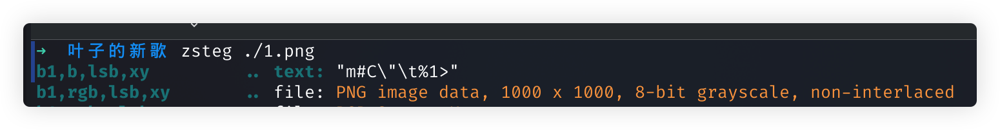

提取出来发现是个类似二维码的东西


尝试用各种手机软件扫码，最终用某东扫码成功，得到 `Gur frperg va uvfgbtenz.` ，看起来像是个句子，而且还有实心点，猜测是凯撒加密，解密后得到 `The secret in histogram.`，秘密在直方图里，也就是图片直方图

首先尝试了用 gimp 打开图片，并查看直方图，发现黑白相间，应该是个条形码，但是我始终调整不好比例，无法扫码

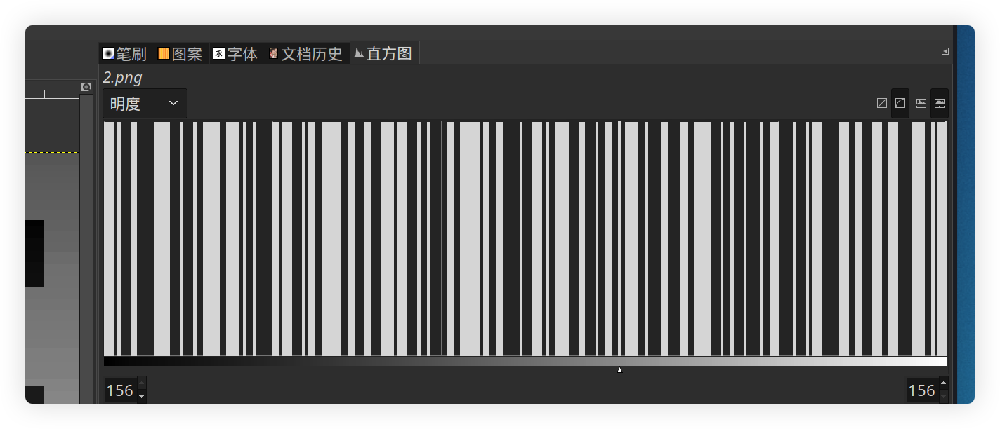

百度一下用 python3 脚本生成直方图的代码

```python
#画直方图
import cv2 as cv
from matplotlib import pyplot as plt
 
def plot_demo(image):
    plt.hist(image.ravel(), 256, [0, 256])         #numpy的ravel函数功能是将多维数组降为一维数组
    plt.show()
 
def image_hist(image):     #画三通道图像的直方图
    color = ('b', 'g', 'r')   #这里画笔颜色的值可以为大写或小写或只写首字母或大小写混合
    for i , color in enumerate(color):
        hist = cv.calcHist([image], [i], None, [256], [0, 256])  #计算直方图
        plt.plot(hist, color)
        plt.xlim([0, 256])
    plt.show()
 
src = cv.imread('2.png')
cv.namedWindow('input_image', cv.WINDOW_NORMAL)
cv.imshow('input_image', src)
 
plot_demo(src)
image_hist(src)
 
cv.waitKey(0)
cv.destroyAllWindows()
```

得到

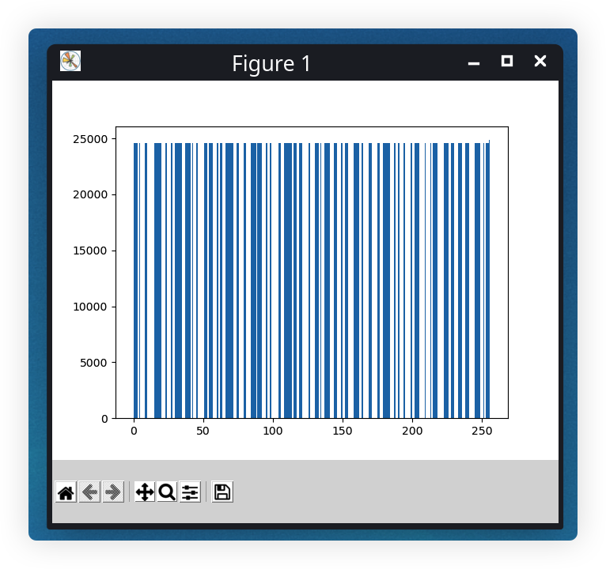

扫码得到 xmcp.ltd/KCwBa 是个文本文件

>  你还记得高中的时候吗？那时在市里的重点中学，我们是同桌。我以前还怪讨人嫌的，老是惹你生气，然后你就不和我说话，我就死乞白赖地求你，或者讲笑话逗你。 不过，你笑起来好可爱，从小就好可爱。此后的一切，也都是从那个笑容开始的吧。 真的，好想回到那个时候啊。 Ook. Ook. Ook. Ook. Ook. Ook. Ook. Ook. Ook. Ook. Ook. Ook. Ook. Ook. ……………………………… 

这个 Ook 看起来特别奇怪，百度搜索知道这是种和 brainfuck 差不多的语言，拖到 https://www.splitbrain.org/services/ook 上运行一下就得到 flag 了

看起来，这条线已经走到最后了。回到音频。尝试了音频隐写、频谱图、波形图隐藏信息等方式，都没有新发现。010 editor 打开发现一串疑似 base64 加密的字符串，解密后发现是个压缩包下载地址

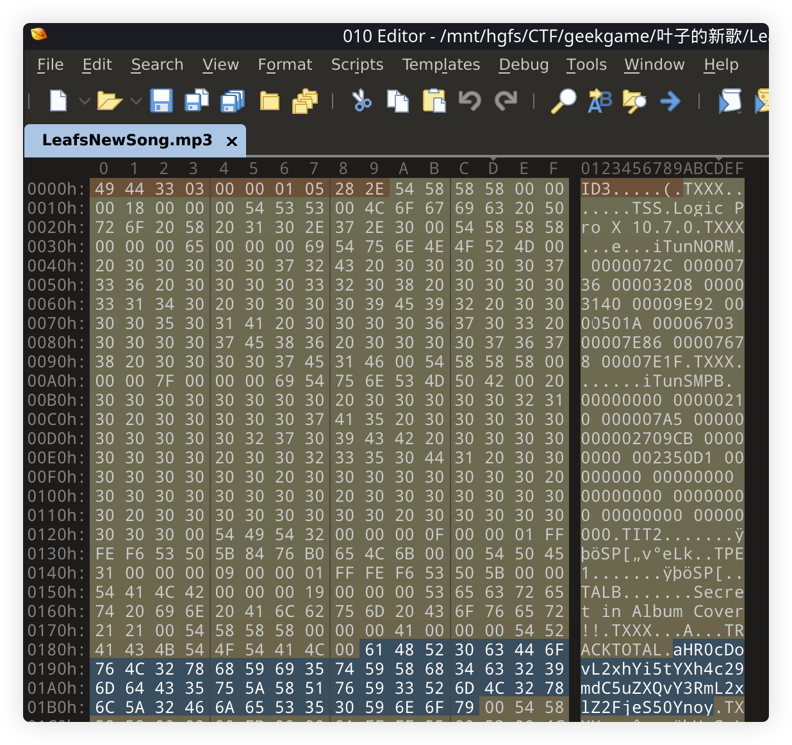

解压得到一个 img 和一个 foryou.txt。挂载 img，里面有一个 MEMORY.zip 和 NOTE.txt，NOTE.txt 提示了压缩包的密码。百度这个奇怪的字符串，知道了是和人民币冠号有关，简单解密一下就知道了密码

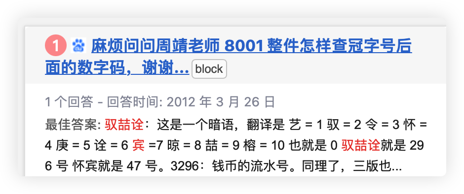

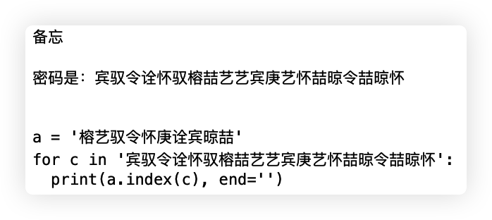

解压得到 readme.txt，left.bin 和 right.bin。用 file 命令无法得知两个 bin 到底是什么文件，但是这俩文件的大小内容十分相似。readme.txt 提示要找茬，也就是比对这两个文件

由于我不知道如何把二进制文件做对比和合并，于是我先把每个 bin 用十六进制保存成文本文件，再用 beyond compare 对比，然后尝试合并两个文件

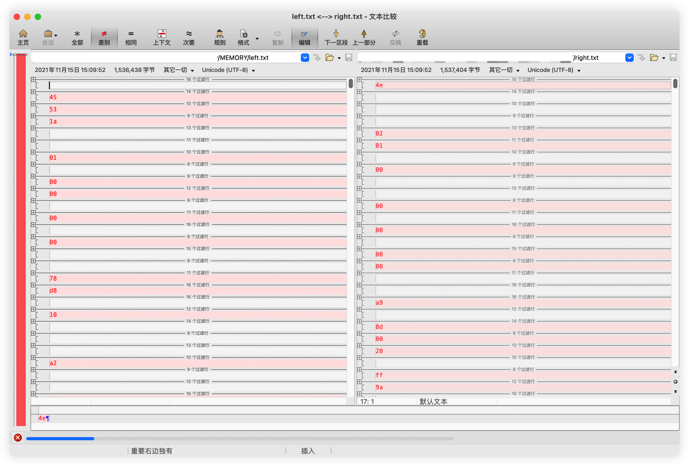

得到新的合并后的十六进制文件，再转回二进制保存，但是这个合并后的文件仍没有任何特征，file 命令检测不出

再考虑一下，是找茬，也就是找出不同的就行，于是用 `diff left.txt right.txt` 比较两个文本文件，将有差异的十六进制找出来，再按二进制写出到文件中

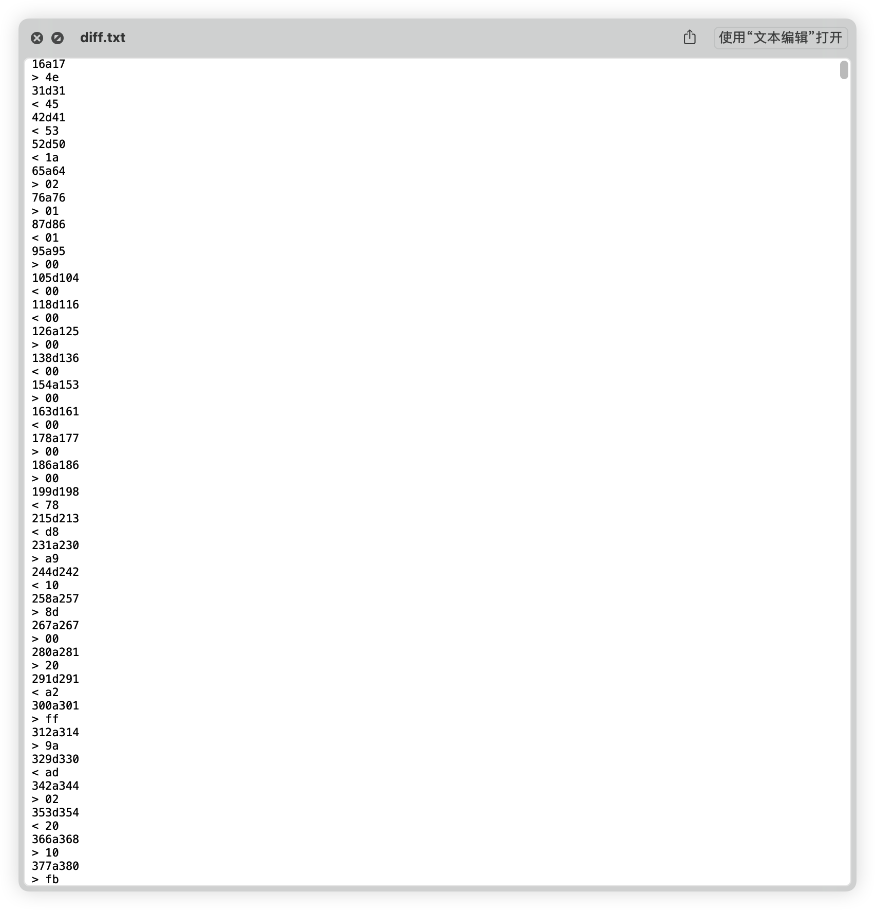

```python
import struct
a = open('diff.txt', 'r').readlines()
f = open('diff.bin', 'wb')
for c in a:
	if c[0] not in '><': continue
	t = int(c[2:], 16)
	f.write(struct.pack('B', t))
```

最终得到的这个 diff.bin，用 file 检测出来是一个 nes 文件，用 virtualnes 打开是个超级马里奥

按照这种游戏题一贯的作风，我猜测是需要在通关以后，能拿到 flag。这是我第一次玩超级马里奥，百度了一下，知道这应该是第一版，有 8 个世界，每个世界 4 关。于是用金手指作弊，改到第 8 世界，再开无敌、空中游泳和无限生命，再看攻略，最终通关了

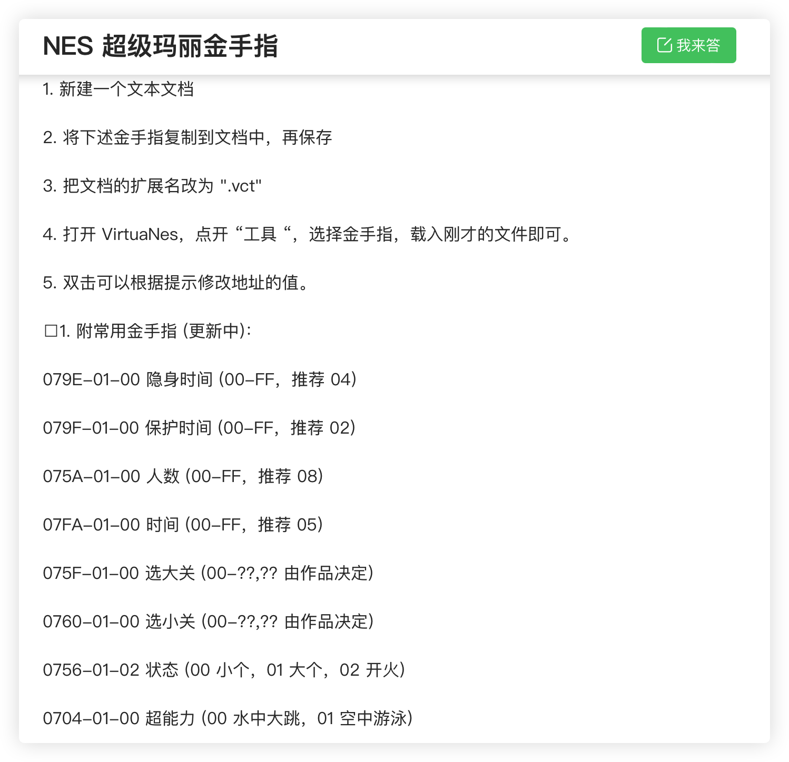

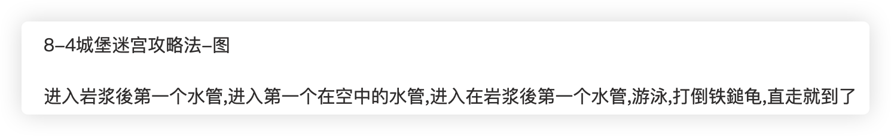

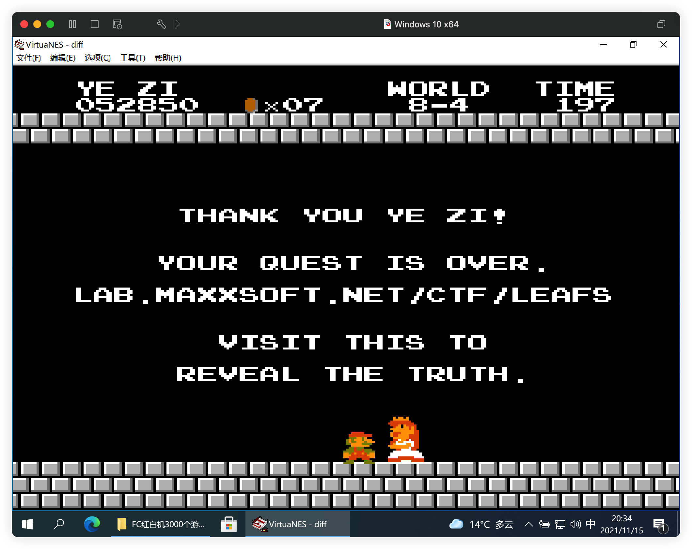

进到这个网站，提示那个软盘可以启动

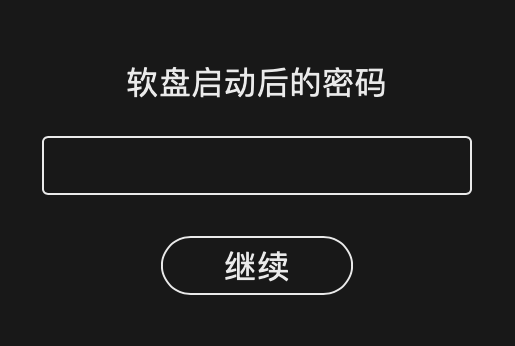

用 bochs 启动一下，就可以看到一个 flag 和一个密码

 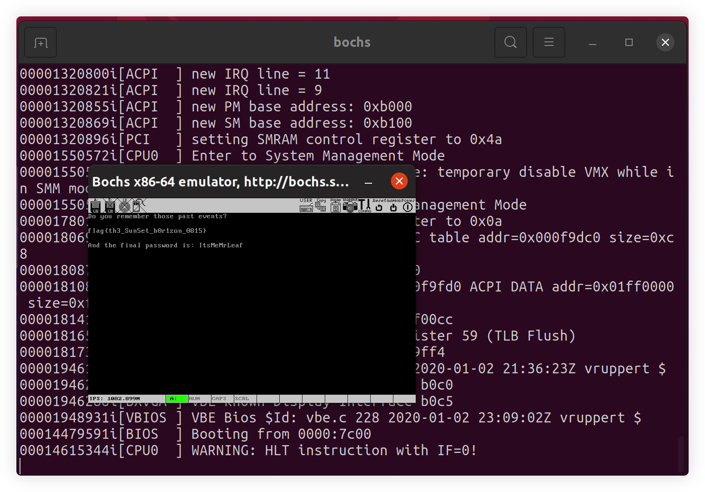

输入到网站上，最终套娃完成

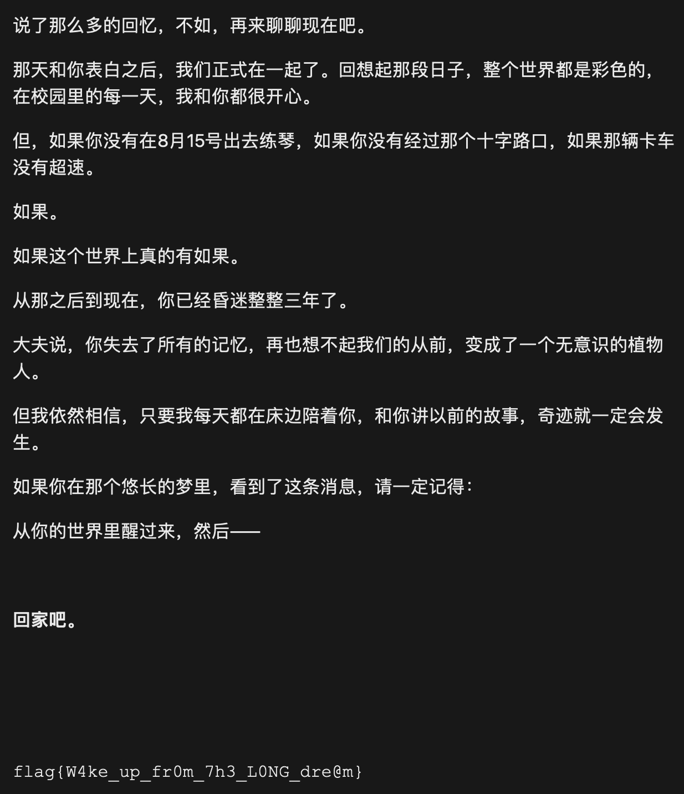

# 在线解压网站

创建一个指向 /flag 的软连接，压缩上传以后，再去访问就能拿到根目录的 flag 了

# 诡异的网关

全场最简单的一题（

打开主程序发现有预设的账号和密码，密码是密文状态，看不了复制不了，猜测这就是 flag 了

用 Detect It Easy 看了看这个主程序，是 VC++2010 写的

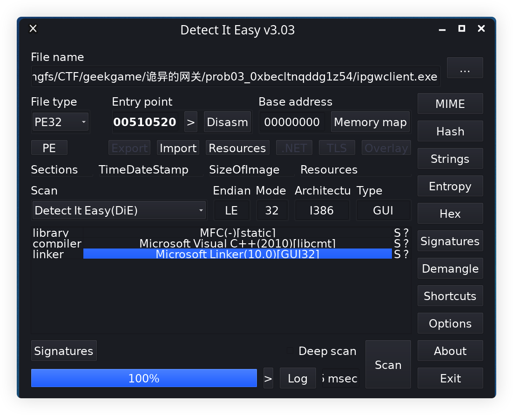

有过 Win32 程序的开发经验的同学应该知道每个系统控件都有个句柄，而且 Windows API 里有 SendMessage，于是就可以给这个密码框发一个 SETPASSWORDCHAR 的消息，取消密文状态，显示明文

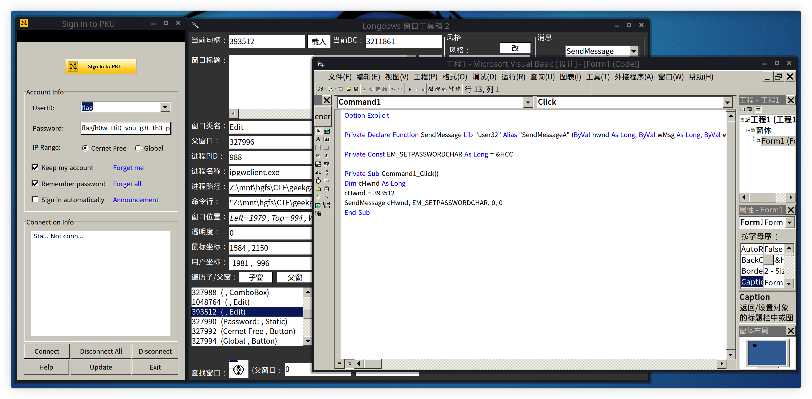

# 最强大脑

这题我做出来一半。用 IDA 分析可以知道，bf 文件是个解释器，开辟了一段内存空间（每次增大一倍）用来当作 bf 的内存，初始为 4096 字节。然后一个函数会去读 flag1 并写到内存的末尾。这里造一个循环遍历输出所有内存的 bf 代码即可 `+[-.>+]`

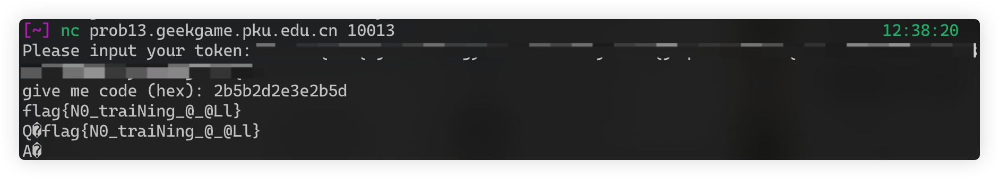