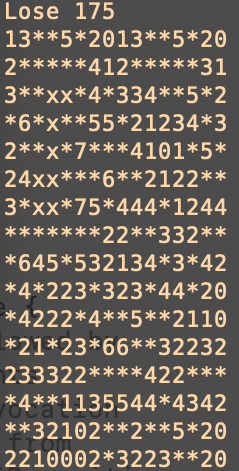

## PKU GeekGame 1st

昵称：feifeiobama 总分：1315

#### 签到

用[在线pdf转txt工具](https://www.zamzar.com/convert/pdf-to-txt/)提取flag。

#### 小北问答Remake

1. 高德地图搜索。
2. 微信搜一搜找到推送文章。
3. 用[crt.sh](https://crt.sh)搜到相应证书。
4. 进入比赛网站后下载题目获得。
5. 在OEIS上查到[相关条目](https://oeis.org/A047659)，代入表达式计算。
6. 查阅Github源代码。
7. Google搜索。
8. 查阅[信科2021年招生指南](https://eecs.pku.edu.cn/info/1060/10794.htm)。

#### 共享的机器

用[在线反编译工具](https://ethervm.io/decompile)反编译智能合约和它的一次[交易](https://teth.bitaps.com/0x26c021f066afcd313150ca57bfe828b47f93c4986297b201e4dff02c525a9b2e/0xa43028c702c3B119C749306461582bF647Fd770a)，发现前者的核心功能是检查msg.caller和tx.origin后写storage，而后者成功调用了前者，基于此推断出storage内容并解码得到flag。

#### 翻车的谜语人

1. 用Wireshark提取flag1.txt和生成它的Jupyter Notebook，根据生成代码和key变量的返回值可以算出flag1。
2. （第二阶段完成）用Wireshark提取flag2.7z，它的加密步骤可以从Websocket记录看到：先用stego-lsb将flag2.txt隐写到flag2.wav，再用密码Wakarimasu! \`date\` \`uname -nom\`加密得到。根据时间戳等信息补全密码就能解压flag2.7z，一路反推得到flag2。

#### 叶子的新歌

1. （未完成）根据MP3的元数据提示导出封面，用stegosolve提取封面LSB隐写的二维码，[在线识别](https://zxing.org/w/decode.jspx)并对结果用ROT13解密得到提示“The secret in histogram.”，将二维码的直方图转化为长256的二进制序列（或三进制序列），到这里就卡住了。
2. （第二阶段完成）MP3的元数据中包含一串长文本，用base64解码得到一个网址，该网址提供了一张软盘镜像，用VMWare Workstation加载并启动可以得到flag2和一串密码。

#### 在线解压网站

创建到../../../../flag的相对符号链接，压缩后上传到网站，从链接下载flag文件。

#### Flag即服务

1. 访问/api/..%2Fpackage.json获得源码的下载地址，源码中给出了flag1。

#### 诡异的网关

根据修改账号前后的文件变化，确定账号密码被保存在config。对比config与config.xml，发现加密规则是将当前字符前5位与前一字符后3位取反拼接，进而解密得到flag。

#### 最强大脑

1. （第二阶段完成）构造满足长度约束的输入+[-.>+]，自动地移动data_ptr指针并输出flag内容。

#### 密码学实践

1. 观察到任意一对明文xor后加密与加密后xor结果相同，利用该特性进行解密（[代码](密码学实践_1.py)）。

#### 扫雷？

1. 从失败时打印的棋局可以获得当前的伪随机数，积累足够长的连续伪随机数序列后就可以用[软件包](https://github.com/kmyk/mersenne-twister-predictor)预测下一个伪随机数，从而预测棋盘并扫雷（[代码](扫雷_1.py)）。

2. （未完成）注意到源代码可以为-1行和-1列上的格子数地雷，这略微降低了扫雷的难度。我基于一个现成的[扫雷算法](https://github.com/mrgriscom/minesweepr)，添加了前k步规则、对地雷的概率采取乐观的估计策略（[代码](扫雷_2/main.py)）。优化后有一次几乎成功了（只剩8块格子未知）：

   
